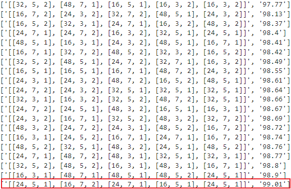
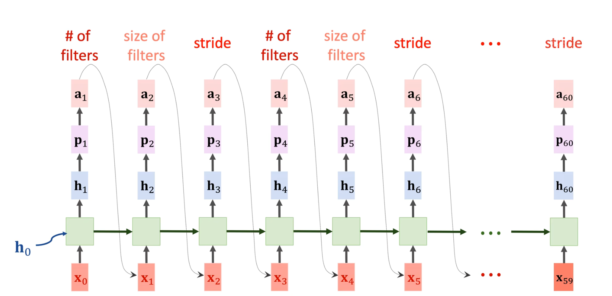
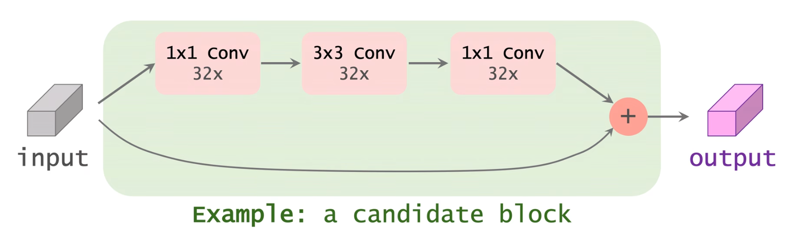
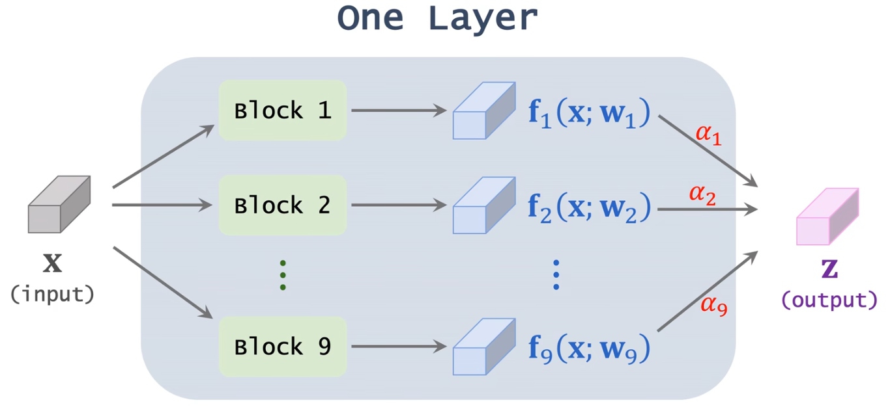
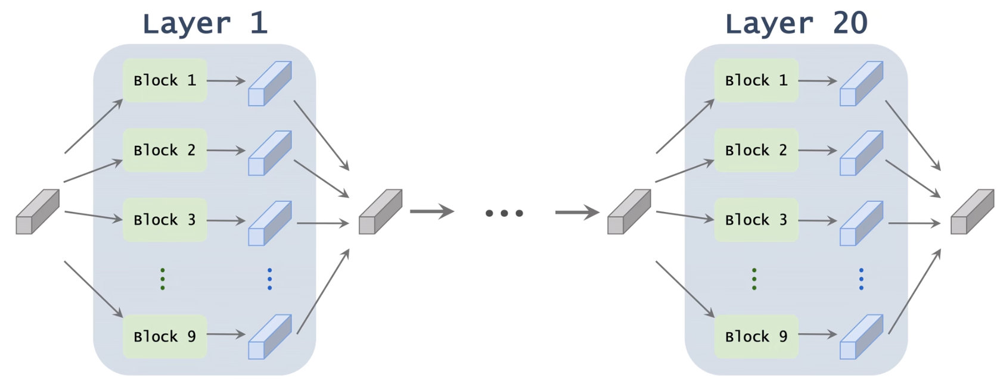
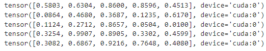
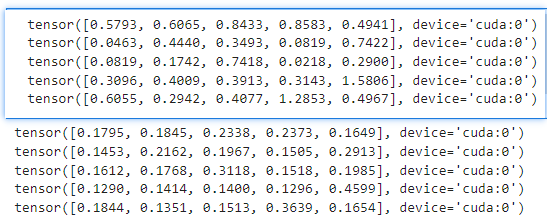
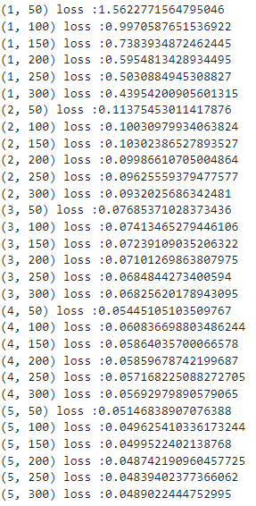
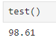

# Neural Architecture Search
## 概述
### 神经网络结构搜索
神经网络结构搜索指的是寻找最优的神经网络，让网络准确率最大化，让计算量和内存开销更小

这里举个例子，一个卷积层需要的参数有三个，卷积核数量，卷积核大小，stride大小，我们想要寻找一组超参数，让模型效果最好。我们通常设置一些备选项，如下图所示，我们预设了四个卷积核数量，三个卷积核大小，两个步长，接下来就在这些参数的组合中寻找最优的参数 

### 搜索空间

搜索空间是指在神经网络结构搜索钩虫中，可以进行探索和优化的所有的网络结构的集合。这个搜索空间半酣了不同的网络层类型（如卷积层、全连接层）、每个层的参数设置（如卷积核大小、激活函数）、连接方式（如残差连接、密集连接）以及整体网络结构的拓扑结构（如网络深度、宽度、分支结构等）。在NAS中，搜索空间的设计和定义对于搜索效率和搜索结果的质量都有重要影响。通过合理设计搜索空间，可以更有效地搜索到性能优秀的神经网络结构。

假设我们要创建一个20层的卷积神经网络，且我们只关注卷积核数量，大小和步长，备选参数如上图所示，则我们的搜索空间就是下面这个笛卡尔积：

搜索空间的大小是所有可能的神经网络的数量，也就是(4\*3\*2)^20 = 4*10^27

## 随机搜索

首先从搜索空间中均匀随机抽样出一组超参数，使用该组超参数构建模型，对模型训练直到收敛，然后进行val测试。一直重复这个过程，挑选准确率最高的超参数作为最终方案。这是最常用的方法。 
**随机搜索的优点**：1.随机搜索简单易实现，容易实现和调整。2.避免局部最优解：随机搜索能够在搜索空间中随机探索，有助于避免陷入局部最优解，提高了找到全局最优解的可能性。3.随机搜索能广泛探索搜索空间，有助于发现不同的网络结构，可能带来更好的性能提升。 
**随机搜索的缺点**：1.效率低：随机搜索在搜索空间较大时，效率较低，需要大量的随机尝试才能找到最优解。2.资源消耗大：由于随机性质，可能需要进行大量的重复实验，消耗大量的计算资源和时间。3.搜索空间偏移：随机搜索可能会导致搜索空间的偏移，使得搜索结果不稳定或不可预测。

### 随机搜索代码实现

接下来我们使用代码实现以下随机搜索，假设我们要设计一个包含五个卷积层的卷积神经网络：

工作化境：
>CPU: I3 10105F （x86_64） 
>GPU: ASUS 3060 12G 
>RAM: 威刚 DDR4 40G 2666 
>主板：MSI B560M-A 
>硬盘：WDC SN550 1T 

>OS: UBUNTU22.04 
>python版本：3.11.7 
>torch版本：2.2.1 
>jupyter notebook  

首先检查服务器gpu情况

    import torch
    import torch.nn
    if torch.cuda.is_available():
        # 获取GPU设备数量
        device_count = torch.cuda.device_count()
        print(f"发现 {device_count} 个可用的GPU 设备")
        # 获取每个GPU的名称
        for i in range(device_count):
            print(f"GPU 设备 {i}: {torch.cuda.get_device_name(i)}")
    else:
        print("没有发现可用的GPU")
    

然后构造实验用的数据集

    from torchvision import transforms
    from torchvision import datasets
    from torch.utils.data import DataLoader
    import torch.nn.functional as F
    import torch.optim as optim
    import torch.nn as nn

    batch_size = 200
    transform = transforms.Compose([
        transforms.ToTensor(),
        transforms.Normalize((0.1307,),(0.3081)),
        transforms.Resize((224, 224))
    ])
    train_dataset = datasets.MNIST(root='./dataset/mnist/',train=True,download=True,transform = transform)
    test_dataset = datasets.MNIST(root='./dataset/mnist/',train=False,download=True,transform = transform)
    train_loader = DataLoader(train_dataset,shuffle=True,batch_size=batch_size)
    test_loader = DataLoader(test_dataset,shuffle=True,batch_size=batch_size)

下一步构建模型，这里输入是一维，输出十个类别，每个卷积层的参数由输入的参数列表决定，最后展平层的输入需要在程序中计算一下：

    class rnn(nn.Module):
        def __init__(self,conv1,conv2,conv3,conv4,conv5):
            super(rnn,self).__init__()
            self.conv1 = nn.Conv2d(in_channels=1, out_channels=conv1[0], kernel_size=conv1[1],stride=conv1[2],padding=(conv1[1]+1)//2)
            self.conv2 = nn.Conv2d(in_channels=conv1[0], out_channels=conv2[0], kernel_size=conv2[1],stride=conv2[2],padding=(conv2[1]+1)//2)
            self.conv3 = nn.Conv2d(in_channels=conv2[0], out_channels=conv3[0], kernel_size=conv3[1],stride=conv3[2],padding=(conv3[1]+1)//2)
            self.conv4 = nn.Conv2d(in_channels=conv3[0], out_channels=conv4[0], kernel_size=conv4[1],stride=conv4[2],padding=(conv4[1]+1)//2)
            self.conv5 = nn.Conv2d(in_channels=conv4[0], out_channels=conv5[0], kernel_size=conv5[1],stride=conv5[2],padding=(conv5[1]+1)//2)
            self.pool = nn.MaxPool2d(kernel_size=2, stride=2)
            self.relu = nn.ReLU()
            self.input_length = 224
            #下面的循环用于计算展平层的输入
            for i in [conv1,conv2,conv3,conv4,conv5]:
                self.input_length = int(((self.input_length-i[1]+2*((i[1]+1)//2))/i[2]+1)/2)
                print(self.input_length)
            self.fc = nn.Linear(int(conv5[0]*(self.input_length**2)),10)
        def forward(self,x):
            batch_size = x.size(0)
            x = self.pool(self.relu(self.conv1(x)))
            # print(x.shape)
            x = self.pool(self.relu(self.conv2(x)))
            # print(x.shape)
            x = self.pool(self.relu(self.conv3(x)))
            # print(x.shape)
            x = self.pool(self.relu(self.conv4(x)))
            # print(x.shape)
            x = self.pool(self.relu(self.conv5(x)))
            # print(x.shape)
            x = x.view(batch_size,-1)
            # print(x.shape)
            x = self.fc(x)
            return x

构造结构备选项，然后构造二十组结构参数：

    import random
    search_space = {
        'num_filters': [16, 24, 32, 48],
        'kernel_sizes': [3, 5, 7],
        'stride': [1, 2]
    }
    network_setup_list=[]
    for i in range(20):
        network_setup=[[random.choice(search_space['num_filters']),random.choice(search_space['kernel_sizes']),random.choice(search_space['stride'])] for i in range(5)]
        network_setup_list.append(network_setup)

构造训练函数和测试函数：

    def train(epoch):
        model.train()
        running_loss =0.0
        for batch_idx,data in enumerate(train_loader,0):
            inputs,labels = data
            # print(labels)
            inputs, labels = inputs.to(device), labels.to(device)
            optimizer.zero_grad()
            outputs = model(inputs)
            # print(outputs)
            loss = criterion(outputs,labels)
            loss.backward()
            optimizer.step()

            running_loss += loss.item()
            if batch_idx % 50 == 49:
                print(f'{epoch+1,batch_idx+1} loss :{running_loss/batch_idx}')

    def test():
        model.eval()
        correct = 0
        total = 0
        with torch.no_grad():
            for data in test_loader:
                images,labels = data
                images,labels = images.to(device),labels.to(device)
                outputs=model(images)
                _,predicted = torch.max(outputs.data,dim=1)#再1维度（横维度）查找最大的值，返回最大值,下标
                total += labels.size(0)
                correct +=(predicted == labels).sum().item()
                # for i in range(len(predicted)):
                    # print(f"预测值: {predicted[i]}, 真实值: {labels[i]}")
        return 100*correct/total

遍历二十组结构参数，对每组结构参数实例化模型，训练十轮，计算测试准确率并记录：

    result = []
    for i in network_setup_list:
        print(i)
        print(i[0])
        model = rnn(i[0],i[1],i[2],i[3],i[4])
        device = torch.device("cuda:0")
        model.to(device)
        criterion = torch.nn.CrossEntropyLoss()#交叉熵损失
        optimizer = optim.SGD(model.parameters(),lr=0.05,momentum=0.5)
        for j in range(10):
            train(j)
        i_res = test()
        result.append([str(i),str(i_res)])
        print(result)

等待所有结构都测试完成，然后将结果列表排序并且打印：

    sorted_list = sorted(result, key=lambda x: x[1])
    for i in sorted_list:
        print(i)

输出结果如下图，就这次随机搜索来说，最好的超参数就是红色框所框选的这一组： 

## NAS via RNN+RL

使用RNN生成神经网络结构，并使用RL训练rnn,该方法在2017年提出

学习该方法，需要熟悉RNN,并且对RL有一定的认识。

使用rnn预测cnn的结构，rnn的结构如下所示：

我们按照rnn的结果搭建神经网络，然后使用训练好的模型的准确率来更新rnn中的参数，过程就是这样：

但是这里的梯度传播可能有问题，所以用强化学习来进行学习，强化学习的入门在[这篇博客](/ai/reinforcement_learning/summarize/)有描述，我是为了学这个方法专门学的强化学习。但是这个方法也不好，每次强化学习想要得到一个好的反馈需要进行大量的实验，从头构建cnn，导致性能开销很大，时间开销也很大，使用强化学习只是不得已而为之，而且这个方法已经被弃置了。

强化学习的目标：改进rnn，使cnn的准确率提高 
强化学习的reward：使用cnn的准确率作为强化学习的奖励 
强化学习的策略函数：使用rnn作为强化学习的策略函数 

## DIFFERENTIABLE NAS(可微神经架构搜索)

这个方法的两篇相关论文分别是：

[DARTS: Differentiable Architecture Search(DARTS：可微分架构搜索)](https://arxiv.org/abs/1806.09055)

[FBNet: Hardware-Aware Efficient ConvNet Design via Differentiable Neural Architecture Search(FBNet：通过可变神经架构搜索实现硬件感知的高效 ConvNet 设计)](https://arxiv.org/abs/1812.03443)

我们主要理解下面这篇论文，我们要主要关注思想，而不是具体的实现，当我们理解方法之后代码可以随便写：

首先用户需要手动定义一些模块作为候选方案，假设我们设定九个候选模块，每个模块都有几个卷积层或者其他的层，候选模块越多，搜索的越慢，这里我们假设一个模块如下图所示，输入和输出的尺寸一样，我们用输入加输出作为最终的输出：

我们设置很多这样的模块，同时我们指定神经网络的层数，这里假定20个层，这里一层指的是一个模块，神经网络每层有九个候选模块，总共的神经网络结构就有9^20种，也就是搜索空间。
在这种情况下，做暴力搜索时不可能的，这时要用到一个新的东西 spuer-net

### super-net

supernet是一个很大的神经网络，每一层由全部九个模块并联而成，每个模块有一个输出f，然后我们将九个f乘以一定的权重，最后合在一起。权重是由softmax算出来的，所以九个权重的和应该等于1，我们的目标就是学习这些α，如下图所示：

这个大的神经网络就叫supernet，每一层的结构都一样，但是不同层的α都不一样。

一个supernet由二十层并联起来的层组成，每个层由九个模块并联，但是最后我们会根据学到的α保留一层。

每一层种我们主要训练的参数包括：w，卷积层中的卷积核，alpha，每个曾对应的权重

每一层都有自己的w和alpha，各不一样。

我们把所有w参数的集合记作W，所有权重的集合记作θ，x表示训练数据，y表示标签，用p（x；W,θ）作为网络的预测，我们要从训练数据中学习W和θ

### 怎么考虑计算延迟？

我们希望神经网络在推理的时候计算量不要太大，或者说希望使用较少的计算量得到较好的效果，我们可以先计算每个模块需停药的耗时，最后将这个耗时加入到最终的结果种一同优化，如下图所示：

前面这一项loss的目的是让神经网络取得更高的准确率，后面这一项里的lambda是一个超参数，用于控制牺牲多少的准确率来提高精度

### 代码实现
我们做实验，使用super_net对一个五层神经网络进行结构搜索，每层有五个候选项。

首先配置实验环境，包括导包，确认gpu情况，处理数据集等。

    import torch
    import torch.nn
    if torch.cuda.is_available():
        # 获取GPU设备数量
        device_count = torch.cuda.device_count()
        print(f"发现 {device_count} 个可用的GPU 设备")
        # 获取每个GPU的名称
        for i in range(device_count):
            print(f"GPU 设备 {i}: {torch.cuda.get_device_name(i)}")
    else:
        print("没有发现可用的GPU")

    from torchvision import transforms
    from torchvision import datasets
    from torch.utils.data import DataLoader
    import torch.nn.functional as F
    import torch.optim as optim
    import torch.nn as nn

    batch_size = 30
    transform = transforms.Compose([
        transforms.ToTensor(),
        transforms.Normalize((0.1307,),(0.3081)),
        transforms.Resize((224, 224))
    ])
    train_dataset = datasets.MNIST(root='./dataset/mnist/',train=True,download=True,transform = transform)
    test_dataset = datasets.MNIST(root='./dataset/mnist/',train=False,download=True,transform = transform)
    train_loader = DataLoader(train_dataset,shuffle=True,batch_size=batch_size)
    test_loader = DataLoader(test_dataset,shuffle=True,batch_size=batch_size)

接下来构建五个候选项，分别是“3x3卷积16个滤波器”，“3x3卷积24个滤波器”，“3x3卷积36个滤波器”，“5x5卷积16个滤波器”，“5x5卷积24个滤波器” 
这里我的代码写的比较复杂，其实可以写一个类然后将卷积核大小和滤波器数量当作参数传入的。

    class conv_3_16(nn.Module):
        #输出16个维度
        def __init__(self,input,output):
            super(conv_3_16,self).__init__()
            self.model = nn.Sequential(
                nn.Conv2d(input,16,3,1,1),
                nn.ReLU()
            )
            self.conv11 = nn.Conv2d(16,output,1,1,0)
        def forward(self,x):
            r_x = self.model(x)
            if(x.shape[1]!=r_x.shape[1]):
                r_x = F.relu(self.conv11(r_x))
            r_x = F.relu(x+r_x)
            return r_x

    class conv_3_24(nn.Module):
        #输出24个维度
        def __init__(self,input,output):
            super(conv_3_24,self).__init__()
            self.model = nn.Sequential(
                nn.Conv2d(input,24,3,1,1),
                nn.ReLU()
            )
            self.conv11 = nn.Conv2d(24,output,1,1,0)
        def forward(self,x):
            r_x = self.model(x)
            if(x.shape[1]!=r_x.shape[1]):
                r_x = F.relu(self.conv11(r_x))
            r_x = F.relu(x+r_x)
            return r_x

    class conv_3_36(nn.Module):
        #输出36个维度
        def __init__(self,input,output):
            super(conv_3_36,self).__init__()
            self.model = nn.Sequential(
                nn.Conv2d(input,36,3,1,1),
                nn.ReLU()
            )
            self.conv11 = nn.Conv2d(36,output,1,1,0)
        def forward(self,x):
            r_x = self.model(x)
            if(x.shape[1]!=r_x.shape[1]):
                r_x = F.relu(self.conv11(r_x))
            r_x = F.relu(x+r_x)
            return r_x

    class conv_5_16(nn.Module):
        #输出36个维度
        def __init__(self,input,output):
            super(conv_5_16,self).__init__()
            self.model = nn.Sequential(
                nn.Conv2d(input,16,5,1,2),
                nn.ReLU()
            )
            self.conv11 = nn.Conv2d(16,output,1,1,0)
        def forward(self,x):
            r_x = self.model(x)
            if(x.shape[1]!=r_x.shape[1]):
                r_x = self.conv11(r_x)
            r_x = F.relu(x+r_x)
            return r_x
            
    class conv_5_24(nn.Module):
        def __init__(self,input,output):
            super(conv_5_24,self).__init__()
            self.model = nn.Sequential(
                nn.Conv2d(input,24,5,1,2),
                nn.ReLU()
            )
            self.conv11 = nn.Conv2d(24,output,1,1,0)
        def forward(self,x):
            r_x = self.model(x)
            if(x.shape[1]!=r_x.shape[1]):
                r_x = self.conv11(r_x)
            r_x = F.relu(x+r_x)
            return r_x

接下来构造每个层类，将每种结构并连起来，并创建一个可以训练的权重：

    class superBlock(nn.Module):
        def __init__(self,input,output):
            super(superBlock,self).__init__()
            self.conv_3_16 = conv_3_16(input,output)
            self.conv_3_24 = conv_3_24(input,output)
            self.conv_3_36 = conv_3_36(input,output)
            self.conv_5_16 = conv_5_16(input,output)
            self.conv_5_24 = conv_5_24(input,output)
            self.alpha = nn.Parameter(torch.rand(5))
            
        def forward(self,x): 
            x_1 = self.conv_3_16(x)
            x_2 = self.conv_3_24(x)
            x_3 = self.conv_3_36(x)
            x_4 = self.conv_5_16(x)
            x_5 = self.conv_5_24(x)
            output = F.softmax(self.alpha,dim=0)[0]*x_1+F.softmax(self.alpha,dim=0)[1]*x_2+F.softmax(self.alpha,dim=0)[2]*x_3+ \
                        F.softmax(self.alpha,dim=0)[3]*x_1+F.softmax(self.alpha,dim=0)[4]*x_5
            return output

然后创建super_net，将五个super层连接在一起：

    class supernet(nn.Module):
        def __init__(self):
            super(supernet,self).__init__()
            self.conv1 = nn.Conv2d(1,16,1,1,0)
            self.superblock1 = superBlock(16,16)
            self.superblock2 = superBlock(16,16)
            self.superblock3 = superBlock(16,16)
            self.superblock4 = superBlock(16,16)
            self.superblock5 = superBlock(16,16)
            self.maxpool = nn.MaxPool2d(2)
            self.linear = nn.Linear(784,10)

        def forward(self,x):
            x = self.conv1(x)
            x = self.maxpool(self.superblock1(x))
            x = self.maxpool(self.superblock2(x))
            x = self.maxpool(self.superblock3(x))
            x = self.maxpool(self.superblock4(x))
            x = self.maxpool(self.superblock5(x))
            x = x.view(x.size(0),-1)
            x = self.linear(x)
            return x

然后对这个模型实例化：

    model = supernet()
    device = torch.device("cuda:0")
    model.to(device)

我们打印一下性训练之前的每个层的权重：

    model_state_dict = model.state_dict()
    print(model_state_dict['superblock1.alpha'])
    print(model_state_dict['superblock2.alpha'])
    print(model_state_dict['superblock3.alpha'])
    print(model_state_dict['superblock4.alpha'])
    print(model_state_dict['superblock5.alpha'])

结果如下：

然后我们定义损失函数，优化器以及训练测试函数：

    import torch.optim as optim
    criterion = torch.nn.CrossEntropyLoss()#交叉熵损失
    optimizer = optim.SGD(model.parameters(),lr=0.01,momentum=0.5)

    def train(epoch):
        model.train()
        running_loss =0.0
        for batch_idx,data in enumerate(train_loader,0):
            inputs,labels = data
            # print(labels)
            inputs, labels = inputs.to(device), labels.to(device)
            optimizer.zero_grad()
            outputs = model(inputs)
            # print(outputs)
            loss = criterion(outputs,labels)
            loss.backward()
            optimizer.step()

            running_loss += loss.item()
            if batch_idx % 50 == 49:
                print(f'{epoch+1,batch_idx+1} loss :{running_loss/batch_idx}')

    def test():
        model.eval()
        correct = 0
        total = 0
        with torch.no_grad():
            for data in test_loader:
                images,labels = data
                images,labels = images.to(device),labels.to(device)
                outputs=model(images)
                _,predicted = torch.max(outputs.data,dim=1)#再1维度（横维度）查找最大的值，返回最大值,下标
                total += labels.size(0)
                correct +=(predicted == labels).sum().item()
                # for i in range(len(predicted)):
                    # print(f"预测值: {predicted[i]}, 真实值: {labels[i]}")
        print(f'{100*correct/total}')

随后对模型训练五轮，然后观察每个层的权重：

    for i in range(5):
        train(i)

    model_state_dict = model.state_dict()
    print(model_state_dict['superblock1.alpha'])
    print(model_state_dict['superblock2.alpha'])
    print(model_state_dict['superblock3.alpha'])
    print(model_state_dict['superblock4.alpha'])
    print(model_state_dict['superblock5.alpha'])

    print(F.softmax(model_state_dict['superblock1.alpha']))
    print(F.softmax(model_state_dict['superblock2.alpha']))
    print(F.softmax(model_state_dict['superblock3.alpha']))
    print(F.softmax(model_state_dict['superblock4.alpha']))
    print(F.softmax(model_state_dict['superblock5.alpha']))

结果如下，第一张图是权重参数的值，第二张图是对应的softmax分类值：

然后我们根据每层的权重，选择权重最大的层构建新的模型：

    class result_net(nn.Module):
        def __init__(self):
            super(result_net,self).__init__()
            self.conv11 = nn.Conv2d(1,16,1,1,0)
            self.conv1 = conv_5_16(16,16)
            self.conv2 = conv_5_24(16,16)
            self.conv3 = conv_3_36(16,16)
            self.conv4 = conv_5_24(16,16)
            self.conv5 = conv_5_16(16,16)
            self.maxpool = nn.MaxPool2d(2)
            self.linear = nn.Linear(784,10)

        def forward(self,x):
            x = self.conv11(x)
            x = self.maxpool(self.conv1(x))
            x = self.maxpool(self.conv2(x))
            x = self.maxpool(self.conv3(x))
            x = self.maxpool(self.conv4(x))
            x = self.maxpool(self.conv5(x))
            x = x.view(x.size(0),-1)
            x = self.linear(x)
            return x

    model = result_net()
    device = torch.device("cuda:0")
    model.to(device)

    import torch.optim as optim
    criterion = torch.nn.CrossEntropyLoss()#交叉熵损失
    optimizer = optim.SGD(model.parameters(),lr=0.05,momentum=0.5)

对模型进行训练和测试：

    for i in range(5):
        train(i)

## 总结
得出结论：从理论上讲神经网络结构搜索可以给出一些比较好的神经网络，从近几年的论文我们也可以看出神经网络结构搜索已经变成实验中很重要的一部分，未来我的工作中也会加入这部分。

心得：本次做实验让我对于relu函数有了更深的认识，当relu使用的地方不对，多用或者是少用都有可能导致梯度爆炸。我在构造super_net的时候就因为构建relu的问题导致梯度爆炸了。

