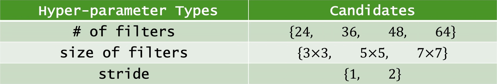
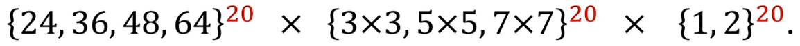
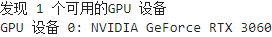
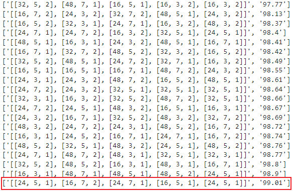

# Neural Architecture Search
## 概述

[Network In Network论文官方链接(点击查看)](https://arxiv.org/abs/1312.4400)

[Network In Network论文备用链接(点击查看)](http://www.apache2.sanyueyu.top/blog/ai/references/network_in_network.pdf)

[Network In Network论文中文pdf链接(点击查看)（本人翻译能力和手段有限，可以看看别人写的）](http://www.apache2.sanyueyu.top/blog/ai/references/network_in_networkcn.pdf)

### 作者做该研究的目的

cnn:卷积层数量，全连接数量，卷积层参数

### 神经网络结构搜索
神经网络结构搜索指的是寻找最优的神经网络，让网络准确率最大化，让计算量和内存开销更小

这里举个例子，一个卷积层需要的参数有三个，卷积核数量，卷积核大小，stride大小，我们想要寻找一组超参数，让模型效果最好。我们通常设置一些备选项，如下图所示，我们预设了四个卷积核数量，三个卷积核大小，两个步长，接下来就在这些参数的组合中寻找最优的参数 

### 搜索空间

搜索空间是指在神经网络结构搜索钩虫中，可以进行探索和优化的所有的网络结构的集合。这个搜索空间半酣了不同的网络层类型（如卷积层、全连接层）、每个层的参数设置（如卷积核大小、激活函数）、连接方式（如残差连接、密集连接）以及整体网络结构的拓扑结构（如网络深度、宽度、分支结构等）。在NAS中，搜索空间的设计和定义对于搜索效率和搜索结果的质量都有重要影响。通过合理设计搜索空间，可以更有效地搜索到性能优秀的神经网络结构。

假设我们要创建一个20层的卷积神经网络，且我们只关注卷积核数量，大小和步长，备选参数如上图所示，则我们的搜索空间就是下面这个笛卡尔积：

搜索空间的大小是所有可能的神经网络的数量，也就是(4\*3\*2)^20 = 4*10^27

## 随机搜索

首先从搜索空间中均匀随机抽样出一组超参数，使用该组超参数构建模型，对模型训练直到收敛，然后进行val测试。一直重复这个过程，挑选准确率最高的超参数作为最终方案。这是最常用的方法。 
**随机搜索的优点**：1.随机搜索简单易实现，容易实现和调整。2.避免局部最优解：随机搜索能够在搜索空间中随机探索，有助于避免陷入局部最优解，提高了找到全局最优解的可能性。3.随机搜索能广泛探索搜索空间，有助于发现不同的网络结构，可能带来更好的性能提升。 
**随机搜索的缺点**：1.效率低：随机搜索在搜索空间较大时，效率较低，需要大量的随机尝试才能找到最优解。2.资源消耗大：由于随机性质，可能需要进行大量的重复实验，消耗大量的计算资源和时间。3.搜索空间偏移：随机搜索可能会导致搜索空间的偏移，使得搜索结果不稳定或不可预测。

### 随机搜索代码实现

接下来我们使用代码实现以下随机搜索，假设我们要设计一个包含五个卷积层的卷积神经网络：

工作化境：
>CPU: I3 10105F （x86_64） 
>GPU: ASUS 3060 12G 
>RAM: 威刚 DDR4 40G 2666 
>主板：MSI B560M-A 
>硬盘：WDC SN550 1T 

>OS: UBUNTU22.04 
>python版本：3.11.7 
>torch版本：2.2.1 
>jupyter notebook  

首先检查服务器gpu情况

    import torch
    import torch.nn
    if torch.cuda.is_available():
        # 获取GPU设备数量
        device_count = torch.cuda.device_count()
        print(f"发现 {device_count} 个可用的GPU 设备")
        # 获取每个GPU的名称
        for i in range(device_count):
            print(f"GPU 设备 {i}: {torch.cuda.get_device_name(i)}")
    else:
        print("没有发现可用的GPU")
    

然后构造实验用的数据集

    from torchvision import transforms
    from torchvision import datasets
    from torch.utils.data import DataLoader
    import torch.nn.functional as F
    import torch.optim as optim
    import torch.nn as nn

    batch_size = 200
    transform = transforms.Compose([
        transforms.ToTensor(),
        transforms.Normalize((0.1307,),(0.3081)),
        transforms.Resize((224, 224))
    ])
    train_dataset = datasets.MNIST(root='./dataset/mnist/',train=True,download=True,transform = transform)
    test_dataset = datasets.MNIST(root='./dataset/mnist/',train=False,download=True,transform = transform)
    train_loader = DataLoader(train_dataset,shuffle=True,batch_size=batch_size)
    test_loader = DataLoader(test_dataset,shuffle=True,batch_size=batch_size)

下一步构建模型，这里输入是一维，输出十个类别，每个卷积层的参数由输入的参数列表决定，最后展平层的输入需要在程序中计算一下：

    class rnn(nn.Module):
        def __init__(self,conv1,conv2,conv3,conv4,conv5):
            super(rnn,self).__init__()
            self.conv1 = nn.Conv2d(in_channels=1, out_channels=conv1[0], kernel_size=conv1[1],stride=conv1[2],padding=(conv1[1]+1)//2)
            self.conv2 = nn.Conv2d(in_channels=conv1[0], out_channels=conv2[0], kernel_size=conv2[1],stride=conv2[2],padding=(conv2[1]+1)//2)
            self.conv3 = nn.Conv2d(in_channels=conv2[0], out_channels=conv3[0], kernel_size=conv3[1],stride=conv3[2],padding=(conv3[1]+1)//2)
            self.conv4 = nn.Conv2d(in_channels=conv3[0], out_channels=conv4[0], kernel_size=conv4[1],stride=conv4[2],padding=(conv4[1]+1)//2)
            self.conv5 = nn.Conv2d(in_channels=conv4[0], out_channels=conv5[0], kernel_size=conv5[1],stride=conv5[2],padding=(conv5[1]+1)//2)
            self.pool = nn.MaxPool2d(kernel_size=2, stride=2)
            self.relu = nn.ReLU()
            self.input_length = 224
            #下面的循环用于计算展平层的输入
            for i in [conv1,conv2,conv3,conv4,conv5]:
                self.input_length = int(((self.input_length-i[1]+2*((i[1]+1)//2))/i[2]+1)/2)
                print(self.input_length)
            self.fc = nn.Linear(int(conv5[0]*(self.input_length**2)),10)
        def forward(self,x):
            batch_size = x.size(0)
            x = self.pool(self.relu(self.conv1(x)))
            # print(x.shape)
            x = self.pool(self.relu(self.conv2(x)))
            # print(x.shape)
            x = self.pool(self.relu(self.conv3(x)))
            # print(x.shape)
            x = self.pool(self.relu(self.conv4(x)))
            # print(x.shape)
            x = self.pool(self.relu(self.conv5(x)))
            # print(x.shape)
            x = x.view(batch_size,-1)
            # print(x.shape)
            x = self.fc(x)
            return x

构造结构备选项，然后构造二十组结构参数：

    import random
    search_space = {
        'num_filters': [16, 24, 32, 48],
        'kernel_sizes': [3, 5, 7],
        'stride': [1, 2]
    }
    network_setup_list=[]
    for i in range(20):
        network_setup=[[random.choice(search_space['num_filters']),random.choice(search_space['kernel_sizes']),random.choice(search_space['stride'])] for i in range(5)]
        network_setup_list.append(network_setup)

构造训练函数和测试函数：

    def train(epoch):
        model.train()
        running_loss =0.0
        for batch_idx,data in enumerate(train_loader,0):
            inputs,labels = data
            # print(labels)
            inputs, labels = inputs.to(device), labels.to(device)
            optimizer.zero_grad()
            outputs = model(inputs)
            # print(outputs)
            loss = criterion(outputs,labels)
            loss.backward()
            optimizer.step()

            running_loss += loss.item()
            if batch_idx % 50 == 49:
                print(f'{epoch+1,batch_idx+1} loss :{running_loss/batch_idx}')

    def test():
        model.eval()
        correct = 0
        total = 0
        with torch.no_grad():
            for data in test_loader:
                images,labels = data
                images,labels = images.to(device),labels.to(device)
                outputs=model(images)
                _,predicted = torch.max(outputs.data,dim=1)#再1维度（横维度）查找最大的值，返回最大值,下标
                total += labels.size(0)
                correct +=(predicted == labels).sum().item()
                # for i in range(len(predicted)):
                    # print(f"预测值: {predicted[i]}, 真实值: {labels[i]}")
        return 100*correct/total

遍历二十组结构参数，对每组结构参数实例化模型，训练十轮，计算测试准确率并记录：

    result = []
    for i in network_setup_list:
        print(i)
        print(i[0])
        model = rnn(i[0],i[1],i[2],i[3],i[4])
        device = torch.device("cuda:0")
        model.to(device)
        criterion = torch.nn.CrossEntropyLoss()#交叉熵损失
        optimizer = optim.SGD(model.parameters(),lr=0.05,momentum=0.5)
        for j in range(10):
            train(j)
        i_res = test()
        result.append([str(i),str(i_res)])
        print(result)

等待所有结构都测试完成，然后将结果列表排序并且打印：

    sorted_list = sorted(result, key=lambda x: x[1])
    for i in sorted_list:
        print(i)

输出结果如下图，就这次随机搜索来说，最好的超参数就是红色框所框选的这一组： 

## NAS via RNN+RL

使用RNN生成神经网络结构，并使用RL训练rnn,该方法在2017年提出

学习该方法，需要熟悉RNN,并且对RL有一定的认识。

## 基于NIN理论的模型设计

这里我们做一个小实验来加深我们对于NIN的学习效果，我选择使用mnist数据集进行实验，使用三层mlpconv加一层全局平均池化的网络结构。首先我们画出网络结构图：

## 基于NIN理论的代码实现（准备阶段）

准备阶段我们要准备硬件环境，同时处理一下数据集，这里我选择使用MNIST数据集

工作化境：
>CPU: I3 10105F （x86_64） 
>GPU: ASUS 3060 12G 
>RAM: 威刚 DDR4 40G 2666 
>主板：MSI B560M-A 
>硬盘：WDC SN550 1T 

>OS: UBUNTU22.04 
>python版本：3.11.7 
>torch版本：2.2.1 
>jupyter notebook  

配置算力平台pytorch环境：

    import torch
    if torch.cuda.is_available():
        device_count = torch.cuda.device_count()
        print(f"有{device_count}个gpu可用")
        for i in range(device_count):
            print(f"gpu 设备 {i} : {torch.cuda.get_device_name(i)}")
    else:
        print("无gpu")
        #结果如下图

## 基于NIN理论的代码试下（动手阶段）
### 模型构建（v0）
直接构建全部模型会导致模型收敛很慢，我决定采用分步训练的方式训练这个模型将整个模型分成v0，v1，v2三个阶段进行训练。

### 模型训练（v0）

### 模型构建（v1）

## 总结
得出结论：使用NIN确实可以增加模型的拟合能力，而且增加的参数量也比较少

心得：模型一次成型是一件很困难的事情，在处理复杂模型的时候可以尝试将模型分成多个部分，一点一点训练，本次的实验最开始我直接构造了完整的模型，但是一直没有很好的优化结果，后面使用分步训练发现模型得到了很好的收敛，这个思路也算是我做该实验的收获。

