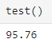

# Network In Network
## 概述

[Network In Network论文官方链接(点击查看)](https://arxiv.org/abs/1312.4400)

[Network In Network论文备用链接(点击查看)](http://www.apache2.sanyueyu.top/blog/ai/references/network_in_network.pdf)

[Network In Network论文中文pdf链接(点击查看)（本人翻译能力和手段有限，可以看看别人写的）](http://www.apache2.sanyueyu.top/blog/ai/references/network_in_networkcn.pdf)

### 作者做该研究的目的

Network In Network (NiN)的作者提出了NiN结构的主要目的是为了增强卷积神经网络（CNN）的表达能力，通过引入多层感知器（MLP）结构来提高特征提取的效果，从而改善图像识别和分类的性能。

### 传统convnet的缺点和解决方法

作者在引言中表示：在CNN中，卷积核是底层数据补丁的广义线性模型（GLM），他认为GLM的抽象程度较低。解释一下就是:GLM的抽象程度较低,它对输入数据的变化和特征的抽象能力较弱，只能捕捉到输入数据的局部特征。这也意味着GLM可能无法很好地处理输入数据中的复杂特征和全局信息。所以作者希望使用非线性函数逼近器替换GLM。

这里我们先解释一下为什么说传统卷积滤波器是广义线性模型：

如上图所示：我们可以把传统卷积的计算过程看作一个类似 y=kx+b 的过程，这里conv就是k，输入图片就是x，输出就是y，因此我们可以把传统卷积的计算过程看作一个线性计算。

为了提高模型的抽象能力，作者希望用一个非线性函数代替传统的GLM，为此作者提出了一种“微型网络”（mlpconv），这是一个通用的非线性函数逼近器（就是全连接网络），这样可以让线性模型变成非线性模型，同时全连接网络和卷积一样可以进行反向传播进行训练。

使用该“微型网络”（mlpconv）之后，做一次卷积结构就变成了下面这个样子

同时作者认为，传统卷积神经网络在最后softmax的时候使用全连接层会很容易出现过拟合问题，从而影响模型的泛化能力，于是他们提出了另一种策略，被称为全局平均池化，思路就是在最后的mlpconv层为每个类生成一个特征图，然后对每个特征图进行一次全局平均池化（池化核的大小和每个维度的大小一样），然后将结果输出到softmax层。如下图所示：

下面这个图片是我在csdn上看到的，可以更好的展示全局平均池化

将多三个mlpconv和一个全剧平均池化层重叠在一起，就可以构成一个可以提取更深层特征的卷积神经网络，同时也是作者论文中使用的卷积神经网络模型，如下图：

作者提出，“对卷积的输出进行非线性函数处理”这个操作，可以使用一种更简单的方法处理：使用1\*1的卷积核对图片进行，原理如下：

作者在前文中提到的mlpconv网络结构大概是这个样子，这里画图我省略了一些隐藏层

按照作者的介绍，我们可以通过使用1*1卷积对以上操作进行简化，如下图所示

这样操作起来明显更简洁，而且使用1x1的卷积可以在增加非线性的同时，显著降低参数的数量，这里我们用一个例子来证明：

>假设我们要将一个三通道5\*5的图片进行卷积操作输出一个二维2\*2的结果 
直接使用3\*3的卷积核，需要的参数数量为卷积核面积\*输入维度\*输出维度=3\*3\*3\*2=54 
先使用1\*1的卷积核，需要的参数数量为1\*1卷积核面积\*输入维度 + 3\*3卷积核面积\*输出维度=1\*3+3\*3\*2=27

由此可见，使用1\*1的卷积对于我们网络的结构优化也有很大的帮助，可以减少网络的参数，加速网络的训练，在后面的GoogLeNet中，就有使用该论文中提到的1\*1的卷积，并且取得了很好的效果。

## 基于NIN理论的模型设计

这里我们做一个小实验来加深我们对于NIN的学习效果，我选择使用mnist数据集进行实验，使用三层mlpconv加一层全局平均池化的网络结构。首先我们画出网络结构图：

## 基于NIN理论的代码实现（准备阶段）

准备阶段我们要准备硬件环境，同时处理一下数据集，这里我选择使用MNIST数据集

工作化境：
>CPU: I3 10105F （x86_64） 
>GPU: ASUS 3060 12G 
>RAM: 威刚 DDR4 40G 2666 
>主板：MSI B560M-A 
>硬盘：WDC SN550 1T 

>OS: UBUNTU22.04 
>python版本：3.11.7 
>torch版本：2.2.1 
>jupyter notebook  

配置算力平台pytorch环境：

    import torch
    if torch.cuda.is_available():
        device_count = torch.cuda.device_count()
        print(f"有{device_count}个gpu可用")
        for i in range(device_count):
            print(f"gpu 设备 {i} : {torch.cuda.get_device_name(i)}")
    else:
        print("无gpu")
        #结果如下图

配置数据预处理参数以及数据迭代器：

    batch_size = 60
    transform = transforms.Compose([
        transforms.ToTensor(),
        transforms.Normalize((0.1307,),(0.3081)),
        transforms.Resize((224,224))
    ])

    train_dataset = datasets.MNIST(root='./dataset/mnist',train=True,download=True,
                                transform=transform)
    test_dataset = datasets.MNIST(root='./dataset/mnist/',train=False,download=True,
                                transform=transform)
    train_loader=DataLoader(train_dataset,shuffle=True,batch_size=batch_size)
    test_loader=DataLoader(test_dataset,shuffle=True,batch_size=batch_size)

随机检查一张图片

    import matplotlib.pyplot as plt
    # 从train_dataset中获取第一个图像和标签
    image, label = train_dataset[24]

    # 将张量转换为图像
    image = transforms.ToPILImage()(image)

    # 显示图像
    plt.imshow(image, cmap='gray')
    plt.show()
    print(f'标签为:{label}')
    #结果如下图

## 基于NIN理论的代码试下（动手阶段）
### 模型构建（v0）
直接构建全部模型会导致模型收敛很慢，我决定采用分步训练的方式训练这个模型将整个模型分成v0，v1，v2三个阶段进行训练。

首先我画出完整的模型流程图：

可以看到，每个3\*3的卷积核后面会有两个1\*1的卷积核，直接做优化很难让模型收敛到一个很好的状态，所以我们先只构建一层1\*1的卷积层进行训练，也就是构建下面淡粉色的层，我们暂且把这个模型叫v0版本模型。

代码如下：

    import torch.nn as nn
    class nin_net(nn.Module):
        def __init__(self):
            super(nin_net,self).__init__()
            self.features = nn.Sequential(
                nn.Conv2d(1,10,3,1,1),
                nn.ReLU(),
                nn.Conv2d(10,10,1,1,0),
                nn.MaxPool2d(2,2),
                nn.Conv2d(10,20,3,1,1),
                nn.ReLU(),
                nn.Conv2d(20,20,1,1,0),
                nn.ReLU(),
                nn.MaxPool2d(2,2),
                nn.Conv2d(20,10,3,1,1),
                nn.ReLU(),
                nn.Conv2d(10,10,1,1,0),
                nn.ReLU(),
                nn.MaxPool2d(2,2),
                nn.AvgPool2d(kernel_size=14),
            )
        def forward(self,x):
            batch_size=x.size(0)
            x = self.features(x)
            x = x.view(batch_size,-1)
            return x
### 模型训练（v0）
首先，将模型迁移至gpu：

    device = torch.device("cuda:0")
    model.to(device)

定义损失函数和优化器：

    import torch.optim as optim
    criterion = torch.nn.CrossEntropyLoss()#交叉熵损失
    optimizer = optim.SGD(model.parameters(),lr=0.001,momentum=0.3)

构造训练和测试函数：

    def train(epoch):
        running_loss =0.0
        for batch_idx,data in enumerate(train_loader,0):
            inputs,labels = data
            # print(labels)
            inputs, labels = inputs.to(device), labels.to(device)
            optimizer.zero_grad()
            outputs = model(inputs)
            # print(outputs)
            loss = criterion(outputs,labels)
            loss.backward()
            optimizer.step()
    
            running_loss += loss.item()
            if batch_idx % 300 == 299:
                print(f'{epoch+1,batch_idx+1} loss :{running_loss/batch_idx}')

    def test():
        correct = 0
        total = 0
        with torch.no_grad():
            for data in test_loader:
                images,labels = data
                images,labels = images.to(device),labels.to(device)
                outputs=model(images)
                _,predicted = torch.max(outputs.data,dim=1)#再1维度（横维度）查找最大的值，返回最大值,下标
                total += labels.size(0)
                correct +=(predicted == labels).sum().item()
                # for i in range(len(predicted)):
                    # print(f"预测值: {predicted[i]}, 真实值: {labels[i]}")
        print(f'{100*correct/total}')

开始训练：
    for i in range(100):
        train(i)

经过一段时间的训练和微调，模型最终收敛情况如下：

对v0模型进行测试，结果如下

准确率为95.19%。

保存v0模型到本地：

    torch.save(model,'nin_mnist.pth')

### 模型构建（v1）

v1模型在v0模型的基础上增加两个1\*1的卷积层，就是下图中淡粉色和淡绿色所示的层

首先 构建模型：

    class nin_net_v1(nn.Module):
        def __init__(self):
            super(nin_net_v1,self).__init__()
            self.features = nn.Sequential(
                nn.Conv2d(1,10,3,1,1),
                nn.ReLU(),
                nn.Conv2d(10,10,1,1,0),
                nn.ReLU(),
                nn.Conv2d(10,10,1,1,0),
                nn.ReLU(),
                nn.MaxPool2d(2,2),
                nn.Conv2d(10,20,3,1,1),
                nn.ReLU(),
                nn.Conv2d(20,20,1,1,0),
                nn.ReLU(),
                nn.MaxPool2d(2,2),
                nn.Conv2d(20,10,3,1,1),
                nn.ReLU(),
                nn.Conv2d(10,10,1,1,0),
                nn.ReLU(),
                nn.Conv2d(10,10,1,1,0),
                nn.ReLU(),
                nn.MaxPool2d(2,2),
                nn.AvgPool2d(kernel_size=14),
            )
        def forward(self,x):
            batch_size=x.size(0)
            x = self.features(x)
            x = x.view(batch_size,-1)
            return x

    # 对模型实例化
    model = nin_net_v1()

然后我们要读取v0模型，将v0模型中训练好的参数传入v1模型，让v1模型在v0模型的基础上进行优化

    #读取v0模型
    nin_model = torch.load('nin_mnist.pth')

打印v0模型和v1模型的结构，观察两个模型的差异

    #打印v0模型
    nin_model

    #打印v1模型
    model

画出两个模型的参数关联关系（图片看不清楚的话可以鼠标右键--在新建标签页中打开）

红线连起来的层是在v0中进行了预训练的层，红色矩形框起来的是未进行预训练的层，这里我把这几个未进行预训练的层全初始化为1，进行了预训练的层则使用预训练参数：

    model.features[0].weight = nin_model.features[0].weight
    model.features[2].weight = nin_model.features[2].weight
    model.features[4].weight.data[:] = 1
    model.features[7].weight = nin_model.features[5].weight
    model.features[9].weight = nin_model.features[7].weight
    model.features[12].weight = nin_model.features[10].weight
    model.features[14].weight = nin_model.features[12].weight
    model.features[16].weight.data[:] = 1

模型迁移至GPU：

    device = torch.device("cuda:0")
    model.to(device)

至此，v1模型构建完成

### 模型训练（v1）

损失函数和优化器以及训练测试函数与v0相同，这里就不再赘述一遍了，直接看收敛情况。训练的时候模型最终损失如下：

可以看到损失比v0的时候要少0.02左右，说明这个方法确实是有用的，接下来看一下v1模型的准确率

v0模型的准确率为95.19，v1模型的准确率为95.28

保存v1模型到本地：

    torch.save(model,'nin_mnist_v1.pth')

接下来用v1模型为基础 构建v2模型

### 模型构建（v2）

v2模型相比v1模型多了一个1\*1的卷积层，也就是下图中蓝色的部分

这里我们先用代码构建v2模型类

    class nin_net_v2(nn.Module):
        def __init__(self):
            super(nin_net_v2,self).__init__()
            self.features = nn.Sequential(
                nn.Conv2d(1,10,3,1,1),
                nn.ReLU(),
                nn.Conv2d(10,10,1,1,0),
                nn.ReLU(),
                nn.Conv2d(10,10,1,1,0),
                nn.ReLU(),
                nn.MaxPool2d(2,2),
                nn.Conv2d(10,20,3,1,1),
                nn.ReLU(),
                nn.Conv2d(20,20,1,1,0),
                nn.ReLU(),
                nn.Conv2d(20,20,1,1,0),
                nn.ReLU(),
                nn.MaxPool2d(2,2),
                nn.Conv2d(20,10,3,1,1),
                nn.ReLU(),
                nn.Conv2d(10,10,1,1,0),
                nn.ReLU(),
                nn.Conv2d(10,10,1,1,0),
                nn.ReLU(),
                nn.MaxPool2d(2,2),
                nn.AvgPool2d(kernel_size=14),
            )
        def forward(self,x):
            batch_size=x.size(0)
            x = self.features(x)
            x = x.view(batch_size,-1)
            return x
        
        #实例化v2模型
        model = nin_net_v2()
    
读取v1模型

    nin_model = torch.load('nin_mnist_v1.pth')

将v1中训练完的层赋值给v2，新添加的层初始化为0.01

    model.features[0].weight = nin_model.features[0].weight
    model.features[2].weight = nin_model.features[2].weight
    model.features[4].weight = nin_model.features[4].weight
    model.features[7].weight = nin_model.features[7].weight
    model.features[9].weight = nin_model.features[9].weight
    model.features[11].weight.data[:] = 0.01
    model.features[14].weight = nin_model.features[12].weight
    model.features[16].weight = nin_model.features[14].weight
    model.features[18].weight = nin_model.features[16].weight

模型迁移

    device = torch.device("cuda:0")
    model.to(device)

### 模型训练（v2）
首先 构建损失函数和优化器

    import torch.optim as optim
    criterion = torch.nn.CrossEntropyLoss()#交叉熵损失
    optimizer = optim.SGD(model.parameters(),lr=0.0004)

训练和测试函数不变，观察最终的损失：

可以看到，v2的损失比v1要小0.015左右

查看准确率

对比一下三个版本的准确率：

>v0：95.19  
>v1：95.28  
>v2：95.76

## 总结
得出结论：使用NIN确实可以增加模型的拟合能力，而且增加的参数量也比较少

心得：模型一次成型是一件很困难的事情，在处理复杂模型的时候可以尝试将模型分成多个部分，一点一点训练，本次的实验最开始我直接构造了完整的模型，但是一直没有很好的优化结果，后面使用分步训练发现模型得到了很好的收敛，这个思路也算是我做该实验的收获。

