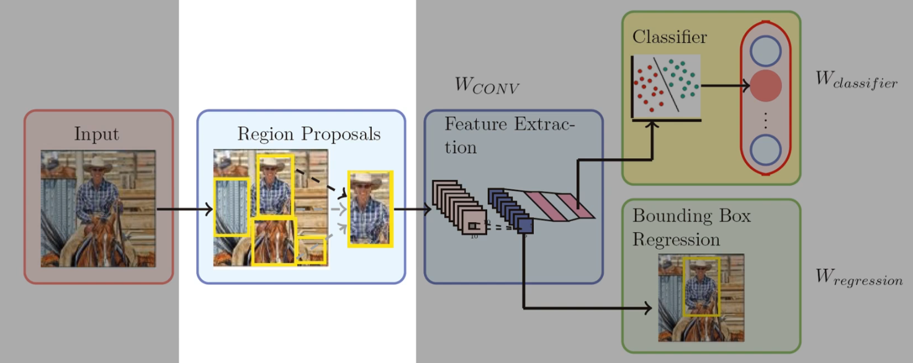
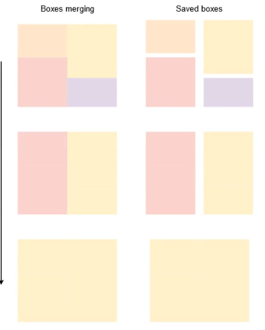

# selective search(选择性搜索)
## 概述

### 论文地址
[selective search论文官方链接(点击查看)](https://ivi.fnwi.uva.nl/isis/publications/bibtexbrowser.php?key=UijlingsIJCV2013&bib=all.bib)

[selective search论文备用链接(点击查看)](http://www.apache2.sanyueyu.top/blog/ai/references/network_in_network.pdf)

[selective search论文中文pdf链接(点击查看)（本人翻译能力和手段有限，可以看看别人写的）](http://www.apache2.sanyueyu.top/blog/ai/references/network_in_networkcn.pdf)
### 算法简述
在R-CNN，Fast R-CNN等算法中都使用了ss（选择性搜索）算法进行候选框的生成，这里我们就简单了解一下ss算法是怎么运行的。

在RCNN算法的流程中，ss的算法的位置如下：

首先我们回顾一下在ss之前，我们的候选框生成时怎么做的：

比较典型的算法有蛮力搜索（exhaustive search）,使用不同的大的框在图像里从上到下，从左到右暴力搜索，这种算法对计算机的算力浪费很大，耗时长，但是在当时没有更好的方法，所以只能使用蛮力搜搜。

接下来我们看一下ss算法：这里我举一个例子就很好理解了，ss算法使用颜色，纹理等特征将图片分成各个块，记录每个块的位置当作候选框，然后合并相近的块（特征相近，不是距离相近），然后记录合并之后的块的位置，以此类推如下所示

上图中我们通过最初的划分最终得到七个候选框，就是上图右边这七个块。根据这个方法我们可能能得到上万个候选框，然后我们根据一定的规则给每一个块赋予一个权重，这样我们调用候选框的时候就会从权重大的块开始读取。
### 算法优点
相比传统的暴力搜索，ss算法无疑时很优秀的，他不会做很多无意义的搜索，尽可能保证每个候选框中的东西都是有意义的。

这个算法在opencv库中有api可以直接调用，代码实现很复杂，更多时候只要会用就ok

