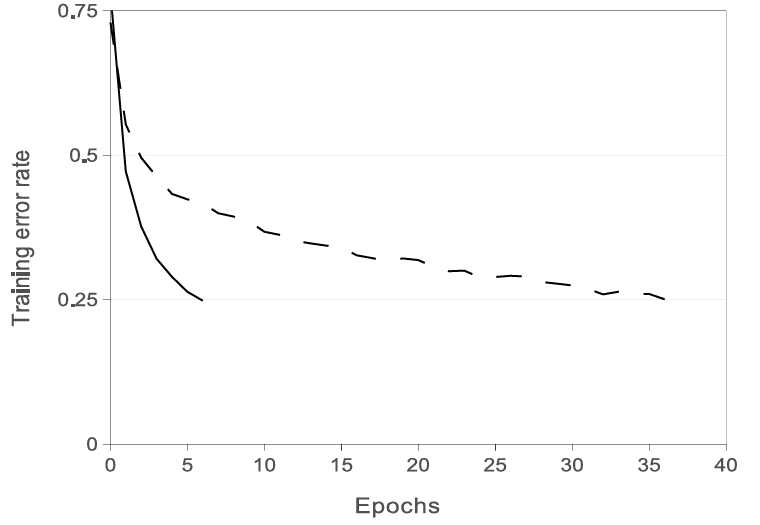
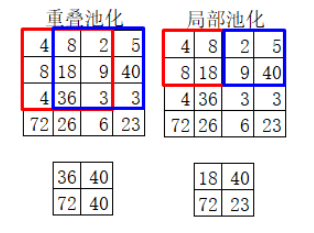
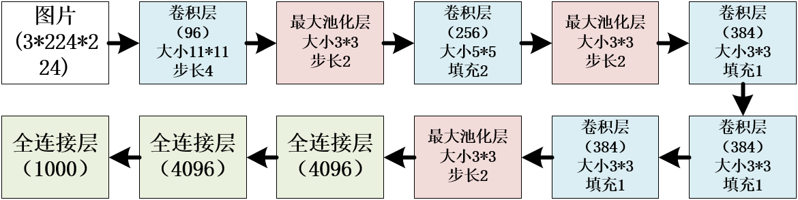
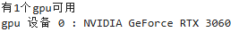
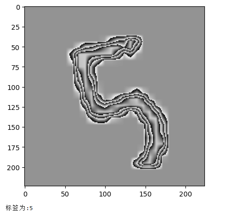
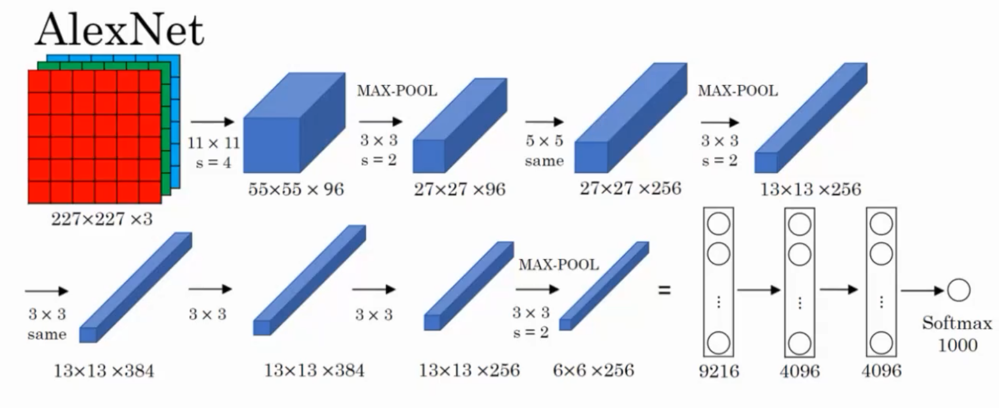
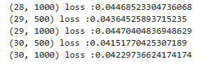
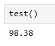

# AlexNet
## AlexNet介绍

[AlexNet论文官方链接(点击查看)](https://proceedings.neurips.cc/paper_files/paper/2012/file/c399862d3b9d6b76c8436e924a68c45b-Paper.pdf)

[AlexNet论文备用链接(点击查看)](http://www.apache2.sanyueyu.top/blog/ai/image_classification/alexnet/alexnet.pdf)

[AlexNet论文中文pdf链接(点击查看)（本人翻译能力和手段有限，可以看看别人写的）](http://www.apache2.sanyueyu.top/blog/ai/image_classification/alexnet/alexnetcn.pdf)

**首先，AlexNet是第一个成功应用于大规模图像识别任务的深度卷积神经网络，具有非常牛逼的纪念意义，是深度学习在计算机视觉领域的里程碑** 
**首先，AlexNet是第一个成功应用于大规模图像识别任务的深度卷积神经网络，具有非常牛逼的纪念意义，是深度学习在计算机视觉领域的里程碑** 
**首先，AlexNet是第一个成功应用于大规模图像识别任务的深度卷积神经网络，具有非常牛逼的纪念意义，是深度学习在计算机视觉领域的里程碑**

AlexNet里作为里程碑的成就：

>1.AlexNet包含八层神经网络，其中有五个卷积层，三个全连接层，这种深度结构使得网络能学习到更加复杂和抽象的特称 
2.同时AlexNet**首次使用了relu作为激活函数**，这种激活函数能加速收敛，并且避免梯度消失 
3.AlexNet是**首个成功使用GPU进行深度学习训练的网络**，利用GPU的并行计算能力大大加快了训练速度，而且AlexNet同时使用两块GTX580(3GB)进行运算，是深度学习领域**首次使用多块GPU进行网络训练和推理的案例**

作为2012年imagenet大赛中的第一名，同时也是这个领域的先驱，我会写的详细一点，如果只是想看网络的代码实现可以跳转到[模型实现部分](#手动实现算法-准备阶段)

### 数据集
AlexNet网络的数据集是imageNet挑战赛使用的imagenet数据集,该数据集包含数百万张图像，一千多个类别，每个类别都有超过1000张图像，该挑战赛在深度学习领域的发展中起到了重要的推动作用，imagenet数据集也成为了评估计算机视觉算法性能的重要数据集。著名的AlexNet，vggnet，googlenet，resnet都出自imagenet挑战赛，都这边提供一个跳转方便大家使用这个数据集：[imagenet数据集官网(点击跳转)](https://www.image-net.org/)

### 激活函数
AlexNet使用rulu非线性函数作为激活函数，根据论文中的研究，使用relu函数时模型的收敛速度可以比使用tanh函数快几倍（如下面的图示所示，其中实线为relu，虚线为tanh）

### 多GPU训练
当初在训练这个网络的时候使用的显卡是GTX580(3GB),3GB的显存对于训练这个庞大的网络有些力不从心，所以AlexNet团队将网络分布在两块GTX580(3GB)上进行训练，同时让GPU在某些层进行通信，保证了模型的整体推理能力，随着显卡算力的增加，现在该模型已经可以使用一块显卡进行训练了，但是AlexNet多显卡训练的思路为如今多卡模型并行技术奠定了基础

### 局部响应归一化
AlexNet在深度卷积神经网络中使用局部响应归一化（LRN）的方法。LRN是一种用于提高深度卷积神经网络性能的技术，它在一定程度上类似于侧抑制机制，通过对局部神经元的响应进行归一化，从而增强网络的泛化能力。

### 重叠池化
AlexNet在池化过程中，池化步长小于池化核的边长，这样可以进行更好的特征提取，同时也可以避免过拟合现象的产生，根据AlexNet论文中的描述，使用重叠池化比使用局部池化错误率降低了0.3%~0.4%，重叠池化和局部池化的区别如下

### 整体结构：
直接看论文里的图片

可以看到网络分为上下两条路径，对应的就是两块GPU，画成比较容易理解的图就是下面这样：

### 减少过拟合的操作
AlexNet为了减少过拟合，对数据进行了数据增强操作，首先是图像平移和水平反射，通过在255\*255的图片上提取224\*224的截图作为训练样本数据，每张图片分别截取四个角以及正中心，以及这些截图的水平反射，会产生十张训练数据，其次是修改rgb通道的强度，来增加数据的复杂程度，避免产生过拟合，最后采用dropout方法对神经元进行随机失活

### 小结

经过以上种种操作，是的AlexNet在imagenet比赛中表现出色，接下来我们使用mnist数据集对AlexNet网络进行复现

## 手动实现算法（准备阶段）

准备阶段我们要做一些准备工作同时处理一下数据集，这里我选择使用MNIST数据集

工作化境：
>CPU: I3 10105F （x86_64） 
>GPU: ASUS 3060 12G 
>RAM: 威刚 DDR4 40G 2666 
>主板：MSI B560M-A 
>硬盘：WDC SN550 1T 

>OS: UBUNTU22.04 
>python版本：3.11.7 
>torch版本：2.2.1 
>jupyter notebook  

**注意事项：本实验一定要在有gpu的平台进行，使用个人电脑的cpu很难将模型优化到不错的状态**
## 手动实现算法（准备阶段）

### 数据预处理

首先检查GPU部署是否正常

    import torch
    if torch.cuda.is_available():
        device_count = torch.cuda.device_count()
        print(f"有{device_count}个gpu可用")
        for i in range(device_count):
            print(f"gpu 设备 {i} : {torch.cuda.get_device_name(i)}")
    else:
        print("无gpu")

检查GPU后，进行数据预处理

    from torchvision import transforms,datasets
    from torch.utils.data import DataLoader
    batch_size = 60 
    #这个batch_size不能设置太大，太大的话梯度下降会很慢
    #这也是这次做实验的时候我发现的，设成400之后模型收敛的很慢
    #根据自己的显存酌情设置batch_size
    transform = transforms.Compose([
        transforms.ToTensor(),
        transforms.Normalize((0.1307,),(0.3081)),
        transforms.Resize((224,224))
    ])

    train_dataset = datasets.MNIST(root='./dataset/mnist',train=True,download=True,
                                transform=transform)
    test_dataset = datasets.MNIST(root='./dataset/mnist/',train=False,download=True,
                                transform=transform)
    train_loader=DataLoader(train_dataset,shuffle=True,batch_size=batch_size)
    test_loader=DataLoader(test_dataset,shuffle=True,batch_size=batch_size)

    #数据导入之后，随便输出一张图片检查一下有没有异常
    import matplotlib.pyplot as plt
    # 从train_dataset中获取一个图像和标签
    image, label = train_dataset[1024]

    # 将张量转换为图像
    image = transforms.ToPILImage()(image)

    # 显示图像
    plt.imshow(image, cmap='gray')
    plt.show()
    print(f'标签为:{label}')

## 手动实现算法（动手阶段）
### 模型实现--构建模型
还是先观察一下模型的图，这里使用吴恩达老师在讲课的时候用的图，这个图和我上面画的图是一个意思，但是看起来更正式一点

根据这个图片我们构建模型：

    import torch.nn.functional as F
    import torch.nn as nn

    class alex_net(nn.Module):
    def __init__(self):
        super(alex_net,self).__init__()
        self.features = nn.Sequential(
            nn.Conv2d(1,96,11,4,0),
            nn.ReLU(),
            nn.MaxPool2d(3,2),
            nn.Conv2d(96,256,5,1,2),
            nn.ReLU(),
            nn.MaxPool2d(3,2),
            nn.Conv2d(256,384,3,1,1),
            nn.ReLU(),
            nn.Conv2d(384,384,3,1,1),
            nn.ReLU(),
            nn.Conv2d(384,256,3,1,1),
            nn.ReLU(),
            nn.MaxPool2d(3,2)
        )
        self.fc = nn.Sequential(
            nn.Linear(256*5*5, 4096),
            nn.ReLU(),
            nn.Dropout(0.5),
            nn.Linear(4096, 4096),
            nn.ReLU(),
            nn.Dropout(0.5),
            nn.Linear(4096, 1000),
            nn.ReLU(),
            nn.Linear(1000,10)
        )
    def forward(self,x):
        batch_size = x.size(0)
        x = self.features(x)
        x = self.fc(x.view(batch_size,-1))
        return x

    model = alex_net()
    device = torch.device("cuda:0")
    model.to(device)
### 模型实现--构建训练和测试函数
    def train(epoch):
        running_loss =0.0
        for batch_idx,data in enumerate(train_loader,0):
            inputs,labels = data
            # print(labels)
            inputs, labels = inputs.to(device), labels.to(device)
            optimizer.zero_grad()
            outputs = model(inputs)
            # print(outputs)
            loss = criterion(outputs,labels)
            loss.backward()
            optimizer.step()
    
            running_loss += loss.item()
            if batch_idx % 500 == 499:
                print(f'{epoch+1,batch_idx+1} loss :{running_loss/batch_idx}')

    def test():
        correct = 0
        total = 0
        with torch.no_grad():
            for data in test_loader:
                images,labels = data
                images,labels = images.to(device),labels.to(device)
                outputs=model(images)
                _,predicted = torch.max(outputs.data,dim=1)
                #在1维度（横维度）查找最大的值，返回最大值,下标
                total += labels.size(0)
                correct +=(predicted == labels).sum().item()
                # for i in range(len(predicted)):
                    # print(f"预测值: {predicted[i]}, 真实值: {labels[i]}")
        print(f'{100*correct/total}')
### 模型实现--小批量随机梯度下降
这里我们先训练30次，如果模型收敛的不好可以自己再训练一下，总之最终的目的就是让模型收敛

    for i in range(30):
        train(i)

像我的这个模型，训练30次就有不错的表现了

进行测试，观察一下正确率

    test()

## 总结

