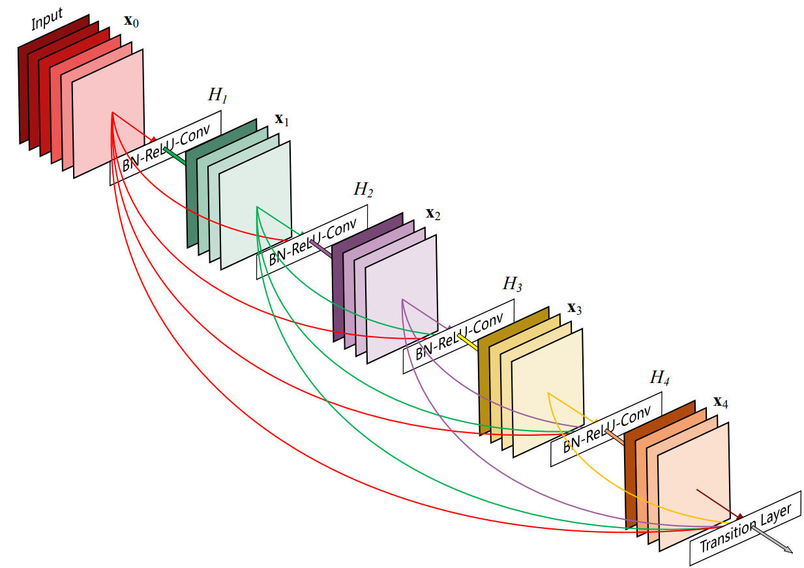
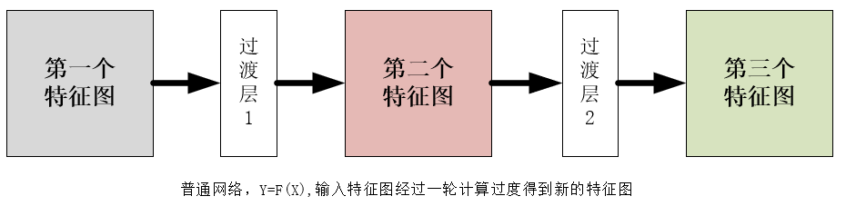
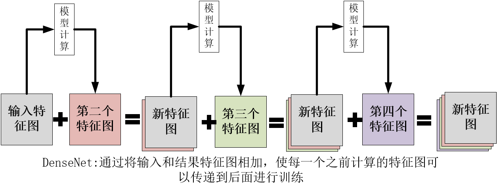
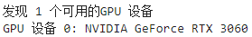
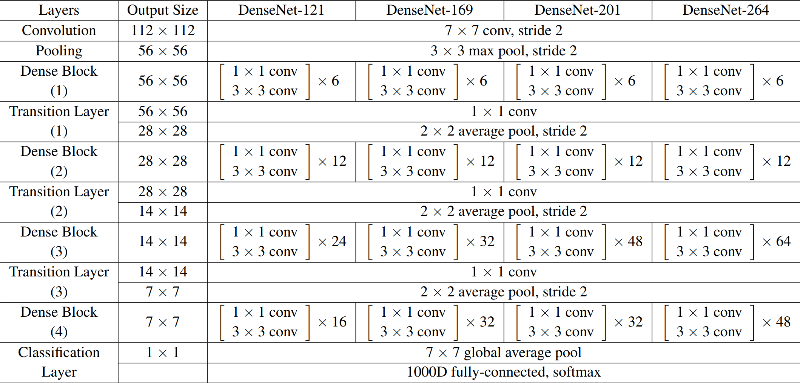
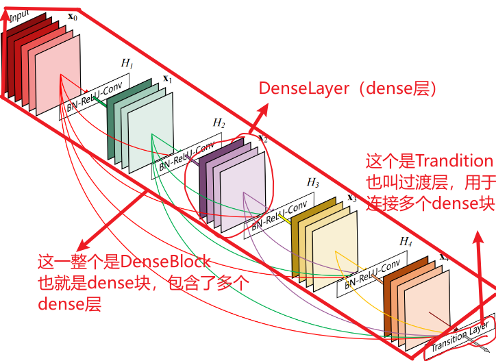
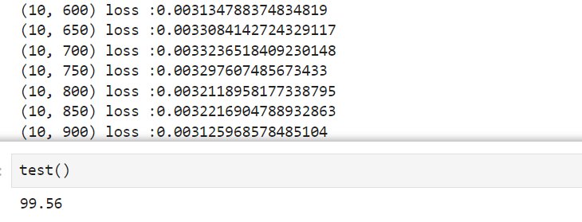

# DenseNet
## DenseNet介绍

[DenseNet论文官方链接(点击查看)](https://arxiv.org/abs/1608.06993)

[DenseNet论文备用链接(点击查看)](http://www.apache2.sanyueyu.top/blog/ai/image_classification/densenet/densenet.pdf)

[DenseNet论文中文pdf链接(点击查看)（本人翻译能力和手段有限，可以看看别人写的）](http://www.apache2.sanyueyu.top/blog/ai/image_classification/densenet/densenetcn.pdf)

DenseNet团队指出，根据最近的工作表名，当卷积神经网络包含靠近输入和靠近输出层的快捷链接，那么卷积网络可以更深入，更准确，更有效的训练。于是他们提出了一种密集卷积神经网络(DenseNet)，它将每一层网络连接到之前的每一层，将所有前面的层的特征图作为输入，可以看成是一个加强版的残差网络（ResNet）。他的优点是加强了特征传播和特征重用，减少了参数量。在结构方面，除了更复杂的快捷连接外，DenseNet没有什么太亮眼的地方，但是他的效果很好，下图是DenseNet的网络结构示意图，取自官方论文。

### 实现方法

对于以上这个结构，官方给出的实现方法是通过将输入和输出拼接在一起一直往下层层传递，直接说可能很难懂，画图可能会好一点，这里我画一个让大家直观地观察到数据的变化

首先是普通的网络，特征图经过一个计算过渡，得到新的特征图，如下图所示

而DensNet为了让特征图可以一直传下去，在过渡层输出的时候会把原特征图和新特征图在通道维度上相加，如下图所示

这里我们可以发现，官方论文中发的图片具有一定误导性，我最开始读论文的时候，以为团队是通过某种连线将特征图进行传递的，实际上就是通过拼接特征图来达到传递特征图的目的。

理解原理之后，就可以着手准备下一步的代码复现

## 手动实现算法（准备阶段）

准备阶段我们要做一些准备工作同时处理一下数据集，这里我选择使用MNIST数据集

工作化境：
>CPU: I3 10105F （x86_64） 
>GPU: ASUS 3060 12G 
>RAM: 威刚 DDR4 40G 2666 
>主板：MSI B560M-A 
>硬盘：WDC SN550 1T 

>OS: UBUNTU22.04 
>python版本：3.11.7 
>torch版本：2.2.1 
>jupyter notebook  

**注意事项：本实验一定要在有gpu的平台进行，使用个人电脑的cpu很难将模型优化到不错的状态**

数据集我选择的是mnist数据集，该数据集包含0~9十个手写数字，包含5万条训练集和1万条测试集

## 手动实现算法（准备阶段）
### 检查算力平台情况

    import torch
    import torch.nn as nn
    import torch.nn.functional as F

    if torch.cuda.is_available():
        # 获取GPU设备数量
        device_count = torch.cuda.device_count()
        print(f"发现 {device_count} 个可用的GPU 设备")
        # 获取每个GPU的名称
        for i in range(device_count):
            print(f"GPU 设备 {i}: {torch.cuda.get_device_name(i)}")
    else:
        print("没有发现可用的GPU")

输出结果：

### 数据预处理

    from torchvision import transforms
    from torchvision import datasets
    from torch.utils.data import DataLoader
    from torch.utils.data import Subset, random_split

    batch_size = 300
    transform = transforms.Compose([
        transforms.ToTensor(),
        transforms.Normalize((0.1307,),(0.3081)),
        transforms.Resize((224, 224))
    ])

    train_dataset = datasets.MNIST(root='./dataset/mnist/',train=True,download=True,
                                transform = transform)
    train_loader = DataLoader(train_dataset,shuffle=True,batch_size=batch_size)
    test_dataset = datasets.MNIST(root='./dataset/mnist/',train=False,download=True,
                                transform = transform)
    test_loader = DataLoader(test_dataset,shuffle=True,batch_size=batch_size)

## 手动实现算法（动手阶段）
### 模型实现--构建模型

先观察以下官方给出的模型结构表

观察第一列，我们可以看到，DenseNet的主要结构有两个，一个是DenseBlock，一个是Trandition Layer，对应样例图就是下面这两个结构：

通过观察我们可以看到，DenseBloc是由很多层组成的，所以我们的构建过程就是，先构建DenseLayer（Dense层，就是每一个DenseBlock中的层）,然后使用DenseLayer构建DenseBlock(也可以叫Dense块或密集块)

首先，构建DenseLayer类：

    class _DenseLayer(nn.Sequential):
        #Dense层类，用于构建Dense块
        def __init__(self,num_input_features,growth_rate,bn_size,drop_rate):
            '''
                num_input_features:输入特征数量
                growth_rate:增长率(也就是增加的卷积核个数）
                bn_size:批归一化参数
                drop_rate:丢弃率
            '''
            super(_DenseLayer,self).__init__()
            self.drop_rate = drop_rate
            self.add_module('norm1',nn.BatchNorm2d(num_input_features)),#对输入进行批量归一化
            self.add_module('relu1',nn.ReLU(inplace=True))
            self.add_module('conv1', nn.Conv2d(num_input_features, bn_size *
                                            growth_rate, kernel_size=1, stride=1, bias=False)), #输入维度为输入维度，输出维度为增长率*批量归一化参数
            self.add_module('norm2', nn.BatchNorm2d(bn_size * growth_rate)),  # 批量归一化
            self.add_module('relu2',nn.ReLU(inplace=True))
            self.add_module('conv2', nn.Conv2d(bn_size * growth_rate, growth_rate,
                                            kernel_size=3, stride=1, padding=1, bias=False)),    # 输出为growth_rate：表示输出通道数为k  提取特征
        def forward(self,x):
            new_fatures = super(_DenseLayer,self).forward(x)
            if self.drop_rate > 0:
                new_features = F.dropout(new_fatures, p=self.drop_rate, training=self.training)
            return torch.cat([x,new_fatures],1)

以上代码用于构建一个Dense层，多个Dense层叠加在一起就可以构建一个Dense块，接下来写Dense块的代码：

    class _DenseBlock(nn.Sequential):
        def __init__(self,num_layers,num_input_features,bn_size,growth_rate,drop_rate):
            '''
                num_layers:密集块中的密集层的数量
                num_input_features：输入特征的数量，即输入张量的通道数
                bn_size:批量归一化大小
                growth_rate:增长率
                drop_rate：丢弃率
            '''
            super(_DenseBlock,self).__init__()
            
            for i in range(num_layers):#传入参数中包括了这个Dense块需要用的的Dense层的参数，遍历这个参数表来创建Dense块中的Dense层结构
                layer=_DenseLayer(num_input_features+i*growth_rate,growth_rate,bn_size,drop_rate)
                self.add_module(f'denselayer{i+1}',layer)

以上，dense块的构建就完成了，整个DenseNet由多个Dense块组成，Dense块由过渡层（Transition Layer）连接，过渡层由一个批量归一化层，一个relu层，一个卷积层和一个平均池化层构成，接下来我们构建TransitionLayer：

    class _Transition(nn.Sequential):
        def __init__(self,num_input_features,num_output_features):
            super(_Transition,self).__init__()
            self.add_module('norm',nn.BatchNorm2d(num_input_features))
            self.add_module('relu',nn.ReLU(inplace=True))
            self.add_module('conv',nn.Conv2d(num_input_features,num_output_features,kernel_size=1,stride=1,bias=False))
            self.add_module('pool',nn.AvgPool2d(kernel_size=2,stride=2))

至此，所有DenseNet的构件定义完成，接下来用这些构件来构建DenseNet：

    class DenseNet(nn.Module):
        def __init__(self,growth_rate=32,block_config=(6,12,24,16),num_init_features=64,bn_size=4,drop_rate=0.3,num_classes=4):
            '''
                gtowth_rate:增长率，每个Dense层计算式增加的特征图数
                block_config:dense块的配置，block_config中数据的个数表示dense块的个数，每个数代表了dense块中dense层的数量
                num_init_features:初始化的特征数，输入的特征经过第一批处理之后维度变成num_init_features
                bn_size:批量归一化大小，在每个dense层中，会把特征增加bn_size+growth_rate，然后使用3x3卷积进行特征提取
                drop_rate：丢弃率
                num_class:类别数量    
            '''
            super(DenseNet,self).__init__()
            self.features = nn.Sequential(OrderedDict([
                ('conv0',nn.Conv2d(1,num_init_features,7,2,3,bias=False)),
                ('norm0',nn.BatchNorm2d(num_init_features)),
                ('relu0',nn.ReLU(inplace=True)),
                ('pool0',nn.MaxPool2d(kernel_size=3,stride=2,padding=1)),
            ]))
            # 以上代码对输入数据进行第一次处理
            num_features = num_init_features
            for i ,num_layers in enumerate(block_config):#读取dense块参数，配置dense块
                block=_DenseBlock(num_layers,num_features,bn_size,growth_rate,drop_rate)
                self.features.add_module(f'denseblock{i + 1}', block)
                # print(num_features,num_features,num_layers,growth_rate)
                num_features = num_features + num_layers * growth_rate
                #以上的代码根据输入的block配置创建dense层。
                if i != len(block_config)-1:
                    trans = _Transition(num_input_features=num_features, num_output_features=num_features // 2)
                    self.features.add_module('transition%d' % (i + 1), trans)
                    num_features = num_features // 2
            self.features.add_module('norm5',nn.BatchNorm2d(num_features))
            self.classifier = nn.Linear(num_features, num_classes)
            for m in self.modules():#参数初始化
                if isinstance(m, nn.Conv2d):
                    nn.init.kaiming_normal(m.weight.data)
                elif isinstance(m, nn.BatchNorm2d):
                    m.weight.data.fill_(1)
                    m.bias.data.zero_()
                elif isinstance(m, nn.Linear):
                    m.bias.data.zero_()
        def forward(self, x):
            x = self.features(x)
            x = F.relu(x, inplace=True)
            x = F.avg_pool2d(x, kernel_size=7, stride=1).view(x.size(0), -1)
            x = self.classifier(x)
            return x

    model = DenseNet(num_init_features=64, growth_rate=32, block_config=(6, 12, 24, 16),num_classes=10)
    device = torch.device("cuda:0")
    model.to(device)

### 模型实现--构建训练和测试函数

首先，构建优化器和损失函数

    import torch.optim as optim
    criterion = torch.nn.CrossEntropyLoss()#交叉熵损失
    optimizer = optim.SGD(model.parameters(),lr=0.01,momentum=0.9)

然后构建训练和测试函数

    def train(epoch):
        model.train()
        running_loss =0.0
        for batch_idx,data in enumerate(train_loader,0):
            inputs,labels = data
            # print(labels)
            inputs, labels = inputs.to(device), labels.to(device)
            optimizer.zero_grad()
            outputs = model(inputs)
            # print(outputs)
            loss = criterion(outputs,labels)
            loss.backward()
            optimizer.step()
    
            running_loss += loss.item()
            if batch_idx % 50 == 49:
                print(f'{epoch+1,batch_idx+1} loss :{running_loss/batch_idx}')

    def test():
        model.eval()
        correct = 0
        total = 0
        with torch.no_grad():
            for data in test_loader:
                images,labels = data
                images,labels = images.to(device),labels.to(device)
                outputs=model(images)
                _,predicted = torch.max(outputs.data,dim=1)#再1维度（横维度）查找最大的值，返回最大值,下标
                total += labels.size(0)
                correct +=(predicted == labels).sum().item()
                # for i in range(len(predicted)):
                    # print(f"预测值: {predicted[i]}, 真实值: {labels[i]}")
        print(f'{100*correct/total}')
### 模型实现--小批量随机梯度下降

    for i in range(10):
        train(i)

损失下降的情况和测试结果如下：

## 总结

DenseNet的模型效果确实很出众，但是他的缺点也是明显的，比如densenet在学习和推理的过程中**需要的空间很大**，推理的**速度也比较慢**，期待后期对这个算法的优化。

