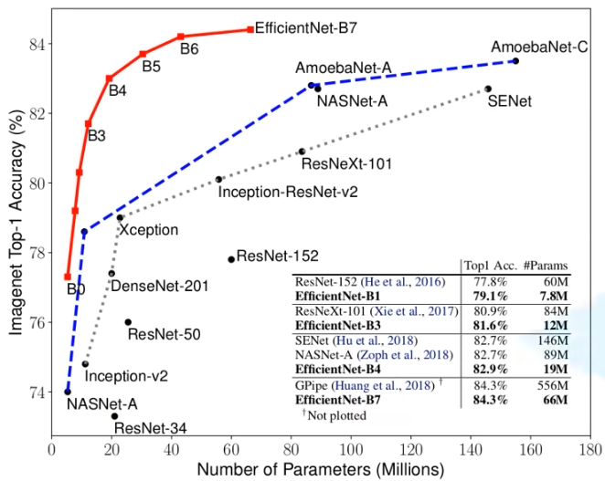
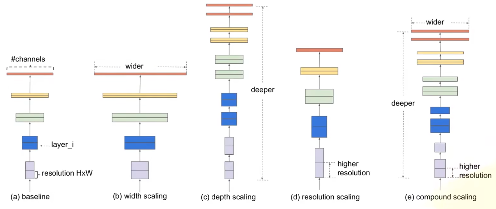
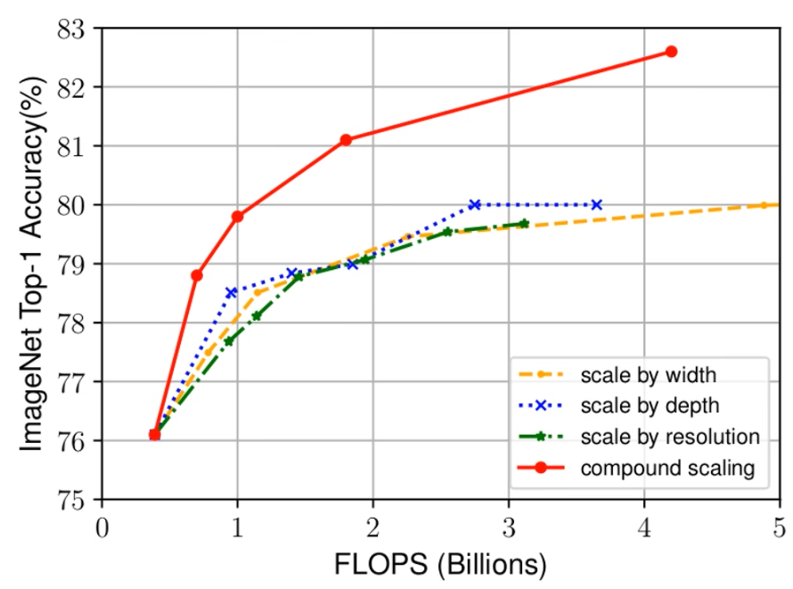
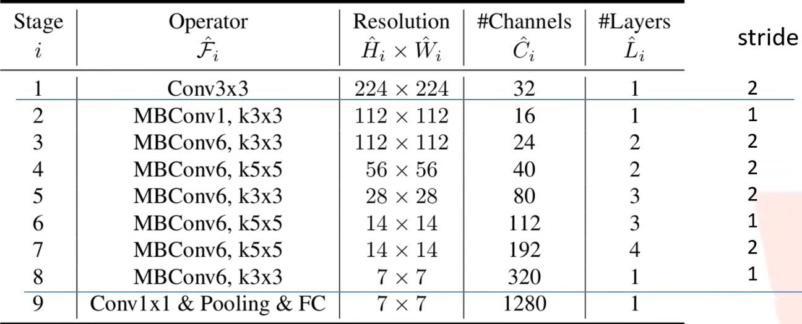
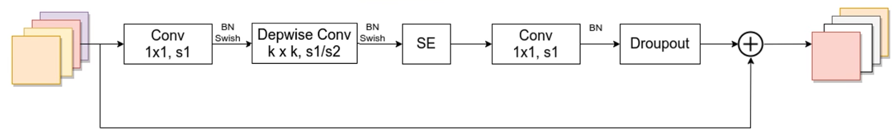
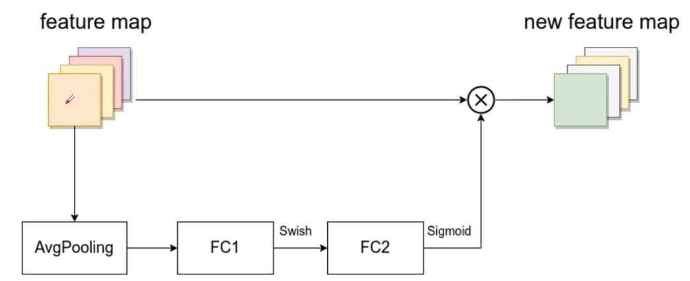
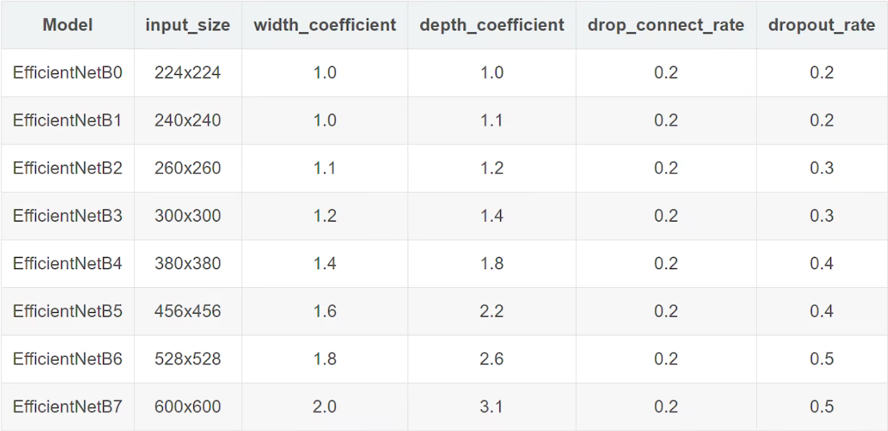
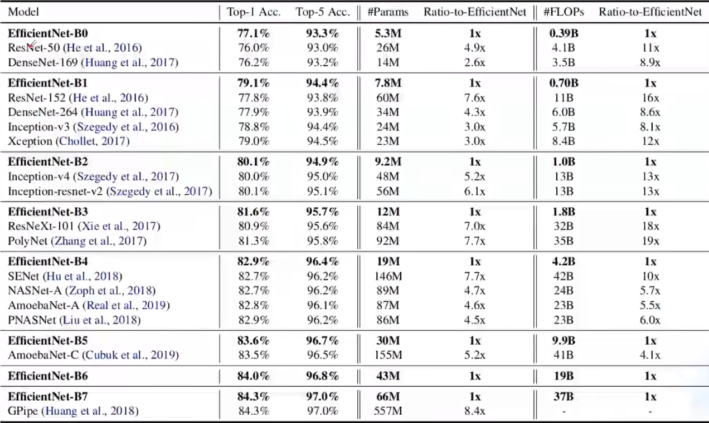
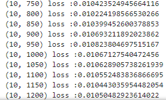
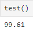

# EfficientNet
## EfficientNet介绍

[EfficientNet论文官方链接(点击查看)](https://arxiv.org/abs/1905.11946)

[EfficientNet论文备用链接(点击查看)](http://www.apache2.sanyueyu.top/blog/ai/image_classification/efficientnet/efficientnet.pdf)

下面中文论文中有些图片分辨率太低了，图片方面可以参考上面备用链接里的图片，而且GoogLeNet的论文写的巨抽象，大概是因为我见识浅薄，读起来很吃力

[EfficientNet论文中文pdf链接(点击查看)（本人翻译能力和手段有限，可以看看别人写的）](http://www.apache2.sanyueyu.top/blog/ai/image_classification/efficientnet/efficientnet_cn.pdf)

efficientnet由谷歌在2019年发布的论文中提出，文中提出的efficientnet-b7在imagenet top-1上达到了当年最高准确率84.3%，与之前准确率最高的gpipe相比，参数数量仅为其1/8.4，推理速度提升了6.1倍，下图展示了efficientnet与当前主流网络之间的对比，横轴为参数数量，纵轴为top1准确率

论文中给出了下面这幅图:

这里a是一个标准的网络，图b是增加宽度的网络，图c是增加深度的网络，图d增加了输入图像的分辨率，e则同时增加网络的宽度深度和分辨率

根据以往的经验，增加深度可以得到更加丰富，复杂的特征，并且能够更好的应用在其他任务中，但是网络的深度过深会面梯度消失，训练困难的问题。 
增加网络的宽度则能获得更好细粒度的特征，并且也更容易训练，但是对于width很大而深度较浅的网络往往很难学习到更深层次的特征。 
增加输入网络的图像分辨率能够潜在获得更高细粒度的特征模板，但是对于非常高的输入分辨率吧，准确率的增益也会减小，而且大分辨率图像会增加计算量。 

于是google对这三种情况进行了实验，实验结果如下图所示，x轴代表理论计算量，y轴代表top1准确率，黄色的线增加了网络的宽度，蓝色的线增加了网络的深度，绿色的线增加了网络的输入图像分辨率，通过观察图像可以得出，这三种情况当网络的top1准确率到达80就陷入了瓶颈。红色的线表示同时增加网络的宽度，深度和输入图像分辨率，这条线没有在80的时候陷入瓶颈，同时在相同计算量（也就是x相同）时，红色的线的效果也比其他三种颜色的线表现更好。

官方给出了efficientnet-b0的结构示意图，这个网络是使用神经网络结构搜索得到的：

这里的MBConvx就是mobilenet里用到的结构，如下图所示，x代表的是倍率因子，也就是1x1的卷积核的倍率

第一个升维的1x1卷积层，卷积核个数是输入特征的维度的n倍 
SE是注意力机制，其他都是很普通的卷积神经网络参数我这里不过多解释 
SE模块的结构如下所示：

这里需要解释一下，第一个全连接层的姐弟啊神女湖是MBConv特征助阵的维度的1/4，且使用swish激活函数。第二个全连接层的阶段个数等于depthwise conv层输出的特征举着你的维度，并且使用sigmoid作为激活函数。

然后官方提供了efficientnet的其他版本的参数变化量，如下图所示：

下图是efficenet各个版本本与其他网络的性能对比

这里需要注意，由于输入图像的分辨率变大了，整个模型的显存占用会很大，这算是efficenet的一个缺点。
## EfficientNet代码实现（模型训练部分）

### 模型构建
首先是导包

    import math
    import copy
    from functools import partial
    from collections import OrderedDict
    from typing import Optional, Callable

    import torch
    import torch.nn as nn
    from torch import Tensor
    from torch.nn import functional as F

检查gpu情况

    if torch.cuda.is_available():
        # 获取GPU设备数量
        device_count = torch.cuda.device_count()
        print(f"发现 {device_count} 个可用的GPU 设备")
        # 获取每个GPU的名称
        for i in range(device_count):
            print(f"GPU 设备 {i}: {torch.cuda.get_device_name(i)}")
    else:
        print("没有发现可用的GPU")

创建调整通道数函数，我之前是不用这个函数的，但是我看好多大佬都这么写

    def _make_divisible(ch,divisor=8,min_ch=None):
        # 调整通道数
        if min_ch is None:
            min_ch = divisor
        new_ch = max(min_ch,int(ch+divisor/2)//divisor*divisor)
        if new_ch<0.9*ch:
            new_ch+=divisor
        return new_ch

dropout方法，这里用的是比较原始的方法，现在可以直接用torch的dropout——api

    def drop_path(x, drop_prob: float = 0., training: bool = False):
        """
        Drop paths (Stochastic Depth) per sample (when applied in main path of residual blocks).
        "Deep Networks with Stochastic Depth", https://arxiv.org/pdf/1603.09382.pdf

        This function is taken from the rwightman.
        It can be seen here:
        https://github.com/rwightman/pytorch-image-models/blob/master/timm/models/layers/drop.py#L140
        """
        if drop_prob == 0. or not training:
            return x
        keep_prob = 1 - drop_prob
        shape = (x.shape[0],) + (1,) * (x.ndim - 1)  # work with diff dim tensors, not just 2D ConvNets
        random_tensor = keep_prob + torch.rand(shape, dtype=x.dtype, device=x.device)
        random_tensor.floor_()  # binarize
        output = x.div(keep_prob) * random_tensor
        return output

    class DropPath(nn.Module):
    """
    Drop paths (Stochastic Depth) per sample  (when applied in main path of residual blocks).
    "Deep Networks with Stochastic Depth", https://arxiv.org/pdf/1603.09382.pdf
    """
        def __init__(self, drop_prob=None):
            super(DropPath, self).__init__()
            self.drop_prob = drop_prob

        def forward(self, x):
            return drop_path(x, self.drop_prob, self.training)

创建标准卷积模块：       

    class ConvBNActivation(nn.Sequential):
        def __init__(self,
                    in_planes:int,
                    out_planes:int,
                    kernel_size:int=3,
                    stride:int=1,
                    groups:int=1,
                    norm_layer:Optional[Callable[...,nn.Module]]=None,
                    activation_layer:Optional[Callable[...,nn.Module]]=None):
            padding=(kernel_size-1)//2
            if norm_layer is None:norm_layer=nn.BatchNorm2d
            if activation_layer is None:activation_layer = nn.SiLU
            super(ConvBNActivation,self).__init__(nn.Conv2d(in_channels=in_channels,out_channels=out_channels,kernel_size=kernel_size,
                                                            stride=stride,padding=padding,groups=groups,bias=False),norm_layer(out_planes),activation_layer())

创建注意力机制se模块：

    class SqueezeExcitation(nn.Module):
        def __init__(self,
                    input_c: int,   # block input channel
                    expand_c: int,  # block expand channel
                    squeeze_factor: int = 4):
            super(SqueezeExcitation, self).__init__()
            squeeze_c = input_c // squeeze_factor
            self.fc1 = nn.Conv2d(expand_c, squeeze_c, 1)
            self.ac1 = nn.SiLU()  # alias Swish
            self.fc2 = nn.Conv2d(squeeze_c, expand_c, 1)
            self.ac2 = nn.Sigmoid()

        def forward(self, x: Tensor) -> Tensor:
            scale = F.adaptive_avg_pool2d(x, output_size=(1, 1))
            scale = self.fc1(scale)
            scale = self.ac1(scale)
            scale = self.fc2(scale)
            scale = self.ac2(scale)
            return scale * x

创建efficientNet主体模块：

    class InvertedResidualConfig:
        # kernel_size, in_channel, out_channel, exp_ratio, strides, use_SE, drop_connect_rate
        def __init__(self,
                    kernel: int,          # 3 or 5
                    input_c: int,
                    out_c: int,
                    expanded_ratio: int,  # 1 or 6
                    stride: int,          # 1 or 2
                    use_se: bool,         # True
                    drop_rate: float,
                    index: str,           # 1a, 2a, 2b, ...
                    width_coefficient: float):
            self.input_c = self.adjust_channels(input_c, width_coefficient)
            self.kernel = kernel
            self.expanded_c = self.input_c * expanded_ratio
            self.out_c = self.adjust_channels(out_c, width_coefficient)
            self.use_se = use_se
            self.stride = stride
            self.drop_rate = drop_rate
            self.index = index

        @staticmethod
        def adjust_channels(channels: int, width_coefficient: float):
            return _make_divisible(channels * width_coefficient, 8)

    class InvertedResidual(nn.Module):
        def __init__(self,
                    cnf: InvertedResidualConfig,
                    norm_layer: Callable[..., nn.Module]):
            super(InvertedResidual, self).__init__()

            if cnf.stride not in [1, 2]:
                raise ValueError("illegal stride value.")

            self.use_res_connect = (cnf.stride == 1 and cnf.input_c == cnf.out_c)

            layers = OrderedDict()
            activation_layer = nn.SiLU  # alias Swish

            # expand
            if cnf.expanded_c != cnf.input_c:
                layers.update({"expand_conv": ConvBNActivation(cnf.input_c,
                                                            cnf.expanded_c,
                                                            kernel_size=1,
                                                            norm_layer=norm_layer,
                                                            activation_layer=activation_layer)})

            # depthwise
            layers.update({"dwconv": ConvBNActivation(cnf.expanded_c,
                                                    cnf.expanded_c,
                                                    kernel_size=cnf.kernel,
                                                    stride=cnf.stride,
                                                    groups=cnf.expanded_c,
                                                    norm_layer=norm_layer,
                                                    activation_layer=activation_layer)})

            if cnf.use_se:
                layers.update({"se": SqueezeExcitation(cnf.input_c,
                                                    cnf.expanded_c)})

            # project
            layers.update({"project_conv": ConvBNActivation(cnf.expanded_c,
                                                            cnf.out_c,
                                                            kernel_size=1,
                                                            norm_layer=norm_layer,
                                                            activation_layer=nn.Identity)})

            self.block = nn.Sequential(layers)
            self.out_channels = cnf.out_c
            self.is_strided = cnf.stride > 1

            # 只有在使用shortcut连接时才使用dropout层
            if self.use_res_connect and cnf.drop_rate > 0:
                self.dropout = DropPath(cnf.drop_rate)
            else:
                self.dropout = nn.Identity()

        def forward(self, x: Tensor) -> Tensor:
            result = self.block(x)
            result = self.dropout(result)
            if self.use_res_connect:
                result += x

            return result

创建EfficientNet网络：

    class EfficientNet(nn.Module):
        def __init__(self,
                    width_coefficient: float,
                    depth_coefficient: float,
                    num_classes: int = 1000,
                    dropout_rate: float = 0.2,
                    drop_connect_rate: float = 0.2,
                    block: Optional[Callable[..., nn.Module]] = None,
                    norm_layer: Optional[Callable[..., nn.Module]] = None
                    ):
            super(EfficientNet, self).__init__()

            # kernel_size, in_channel, out_channel, exp_ratio, strides, use_SE, drop_connect_rate, repeats
            default_cnf = [[3, 32, 16, 1, 1, True, drop_connect_rate, 1],
                        [3, 16, 24, 6, 2, True, drop_connect_rate, 2],
                        [5, 24, 40, 6, 2, True, drop_connect_rate, 2],
                        [3, 40, 80, 6, 2, True, drop_connect_rate, 3],
                        [5, 80, 112, 6, 1, True, drop_connect_rate, 3],
                        [5, 112, 192, 6, 2, True, drop_connect_rate, 4],
                        [3, 192, 320, 6, 1, True, drop_connect_rate, 1]]

            def round_repeats(repeats):
                """Round number of repeats based on depth multiplier."""
                return int(math.ceil(depth_coefficient * repeats))

            if block is None:
                block = InvertedResidual

            if norm_layer is None:
                norm_layer = partial(nn.BatchNorm2d, eps=1e-3, momentum=0.1)

            adjust_channels = partial(InvertedResidualConfig.adjust_channels,
                                    width_coefficient=width_coefficient)

            # build inverted_residual_setting
            bneck_conf = partial(InvertedResidualConfig,
                                width_coefficient=width_coefficient)

            b = 0
            num_blocks = float(sum(round_repeats(i[-1]) for i in default_cnf))
            inverted_residual_setting = []
            for stage, args in enumerate(default_cnf):
                cnf = copy.copy(args)
                for i in range(round_repeats(cnf.pop(-1))):
                    if i > 0:
                        # strides equal 1 except first cnf
                        cnf[-3] = 1  # strides
                        cnf[1] = cnf[2]  # input_channel equal output_channel

                    cnf[-1] = args[-2] * b / num_blocks  # update dropout ratio
                    index = str(stage + 1) + chr(i + 97)  # 1a, 2a, 2b, ...
                    inverted_residual_setting.append(bneck_conf(*cnf, index))
                    b += 1

            # create layers
            layers = OrderedDict()

            # first conv
            layers.update({"stem_conv": ConvBNActivation(in_planes=1,#这里我们使用的输入维度是1
                                                        out_planes=adjust_channels(32),
                                                        kernel_size=3,
                                                        stride=2,
                                                        norm_layer=norm_layer)})

            # building inverted residual blocks
            for cnf in inverted_residual_setting:
                layers.update({cnf.index: block(cnf, norm_layer)})

            # build top
            last_conv_input_c = inverted_residual_setting[-1].out_c
            last_conv_output_c = adjust_channels(1280)
            layers.update({"top": ConvBNActivation(in_planes=last_conv_input_c,
                                                out_planes=last_conv_output_c,
                                                kernel_size=1,
                                                norm_layer=norm_layer)})

            self.features = nn.Sequential(layers)
            self.avgpool = nn.AdaptiveAvgPool2d(1)

            classifier = []
            if dropout_rate > 0:
                classifier.append(nn.Dropout(p=dropout_rate, inplace=True))
            classifier.append(nn.Linear(last_conv_output_c, num_classes))
            self.classifier = nn.Sequential(*classifier)

            # initial weights
            for m in self.modules():
                if isinstance(m, nn.Conv2d):
                    nn.init.kaiming_normal_(m.weight, mode="fan_out")
                    if m.bias is not None:
                        nn.init.zeros_(m.bias)
                elif isinstance(m, nn.BatchNorm2d):
                    nn.init.ones_(m.weight)
                    nn.init.zeros_(m.bias)
                elif isinstance(m, nn.Linear):
                    nn.init.normal_(m.weight, 0, 0.01)
                    nn.init.zeros_(m.bias)

        def _forward_impl(self, x: Tensor) -> Tensor:
            x = self.features(x)
            x = self.avgpool(x)
            x = torch.flatten(x, 1)
            x = self.classifier(x)

            return x

        def forward(self, x: Tensor) -> Tensor:
            return self._forward_impl(x)

创建各个版本EfficientNet的创建方法

    def efficientnet_b0(num_classes=1000):
        # input image size 224x224
        return EfficientNet(width_coefficient=1.0,
                            depth_coefficient=1.0,
                            dropout_rate=0.2,
                            num_classes=num_classes)

    def efficientnet_b1(num_classes=1000):
        # input image size 240x240
        return EfficientNet(width_coefficient=1.0,
                            depth_coefficient=1.1,
                            dropout_rate=0.2,
                            num_classes=num_classes)

    def efficientnet_b2(num_classes=1000):
        # input image size 260x260
        return EfficientNet(width_coefficient=1.1,
                            depth_coefficient=1.2,
                            dropout_rate=0.3,
                            num_classes=num_classes)

    def efficientnet_b3(num_classes=1000):
        # input image size 300x300
        return EfficientNet(width_coefficient=1.2,
                            depth_coefficient=1.4,
                            dropout_rate=0.3,
                            num_classes=num_classes)

    def efficientnet_b4(num_classes=1000):
        # input image size 380x380
        return EfficientNet(width_coefficient=1.4,
                            depth_coefficient=1.8,
                            dropout_rate=0.4,
                            num_classes=num_classes)

    def efficientnet_b5(num_classes=1000):
        # input image size 456x456
        return EfficientNet(width_coefficient=1.6,
                            depth_coefficient=2.2,
                            dropout_rate=0.4,
                            num_classes=num_classes)

    def efficientnet_b6(num_classes=1000):
        # input image size 528x528
        return EfficientNet(width_coefficient=1.8,
                            depth_coefficient=2.6,
                            dropout_rate=0.5,
                            num_classes=num_classes)

    def efficientnet_b7(num_classes=1000):
        # input image size 600x600
        return EfficientNet(width_coefficient=2.0,
                            depth_coefficient=3.1,
                            dropout_rate=0.5,
                            num_classes=num_classes)

### 训练准备工作

构造数据集

    from torchvision import transforms
    from torchvision import datasets
    from torch.utils.data import DataLoader
    from torch.utils.data import Subset, random_split

    batch_size = 50
    transform = transforms.Compose([
        transforms.ToTensor(),
        transforms.Normalize((0.1307,),(0.3081)),
        transforms.Resize((224, 224))
    ])

    train_dataset = datasets.MNIST(root='./dataset/mnist/',train=True,download=True,
                                transform = transform)
    train_loader = DataLoader(train_dataset,shuffle=True,batch_size=batch_size)
    test_dataset = datasets.MNIST(root='./dataset/mnist/',train=False,download=True,
                                transform = transform)
    test_loader = DataLoader(test_dataset,shuffle=True,batch_size=batch_size)

实例化模型，构造损失函数和优化器

    model =  efficientnet_b0(num_classes=10)
    device = torch.device("cuda:0")
    model.to(device)

    import torch.optim as optim
    criterion = torch.nn.CrossEntropyLoss()#交叉熵损失
    optimizer = optim.SGD(model.parameters(),lr=0.01,momentum=0.8)

构造训练函数和测试函数

    def train(epoch):
        model.train()
        running_loss =0.0
        for batch_idx,data in enumerate(train_loader,0):
            inputs,labels = data
            # print(labels)
            inputs, labels = inputs.to(device), labels.to(device)
            optimizer.zero_grad()
            outputs = model(inputs)
            # print(outputs)
            loss = criterion(outputs,labels)
            loss.backward()
            optimizer.step()

            running_loss += loss.item()
            if batch_idx % 50 == 49:
                print(f'{epoch+1,batch_idx+1} loss :{running_loss/batch_idx}')

    def test():
        model.eval()
        correct = 0
        total = 0
        with torch.no_grad():
            for data in test_loader:
                images,labels = data
                images,labels = images.to(device),labels.to(device)
                outputs=model(images)
                _,predicted = torch.max(outputs.data,dim=1)#再1维度（横维度）查找最大的值，返回最大值,下标
                total += labels.size(0)
                correct +=(predicted == labels).sum().item()
                # for i in range(len(predicted)):
                    # print(f"预测值: {predicted[i]}, 真实值: {labels[i]}")
        print(f'{100*correct/total}')

### 训练并观察结果

    for i in range(10):
        train(i)
    #结果如下

## 总结

发现一个问题，pytorch中的GoogLeNet的网络结构和论文中的网络结构有一些差异，不知道是不是pytorch那边弄错了

