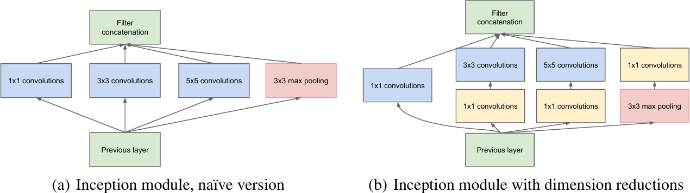
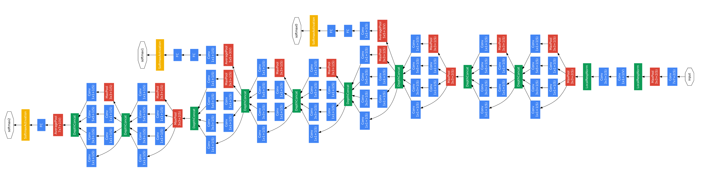
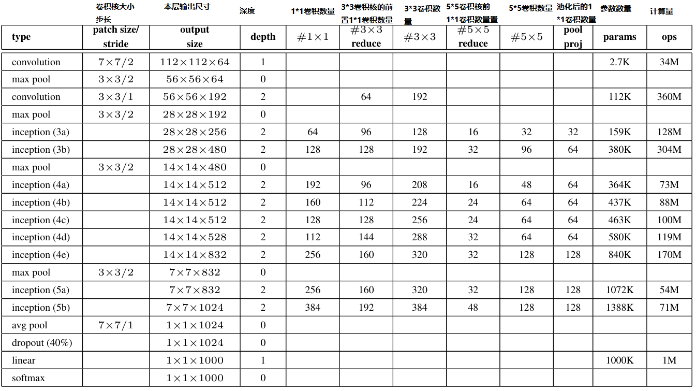

# GoogLeNet
## GoogLeNet介绍

[GoogLeNet_v1论文官方链接(点击查看)](https://arxiv.org/abs/1409.4842)

[GoogLeNet_v1论文备用链接(点击查看)](http://www.apache2.sanyueyu.top/blog/ai/image_classification/googlenet/GoogLeNet_v1.pdf)

下面中文论文中有些图片分辨率太低了，图片方面可以参考上面备用链接里的图片，而且GoogLeNet的论文写的巨抽象，大概是因为我见识浅薄，读起来很吃力

[GoogLeNet_v1论文中文pdf链接(点击查看)（本人翻译能力和手段有限，可以看看别人写的）](http://www.apache2.sanyueyu.top/blog/ai/image_classification/googlenet/GoogLeNet_v1cn.pdf)

首先，在引言部分，GoogLeNet团队提出，该算法设计的原则不是一味追求准确率，在大部分实验中模型设计都是为了在推理的时候保持150亿次算数运算，这样可以让模型可以实际投入到边缘计算项目中，而不是只能出现在实验室中

其次，GoogLeNet团队根据"Network in network"这篇论文中提到的技术，在模型中使用1\*1的卷积对模型进行线性激活，增加了网络的非线性，同时还可以对参数进行简化，对比一下AlexNet和GoogLeNet可以发现，GoogLeNet的参数仅为AlexNet的十二分之一，GoogLeNet团队指出，过多的参数可以使模型具有较好的结果，但是也更容易产生过拟合，所以较少的参数在部署模型的时候可能会有一些比较好的结果

同时，GoogLeNet团队提出了一种inception模块，inception模块使用多个不同尺寸的卷积对模型进行特征提取，增加了模型的特征识别能力,inception模块结构如下（右键--在新建标签页中打开，可以查看高清图像，或者在论文中查看原图）：

## GoogLeNet结构

首先查看一下官方给出的模型结构图和结构表（右键--在新建标签页中打开，可以查看高清图像，或者在论文中查看原图）

根据模型的结构表我们简述一下这个模型的结构：

>**输入图像** 224\*224\*3 
**卷积层** 卷积核长7 步长2 填充3 输出维度64 得到结果 112\*112\*64 （填充是根据输出尺寸算出来的） 
**最大池化层** 池化核长3 步长2 得到结果 56\*56\*64  
**卷积层** 卷积核长3 步长1 填充1 输出维度192 得到结果 56\*56\*192  
**最大池化层** 池化核长3 步长2 得到结果 28\*28\*192  
**inception(3a)**
