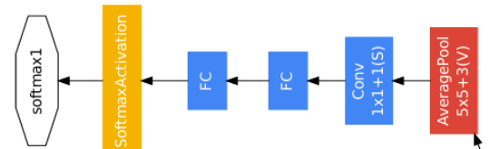
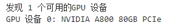
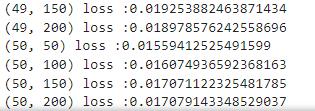
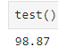

# GoogLeNet
## GoogLeNet介绍

[GoogLeNet_v1论文官方链接(点击查看)](https://arxiv.org/abs/1409.4842)

[GoogLeNet_v1论文备用链接(点击查看)](http://www.apache2.sanyueyu.top/blog/ai/image_classification/googlenet/GoogLeNet_v1.pdf)

下面中文论文中有些图片分辨率太低了，图片方面可以参考上面备用链接里的图片，而且GoogLeNet的论文写的巨抽象，大概是因为我见识浅薄，读起来很吃力

[GoogLeNet_v1论文中文pdf链接(点击查看)（本人翻译能力和手段有限，可以看看别人写的）](http://www.apache2.sanyueyu.top/blog/ai/image_classification/googlenet/GoogLeNet_v1cn.pdf)

首先，在引言部分，GoogLeNet团队提出，该算法设计的原则不是一味追求准确率，在大部分实验中模型设计都是为了在推理的时候保持150亿次算数运算，这样可以让模型可以实际投入到边缘计算项目中，而不是只能出现在实验室中

其次，GoogLeNet团队根据"Network in network"这篇论文中提到的技术，在模型中使用1\*1的卷积对模型进行线性激活，增加了网络的非线性，同时还可以对参数进行简化，对比一下AlexNet和GoogLeNet可以发现，GoogLeNet的参数仅为AlexNet的十二分之一，GoogLeNet团队指出，过多的参数可以使模型具有较好的结果，但是也更容易产生过拟合，所以较少的参数在部署模型的时候可能会有一些比较好的结果

同时，GoogLeNet团队提出了一种inception模块，inception模块使用多个不同尺寸的卷积对模型进行特征提取，增加了模型的特征识别能力,inception模块结构如下（右键--在新建标签页中打开，可以查看高清图像，或者在论文中查看原图）：

此外，GoogLeNet团队还对该模型设置了辅助分类器（结构如下图），在训练过程中，最终的损失=模型输出损失+辅助分类器损失*0.3，可以避免梯度消失等问题，保证了隐藏层单元参与了特征计算，辅助分类器只参与模型训练，在实际预测的时候辅助分类器会被丢弃。

## GoogLeNet结构

首先查看一下官方给出的模型结构图和结构表（右键--在新建标签页中打开，可以查看高清图像，或者在论文中查看原图）

根据模型的结构表我们简述一下这个模型的结构：

>**输入图像** 224\*224\*3 
**卷积层** 卷积核长7 步长2 填充3 输出维度64 得到结果 112\*112\*64 （填充是根据输出尺寸算出来的） 
**最大池化层** 池化核长3 步长2 得到结果 56\*56\*64  
**卷积层** 卷积核长3 步长1 填充1 输出维度192 得到结果 56\*56\*192  
**最大池化层** 池化核长3 步长2 得到结果 28\*28\*192  
**inception(3a)则对应下面四条线** 
>>1\*1卷积核 64个 
>>1\*1卷积核 96个 -> 3\*3卷积核128个 
>>1\*1卷积核 16个 -> 5\*5卷积核32个 
>>3\*3最大池化 步长2 -> 1\*1卷积核32个

以此类推，inception(3a),后面的结构和这个结构相似，根据上面表中的参数对卷积核的数量进行修改就可以了。

## GoogLeNet代码实现（准备阶段）

首先是实验环境，该实验使用的是青海民族大学的算力平台，在此感谢学校为我们提供的算力资源
>CPU: Intel Xeon Gold 6330 
    GPU: NVIDIA A800 80GB 
    RAM: 503.4 GB 
    OS: UBUNTU22.04 
    python版本：3.10.11 
    torch版本：2.2.1 
    jupyter notebook 

进入实验环境后，首先检查gpu是否正常：

    import torch
    import torch.nn as nn
    if torch.cuda.is_available():
        # 获取GPU设备数量
        device_count = torch.cuda.device_count()
        print(f"发现 {device_count} 个可用的GPU 设备")
        # 获取每个GPU的名称
        for i in range(device_count):
            print(f"GPU 设备 {i}: {torch.cuda.get_device_name(i)}")
    else:
        print("没有发现可用的GPU")

然后导入数据集，这次实验依旧使用mnist数据集，数据导入和预处理代码如下

    from torchvision import transforms
    from torchvision import datasets
    from torch.utils.data import DataLoader
    from torch.utils.data import Subset, random_split

    batch_size = 300
    transform = transforms.Compose([
        transforms.ToTensor(),
        transforms.Normalize((0.1307,),(0.3081)),
        transforms.Resize((224, 224))
    ])
    
    train_dataset = datasets.MNIST(root='./dataset/mnist/',train=True,download=True,
                                transform = transform)
    train_loader = DataLoader(train_dataset,shuffle=True,batch_size=batch_size)
    test_dataset = datasets.MNIST(root='./dataset/mnist/',train=False,download=True,
                                transform = transform)
    test_loader = DataLoader(test_dataset,shuffle=True,batch_size=batch_size)

    
## GoogLeNet代码实现（模型构建部分）
首先，导入我们要用的第三方库

    import torch
    import torch.nn as nn
    import torch.nn.functional as F

模型的构建是一个自底向上的过程，我们先构建inception部分

    class Inception(nn.Module):
    def __init__(self, in_channels, conv1, conv3red, conv3, conv5red, conv5, pool_proj):
        #传入参数列表：
        #in_channels 输入通道数
        #conv1 1*1卷积和个数
        #conv3red 3*3前置1*1卷积数量 总之就是照着官方给的结构表填写参数
        super(Inception, self).__init__()
        self.branch1 =nn.Sequential(
            #第一个分支，单1*1卷积
            nn.Conv2d(in_channels, conv1, kernel_size=1),
            nn.ReLU()
        )
        self.branch2 = nn.Sequential(
            #第二个分支，1*1卷积接3*3卷积
            nn.Conv2d(in_channels, conv3red, kernel_size=1),
            nn.ReLU(),
            nn.Conv2d(conv3red, conv3, kernel_size=3, padding=1),
            nn.ReLU(),
        )
        self.branch3 = nn.Sequential(
            #第三个分支，1*1卷积接5*5卷积
            nn.Conv2d(in_channels, conv5red, kernel_size=1),
            nn.ReLU(),
            nn.Conv2d(conv5red, conv5, kernel_size=5, padding=2),
            nn.ReLU()
        )
        self.branch4 = nn.Sequential(
            #第四个分支，池化接1*1卷积
            nn.MaxPool2d(kernel_size=3, stride=1, padding=1),
            nn.ReLU(),
            nn.Conv2d(in_channels, pool_proj, kernel_size=1),
            nn.ReLU()
        )
    def forward(self, x):
    #正向传播，计算四个分支的结果并且沿着第一个维度叠加
        branch1 = self.branch1(x)
        branch2 = self.branch2(x)
        branch3 = self.branch3(x)
        branch4 = self.branch4(x)
        outputs = [branch1, branch2, branch3, branch4]
        return torch.cat(outputs,1)

接着构建辅助分类器

    class AuxiliaryClassifier(nn.Module):
        #辅助分类器
        def __init__(self, in_channels, num_classes):
            super(AuxiliaryClassifier, self).__init__()
            self.averagePool = nn.AvgPool2d(kernel_size=5, stride=3)
            self.conv = nn.Conv2d(in_channels, 128, kernel_size=1)
            self.fc1 = nn.Linear(1152, 1024)
            self.fc2 = nn.Linear(1024, num_classes)
    
        # 前向传播过程
        def forward(self, x):
            x = self.averagePool(x)
            x = F.relu(self.conv(x))
            x = torch.flatten(x, 1)
            x = F.dropout(x, 0.5, training=self.training)
            x = self.fc1(x)
            x = F.relu(x)
            x = F.dropout(x, 0.5, training=self.training)
            x = self.fc2(x)
            return x

最后借助辅助分类器类和inception类构建整个GoogLeNet模型，模型中辅助分类器只在训练过程中生效：

    class GoogLeNet(nn.Module):
        def __init__(self):
            super(GoogLeNet,self).__init__()
            self.pool32 = nn.MaxPool2d(3,2)
            self.conv1 = nn.Conv2d(1,64,7,2,3)
            self.conv2 = nn.Conv2d(64,64,1,1)
            self.conv3 = nn.Conv2d(64,192,3,1,1)
            self.ince_3a = Inception(192,64,96,128,16,32,32)
            self.ince_3b = Inception(256,128,128,192,32,96,64)
            self.ince_4a = Inception(480,192,96,208,16,48,64)
            self.aux1 = AuxiliaryClassifier(512,10)
            self.ince_4b = Inception(512,160,112,224,24,64,64)
            self.ince_4c = Inception(512,128,128,256,24,64,64)
            self.ince_4d = Inception(512,112,144,288,32,64,64)
            self.aux2 = AuxiliaryClassifier(528,10)
            self.ince_4e = Inception(528,256,160,320,32,128,128)
            self.ince_5a = Inception(832,256,160,320,32,128,128)
            self.ince_5b = Inception(832,384,192,384,48,128,128)
            self.avgpool = nn.AdaptiveAvgPool2d((1,1))
            self.dropout = nn.Dropout(0.4)
            self.fc = nn.Linear(1024,10)
            self.relu = nn.ReLU()

        def forward(self,x):
            x = self.relu(self.conv1(x))
            x = self.pool32(x)
            x = self.relu(self.conv2(x))
            x = self.relu(self.conv3(x))
            x = self.pool32(x)
            x = self.ince_3a(x)
            x = self.ince_3b(x)
            x = self.pool32(x)
            x = self.ince_4a(x)
            if self.training:
                aux1 = self.aux1(x)
            x = self.ince_4b(x)
            x = self.ince_4c(x)
            x = self.ince_4d(x)
            if self.training:
                aux2 = self.aux2(x)
            x = self.ince_4e(x)
            x = self.pool32(x)
            x = self.pool32(x)
            x = self.ince_5a(x)
            x = self.ince_5b(x)
            x = self.avgpool(x)
            x = torch.flatten(x, 1)
            x = self.dropout(x)
            x = self.fc(x)
            if self.training:
                return x+0.3*aux1+0.3*aux2
            return x
        
    #模型实例化
    model = GoogLeNet()

至此，模型已经构建成功，接下来进行模型的训练阶段

## GoogLeNet代码实现（模型预处理部分）

为了加快模型的训练过程，我们使用pytorch提供的GoogLeNet预训练模型对我们模型的一些参数赋值

首先，读取pytorch提供的GoogLeNet预训练模型

    googmodel = torch.hub.load('pytorch/vision:v0.10.0', 'googlenet', pretrained=True)

然后将官方模型中和我们模型契合的层的权重赋值给我们的模型：

    model.conv2.weight = googmodel.conv2.conv.weight
    model.conv3.weight = googmodel.conv3.conv.weight
    model.ince_3a.branch1[0].weight = googmodel.inception3a.branch1.conv.weight
    model.ince_3a.branch2[0].weight = googmodel.inception3a.branch2[0].conv.weight
    model.ince_3a.branch2[2].weight = googmodel.inception3a.branch2[1].conv.weight
    model.ince_3a.branch3[0].weight = googmodel.inception3a.branch3[0].conv.weight
    # model.ince_3a.branch3[2].weight = googmodel.inception3a.branch3[1].conv.weight
    model.ince_3a.branch4[2].weight = googmodel.inception3a.branch4[1].conv.weight
    model.ince_3b.branch2[0].weight = googmodel.inception3b.branch2[0].conv.weight
    model.ince_3b.branch2[2].weight = googmodel.inception3b.branch2[1].conv.weight
    model.ince_3b.branch3[0].weight = googmodel.inception3b.branch3[0].conv.weight
    # model.ince_3b.branch3[2].weight = googmodel.inception3b.branch3[1].conv.weight
    model.ince_3b.branch4[2].weight = googmodel.inception3b.branch4[1].conv.weight
    model.ince_4a.branch2[0].weight = googmodel.inception4a.branch2[0].conv.weight
    model.ince_4a.branch2[2].weight = googmodel.inception4a.branch2[1].conv.weight
    model.ince_4a.branch3[0].weight = googmodel.inception4a.branch3[0].conv.weight
    # model.ince_4a.branch3[2].weight = googmodel.inception4a.branch3[1].conv.weight
    model.ince_4a.branch4[2].weight = googmodel.inception4a.branch4[1].conv.weight
    model.ince_4b.branch2[0].weight = googmodel.inception4b.branch2[0].conv.weight
    model.ince_4b.branch2[2].weight = googmodel.inception4b.branch2[1].conv.weight
    model.ince_4b.branch3[0].weight = googmodel.inception4b.branch3[0].conv.weight
    # model.ince_4b.branch3[2].weight = googmodel.inception4b.branch3[1].conv.weight
    model.ince_4b.branch4[2].weight = googmodel.inception4b.branch4[1].conv.weight
    model.ince_4c.branch2[0].weight = googmodel.inception4c.branch2[0].conv.weight
    model.ince_4c.branch2[2].weight = googmodel.inception4c.branch2[1].conv.weight
    model.ince_4c.branch3[0].weight = googmodel.inception4c.branch3[0].conv.weight
    # model.ince_4c.branch3[2].weight = googmodel.inception4c.branch3[1].conv.weight
    model.ince_4c.branch4[2].weight = googmodel.inception4c.branch4[1].conv.weight
    model.ince_4d.branch2[0].weight = googmodel.inception4d.branch2[0].conv.weight
    model.ince_4d.branch2[2].weight = googmodel.inception4d.branch2[1].conv.weight
    model.ince_4d.branch3[0].weight = googmodel.inception4d.branch3[0].conv.weight
    # model.ince_4d.branch3[2].weight = googmodel.inception4d.branch3[1].conv.weight
    model.ince_4d.branch4[2].weight = googmodel.inception4d.branch4[1].conv.weight
    model.ince_4e.branch2[0].weight = googmodel.inception4e.branch2[0].conv.weight
    model.ince_4e.branch2[2].weight = googmodel.inception4e.branch2[1].conv.weight
    model.ince_4e.branch3[0].weight = googmodel.inception4e.branch3[0].conv.weight
    # model.ince_4e.branch3[2].weight = googmodel.inception4e.branch3[1].conv.weight
    model.ince_4e.branch4[2].weight = googmodel.inception4e.branch4[1].conv.weight
    model.ince_5a.branch2[0].weight = googmodel.inception5a.branch2[0].conv.weight
    model.ince_5a.branch2[2].weight = googmodel.inception5a.branch2[1].conv.weight
    model.ince_5a.branch3[0].weight = googmodel.inception5a.branch3[0].conv.weight
    # model.ince_5a.branch3[2].weight = googmodel.inception5a.branch3[1].conv.weight
    model.ince_5a.branch4[2].weight = googmodel.inception5a.branch4[1].conv.weight
    model.ince_5b.branch2[0].weight = googmodel.inception5b.branch2[0].conv.weight
    model.ince_5b.branch2[2].weight = googmodel.inception5b.branch2[1].conv.weight
    model.ince_5b.branch3[0].weight = googmodel.inception5b.branch3[0].conv.weight
    # model.ince_5b.branch3[2].weight = googmodel.inception5b.branch3[1].conv.weight
    model.ince_5b.branch4[2].weight = googmodel.inception5b.branch4[1].conv.weight

结束之后迁移模型至GPU

    device = torch.device("cuda:0")
    model.to(device)

定义损失和优化器

    import torch.optim as optim
    criterion = torch.nn.CrossEntropyLoss()#交叉熵损失
    optimizer = optim.SGD(model.parameters(),lr=0.001,momentum=0.7)

## GoogLeNet代码实现（模型训练部分）

构建训练和测试函数

    def train(epoch):
        model.train()
        running_loss =0.0
        for batch_idx,data in enumerate(train_loader,0):
            inputs,labels = data
            # print(labels)
            inputs, labels = inputs.to(device), labels.to(device)
            optimizer.zero_grad()
            outputs = model(inputs)
            # print(outputs)
            loss = criterion(outputs,labels)
            loss.backward()
            optimizer.step()
    
            running_loss += loss.item()
            if batch_idx % 50 == 49:
                print(f'{epoch+1,batch_idx+1} loss :{running_loss/batch_idx}')

    def test():
        model.eval()
        correct = 0
        total = 0
        with torch.no_grad():
            for data in test_loader:
                images,labels = data
                images,labels = images.to(device),labels.to(device)
                outputs=model(images)
                _,predicted = torch.max(outputs.data,dim=1)#再1维度（横维度）查找最大的值，返回最大值,下标
                total += labels.size(0)
                correct +=(predicted == labels).sum().item()
                # for i in range(len(predicted)):
                    # print(f"预测值: {predicted[i]}, 真实值: {labels[i]}")
        print(f'{100*correct/total}')

循环训练模型

    for i in range(50):
        train(i)

模型的收敛情况如下：

模型最初的损失为2.34666 可以看到损失已经下降了很多很多，且已经趋近于平滑，可以收工了，我们看一下测试情况：

这个准确率已经超过人类的水准了，人类的准确率在90%~95%之间。

## 总结

发现一个问题，pytorch中的GoogLeNet的网络结构和论文中的网络结构有一些差异，不知道是不是pytorch那边弄错了

