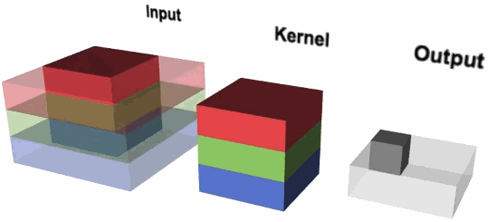
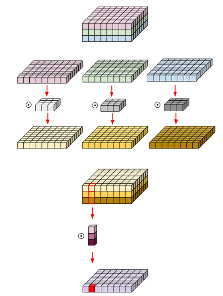
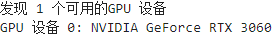
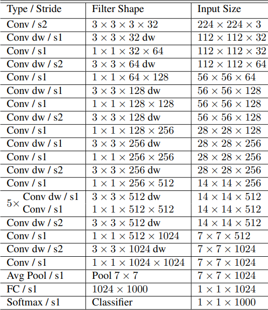
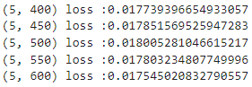
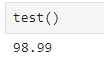

# MobileNet_V1
## MobileNet_V1论文

[MobileNet_V1论文官方链接(点击查看)](http://xxx.itp.ac.cn/pdf/1704.04861v1)

[MobileNet_V1论文备用链接(点击查看)](http://www.apache2.sanyueyu.top/blog/ai/image_classification/mobilenetv1/mobilenet.pdf)

下面中文论文中有些图片分辨率太低了，图片方面可以参考上面备用链接里的图片

[MobileNet_V1论文中文pdf链接(点击查看)（本人翻译能力和手段有限，可以看看别人写的）](http://www.apache2.sanyueyu.top/blog/ai/image_classification/mobilenetv1/mobilenet_cn.pdf)

## MobileNetV1介绍
MobileNet_V1 是一种高效的卷积神经网络架构，专为移动和边缘设备上的计算而设计。它的主要目标是实现高效的图像分类和物体检测，同时保持较低的计算成本和内存占用。其中主要用到了两项技术：1.深度可分离卷积，2.可调节的宽度和分辨率，下面我们详细讲一下这两项技术。
### 深度可分离卷积
深度可分离卷积就是将标准卷积拆分成两个更简单的操作：

1.深度卷积（Depthwise Convolution）：对每个输入通道独立地进行卷积。

2.逐点卷积（Pointwise Convolution）：使用 1x1 的卷积核对所有通道进行组合

前者深度卷积可以处理通道内的信息，后者逐点卷积可以处理各通道之间的联系，两者结合达信息提取的目的。看不懂没有关系，这里我们用几张图片来辅助理解：

首先我们看一下传统卷积网络的卷积过程：

这个过程我们并不陌生，一个卷积核通过在input上滑动，得到output，每次卷积会同时对所有的输入通道进行计算。

再看一下可分离卷积的示意图：

在上图中可以分为两部分观看，上半部分是通过深度卷积，将三通道的输入特征图计算为三通道的输出特征图，下半部分是通过逐点卷积将三通道的输出特征图计算为单通道输出特征图

直接看图我们好像还是不能理解为什么要这样操作，所以这里我们算一下参数数量和计算量：  

传统卷积网络：

>设：卷积核边长为DK  输出特征图边长为DF 输入通道数为M 输出通道数为N，则： 
**卷积乘法计算量 = (DK\*DK\*M)\*(DF\*DF\*N)** 
**参数数量 = DK\*DK\*M\*N** 
解释：卷积乘法计算量应该等于**单次卷积计算量**乘以**输出特征图元素个数**，上述公式中第一个括号中是单次卷积计算量，第二个括号中是输出特征图的元素个数，顾计算结果是这次完整的卷积操作的乘法计算量，参数数量公式不做过多赘述。

深度可分离卷积网络：

>设：深度卷积核边长为DK 输出特征图边长为DF 输入通道数为M 输出通道数为N，则： 
**卷积乘法计算量 = (DK\*DK)\*(M\*DF\*DF)+M\*(N\*DF\*DF)** 
**参数数量 = DK\*DK\*M+1\*1\*M\*N** 
解释：使用深度可分离卷积之后，卷积乘法计算量应该等于**深度卷积计算量**+**逐点卷积计算量**，深度卷积计算时，特征图的通道数是不变的，所以深度卷积计算时的乘法计算量等于**深度卷积核面积**\***深度卷积输出的特征图的元素数量**（**深度卷积输出的特征图元素数量**就是**深度卷积输出通道数量**\***输出特征图面积**，这里输出通道数和输入通道数一样都是M），逐点卷积的计算量等于**单次数逐点卷积操作的计算量**\***最终输出特征图元素数量**,这里卷积核的截面积是1x1，所以单次逐点卷积操作的计算量和特征图的通道数一致。

将计算结果进行相除可得： 
**使用深度可分离卷积的乘法计算量和参数数量都为传统卷积的[(1/N) + (1/(DK\*DK))]**,假设卷积核边长为3，输出通道数为10，则使用深度可分离卷积的乘法计算量和参数数量都为传统卷积的19/90,可以看到这个提升是很大的，

同时论文中还指出，团队给MobileNet_V1设置了两个超参数用于控制M和DF,这个我们可以按照需求添加。

### 深度可分离卷积的实现方法

在卷积神经网络中，有一个操作叫分组卷积，如下图所示，左边是普通卷积，而右边是分组卷积，这张图片来自[researchGate](https://www.researchgate.net/figure/The-transformations-within-a-layer-in-DenseNets-left-and-CondenseNets-at-training-time_fig2_321325862)。分组卷积就是每个卷积核只处理一部分通道，而深度可分离卷积可以看成是分组卷积的一个极端表现：每个卷积核只处理一个通道。这样的操作在pytorch框架中很好实现，只需要在创建卷积层的时候加上参数groups=in_channels。

### 其他优化方法：

在MobileNet_V1中，为了能流畅运行于移动和边缘设备，还有一些特别的优化方法，比如：使用ReLU6函数作为激活函数，可以限制模型的输出范围，同时减少计算和存储需求。
## 手动实现算法（准备阶段）
准备阶段我们要做一些准备工作同时处理一下数据集，这里我选择使用MNIST数据集

工作化境：
>CPU: I3 10105F （x86_64） 
>GPU: ASUS 3060 12G 
>RAM: 威刚 DDR4 40G 2666 
>主板：MSI B560M-A 
>硬盘：WDC SN550 1T 

>OS: UBUNTU22.04 
>python版本：3.11.7 
>torch版本：2.2.1 
>jupyter notebook  

**注意事项：本实验尽量在有gpu的平台进行，使用个人电脑的cpu也可以将模型优化到不错的状态**

### 检查算力平台情况

    import torch

    # 检查是否有可用的GPU
    if torch.cuda.is_available():
        # 获取GPU设备数量
        device_count = torch.cuda.device_count()
        print(f"发现 {device_count} 个可用的GPU 设备")
        # 获取每个GPU的名称
        for i in range(device_count):
            print(f"GPU 设备 {i}: {torch.cuda.get_device_name(i)}")
    else:
        print("没有发现可用的GPU")

输出结果：

### 数据预处理

    from torchvision import transforms
    from torchvision import datasets
    from torch.utils.data import DataLoader
    import torch.nn.functional as F
    import torch.optim as optim
    import torch.nn as nn

    batch_size = 32
    transform = transforms.Compose([
        transforms.ToTensor(),
        transforms.Normalize((0.1307,),(0.3081)),
        transforms.Resize((224, 224))
    ])
    train_dataset = datasets.MNIST(root='./dataset/mnist/',train=True,download=True,transform = transform)
    test_dataset = datasets.MNIST(root='./dataset/mnist/',train=False,download=True,transform = transform)
    train_loader = DataLoader(train_dataset,shuffle=True,batch_size=batch_size)
    test_loader = DataLoader(test_dataset,shuffle=True,batch_size=batch_size)

## 手动实现算法（动手阶段）
### 模型实现--构建模型
首先，构建深度可分离卷积块，即在普通卷积模块的基础上增加分组参数。同时增加网络深度超参数"width_mul"

    class DepthwiseSeparableConv(nn.Module):
        def __init__(self, in_channels, out_channels,width_mul = 1 , stride=1):
            super(DepthwiseSeparableConv, self).__init__()
            out_channels = out_channels * width_mul
            self.depthwise = nn.Conv2d(in_channels, in_channels, kernel_size=3, stride=stride, padding=1, groups=in_channels, bias=False)
            self.pointwise = nn.Conv2d(in_channels, out_channels, kernel_size=1, bias=False)
            self.bn1 = nn.BatchNorm2d(in_channels)
            self.bn2 = nn.BatchNorm2d(out_channels)

        def forward(self, x):
            x = self.depthwise(x)
            x = self.bn1(x)
            x = F.relu6(x)
            x = self.pointwise(x)
            x = self.bn2(x)
            x = F.relu6(x)
            return x

然后构建MobileNet_V1网络，根据下图的结构我们写代码：

    class MobileNetV1(nn.Module):
        def __init__(self, num_classes=10):
            super(MobileNetV1, self).__init__()
            self.model = nn.Sequential(
                nn.Conv2d(1, 32, kernel_size=3, stride=2, padding=1, bias=False),
                nn.BatchNorm2d(32),
                nn.ReLU6(inplace=True),
                DepthwiseSeparableConv(32, 64, 1),
                DepthwiseSeparableConv(64, 128, 1, stride=2),
                DepthwiseSeparableConv(128, 128 ,1),
                DepthwiseSeparableConv(128, 256, 1 , stride=2),
                DepthwiseSeparableConv(256, 256, 1),
                DepthwiseSeparableConv(256, 512, 1, stride=2),
            )

            # 添加 6 个 Depthwise Separable Convolutions
            for _ in range(6):
                self.model.add_module('ds_conv', DepthwiseSeparableConv(512, 512))

            self.model.add_module('conv_1', nn.Conv2d(512, 1024, kernel_size=3, stride=2, padding=1, bias=False))
            self.model.add_module('bn_1', nn.BatchNorm2d(1024))
            self.model.add_module('relu_1', nn.ReLU6(inplace=True))
            self.model.add_module('conv_2', nn.Conv2d(1024, num_classes, kernel_size=1, bias=False))

        def forward(self, x):
            x = self.model(x)
            x = F.adaptive_avg_pool2d(x, (1, 1))
            x = x.view(x.size(0), -1)
            return x

    model = torch.load('MobileNet_res_mnist.pth')
    device = torch.device("cuda:0")
    model.to(device)

### 模型实现--构建训练和测试函数

首先构建损失函数和优化器

    import torch.optim as optim
    criterion = torch.nn.CrossEntropyLoss()#交叉熵损失
    optimizer = optim.SGD(model.parameters(),lr=0.05,momentum=0.5)

构建训练函数和测试函数

    def train(epoch):
        model.train()
        running_loss =0.0
        for batch_idx,data in enumerate(train_loader,0):
            inputs,labels = data
            # print(labels)
            inputs, labels = inputs.to(device), labels.to(device)
            optimizer.zero_grad()
            outputs = model(inputs)
            # print(outputs)
            loss = criterion(outputs,labels)
            loss.backward()
            optimizer.step()
    
            running_loss += loss.item()
            if batch_idx % 50 == 49:
                print(f'{epoch+1,batch_idx+1} loss :{running_loss/batch_idx}')

    def test():
        model.eval()
        correct = 0
        total = 0
        with torch.no_grad():
            for data in test_loader:
                images,labels = data
                images,labels = images.to(device),labels.to(device)
                outputs=model(images)
                _,predicted = torch.max(outputs.data,dim=1)#再1维度（横维度）查找最大的值，返回最大值,下标
                total += labels.size(0)
                correct +=(predicted == labels).sum().item()
                # for i in range(len(predicted)):
                    # print(f"预测值: {predicted[i]}, 真实值: {labels[i]}")
        print(f'{100*correct/total}')

### 模型实现--小批量随机梯度下降
运行训练函数（每训练一轮之后，保存一下模型，防止突然断电，血的教训）

    for i in range(5):
        train(i)
        torch.save(model,'mobilenet_mnist.pth')

经过五轮训练，损失函数最终下降到0.0175左右，还有下降趋势但是我们就不继续了：

接下来观察一下测试情况

至此实验完成。

## 总结

我一开始也没有看懂深度可分离卷积的作用，后来经过计算才知道原来这个结构对性能的影响这么大，检查算法效率的时候动手算一下还是有好处的。