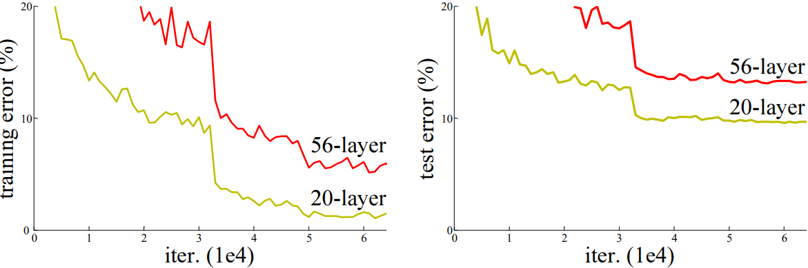
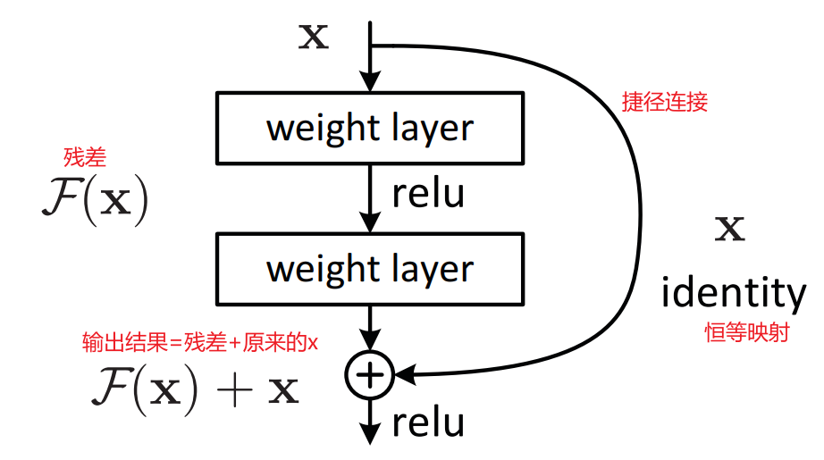
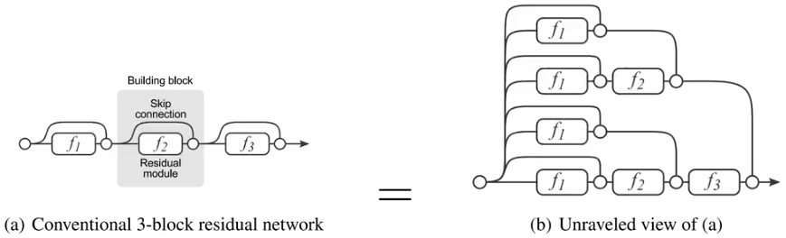
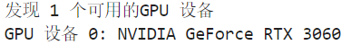
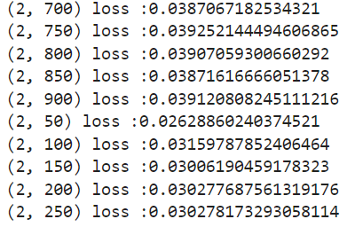
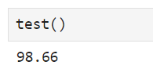

# ResNet
## ResNet论文

[ResNet论文官方链接(点击查看)](https://arxiv.org/pdf/1512.03385)

[ResNet论文备用链接(点击查看)](http://www.apache2.sanyueyu.top/blog/ai/image_classification/resnet/resnet.pdf)

下面中文论文中有些图片分辨率太低了，图片方面可以参考上面备用链接里的图片

[GoogLeNet_v1论文中文pdf链接(点击查看)（本人翻译能力和手段有限，可以看看别人写的）](http://www.apache2.sanyueyu.top/blog/ai/image_classification/resnet/resnetcn.pdf)

ResNet团队表示，深度很大的网络通常难以训练，团队提出了残差学习框架，以便训练更深的网络。 

ResNet的网络深度高达152层，相比vgg网络深度增加了8倍，但是模型复杂度却仍然比较低。该网络在ImageNet测试集上达到了3.57的错误率。这个错误率已经超过了人眼的识别水平。 

在2015年，ResNet在ImageNet Classification，ImageNet Detection，ImageNet Localization，COCO Detection，COCO Segmentation这五个比赛中，包揽了冠军的同时，且大幅度领先第二名，后来ResNet论文被CVPR（计算机视觉与模式识别领域的顶级国际会议）评为2016年最佳论文。

## ResNet介绍
### 网络退化现象

在摘要部分，团队提到了一个网络退化现象：在传统网络的训练中，过高的深度会导致更高的误差，这一点在他们的实验中得到了充分的验证，这里我们用一张实验的图片就可以观察到网络退化现象:

左侧为训练集上的损失，右侧为测试集上的损失，可以观察到，在传统网络中，过度增加网络的深度会导致更高的误差，这并不是过拟合导致的，同时也不是由于梯度消失导致的，我们可以看到不管是20层网络还是56层网络的梯度还是在下降的，但是56层网络的效果就是不如20层好。

### 网络退化现象解决办法

首先，团队提出了一个观点，假设我们有一个网络模型，现在我们在这个模型的基础上加一些层产生一个新的模型，新模型是老模型+增加的层，按道理来说，新模型的误差应该比老模型更好才对（相当于给老模型进行了更细致的调整），但是实验结果表明事实并非如此。为了能让新模型的误差比老模型小，团队提出了一个结构，就是下图这个结构：

我们可以这样理解这个结构：该结构的**输出** = **该结构的输入** + **残差（也就是对输入的优化部分）**。这样就保证了新模型的效果一定比老模型好，这就是残差网络。

### 为什么使用残差会使性能变好
    
这个问题没有绝对的答案，但是有一些可以用于参考的说法，这里我列举一些我在学习的时候听到的说法：

**1**，残差网络可以防止梯度小时，因为“捷径连接”的梯度是1，可以保证梯度不会消失。 
**2**，残差结构类似于relu函数，relu函数在输入大于0的时候会映射一个值，小于0的时候会映射到0，这可以保证映射的结果不会是负的，同样使用残差模型的时候，残差经过优化至少可以保证模型不会向坏的方向发展。 
**3**,残差神经网络可以拟合恒等映射，有时候什么都不做比乱作要好。传统神经网络很难进行恒等映射。 
**4**,残差网络增加了相邻像素梯度的相关性（截至2024.6.19 这个论文我还没看，具体的理论实现有待学习。[点击此处查看论文](https://arxiv.org/abs/1702.08591)/[备用地址](http://www.apache2.sanyueyu.top/blog/ai/image_classification/resnet/4.pdf)） 
**5**，残差网络相当于集合浅层网络的集成，我们可以把残差网络像下面这样展开：

残差结构可以把模块并连起来，相比于传统的串联结构（比如vgg），并联结构中少数模块出问题不会对模型性能产生很大影响。串联结构就不一样，只要有一个模块出现问题，整体效果就会受到很大影响。（截至2024.6.19 这个论文我还没看，具体的理论实现有待学习。[点击此处查看论文](https://arxiv.org/abs/1605.06431)/[备用地址](http://www.apache2.sanyueyu.top/blog/ai/image_classification/resnet/5.pdf)）

## 手动实现算法（准备阶段）
准备阶段我们要做一些准备工作同时处理一下数据集，这里我选择使用MNIST数据集

工作化境：
>CPU: I3 10105F （x86_64） 
>GPU: ASUS 3060 12G 
>RAM: 威刚 DDR4 40G 2666 
>主板：MSI B560M-A 
>硬盘：WDC SN550 1T 

>OS: UBUNTU22.04 
>python版本：3.11.7 
>torch版本：2.2.1 
>jupyter notebook  

**注意事项：本实验一定要在有gpu的平台进行，使用个人电脑的cpu很难将模型优化到不错的状态**

数据集我选择的是mnist数据集，该数据集包含0~9十个手写数字，包含5万条训练集和1万条测试集

### 检查算力平台情况

    import torch
    import torch.nn as nn
    import torch.nn.functional as F

    if torch.cuda.is_available():
        # 获取GPU设备数量
        device_count = torch.cuda.device_count()
        print(f"发现 {device_count} 个可用的GPU 设备")
        # 获取每个GPU的名称
        for i in range(device_count):
            print(f"GPU 设备 {i}: {torch.cuda.get_device_name(i)}")
    else:
        print("没有发现可用的GPU")

输出结果：

### 数据预处理

    from torchvision import transforms
    from torchvision import datasets
    from torch.utils.data import DataLoader
    import torch.nn.functional as F
    import torch.optim as optim

    batch_size = 300
    transform = transforms.Compose([
        transforms.ToTensor(),
        transforms.Normalize((0.1307,),(0.3081)),
        transforms.Resize((224, 224))
    ])

    train_dataset = datasets.MNIST(root='./dataset/mnist/',train=True,download=True,
                                transform = transform)
    train_loader = DataLoader(train_dataset,shuffle=True,batch_size=batch_size)
    test_dataset = datasets.MNIST(root='./dataset/mnist/',train=False,download=True,
                                transform = transform)
    test_loader = DataLoader(test_dataset,shuffle=True,batch_size=batch_size)
    
## 手动实现算法（动手阶段）
### 模型实现--构建模型

ResNet的结构包括一个可以将输入和输出叠加在一起的Resblock，该模块中进行的操作包括：1.卷积，归一化。2.统一输入输出的尺寸，3.正向传播的时候将输入和输出加在一起。总体来说还是比较简单的，代码如下：

    import torch.nn as nn
    class resBlock(nn.Module):
        def __init__(self,in_channels,out_channels,stride=1):
            super().__init__()
            self.conv1 = nn.Conv2d(in_channels,out_channels,3,stride,1)
            self.bn1 = nn.BatchNorm2d(out_channels)
            self.conv2 = nn.Conv2d(out_channels,out_channels,3,1,1)
            self.bn2 = nn.BatchNorm2d(out_channels)
            if stride != 1 or in_channels != out_channels:
                self.conv_down = nn.Conv2d(in_channels, out_channels, 1, stride=stride, padding=0)
                self.bn3 = nn.BatchNorm2d(out_channels)
        def forward(self,x):
            inputs = x
            x = F.relu(self.bn1(self.conv1(x)))
            x = self.bn2(self.conv2(x))
            if self.conv_down is not None:
                inputs = self.bn3(self.conv_down(inputs))
            out = x + inputs
            out = F.relu(out)
            return out

然后使用上面这个resBlock构建ResNet网络结构，这里我的任务比较简单，所以我只构建了五层：

    class resNet(nn.Module):
        def __init__(self):
            super().__init__()
            self.res1 = resBlock(1,20)
            self.res2 = resBlock(20,40,2)
            self.res3 = resBlock(40,60,2)
            self.res4 = resBlock(60,80,2)
            self.res5 = resBlock(80,100,2)
            self.fc = nn.Linear(19600,10)
        def forward(self,x):
            batch_size = x.shape[0]
            x = self.res1(x)
            x = self.res2(x)
            x = self.res3(x)
            x = self.res4(x)
            x = self.res5(x)
            x = self.fc(x.view(batch_size,-1))
            return x
    model = resNet()
    device = torch.device("cuda:0")
    model.to(device)

### 模型实现--构建训练和测试函数

首先构建优化器和损失函数

    import torch.optim as optim
    criterion = torch.nn.CrossEntropyLoss()#交叉熵损失
    optimizer = optim.SGD(model.parameters(),lr=0.01,momentum=0.9)

然后构建训练和测试函数

    def train(epoch):
        model.train()
        running_loss =0.0
        for batch_idx,data in enumerate(train_loader,0):
            inputs,labels = data
            # print(labels)
            inputs, labels = inputs.to(device), labels.to(device)
            optimizer.zero_grad()
            outputs = model(inputs)
            # print(outputs)
            loss = criterion(outputs,labels)
            loss.backward()
            optimizer.step()
    
            running_loss += loss.item()
            if batch_idx % 50 == 49:
                print(f'{epoch+1,batch_idx+1} loss :{running_loss/batch_idx}')

    def test():
        model.eval()
        correct = 0
        total = 0
        with torch.no_grad():
            for data in test_loader:
                images,labels = data
                images,labels = images.to(device),labels.to(device)
                outputs=model(images)
                _,predicted = torch.max(outputs.data,dim=1)#再1维度（横维度）查找最大的值，返回最大值,下标
                total += labels.size(0)
                correct +=(predicted == labels).sum().item()
                # for i in range(len(predicted)):
                    # print(f"预测值: {predicted[i]}, 真实值: {labels[i]}")
        print(f'{100*correct/total}')

### 模型实现--小批量随机梯度下降

    for i in range(20):
    train(1)

训练结果如下：

可以看到模型收敛的也是很好，在最后测试的时候准确率也是蛮高的。

## 总结

ResNet提出的残差对后来网络的影响很大，残差网络可以加速模型的收敛，防止梯度消失，并且从理论上讲，残差网络的效果可以达到无限好，但是理论是理论实际是实际。

残差的思想对我后续的网络设计工作起到了很大的帮助