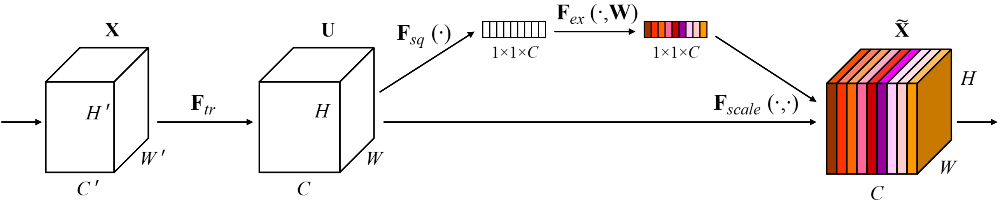
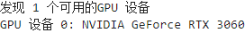
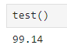

# SENet
## SENet论文

[SENet论文官方链接(点击查看)](https://arxiv.org/pdf/1709.01507)

[SENet论文备用链接(点击查看)](http://www.apache2.sanyueyu.top/blog/ai/image_classification/senet/senet.pdf)

下面中文论文中有些图片分辨率太低了，图片方面可以参考上面备用链接里的图片

[SENet论文中文pdf链接(点击查看)（本人翻译能力和手段有限，可以看看别人写的）](http://www.apache2.sanyueyu.top/blog/ai/image_classification/senet/senetcn.pdf)

## SENet介绍
SENet通过在卷积神经网络中添加自注意力机制，增加神经网络的性能，自注意力机制的实现方法是通过全局平均池化计算权重值，具体方法将会在下面详细介绍。SENet地示意图如下:

简单介绍一下这张图，特征图U经过两个分支，分别是 Fsq -> Fex 和 Fscale,Fsq是对原特征图进行全局池化，通过压缩使其成为一个1x1x原通道数 的张量，代表每个通道的权重情况，然后通过一系卷积操作对这个张量进行计算，计算每个通道最合适的权重，Fscale进行的操作时将原特征图和Fsq -> Fex计算出来的结果将进行相乘，得到的就是一个包含自注意力机制的特征图，值得注意的是，在Fex中使用的激活函数时sigmoid，这将把每个通道的权重限制在0到1之间。

SENet通过对通道进行全局平均池化得到权重，也就是通过通道之间的互相依赖性来提高网络的表示能力，所以也叫通道维度上的注意力机制，模型通过学习会自动调整每个通道的权重，以达到一个更好的效果
SENet的思想可以很简单地嵌入到其他卷积神经网络中，以提高网络的性能，下面做实验我们就使用SENet和ResNet结合来验证SEnet的性能

## 手动实现算法（准备阶段）
准备阶段我们要做一些准备工作同时处理一下数据集，这里我选择使用MNIST数据集

工作化境：
>CPU: I3 10105F （x86_64） 
>GPU: ASUS 3060 12G 
>RAM: 威刚 DDR4 40G 2666 
>主板：MSI B560M-A 
>硬盘：WDC SN550 1T 

>OS: UBUNTU22.04 
>python版本：3.11.7 
>torch版本：2.2.1 
>jupyter notebook  

**注意事项：本实验一定要在有gpu的平台进行，使用个人电脑的cpu很难将模型优化到不错的状态，同时该项目非常占显存，我在批次大小32的情况下差不多用了12GB内存，**

### 检查算力平台情况

    import torch

    # 检查是否有可用的GPU
    if torch.cuda.is_available():
        # 获取GPU设备数量
        device_count = torch.cuda.device_count()
        print(f"发现 {device_count} 个可用的GPU 设备")
        # 获取每个GPU的名称
        for i in range(device_count):
            print(f"GPU 设备 {i}: {torch.cuda.get_device_name(i)}")
    else:
        print("没有发现可用的GPU")

输出结果：

### 数据预处理

    from torchvision import transforms
    from torchvision import datasets
    from torch.utils.data import DataLoader
    import torch.nn.functional as F
    import torch.optim as optim
    import torch.nn as nn

    batch_size = 32
    transform = transforms.Compose([
        transforms.ToTensor(),
        transforms.Normalize((0.1307,),(0.3081)),
        transforms.Resize((224, 224))
    ])
    train_dataset = datasets.MNIST(root='./dataset/mnist/',train=True,download=True,transform = transform)
    test_dataset = datasets.MNIST(root='./dataset/mnist/',train=False,download=True,transform = transform)
    train_loader = DataLoader(train_dataset,shuffle=True,batch_size=batch_size)
    test_loader = DataLoader(test_dataset,shuffle=True,batch_size=batch_size)

## 手动实现算法（动手阶段）
### 模型实现--构建模型
首先，构建SE块

    class SE_Block(nn.Module):
        def __init__(self, inchannel, ratio=16):
            super(SE_Block, self).__init__()
            # 全局平均池化(Fsq操作)
            self.gap = nn.AdaptiveAvgPool2d((1, 1))
            # 两个全连接层(Fex操作)
            self.fc = nn.Sequential(，
                nn.Linear(inchannel, inchannel // ratio, bias=False),  # 从 c -> c/r
                nn.ReLU(),
                nn.Linear(inchannel // ratio, inchannel, bias=False),  # 从 c/r -> c
                nn.Sigmoid()#这里使用sigmoid效果最好
            )
    
        def forward(self, x):
                # 读取批数据图片数量及通道数
                b, c, h, w = x.size()
                # Fsq操作：经池化后输出b*c的矩阵
                y = self.gap(x).view(b, c)
                # Fex操作：经全连接层输出（b，c，1，1）矩阵
                y = self.fc(y).view(b, c, 1, 1)
                # Fscale操作：将得到的权重乘以原来的特征图x
                return x * y.expand_as(x)#扩展y，使其和x大小相同，然后逐个元素相乘

然后构建Res块，这块的代码就不过多赘述了，注释写的也比较少，如果不懂可以去看我关于ResNet的博客[（点击跳转）](/ai/image_classification/resnet/)

    class BasicBlock(nn.Module):
        expansion = 1
    
        def __init__(self, inchannel, outchannel, stride=1):
            super(BasicBlock, self).__init__()
            self.conv1 = nn.Conv2d(inchannel, outchannel, kernel_size=3,
                                stride=stride, padding=1, bias=False)
            self.bn1 = nn.BatchNorm2d(outchannel)
            self.conv2 = nn.Conv2d(outchannel, outchannel, kernel_size=3,
                                stride=1, padding=1, bias=False)
            self.bn2 = nn.BatchNorm2d(outchannel)
            # SE_Block放在BN之后，shortcut之前
            self.SE = SE_Block(outchannel)
    
            self.shortcut = nn.Sequential()
            if stride != 1 or inchannel != self.expansion*outchannel:
                self.shortcut = nn.Sequential(
                    nn.Conv2d(inchannel, self.expansion*outchannel,
                            kernel_size=1, stride=stride, bias=False),
                    nn.BatchNorm2d(self.expansion*outchannel)
                )
    
        def forward(self, x):
            out = F.relu(self.bn1(self.conv1(x)))
            out = self.bn2(self.conv2(out))
            SE_out = self.SE(out)
            out = out * SE_out
            out += self.shortcut(x)
            out = F.relu(out)
            return out

构建SE_ResNet

    class SE_ResNet(nn.Module):
        def __init__(self, block, num_blocks, num_classes=10):
            super(SE_ResNet, self).__init__()
            self.in_planes = 64
            self.conv1 = nn.Conv2d(1, 64, kernel_size=3,stride=1, padding=1, bias=False)                  # conv1
            self.bn1 = nn.BatchNorm2d(64)
            self.layer1 = self._make_layer(block, 64, num_blocks[0], stride=1)       # conv2_x
            self.layer2 = self._make_layer(block, 128, num_blocks[1], stride=2)      # conv3_x
            self.layer3 = self._make_layer(block, 256, num_blocks[2], stride=2)      # conv4_x
            self.layer4 = self._make_layer(block, 512, num_blocks[3], stride=2)      # conv5_x
            self.avgpool = nn.AdaptiveAvgPool2d((1, 1))
            self.linear = nn.Linear(512 * block.expansion, num_classes)
    
        def _make_layer(self, block, planes, num_blocks, stride):
            strides = [stride] + [1]*(num_blocks-1)
            layers = []
            for stride in strides:
                layers.append(block(self.in_planes, planes, stride))
                self.in_planes = planes * block.expansion
            return nn.Sequential(*layers)
    
        def forward(self, x):
            x = F.relu(self.bn1(self.conv1(x)))
            x = self.layer1(x)
            x = self.layer2(x)
            x = self.layer3(x)
            x = self.layer4(x)
            x = self.avgpool(x)
            x = torch.flatten(x, 1)
            out = self.linear(x)
            return out

    model = torch.load('senet_res_mnist.pth')
    device = torch.device("cuda:0")
    model.to(device)

### 模型实现--构建训练和测试函数

首先构建损失函数和优化器

    import torch.optim as optim
    criterion = torch.nn.CrossEntropyLoss()#交叉熵损失
    optimizer = optim.SGD(model.parameters(),lr=0.05,momentum=0.5)

构建训练函数和测试函数

    def train(epoch):
        model.train()
        running_loss =0.0
        for batch_idx,data in enumerate(train_loader,0):
            inputs,labels = data
            # print(labels)
            inputs, labels = inputs.to(device), labels.to(device)
            optimizer.zero_grad()
            outputs = model(inputs)
            # print(outputs)
            loss = criterion(outputs,labels)
            loss.backward()
            optimizer.step()
    
            running_loss += loss.item()
            if batch_idx % 50 == 49:
                print(f'{epoch+1,batch_idx+1} loss :{running_loss/batch_idx}')

    def test():
        model.eval()
        correct = 0
        total = 0
        with torch.no_grad():
            for data in test_loader:
                images,labels = data
                images,labels = images.to(device),labels.to(device)
                outputs=model(images)
                _,predicted = torch.max(outputs.data,dim=1)#再1维度（横维度）查找最大的值，返回最大值,下标
                total += labels.size(0)
                correct +=(predicted == labels).sum().item()
                # for i in range(len(predicted)):
                    # print(f"预测值: {predicted[i]}, 真实值: {labels[i]}")
        print(f'{100*correct/total}')

### 模型实现--小批量随机梯度下降
运行训练函数（每训练一轮之后，保存一下模型，防止突然断电，血的教训）

    for i in range(20):
        train(i)
        torch.save(model,'senet_res_mnist.pth')

经过二十轮训练，损失函数最终下降到0.023左右开始震荡，接下来观察一下测试情况

至此实验完成。

## 总结

总结一下最近的学习心得，至此我已经了解了大部分imagenet夺冠的网络模型，感觉这个学习经历给自己带来的提升很大，主要包括以下几个方面：

>读论文比之前顺畅了许多，很多翻译就算出了问题也能看懂了

>对于卷积神经网络在图像识别方面的应用有了一定了解，可以手动设计一些模型用于图像识别了

>熟悉了pytorch的操作，可以熟练使用pytorch进行生产

>熟悉了一些神经网络周边工具，比如结构图绘画工具，模型结构查看工具等

接下来我准备把任务的重心向目标检测方向转移，为以后工作打下坚实的基础 

学如逆水行舟，不进则退。2024/7/20
