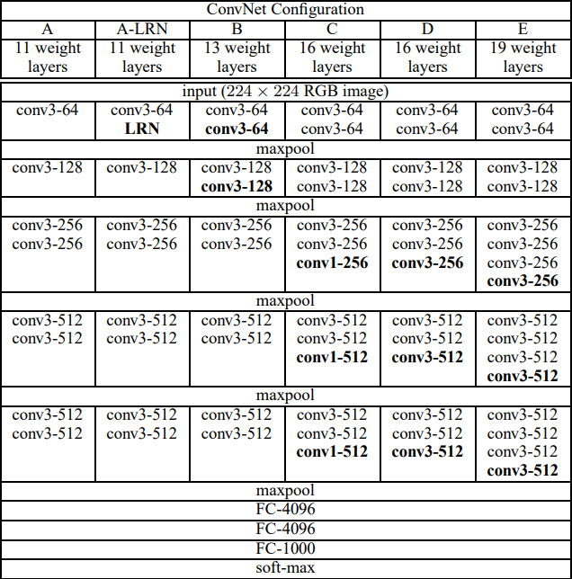
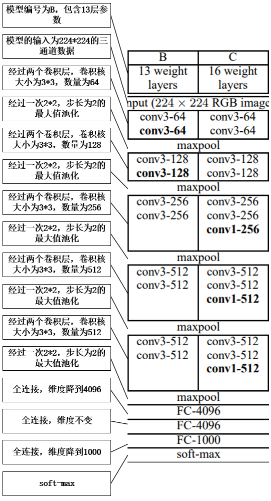
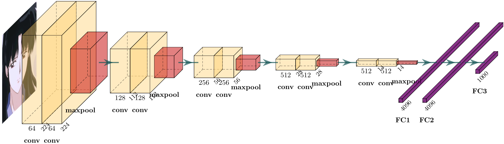
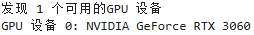
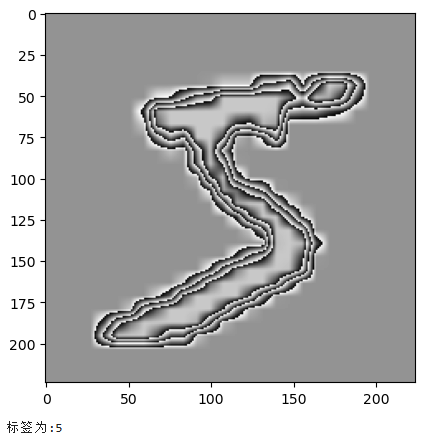
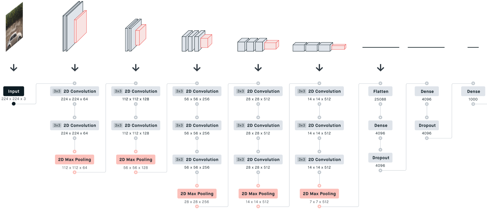
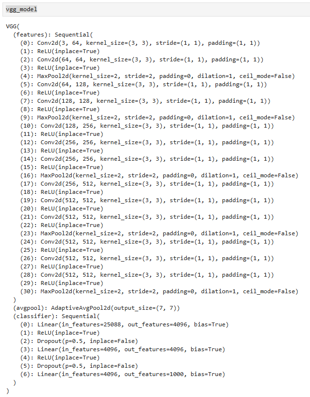
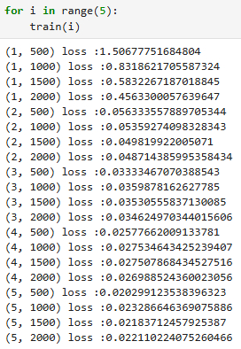
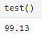

# vgg
## vgg介绍

[vgg官方链接(点击查看)](https://www.robots.ox.ac.uk/~vgg/publications/2015/Simonyan15/)

[vgg论文pdf链接(点击查看)](http://www.apache2.sanyueyu.top/blog/ai/image_classification/vgg/vgg.pdf)

[vgg论文中文pdf链接(点击查看)（本人翻译能力和手段有限，可以看看别人写的）](http://www.apache2.sanyueyu.top/blog/ai/image_classification/vgg/vggcn.pdf)

## vgg网络结构

vgg论文中给出的网络结构如下图，

论文中一共使用了六个网络结构，这里我们随便选一个网络结构进行解释，这里我选B进行详细一点的解释：

网络可视化如下：

卷积层全部使用3*3的卷积核，stride=1，padding=1

pool层全部采用maxpool，size=2,stride=2

全连接层使用rulu作为激活函数，并且进行dropouts操作防止产生过拟合现象

**vgg通过堆叠多个3x3的卷积核来代替尺寸较大的卷积核**，比如：堆叠两个3\*3的卷积核来代替一个5\*5的卷积核，堆叠三个3\*3的卷积核来代替一个7\*7的卷积核，在相同的感受野下，这样操作可以减少参数的数量，假设在单通道输入单通道输出的情况下，要使用一个5\*5的卷积，需要的的参数数量为5\*5=25,而使用两个3\*3的卷积核参数的数量为3\*3\*2=18，在高维输入输出的情况下，这种参数数量的差距会呈倍增加

在上面的表格中,D就是现在常用的VGG16模型,E就是现在常用的VGG19模型

## 手动实现算法（准备阶段）

这里我们手动实现一下VGG16算法，准备阶段我们要做一些准备工作同时处理一下数据集，这里我选择使用MNIST数据集

工作化境：
>CPU: I3 10105F （x86_64） 
>GPU: ASUS 3060 12G 
>RAM: 威刚 DDR4 40G 2666 
>主板：MSI B560M-A 
>硬盘：WDC SN550 1T 

>OS: UBUNTU22.04 
>python版本：3.11.7 
>torch版本：2.2.1 
>jupyter notebook  

**注意事项：本实验一定要在有gpu的平台进行，否则进行一次完整的小批量梯度下降需要差不多两天时间**
 
代码部分： 
 
    #首先，检查torch的gpu情况
    import torch
    if torch.cuda.is_available():
        # 获取GPU设备数量
        device_count = torch.cuda.device_count()
        print(f"发现 {device_count} 个可用的GPU 设备")
        # 获取每个GPU的名称
        for i in range(device_count):
            print(f"GPU 设备 {i}: {torch.cuda.get_device_name(i)}")
    else:
        print("没有发现可用的GPU")

    #然后，开始处理数据集
    from torchvision import transforms
    from torchvision import datasets
    from torch.utils.data import DataLoader

    batch_size = 30 #批次大小太大显存遭不住，这个数据可以根据自己的显存大小进行调整
    transform = transforms.Compose([
        transforms.ToTensor(),
        transforms.Normalize((0.1307,),(0.3081)),
        transforms.Resize((224, 224))
    ])

    train_dataset = datasets.MNIST(root='./dataset/mnist/',train=True,download=True,
                                transform = transform)
    train_loader = DataLoader(train_dataset,shuffle=True,batch_size=batch_size)
    test_dataset = datasets.MNIST(root='./dataset/mnist/',train=False,download=True,
                                transform = transform)
    test_loader = DataLoader(test_dataset,shuffle=True,batch_size=batch_size)

    随便查看一个图片和标签（个人习惯，非必要操作）：
    import matplotlib.pyplot as plt
    # 从train_dataset中获取第一个图像和标签
    image, label = train_dataset[0]

    # 将张量转换为图像
    image = transforms.ToPILImage()(image)

    # 显示图像
    plt.imshow(image, cmap='gray')
    plt.show()
    print(label)
    

## 手动实现算法（动手阶段）

### 模型实现--构建模型

首先我们参考一下vgg16的详细流程，如下图

根据流程创建适用于我们训练数据的vgg模型,主要修改包括将input的维度从三维变成一维，最后模型的输出从1000维降到10维：

    import torch.nn.functional as F

    class vgg16(torch.nn.Module):
    def __init__(self):
        super(vgg16,self).__init__()
        self.conv1_1 = torch.nn.Conv2d(1,64,kernel_size=3,stride=1,padding=1)
        self.conv1_2 = torch.nn.Conv2d(64,64,kernel_size=3,stride=1,padding=1)
        
        self.conv2_1 = torch.nn.Conv2d(64,128,kernel_size=3,stride=1,padding=1)
        self.conv2_2 = torch.nn.Conv2d(128,128,kernel_size=3,stride=1,padding=1)
        
        self.conv3_1 = torch.nn.Conv2d(128,256,kernel_size=3,stride=1,padding=1)
        self.conv3_2 = torch.nn.Conv2d(256,256,kernel_size=3,stride=1,padding=1)
        self.conv3_3 = torch.nn.Conv2d(256,256,kernel_size=3,stride=1,padding=1)
        
        self.conv4_1 = torch.nn.Conv2d(256,512,kernel_size=3,stride=1,padding=1)
        self.conv4_2 = torch.nn.Conv2d(512,512,kernel_size=3,stride=1,padding=1)
        self.conv4_3 = torch.nn.Conv2d(512,512,kernel_size=3,stride=1,padding=1)
        
        self.conv5_1 = torch.nn.Conv2d(512,512,kernel_size=3,stride=1,padding=1)
        self.conv5_2 = torch.nn.Conv2d(512,512,kernel_size=3,stride=1,padding=1)
        self.conv5_3 = torch.nn.Conv2d(512,512,kernel_size=3,stride=1,padding=1)
        
        self.pooling = torch.nn.MaxPool2d(2)

        self.fc1 = torch.nn.Linear(7*7*512,4096)
        self.fc2 = torch.nn.Linear(4096,4096)
        self.fc3 = torch.nn.Linear(4096,1000)
        self.fc4 = torch.nn.Linear(1000,10)

        self.dropout1 = torch.nn.Dropout(0.2)  # 添加第一个dropout层
        self.dropout2 = torch.nn.Dropout(0.2)  # 添加第一个dropout层

    def forward(self,x):
        batch_size = x.size(0)
        x=F.relu(self.conv1_1(x))
        x=F.relu(self.pooling(self.conv1_2(x)))

        x=F.relu(self.conv2_1(x))
        x=F.relu(self.pooling(self.conv2_2(x)))

        x=F.relu(self.conv3_1(x))
        x=F.relu(self.conv3_2(x))
        x=F.relu(self.pooling(self.conv3_3(x)))
        
        x=F.relu(self.conv4_1(x))
        x=F.relu(self.conv4_2(x))
        x=F.relu(self.pooling(self.conv4_3(x)))

        x=F.relu(self.conv5_1(x))
        x=F.relu(self.conv5_2(x))
        x=F.relu(self.pooling(self.conv5_3(x)))
        
        x = x.view(batch_size,-1)
        x = F.relu(self.fc1(x))
        x = self.dropout1(x)
        x = F.relu(self.fc2(x))
        x = self.dropout2(x)
        x = F.relu(self.fc3(x))
        x = self.fc4(x)
        return x

### 模型实现--加载预训练权重

如果直接使用上面定义的模型进行训练，会发现模型很难收敛，做实验的时候，我用mnist数据集对模型参数微调了三天但是模型还是没有很好的结果。所以我们需要借助官方的预训练模型进行优化

    #实例化我们的模型
    model = vgg16()
    #实例化官方模型
    vgg_model = torch.hub.load('pytorch/vision:v0.10.0', 'vgg16', pretrained=True)

然后我们查看一下官方的模型结构，目的是为了下一步中把官方的预训练权重复制给我们的模型
    
    vgg_model

下一步：将官方的权重赋值给我们的模型，权重对应的编号可以在上面vgg_model的输出中进行查找

    model.conv1_2.weight = vgg_model.features[2].weight
    model.conv2_1.weight = vgg_model.features[5].weight
    model.conv2_2.weight = vgg_model.features[7].weight
    model.conv3_1.weight = vgg_model.features[10].weight
    model.conv3_2.weight = vgg_model.features[12].weight
    model.conv3_3.weight = vgg_model.features[14].weight
    model.conv4_1.weight = vgg_model.features[17].weight
    model.conv4_2.weight = vgg_model.features[19].weight
    model.conv4_3.weight = vgg_model.features[21].weight
    model.conv5_1.weight = vgg_model.features[24].weight
    model.conv5_2.weight = vgg_model.features[26].weight
    model.conv5_3.weight = vgg_model.features[28].weight
    model.fc1.weight = vgg_model.classifier[0].weight
    model.fc2.weight = vgg_model.classifier[3].weight
    model.fc3.weight = vgg_model.classifier[6].weight

### 模型实现--小批量随机梯度下降

迁移我们的模型至GPU

    device = torch.device("cuda:0")
    model.to(device)

定义损失函数和优化器

    import torch.optim as optim
    criterion = torch.nn.CrossEntropyLoss()#交叉熵损失
    optimizer = optim.SGD(model.parameters(),lr=0.001,momentum=0.1)

创建训练和测试函数

    def train(epoch):
        running_loss =0.0
        for batch_idx,data in enumerate(train_loader,0):
            inputs,labels = data
            # print(labels)
            inputs, labels = inputs.to(device), labels.to(device)
            optimizer.zero_grad()
            outputs = model(inputs)
            # print(outputs)
            loss = criterion(outputs,labels)
            loss.backward()
            optimizer.step()
    
            running_loss += loss.item()
            if batch_idx % 500 == 499:
                print(f'{epoch+1,batch_idx+1} loss :{running_loss/batch_idx}')

    def test():
        correct = 0
        total = 0
        with torch.no_grad():
            for data in test_loader:
                images,labels = data
                images,labels = images.to(device),labels.to(device)
                outputs=model(images)
                _,predicted = torch.max(outputs.data,dim=1)#再1维度（横维度）查找最大的值，返回最大值,下标
                total += labels.size(0)
                correct +=(predicted == labels).sum().item()
                # for i in range(len(predicted)):
                    # print(f"预测值: {predicted[i]}, 真实值: {labels[i]}")
        print(f'{100*correct/total}')

开始训练，因为我们的训练集数量比较大，所以不用训练太多次

    for i in range(5):
        train(i)

观察训练时的输出，发现经过五次完整的小批量随机梯度下降之后模型进行了明显的优化

观察测试集上的表现

    test()

如果希望拥有更好的效果，可以适当调整训练次数

## 总结

VGG算法的优点：
>1.使用多个小卷积核代替大卷积核，减少参数的数量，加快模型的优化过程 
2.使用dropouts以防止过拟合现象

VGG算法的缺点：
>1.网络结构较深，参数较多，训练时间较长，占用计算机资源较多

VGG是图像分类领域很经典的算法，并且具有很高的实用价值，算是一个图像分类领域必须要会用的网络模型