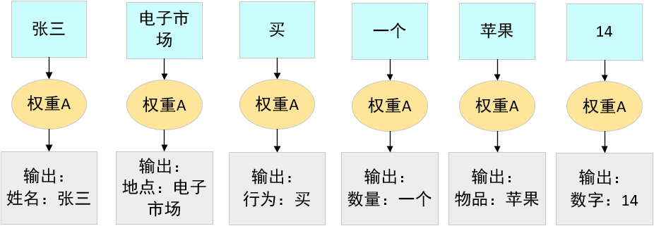
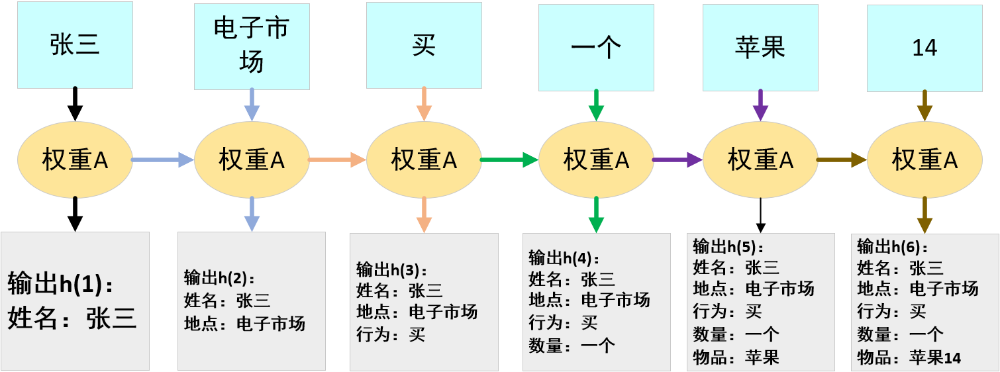
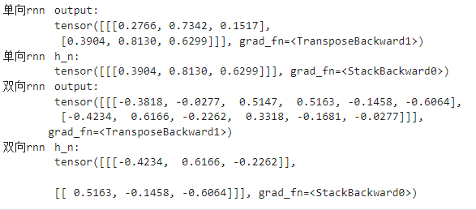
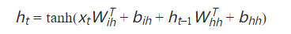
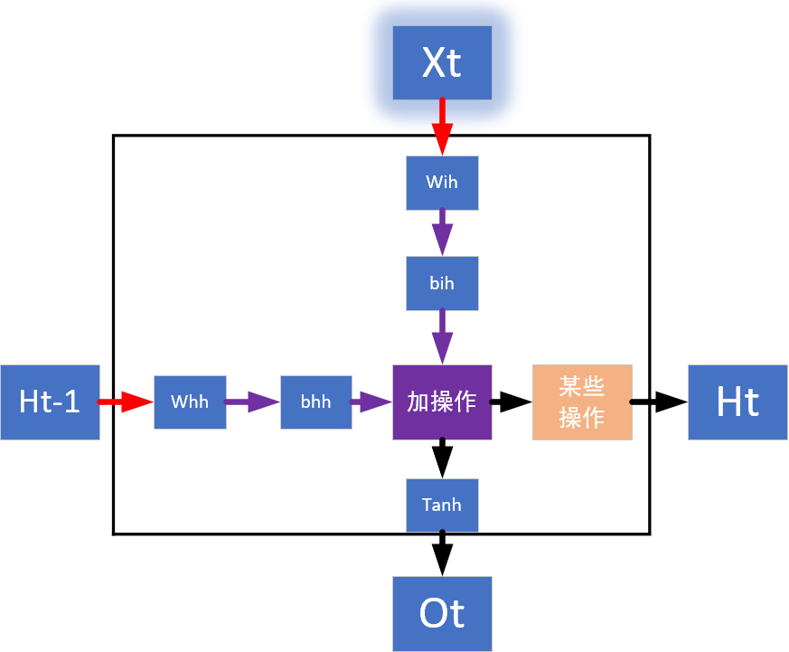
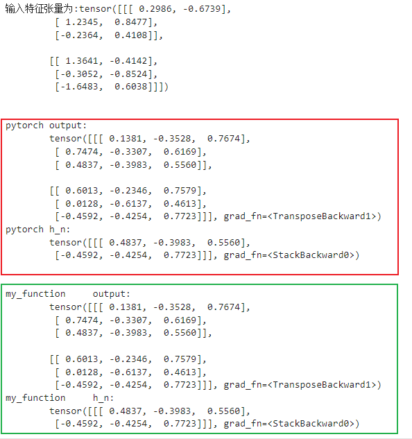
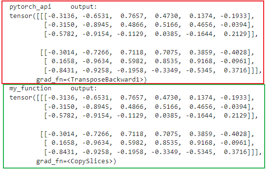

# RNN
## RNN介绍
### 基本介绍
RNN神经网络现在一般称为循环神经网络，但是从模型的运算过程来讲应该翻译成递归神经网络，这是一种用于处理序列数据的神经网络架构。与传统的前馈神经网络不同，RNN具有循环连接的特性，使其能够在时间维度上保留和利用之前的信息。这使得RNN特别适合处理时间序列数据、自然语言处理、语音识别等任务。

RNN的基本单元可以看作是一个包含隐藏状态的神经元，每个时间步的输入不仅以来于当前的输入，还依赖于前一个时间步的隐藏状态，这样说可能还是有点抽象，这样我们用一个实际的例子来解释，假设我们输入了一段文本：“张三在电子产品市场买了一个苹果14”,在一个理想化的没有关联性的模型（非RNN模型）中对文本进行分析：他可能是这样的： 
 
我们可以看到，模型可以识别出这些词的意思，但是因为没有联系上下文所以识别出来的这个意思也不是很准确，比如这里的苹果经过模型就会识别成蔷薇科-苹果属-家苹果种的那个苹果。而循环神经网络可以将上一次的输出传递给下一次模型的计算，让模型有了联系上下文的能力，如下图所示 
 
此时，在上图中的输出h(5)中：苹果就不太可能被识别成蔷薇科-苹果属-家苹果种的那个苹果，因为在上文中提到了电子市场，所以这个苹果更有可能被识别成苹果公司推出的电子产品iphone，h(6)中的14更有可能被识别成iphone的型号，而不是数量。

至此我们可以看出，在序列数据中，上下文的联系对于我们提取序列信息具有重要作用。

### 结构介绍

下面我们对RNN的结构进行一个深入的认识：

**隐藏层**：RNN的隐藏层也可以称为记忆单元，该结构在获取过去信息的同时，接受当前的数据，记忆单元有一些改进版本，比如长短期记忆网络(LSTM)和门控循环单元(GRU)，这些改进的版本包含了更复杂的记忆单元设计，以更好地处理长序列数据。 
**模型结构**：RNN的主要结构包括：单向循环，双向循环，多层的单向或双向叠加。

>>单向循环神经网络：单向循环神经网络是指信息在网络中只能按照一个方向传播，通常是从输入序列的第一个时间步到最后一个时间步。这种结构适用于顺序敏感的任务，如语言建模、情感分析等。
>
>>双向循环神经网络：双向循环神经网络是指在网络中同时使用两个单向RNN，一个按照正向顺序传播信息，另一个按照逆向顺序传播信息。这样可以更好地捕捉序列数据中的双向依赖关系，提高模型的性能。
>
>>多层的单向或双向循环神经网络：多层的单向或双向循环神经网络是指在网络中堆叠多个RNN层，可以是单向RNN或双向RNN。通过堆叠多个循环层，可以增加网络的表示能力，使得网络可以学习更复杂的模式和关系。

**RNN的优点**：可以处理变长序列，模型大小于序列长度无关，计算量与训练长度呈线性增长，考虑历史信息，便于流式输出。 
**RNN的缺点**：串行计算比较慢，无法获取太长的历史信息。

### pytorch接口介绍

pytorch的torch库种提供了torch.nn.RNN()接口，方便我们构建RNN模型。 
torch.nn.RNN()继承自torch.nn.Module,其主要参数包括如下： 

>>input_size 输入特征的维度，即每次输入的特征数
>
>>hidden_size 隐藏状态的维度，即每个隐藏层的输出特征的维度
>
>>num_layers ：rnn的层数，默认为1，可以通过堆叠多个rnn来构建更急深的网络
>
>>nonlinearity :默认非线性激活函数，一般用tanh或者relu，默认值为tanh
>
>>bias：是否使用偏执，默认为true，如果设置成false，则不使用偏置。
>
>>batch_first：设置输入输出格式，如果设置为true，则输入和输出的形状为（batch,seq,feature），否则为(seq,batch,feature)。默认为false。 
    batch：批次大小，表示一次训练或推理中输入的样本数量。批次大小通常是一个超参数，可以根据可用的内存和计算资源进行调整。使用批次处理可以提高训练效率并加速收敛。 
    seq，序列长度，表示每个输入序列的时间步数或长度。在处理时间序列数据（如文本、语音或其他序列数据）时，序列长度是指序列中包含的时间步的数量。例如，在自然语言处理中，一个句子的单词数量可以被视为序列长度。 
    feature：特征维度，表示每个时间步的特征数量。特征维度是指在每个时间步中输入的特征的数量。例如，在处理图像序列时，特征维度可能是图像的通道数（如 RGB 图像的特征维度为 3）；在处理文本时，特征维度可能是词嵌入的大小。
>
>>dropout：设置丢弃率
>
>>bidirectional：如果设置为true，则为双向rnn，默认为false
>
>>proj_size:尽在使用投影rnn时有效，指定投影的输出大小。默认为0，表示没有投影

### 接口的简单调用

这里我们可以调用一些简单的接口来做一下小实验，代码如下：

    import torch
    import torch.nn as nn

    model = nn.RNN(4,3,1,batch_first=True)
    input = torch.randn(1,2,4)
    output,h_n=model(input)
    print(f"单向rnn\toutput:\n\t{output}")
    print(f"单向rnn\th_n:\n\t{h_n}")
    model = nn.RNN(4,3,1,batch_first=True,bidirectional=True)
    output,h_n=model(input)
    print(f"双向rnn\toutput:\n\t{output}")
    print(f"双向rnn\th_n:\n\t{h_n}")

输出结果如图： 
 

这里我们构建了一个单向rnn和一个双向rnn，观察结果可以发现，双向rnn在输出结果的时候，输出的每个结果序列都比单向rnn要长一倍，在输出最后一次计算的结果序列时，双向rnn比单向rnn多了一个维度，这是因为双向rnn在计算的时候不仅需要计算正向结果，还需要计算反向结果。

### 手动实现正向传播

首先我们看一下pytorch提供的正向传播公式，可以直接看下图，或者[点击此处](https://pytorch.org/docs/stable/generated/torch.nn.RNN.html)进入pytorch官网查看文档： 

通过这个公式我们知道，想要正向推理RNN的结果，需要以下组成部分：
>>Xt：输入序列种第t个时间步的输入数据
>
>>Wih：输入到隐藏层的权重矩阵
>
>>bih：输入到隐藏层的偏执向量
>
>>ht-1:上一个时间步的隐藏状态
>
>>whh：隐藏层到隐藏层的权重矩阵
>
>>bhh:隐藏层到隐藏层的偏置向量

这些部分的工作状态如下图所示，入口为Xt（在图中发光的块），图中的箭头，红色为张量乘操作，紫色为张量加操作，黑色矩形框框起来的就是隐藏层所做的操作:

接下来我们使用代码手动复刻以下这个结构：

    def rnn_forward(input,weight_ih,weight_hh,bias_ih,bias_hh,h_prev):
        bs,t,input_size = input.shape#获取批次大小，序列长度和输入维度
        h_dim = weight_ih.shape[0]#获取输入->隐藏层的权重矩阵的第一个维度，用来构建输出矩阵
        # print(weight_ih)
        h_out = torch.zeros(bs,t,h_dim)#构建输出矩阵
        # print(h_out)
        for i in range(t):#循环遍历每一个时间步
            # print(input[:,i,:])
            x = input[:,i,:].unsqueeze(2)#这一步让原本的行数据变成列数据，好用来做向量乘法
            w_ih_batch = weight_ih.unsqueeze(0).tile(bs,1,1)
            w_hh_batch = weight_hh.unsqueeze(0).tile(bs,1,1)
            w_times_x = torch.bmm(w_ih_batch,x).squeeze(-1)#讲数据和权重进行并行乘法运算，然后删除最后一个维度
            w_times_h = torch.bmm(w_hh_batch,h_prev.unsqueeze(2)).squeeze(-1)
            #下面的代码将前一时刻的数据处理结果和当前输入的数据处理结果相加，再加上偏置
            h_prev = torch.tanh(w_times_x+bias_ih+w_times_h+bias_hh)
            h_out[:,i,:] = h_prev #记录结果
        return h_out,h_prev.unsqueeze(0)

随后我们验证一下这个结构是否正确，我们将rnn_forward的结果（下图中绿色框）和pytorch api的结果（下图中红色框）进行比较：

    bs,t = 2,3 #批次大小，输入序列长度
    input_size,hidden_size = 2,3 #输入特征维度，隐含层特征维度
    input = torch.randn(bs,t,input_size)
    print(f'输入特征张量为:{input}')

    h_prev = torch.zeros(bs,hidden_size)
    rnn = nn.RNN(input_size,hidden_size,batch_first=True)

    rnn_out,rnn_n = rnn(input,h_prev.unsqueeze(0))
    print(f"\n\npytorch\toutput:\n\t{rnn_out}")
    print(f"pytorch\th_n:\n\t{rnn_n}")

    f_out,f_n=rnn_forward(input,rnn.weight_ih_l0,rnn.weight_hh_l0,rnn.bias_ih_l0,rnn.bias_hh_l0,h_prev)
    print(f"\n\nmy_function\toutput:\n\t{rnn_out}")
    print(f"my_function\th_n:\n\t{rnn_n}")

结果如下，我们可以看到，我们写的函数和pytorch提供的api计算的结果相同：

我们再试一下双向rnn，双向rnn的参数量为单向的两倍，内部操作是：先将序列正向算一遍，然后再反向算一遍，然后把结果拼接起来，这里注意反向拼接的时候需要对结果进行翻转，我们直接看代码：

    def bidirectional_rnn_forward(input,weight_ih,weight_hh,bias_ih,bias_hh,h_prev,\
                                weight_ih_reverse,weight_hh_reverse,bias_ih_reverse,bias_hh_reverse,h_prev_reverse):
        bs,t,input_size = input.shape
        h_dim = weight_ih.shape[0]
        h_out = torch.zeros(bs,t,h_dim*2)
        forward_output = rnn_forward(input,weight_ih,weight_hh,bias_ih,bias_hh,h_prev)[0]#正向推理结果
        backward_output = rnn_forward(torch.flip(input,[1]),weight_ih_reverse,weight_hh_reverse,bias_ih_reverse,bias_hh_reverse,h_prev_reverse)[0]#反向推理结果
        backward_output = torch.flip(backward_output,[1])#反向推理结果翻转
        h_out[:,:,:h_dim] = forward_output
        h_out[:,:,h_dim:] = backward_output
        print(h_out)

    bs,t = 2,3 #批次大小，输入序列长度
    input_size,hidden_size = 2,3 #输入特征维度，隐含层特征维度
    model = nn.RNN(input_size,hidden_size,batch_first=True,bidirectional=True)
    print("pytorch_api\toutput:\n")
    print(model(input)[0])
    h_prev=torch.zeros(2,bs,hidden_size)
    print("my_function\toutput:\n")
    bidirectional_rnn_forward(input,model.weight_ih_l0,model.weight_hh_l0,model.bias_ih_l0,model.bias_hh_l0,h_prev[0],\
                            model.weight_ih_l0_reverse,model.weight_hh_l0_reverse,model.bias_ih_l0_reverse,model.bias_hh_l0_reverse,h_prev[1])
                        
输出结果如下，pytorch_api计算的结果（红色框框选）和我们的双向rnn函数（绿色框框选）计算的结果一致。
    

## MobileNet_V2介绍

### inverted升维的数学原理

## 手动实现算法（准备阶段）
准备阶段我们要做一些准备工作同时处理一下数据集，这里我选择使用MNIST数据集

工作化境：
>CPU: I3 10105F （x86_64） 
>GPU: ASUS 3060 12G 
>RAM: 威刚 DDR4 40G 2666 
>主板：MSI B560M-A 
>硬盘：WDC SN550 1T 

>OS: UBUNTU22.04 
>python版本：3.11.7 ，
>torch版本：2.2.1 
>jupyter notebook  

**注意事项：本实验尽量在有gpu的平台进行，使用个人电脑的cpu也可以将模型优化到不错的状态**

### 检查算力平台情况

### 数据预处理

## 手动实现算法（动手阶段）
### 模型实现--构建模型

### 模型实现--构建训练和测试函数

### 模型实现--小批量随机梯度下降

## 总结

在这一次实验中我对残差神经网络有了一点新的认识，比如残差网络中维度匹配不是必要的，可以根据自己对精度-速度的取舍来判断要不要进行维度匹配。