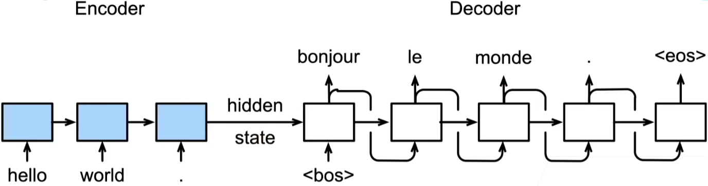
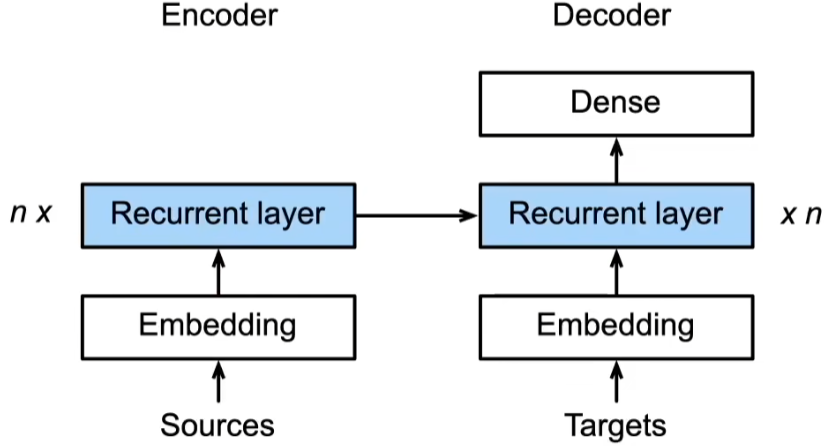

# seq2seq
## seq2seq介绍

[seq2seq论文官方链接(点击查看)](https://arxiv.org/pdf/1409.3215)

[seq2seq论文备用链接(点击查看)](http://www.apache2.sanyueyu.top/blog/ai/nlp/seq2seq/seq2seq.pdf)

[seq2seq论文中文链接(本人翻译能力和手段有限，可以看看别人写的)](http://www.apache2.sanyueyu.top/blog/ai/nlp/seq2seq/seq2seq_cn.pdf)
## 论文简述

seq2seq的出现是为了解决深度神经网络不能用于解决序列映射序列任务的问题，团队使用多层LSTM将输入序列映射到一个固定维度的向量，然后使用另一个深度lstm从向量种解码目标序列，以达到序列映射到序列的目的。斌给钱在WMT14数据集中的英法互译任务中取得了不错的成绩。同时团队还得出了源句电刀规律：颠倒所有源句（而非目标句）中的词序能显著提高 LSTM 的性能，因为这样做在源句和目标句之间引入了许多短期依赖关系，从而使优化问题变得更容易。

seq2seq最早的使用场景是机器翻译，编码器和解码器都是一个深度RNN模型，将编码器最后的状态传给解码器，解码器通过传入的数据来解析序列，直到解析到eos(结束标识符)，如下图所示

seq2seq的编码器是一个没有输出的rnn网络，将编码器的隐状态作为解码器的初始状态，然后将要翻译的目标作为解码器的输入，如下图所示，左边为编码器，右边为解码器：

可以看到rnn的模型结构也蛮简单的，接下来我们就用这个结构来做一个简单的词语翻，词语翻译任务可以看作是一个简单的序列转序列任务，我们使用神经网络将英文序列转换成中文序列。

## 简单seq2seq实验

实验目的：将英文单词翻译为中文单词

### 准备工作

首先是一些准备工作，包括检查gpu，模拟数据，以及一些数据预处理操作

    import torch
    import numpy as np
    import torch.nn as nn
    import torch.utils.data as Data
    device = torch.device('cuda' if torch.cuda.is_available() else 'cpu')
    #通过以上代码我们导入了实验所用到的第三方库，设置了torch使用的计算环境

### 数据集与预处理

    #模拟实验用到的数据集，这里我用了六组中英文词语作为实验数据
    seq_data = [['man', '男人'], ['black', '黑色'], ['king', '国王'], ['girl', '女孩'], ['up', '上'], ['high', '高']]
    #设置字典集，包含数据集中所有词语的组成元素。
    letter = [c for c in 'SE?abcdefghijklmnopqrstuvwxyz男人黑色国王女孩上高']
    #将字典集进行编号，每个字符有一个单独的编号
    letter2idx = {n: i for i, n in enumerate(letter)}
    #获取数据集中最长的词语的长度
    n_step = max([max(len(i), len(j)) for i, j in seq_data]) # max_len(=5)
    n_hidden = 128
    n_class = len(letter2idx) # classfication problem
    batch_size = 3

    #下面我们设置一个方法，用于数据预处理，输入数据集，返回数据集对应的张量
    def make_data(seq_data):
        enc_input_all, dec_input_all, dec_output_all = [], [], [] #创建三个空列表用于存储特征向量

        for seq in seq_data:
            for i in range(2):
                seq[i] = seq[i] + '?' * (n_step - len(seq[i])) # 填充数据，如man就填充成'man??'

            enc_input = [letter2idx[n] for n in (seq[0] + 'E')] # 为填充之后的向量添加结尾符E，如man经过处理之后就是['m', 'a', 'n', '?', '?', 'E']
            dec_input = [letter2idx[n] for n in ('S' + seq[1])] # 添加起始符S['S', 'b', 'l', 'a', 'c', 'k']
            dec_output = [letter2idx[n] for n in (seq[1] + 'E')] # 添加终止符E['b', 'l', 'a', 'c', 'k', 'E']

            enc_input_all.append(np.eye(n_class)[enc_input]) #创建编码器输入数据的独热向量
            dec_input_all.append(np.eye(n_class)[dec_input]) #创建解码器输入的独热向量
            dec_output_all.append(dec_output) # not one-hot #解码器输出不需要独热向量，直接输出字符对应的序号
        #最后转换成张量输出
        return torch.Tensor(enc_input_all), torch.Tensor(dec_input_all), torch.LongTensor(dec_output_all)

    #调用方法得到对应张量
    enc_input_all, dec_input_all, dec_output_all = make_data(seq_data)

    #接下来创建数据集类，相关知识请自行查找torch数据集类是干嘛用的，这个是通用函数
    class TranslateDataSet(Data.Dataset):
        def __init__(self, enc_input_all, dec_input_all, dec_output_all):
            self.enc_input_all = enc_input_all
            self.dec_input_all = dec_input_all
            self.dec_output_all = dec_output_all
        
        def __len__(self): # return dataset size
            return len(self.enc_input_all)
        
        def __getitem__(self, idx):
            return self.enc_input_all[idx], self.dec_input_all[idx], self.dec_output_all[idx]
    #实例化数据集类
    loader = Data.DataLoader(TranslateDataSet(enc_input_all, dec_input_all, dec_output_all), batch_size, True)

### 搭建模型

    #接下来搭建seq2seq模型类
    # Model
    class Seq2Seq(nn.Module):
        def __init__(self):
            super(Seq2Seq, self).__init__()
            self.encoder = nn.RNN(input_size=n_class, hidden_size=n_hidden, dropout=0.5) # 编码器
            self.decoder = nn.RNN(input_size=n_class, hidden_size=n_hidden, dropout=0.5) # 解码器
            self.fc = nn.Linear(n_hidden, n_class)

        def forward(self, enc_input, enc_hidden, dec_input):
            enc_input = enc_input.transpose(0, 1) # enc_input: [n_step+1, batch_size, n_class]
            dec_input = dec_input.transpose(0, 1) # dec_input: [n_step+1, batch_size, n_class]

            _, h_t = self.encoder(enc_input, enc_hidden)
            outputs, _ = self.decoder(dec_input, h_t)

            model = self.fc(outputs) # model : [n_step+1, batch_size, n_class]
            return model

    model = Seq2Seq().to(device)
    criterion = nn.CrossEntropyLoss().to(device)
    optimizer = torch.optim.Adam(model.parameters(), lr=0.001)

### 训练模型

    for epoch in range(5000):
        for enc_input_batch, dec_input_batch, dec_output_batch in loader:
            # make hidden shape [num_layers * num_directions, batch_size, n_hidden]
            h_0 = torch.zeros(1, batch_size, n_hidden).to(device)

            (enc_input_batch, dec_intput_batch, dec_output_batch) = (enc_input_batch.to(device), dec_input_batch.to(device), dec_output_batch.to(device))
            # enc_input_batch : [batch_size, n_step+1, n_class]
            # dec_intput_batch : [batch_size, n_step+1, n_class]
            # dec_output_batch : [batch_size, n_step+1], not one-hot
            pred = model(enc_input_batch, h_0, dec_intput_batch)
            # pred : [n_step+1, batch_size, n_class]
            pred = pred.transpose(0, 1) # [batch_size, n_step+1(=6), n_class]
            loss = 0
            for i in range(len(dec_output_batch)):
                # pred[i] : [n_step+1, n_class]
                # dec_output_batch[i] : [n_step+1]
                loss += criterion(pred[i], dec_output_batch[i])
            if (epoch + 1) % 1000 == 0:
                print('Epoch:', '%04d' % (epoch + 1), 'cost =', '{:.6f}'.format(loss))
                
            optimizer.zero_grad()
            loss.backward()
            optimizer.step()
    
### 测试模型
    def translate(word):
        enc_input, dec_input, _ = make_data([[word, '?' * n_step]])
        enc_input, dec_input = enc_input.to(device), dec_input.to(device)
        # make hidden shape [num_layers * num_directions, batch_size, n_hidden]
        hidden = torch.zeros(1, 1, n_hidden).to(device)
        output = model(enc_input, hidden, dec_input)
        # output : [n_step+1, batch_size, n_class]

        predict = output.data.max(2, keepdim=True)[1] # select n_class dimension
        decoded = [letter[i] for i in predict]
        translated = ''.join(decoded[:decoded.index('E')])

        return translated.replace('?', '')

    print('test')
    print('man ->', translate('man'))
    print('girl ->', translate('girl'))
    print('king ->', translate('king'))
    print('black ->', translate('black'))
    print('up ->', translate('up'))

以上实验都是seq2seq的最简单使用，可以根据自己的需求对网络结构进行调整。

## 总结

该篇中我们使用了最简单的seq2seq模型对中英文进行了翻译，我们后续可以根据自己的需求对模型的结构进行调整，比如不适用rnn的任务，可以尝试使用lstm或者gru作为模型的主干网络。