# seq2seq
## seq2seq介绍

[Transformer论文官方链接(点击查看)](https://arxiv.org/pdf/1706.03762)
[Transformer论文备用链接(点击查看)](http://www.apache2.sanyueyu.top/blog/ai/nlp/transformer/transformer.pdf)
[Transformer中文论文链接(点击查看)（本人翻译能力和手段有限，可以看看别人写的）](http://www.apache2.sanyueyu.top/blog/ai/nlp/transformer/transformer_cn.pdf)
### 论文简述

transformer的标题是 attention is all you need 可以‘理解为集中你的注意力’。该论文提出了一个简单的架构，名字叫transformer，该模型仅仅使用了注意力机制，没有使用cnn和rnn，该模型在英语到德语的翻译任务中取得了28.4的BLEU得分。并且在英语-法语机器翻译任务中取得了前所未有的好成绩，该模型的最初目的是用于机器翻译，但是现在也可以泛化到其他任务领域。

在论文结论部分，研究团队表示该模型仅仅使用注意力机制，没有使用rnn，模型的结果非常好，在机器翻译任务上取得了很好的效果，且训练时间也相较于其他模型快了很多。

文章中指到传统rnn模型的缺点：不能并行计算，传统rnn网络的输出一般是依靠隐藏状态和当前时间步的输入对当前时间步的输出进行预测，所以模型的输出是不能并行运算的，必须有当前时间步的隐藏状态和输入步骤，同时在时序序列比较长的情况下，早期输入的信息可能会随着时序的推进慢慢消失在隐藏状态中。所以transformer没有使用时序神经网络，而是完完全全基于attention对模型进行预测，这样使模型可以进行并行计算，获得较快的训练速度，同时不依赖隐藏状态，节省内存开销。

相关工作中提到，团队通过使用卷积神经网络对序列进行处理，以达到并行运算的效果，但是传统卷积神经网络一次只能处理一小部分数据，所以这里用注意力机制来代替卷积神经网络，这样模型就可以一次看到全部数据，而不是仅仅关注一小部分数据，同时团队使用多个注意力机制层并行的方式来代替卷积神经网络中的多个卷积层，也就是现在很出名的多头注意力机制。

模型方面，transformer使用的也是传统seq2seq的编码器解码器结构，测试过程中使用自回归计算，即使用自己当前时间步的输出作为自己下一个时间步的输入，整体的模型由词嵌入层，位置编码层，编码层，解码层，线性输出层，softmax层组成，如下图所示，图像左半边为编码器，右半边为解码器：

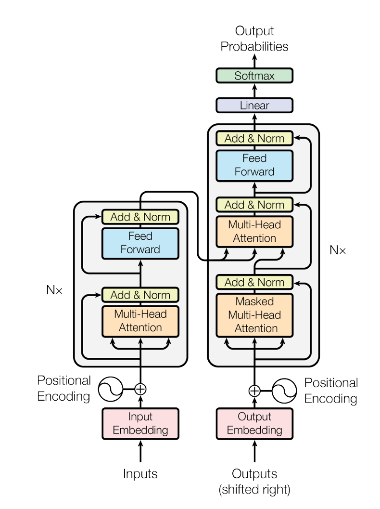

## 技术细节

### 编码器

传统的神经网络对数据进行标准化通常是将一个维度的数据进行标准化，转化为均值为0方差为1的数列，这种我们称之为batch标准化。而transformer则使用的是layer标准化，就是将每个样本自身进行标准化，在时序的样本中，每个样本的长度不一样，所以使用batch的均值和方差的抖动会比较大，而使用layer标准化则只计算自己内部的均值和方差，就不会受到其他样本的影响。
batch标准化和layer标准化范围的图例如下所示，黄色举行表示的是batch标准化的切割范围，蓝色的是layer标准化的切割范围。

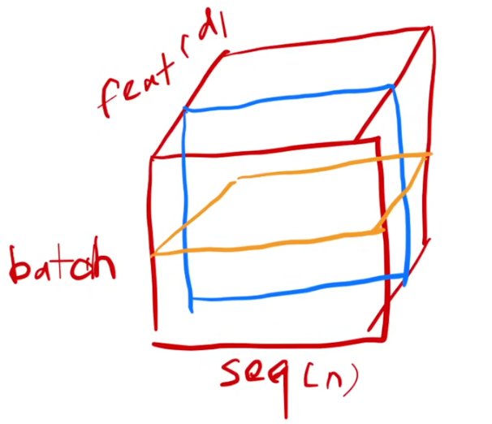

### 解码器
在解码器训练中，模型是不应该看到当前时间步后面的数据的，即模型在预测当前输出的时候并不知道未来的数据是什么，为了在训练阶段保证模型不看到不该看到的数据，我们在训练时间使用带掩码的注意力机制。即先创建一个长度和元数据序列相同的上三角矩阵，然后反转上三角矩阵，接着循环使用上三角矩阵的每一行对模型进行处理，以达到逐字生成outputs的目的，下面我用代码展示一下这个过程：

    import numpy as np

    text = "baizhenblog掩码演示"
    length = len(text)

    # 创建下三角矩阵作为掩码（反转上三角矩阵）
    mask_matrix = np.tril(np.ones((length, length)), k=0)
    # 打印原始字符串
    print("原始字符串:", text)
    # 循环打印掩码效果
    for i in range(length):
        # 根据当前行的掩码值处理字符串
        masked_text = ''.join(
            char if mask_matrix[i][j] == 1 else '*'  # 使用 * 替换被掩码的部分
            for j, char in enumerate(text)
        )
        print(f"掩码行 {i + 1}: {masked_text}")

结果如下所示：

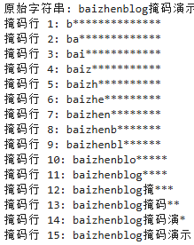

在transformer架构图中这部分对应下图中的红框部分

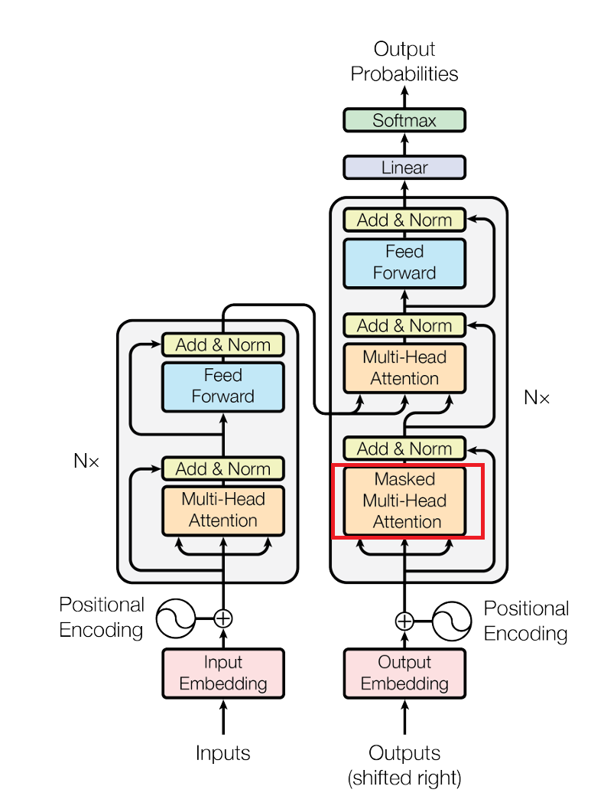

### 注意力层

论文中表示，注意力层是将query和一些key-value映射成一个输出的函数，具体来说，output是value的一个加权和，权重是value对应的key和query进行相似度计算得出的，通俗的讲，query和哪个key更相似，该key对应的value的权重就更大,不同的注意力机制的具体计算步骤也不尽相同。

transformer用到的注意力计算的方法叫 Scaled Dot-Product Attention ,在该方法中 query和key的长度是相等的，都等于dk，输出的长度为dv，通过将每个query和key做内积，将累积作为相似度，两个向量的内积越大，说明两个向量的余弦值大，说明相似度高，如果内积接近零，说明两个向量是正交，没有相似度。然后将这个值除以根号dk，就是除以序列长度，最后做softmax，得到我们的权重，公式如下所示，n个key就会算出n个权重，最后将n个权重乘上n个value得到的就是我们的输出。

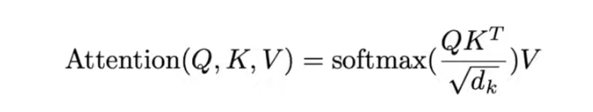

在实际运算过程中，query可以写成一个矩阵（因为可能有不止一个query），query矩阵的维度是(n,dk),key矩阵的维度是(m,dk),将key矩阵进行转置，得到的key转置矩阵的形状为(dk,m),将query矩阵和key矩阵相乘，得到的结果矩阵形状为(n,m)，将结果矩阵除以根号dk（因为dk比较大，在transformer里dk是512，用不用根号请根据实际情况判断），最后对每一行进行softmax，这样就可以得到相似度。具体流程如下图所示

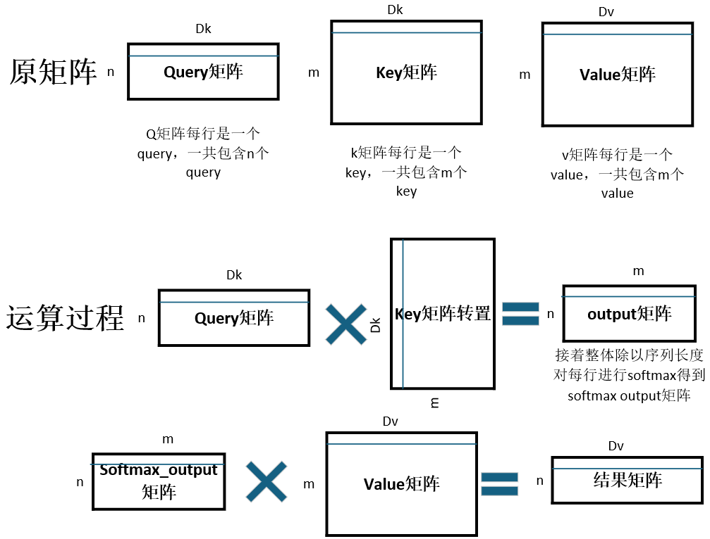

该过程在官方论文中的图如下所示，和我们自己画的图意思是一样的。

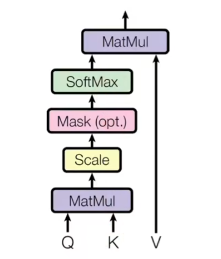

上图中的mast就是我们上面讲到的为了防止模型看到自己不应该看到的seq部分而做的掩码操作

作者提到，我们可以将qkv三个矩阵投影到低维空间中，然后使用多个注意力机制对其进行运算，最后将运算的结果加在一起，效果会更好，于是有了多头注意力机制，也就是下面这张图：

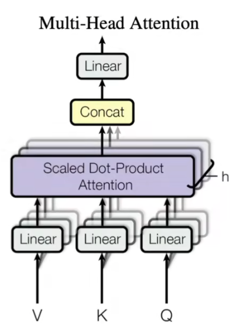

在这张图中qkv三个矩阵将自己传入h个不同的linear组中进行降低维度，然后降低维度之后的数据输入h个注意力层，最后将h个注意力层的输出合并在一起做一次线性投影作为总体的输出。这么做的好处是添加linear层可以增加模型可以学习的参数，让模型达到更好的效果。同时多个注意力机制同时运行也可以让模型产生更好的效果，下图为红色部分为论文原图中的多头注意力部分，其中蓝色的是多头部分，也就是使用多个线性层组将数据降维。

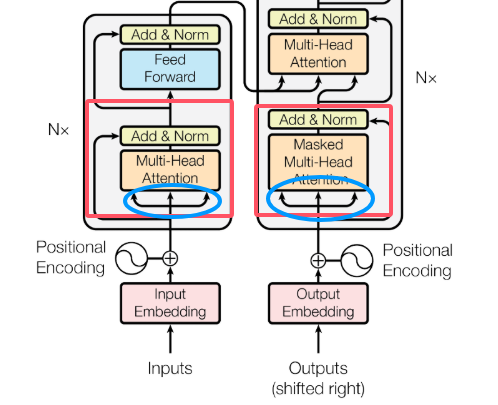

线性层的计算公式如下，如果感兴趣的话可以去论文中看详细的解析
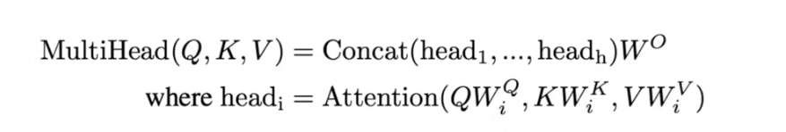

### 编码器数据传递到解码器

在论文图例中展示了编码器和解码器是如何联系在一起的，如下图所示：

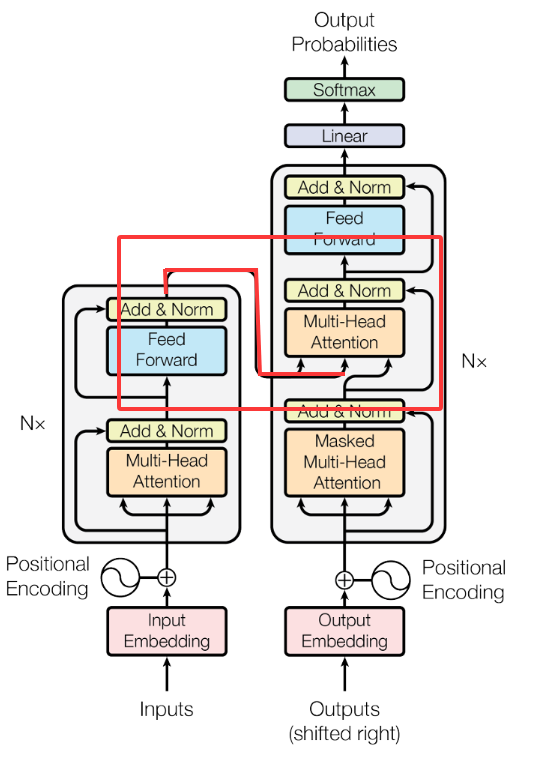   

这个图中没有标注qkv，所以我们解释一下，我们使用编码器的key-value作为模型第二个解码器层的key-value（这里我在上图中用红线进行了高亮标注），将第一个解码器层的query作为模型第二个解码器层的query，然后进行上面我们说的解码器的操作，即q矩阵与k矩阵的转置相乘，然后得到权重，与value矩阵相乘加权。与query越相似的key对应的value的权重越大。

### feed forward

feed forward是模型示例图中蓝色的部分，其本质就是一个mlp网络（多层感知机） ，这个多层感知机的公式如下：

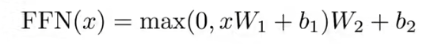

我们之前说过研究团队把序列长度设置在了512 所以我们这里的x就是一个长512的向量，W1会将512维度的向量投影成2048维度，xW1+b1是一个线性层，max()是一个relu激活函数，W2会将2048维度的向量投影回512

### 位置编码

在传统的RNN和LSTM中，模型天然地通过时间步的顺序处理序列数据，隐含地获得了位置信息。但是我们使用注意力机制对数据进行并行处理的时候发现，自注意力层本身是位置无关的。对于相同的输入token集合，无论它们的顺序如何排列，自注意力都会产生相同的输出（仅内容相关，与位置无关）。这显然不符合语言时序等数据的特性。研究团队提出了位置编码（Positional Encoding），使用位置编码对数据的位置进行标记。团队使用正余弦编码对seq进行位置编码，编码的公式如下：

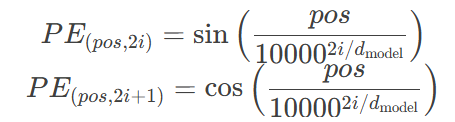
pos：token在序列中的位置（0, 1, 2...）
i：维度索引（ 0 ≤ i < dmodel​/2）
dmodel嵌入维度

这里我们做一个简单的实验来看一下这个所谓的位置编码：

    import torch
    import math
    import numpy as np

    def positional_encoding(max_len, d_model):
        """生成位置编码"""
        pe = torch.zeros(max_len, d_model)
        position = torch.arange(0, max_len, dtype=torch.float).unsqueeze(1)
        div_term = torch.exp(torch.arange(0, d_model, 2).float() * (-math.log(10000.0) / d_model))
        
        pe[:, 0::2] = torch.sin(position * div_term)  # 偶数位置使用sin
        pe[:, 1::2] = torch.cos(position * div_term)  # 奇数位置使用cos
        return pe

    # 创建0-99的矩阵 (10x10)
    matrix = torch.arange(100).reshape(10, 10).float()

    # 设置嵌入维度为10(与矩阵列数相同)
    d_model = 10

    # 生成位置编码
    pe = positional_encoding(100, d_model)  # 生成100个位置(足够覆盖我们的矩阵)

    # 将位置编码应用到矩阵
    encoded_matrix = matrix + pe[:10, :]  # 只取前10行位置编码

    # 打印结果
    print("原始矩阵(0-99):")
    print(matrix.int().numpy())
    print("\n位置编码(前10个位置):")
    print(pe[:10, :].numpy().round(4))
    print("\n编码后的矩阵:")
    print(encoded_matrix.numpy().round(4))

结果如下：

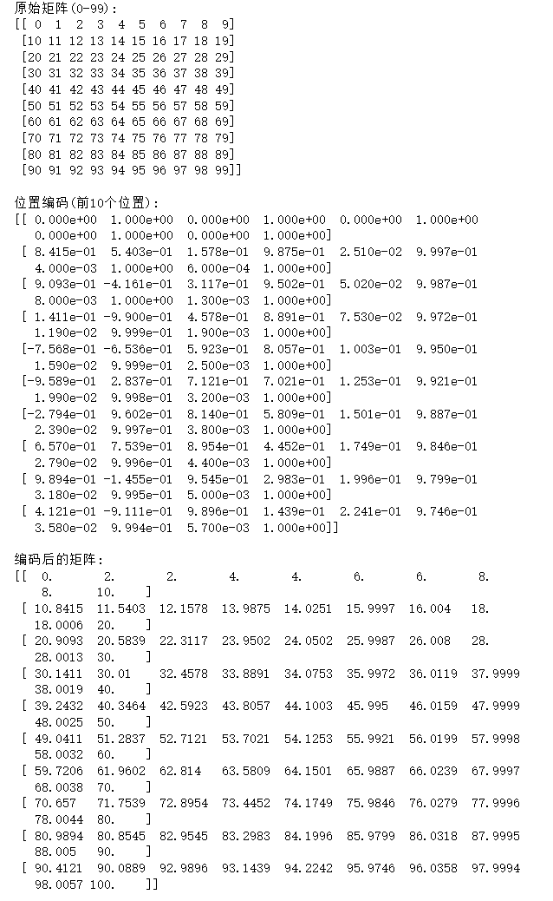

上图中第一个矩阵是原数据，第二个矩阵是位置编码矩阵，第三个图是编码后的矩阵。

位置编码需要模型进行学习，模型会自己找位置编码的规律，
