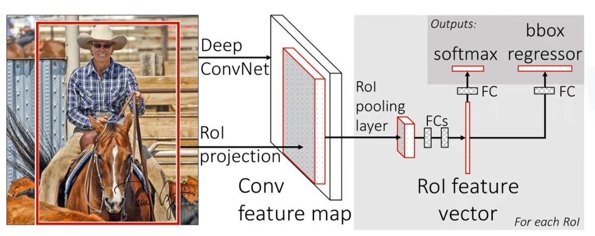
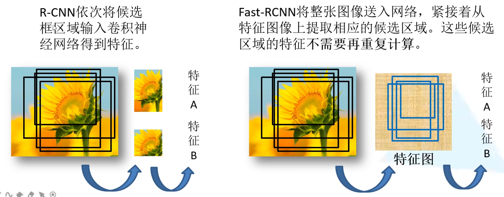
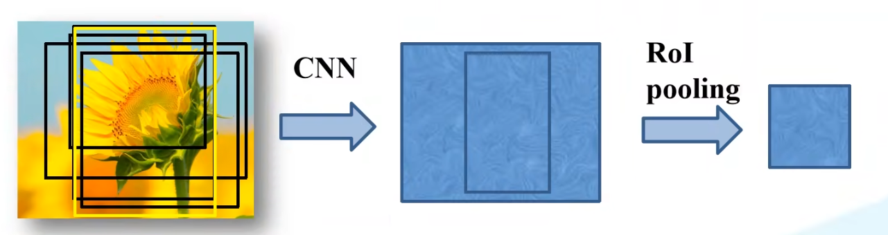
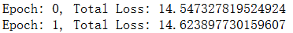
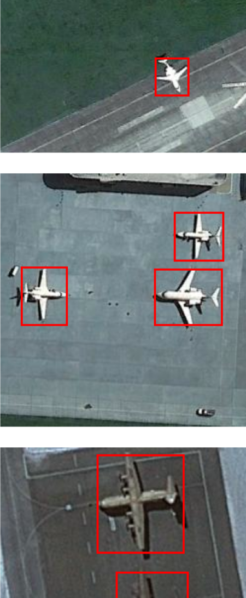

# Fast R-CNN
## Fast R-CNN概述

[Fast R-CNN论文官方链接(点击查看)](http://xxx.itp.ac.cn/pdf/1504.08083v2)

[RCNN论文备用链接(点击查看)](http://www.apache2.sanyueyu.top/blog/ai/image_classification/googlenet/GoogLeNet_v1.pdf)

下面中文论文中有些图片分辨率太低了，图片方面可以参考上面备用链接里的图片，而且GoogLeNet的论文写的巨抽象，大概是因为我见识浅薄，读起来很吃力

[RCNN论文中文pdf链接(点击查看)（本人翻译能力和手段有限，可以看看别人写的）](http://www.apache2.sanyueyu.top/blog/ai/image_classification/googlenet/GoogLeNet_v1cn.pdf)

### 背景

Fast R-CNN是作者RossGirshick继R-CNN之后的又一力作，同样使用VGG16作为网络的backbone（主干网络）,与R-CNN相比训练时间块9倍，测试推理时间块213倍，准确率从62%提升至66%（在pascal voc数据集上测试）

### 方法

首先我们回顾一下RCNN的流程：

>> 一张图像使用ss算法生成2k个候选区域
>
>> 对每个候选区域，使用cnn网络提取特征
>
>> 特征送入每一类的SVM分类器
>
>>使用回归器进行修正候选框位置

接下来我们看一下Fast R-CNN算法的流程：

>> 一张图像通过ss算法生成2k个候选区域
>
>>将图像输入网络得到相应的特征图，将ss算法生成的候选框投影到特征图上得到相应的特征矩阵
>
>>将每个特征矩阵通过roi pooling层缩放到7x7大小的特征图，接着将特征图战平通过一系列全连接层得到预测结果

之前是将每个特征图分别输入网络，而现在则是将整幅图像直接输入cnn网络，得到相应的特征图，然后将ss算法得到的候选区域映射到特征图上得到特征矩阵

在rcnn中，我们需要将ss算法得到的候选区域截取出来，然后依次传入模型训练，如下图哦左边所示，这样会训练很多重复的数据，而在fast-rcnn中，我们每张图片只需要训练一次，这样大量节省了内存空间和算力

将特征图截取出来之后，使用roipool层缩放成7x7操作，这样就可以不限制输入图像的尺寸

最后将roipool的结果并联两个全连接层，一个用于判断类别，一个用于回归边界，分类全连接层输出的类别应该是n+1个，包含n个类别+1个背景。边界框回归器会返回n+1个类别的边界框回归参数，一共回归（n+1）x4个节点

### 效能

与R-CNN相比训练时间块9倍，测试推理时间块213倍，准确率从62%提升至66%（在pascal voc数据集上测试）

### 不足

要求图像的size是固定的

训练分三步，首先训练卷积网络，然后训练svm，然后训练bbox regressor

训练耗时耗空间

检测速度满，使用vgg进行detection时，每张图片要检测四十秒以上

## Fast RCNN流程

首先使用selective search算法生成大概2000个region proposal 
接着通过affine image warping将这些region proposal的尺寸统一到固定size(227x227) 
然后将名美国人region proposal和原图片输入到alexNet，获得每个region proposal对应的feature vector（4096维）
然后把每个feature vector分别输入到多个线性svm（每个class对应一个线性svm，判断是否属于该class），注意：classification和regression并行
最后对所有scored region进行greedy NMS,每个class的box独立进行

### region proposals（生成可能包含目标对象的区域）

思路：为每个image生成2000个左右category-independent region proposal（独立类别区域建议）

方法：文本使用selective search（fast mode），也可以使用任意的其他方法

selective search（选择搜索）的大概思路：先将图片分割成很多小区域，然后按照一定规则合并相邻的两个区域，抑制合并到只剩一个区域，整个过程中存在过的所有区域就是selective search的结果

### feature extraction（特征提取）

思路：使用alexnet为每个region proposal生成一个4096维的feature vector

affine image warping（仿射图像扭曲）：作用：使输入到Alexnet的每个region proposal的size都为227x227，以匹配alexnet的要求

方法：不管proposal（提案）的size 和aspect ratio（长宽比）是多少，都将其扭曲到所需size，在wrap之前扩张proposal box，是wrao之后原始proposal box周围正好有p（16）个上下文像素

### classification

每个class都有一个对应了linear SVM涌来判断是否为该class，使用每个SVM对每个featurevector进行score

feature matrix：2000x4096，SVM weight matrix：4096xN（N为class的数量）

即使有100K个class，matrix multiplication在当时的多核CPU上也只需要跑十秒

## 代码实现

数据集使用飞机场数据集，我们首先理一下思路：

### 创建数据集类

首先，在学习fast rcnn之前要先学一下rcnn，这样有的概念才能看懂，我们要把数据集和目标的标记提取出来，然后使用cv2的ss算法获得一些搜索框，然后时使用iou判断这个框是不是我们的目标。然后记录目标狂的百分比位置，方便一会对特征图进行投影定位。我们需要记录每张图片的候选框正样本框的百分比，以及标签。

首先导包

    # 导入库
    import torch
    import torch.nn as nn
    from torchvision import datasets
    import os
    import xml.etree.ElementTree as ET
    from PIL import Image
    import matplotlib.pyplot as plt
    from torch.utils.data import Dataset
    import torchvision
    from torchvision import transforms
    import numpy as np
    import cv2
    import pandas as pd
    import torch.nn.functional as F
    #图片文件夹和csv的文件夹
    path = "../dataset/airplane_dataset/Images"
    annot = "../dataset/airplane_dataset/Airplanes_Annotations"

创建数据类，这个数据类包括我们上面说的，记录百分比位置，创建搜索框，使用iou判断正负样本等等，这个类我第一次写的时候写了一下午，真头大：

    class airplaneDataset(Dataset):
        def __init__(self, transform=None):
            self.img_list = []
            self.csv_label_list = []
            self.ss_k_list = []
            self.ss_label_list = []
            self.box = []
            for e,i in enumerate(os.listdir(annot)):
                print(i)
                if i.startswith("airplane"):
                    #读取图像，保存图像
                    filename = i.split(".")[0]+".jpg"
                    image = cv2.imread(os.path.join(path,filename))
                    self.img_list.append(image)
                    #读取原标签，保存原标签
                    df = pd.read_csv(os.path.join(annot,i))
                    gtvalues=[]
                    for row in df.iterrows():
                        x1 = int(row[1][0].split(" ")[0])
                        y1 = int(row[1][0].split(" ")[1])
                        x2 = int(row[1][0].split(" ")[2])
                        y2 = int(row[1][0].split(" ")[3])
                        gtvalues.append({"x1":x1,"x2":x2,"y1":y1,"y2":y2})
                    self.csv_label_list.append(gtvalues)
                    # 生成候选框
                    ss = cv2.ximgproc.segmentation.createSelectiveSearchSegmentation()
                    ss.setBaseImage(image)
                    ss.switchToSelectiveSearchFast()
                    ssresults = ss.process()
                    print(f'ss:{len(ssresults)}')
                    #筛选，保存候选框的百分比位置和对应标签
                    k_list = []
                    label_list = []
                    old_age = []
                    print(gtvalues)
                    y_size,x_size = image.shape[0:2]
                    for gtval in gtvalues:#gtval是标记的框，四个值分别是x1，x2,y1,y2
                        g_list=[]
                        g_label=[]
                        zheng = 0
                        fu = 0
                        old_age_value = [gtval['x1']/x_size,gtval['x2']/x_size,gtval['y1']/y_size,gtval['y2']/y_size]
                        for j in ssresults:#i是选择性搜索的框，四个值分别是x1，y1，w，h
                            x,y,w,h = j
                            iou = get_iou(gtval,{"x1":x,"x2":x+w,"y1":y,"y2":y+h})
                            if zheng < 30:
                                if iou > 0.7:
                                    timeage = [x/x_size,(x+w)/x_size,y/y_size,(y+h)/y_size]
                                    k_list.append(timeage)
                                    label_list.append(1)
                                    old_age.append(old_age_value)
                                    zheng += 1
                            if fu < 30:
                                if iou < 0.3:
                                    timeage = [x/x_size,(x+w)/x_size,y/y_size,(y+h)/y_size]
                                    k_list.append(timeage)
                                    label_list.append(0)
                                    old_age.append([0,0,0,0])
                                    fu += 1
                    print(label_list)
                    self.box.append(old_age)
                    self.ss_k_list.append(k_list)
                    self.ss_label_list.append(label_list)
        def __len__(self):
            return len(self.img_list)
        def __getitem__(self, index):
            image = self.img_list[index]
            csv_label = self.csv_label_list[index]
            ss_k_list = self.ss_k_list[index]
            ss_label_list=self.ss_label_list[index]
            box = self.box[index]
            
            return image,csv_label,ss_k_list,ss_label_list,box

实例化数据集

    train_data = airplaneDataset()
    dataloader = torch.utils.data.DataLoader(train_data, batch_size=1, shuffle=True)

### 创建网络

创建resnet，最后分类部分创建两个分类器，一个用于回归位置，一个用于判断类别：

    class resBlock(nn.Module):
        def __init__(self,in_channels,out_channels,stride=1):
            super().__init__()
            self.conv1 = nn.Conv2d(in_channels,out_channels,3,stride,1)
            self.bn1 = nn.BatchNorm2d(out_channels)
            self.conv2 = nn.Conv2d(out_channels,out_channels,3,1,1)
            self.bn2 = nn.BatchNorm2d(out_channels)
            if stride != 1 or in_channels != out_channels:
                self.conv_down = nn.Conv2d(in_channels, out_channels, 1, stride=stride, padding=0)
                self.bn3 = nn.BatchNorm2d(out_channels)
        def forward(self,x):
            inputs = x
            x = F.relu(self.bn1(self.conv1(x)))
            x = self.bn2(self.conv2(x))
            if self.conv_down is not None:
                inputs = self.bn3(self.conv_down(inputs))
            out = x + inputs
            out = F.relu(out)
            return out

    class resNet(nn.Module):
            def __init__(self):
                super().__init__()
                self.res1 = resBlock(3,20)
                self.res2 = resBlock(20,40,1)
                self.res3 = resBlock(40,60,1)
                self.res4 = resBlock(60,80,2)
                self.res5 = resBlock(80,40,1)
                self.softmax_fc = nn.Linear(1960,2)
                self.fc2 = nn.Linear(1960,8)
            
            def forward(self,x,ss_size):
                batch_size = x.shape[0]
                x = self.res1(x)
                x = self.res2(x)
                x = self.res3(x)
                x = self.res4(x)
                x = self.res5(x)
                x_size = x.shape[2]
    #             print(x.shape)
    #             print(f'x_size{x_size}')
    #             print(f'ss_size{ss_size}')
                soft_list = []
                bbox_list = []
                new_tensor = torch.empty(0).to(device)
    #             print('ss_size_shape',ss_size.shape)
                for i in ss_size:
    #                 print(i)
                    x1,x2,y1,y2 = i
                    x1,x2,y1,y2 = int(x_size*x1),int(x_size*x2),int(x_size*y1),int(x_size*y2)
                    if y2 <= y1:y2=y1+1
                    if x2 <= x1:x2=x1+1
                    sliced_tensor = x[:, :, x1:x2, y1:y2]
    #                 print(sliced_tensor.shape)
                    pooled_tensor = F.adaptive_avg_pool2d(sliced_tensor,(7,7))
                    tensor_x = pooled_tensor.view(1,-1)
                    new_tensor=torch.cat([new_tensor,tensor_x])
    #             print(new_tensor)
    #             print('new:shape:',new_tensor.shape)
                sof = self.softmax_fc(new_tensor)
                bbox = self.fc2(new_tensor)
    #             print(f'sof:{sof},_________________shape:{sof.shape}')
    #             print(f'sof:{bbox},_________________shape:{bbox.shape}')
                return sof,bbox

    model = resNet()
    device = torch.device("cuda:0")
    model.to(device)

构建训练函数，这里的损失函数是两个损失加在一起，一个是softmax分类器的损失，一个是位置回归的损失：

    import torch.optim as optim
    optimizer = optim.SGD(model.parameters(),lr=0.001,momentum=0.9)
    criterion=nn.CrossEntropyLoss()
    bboloss = nn.SmoothL1Loss()

    def train(epoch):
        total_loss = 0.0  # 初始化整体损失为0
    #     model.train()
    #     running_loss =0.0
        for batch_idx,data in enumerate(dataloader,0):
            image,csv_label,ss_k_list,ss_label_list,box = data
    #         print(image.shape)
    #         print(len(csv_label))
    #         print(ss_k_list)
    #         print(ss_label_list)
            ss_k_tensor = torch.tensor(ss_k_list).to(torch.float)
            image = image.to(torch.float).transpose(1,3)
            image = image.to(device)
    #         print(ss_k_tensor.shape)
            optimizer.zero_grad()
            if ss_k_tensor.shape[0]<1:
                continue
            soft_res,bbox_res = model(image,ss_k_tensor)
            ss_label_tensor = torch.tensor(ss_label_list).to(device)
            loss1 = criterion(soft_res,ss_label_tensor)
    #         print(loss1)
    #         print(bbox_res.shape)
            old_age = []
            for i in range(len(ss_label_list)):
    #             print(ss_label_list[i],bbox_res[i])
                if ss_label_list[i] == 0 :
    #                 print(bbox_res[i][:4])
                    old_age.append(bbox_res[i][:4])
                else:
                    old_age.append(bbox_res[i][4:])
            old_age = torch.stack(old_age)
            box = torch.tensor(box).to(device)
            loss2 = bboloss(old_age,box)
            loss_value = loss1+loss2
    #         print(loss_value)
            loss_value.backward()
            optimizer.step()
            total_loss += loss_value.item()
        print(f'Epoch: {epoch}, Total Loss: {total_loss}')  # 输出整个大批次的平均损失
    
### 训练模型

最后对模型进行训练：

    for i in range():
        train(i)

损失最后定格在14左右：

最后的测试环节，代码我也写得有点神志不清了，这里模仿数据集类写测试集类：

    class airplane_test_Dataset(Dataset):
        def __init__(self, transform=None):
            self.img_list = []
            self.csv_label_list = []
            self.ss_k_list = []
            self.ss_label_list = []
            self.box = []
            num = 0
            for e,i in enumerate(os.listdir(annot)):
                print(i)
                if i.startswith("air"):
                    #读取图像，保存图像
                    filename = i.split(".")[0]+".jpg"
                    image = cv2.imread(os.path.join(path,filename))
                    self.img_list.append(image)
                    #读取原标签，保存原标签
                    df = pd.read_csv(os.path.join(annot,i))
                    gtvalues=[]
                    for row in df.iterrows():
                        x1 = int(row[1][0].split(" ")[0])
                        y1 = int(row[1][0].split(" ")[1])
                        x2 = int(row[1][0].split(" ")[2])
                        y2 = int(row[1][0].split(" ")[3])
                        gtvalues.append({"x1":x1,"x2":x2,"y1":y1,"y2":y2})
                    self.csv_label_list.append(gtvalues)
                    # 生成候选框
                    ss = cv2.ximgproc.segmentation.createSelectiveSearchSegmentation()
                    ss.setBaseImage(image)
                    ss.switchToSelectiveSearchFast()
                    ssresults = ss.process()
                    print(f'ss:{len(ssresults)}')
                    #筛选，保存候选框的百分比位置和对应标签
                    k_list = []
                    label_list = []
                    old_age = []
                    print(gtvalues)
                    y_size,x_size = image.shape[0:2]
                    for gtval in gtvalues:#gtval是标记的框，四个值分别是x1，x2,y1,y2
                        g_list=[]
                        g_label=[]
                        zheng = 0
                        fu = 0
                        old_age_value = [gtval['x1']/x_size,gtval['x2']/x_size,gtval['y1']/y_size,gtval['y2']/y_size]
                        for j in ssresults:#i是选择性搜索的框，四个值分别是x1，y1，w，h
                            x,y,w,h = j
                            iou = get_iou(gtval,{"x1":x,"x2":x+w,"y1":y,"y2":y+h})
                            if zheng < 30:
                                if iou > 0.7:
                                    timeage = [x/x_size,(x+w)/x_size,y/y_size,(y+h)/y_size]
                                    k_list.append(timeage)
                                    label_list.append(1)
                                    old_age.append(old_age_value)
                                    zheng += 1
                            if fu < 30:
                                if iou < 0.3:
                                    timeage = [x/x_size,(x+w)/x_size,y/y_size,(y+h)/y_size]
                                    k_list.append(timeage)
                                    label_list.append(0)
                                    old_age.append([0,0,0,0])
                                    fu += 1
                    print(label_list)
                    self.box.append(old_age)
                    self.ss_k_list.append(k_list)
                    self.ss_label_list.append(label_list)
                num += 1
                if num >10:
                    break
        def __len__(self):
            return len(self.img_list)
        def __getitem__(self, index):
            image = self.img_list[index]
            csv_label = self.csv_label_list[index]
            ss_k_list = self.ss_k_list[index]
            ss_label_list=self.ss_label_list[index]
            box = self.box[index]
            
            return image,csv_label,ss_k_list,ss_label_list,box
    test_data = airplane_test_Dataset()

### 测试模型

然后遍历所有测试数据，查看结果：

    for batch_idx,data in enumerate(test_data,0):
        image,csv_label,ss_k_list,ss_label_list,box = data
        ten_image = torch.tensor(image).to(torch.float).unsqueeze(0).transpose(1,3)
        ss_k_tensor = torch.tensor(ss_k_list).to(torch.float)
        ten_image = ten_image.to(device)
        soft_res,bbox_res = model(ten_image,ss_k_tensor)
        
        
    #     plt.imshow(image)
    #     plt.gca().add_patch(plt.Rectangle((x1, y1), x2 - x1, y2 - y1, linewidth=2, edgecolor='r', facecolor='none'))
    #     plt.axis('off')  # 关闭坐标轴
    #     plt.show()
        # 获取原图
        ssize = image.shape[1]
    #     print(ssize)
        plt.imshow(image)
        for i in range(len(soft_res)):
            if F.softmax(soft_res[i], dim=0)[1] > 0.8:  # 检查概率
    #             print(soft_res[i])
                bboxx = bbox_res[i][4:].detach().cpu().numpy()  # 获取 bbox_res
    #             print(bboxx)
    #             print(box[i])
                # 假设 bbox 是 [x1, y1, x2, y2] 格式
                x1, x2, y1, y2 = box[i]
                
                # 在图像上绘制矩形框
                
                plt.gca().add_patch(plt.Rectangle((int(x1*ssize),int(y1*ssize)), int((x2 - x1)*ssize), int((y2 - y1)*ssize), linewidth=2, edgecolor='r', facecolor='none'))
        plt.axis('off')  # 关闭坐标轴
        plt.show()

## 总结

这个项目写的我真是，昏天黑地，写得我道心破碎了都要，这次的任务让我认识了一些新的东西，比如dataloder在输出数据形状不一致的时候不能正常运行，比如列表中有张量的时候，不能使用torch.tensor,而是要使用torch.stack等等。

