# Faster R-CNN
## Faster R-CNN简介
Faster R-CNN:直接回归目标类别和位置，在不同尺度的特征图上进行预测，端到端的训练，不挑分辨率

[Faster R-CNN论文官方链接(点击查看)](http://xxx.itp.ac.cn/abs/1506.01497)

[Faster R-CNN论文pdf链接(点击查看)](http://www.apache2.sanyueyu.top/blog/ai/object_detection/Faster R-CNN/Faster R-CNN.pdf)

[Faster R-CNN中文论文pdf链接(点击查看)（用ai&有道词典翻译的，质量一般）](http://www.apache2.sanyueyu.top/blog/ai/object_detection/Faster R-CNN/Faster R-CNNcn.pdf)

### 背景

Faster R-CNN是作者RossGirshick继Faster R-CNN之后的又一力作，同样使用VGG16作为网络的backbone（主干网络）,推理速度再GPU上达到了5fps（包括候选区域的生成），准确率也有进一步的提升，再2015年的ILSVRC以及coco竞赛中获得多个项目的第一名。Faster R-CNN的核心部分是他的区域生成网络，这也是我们这篇博客的重点。

### 方法

首先我们回顾一下Fast R-CNN的流程：

>> 一张图像通过ss算法生成2k个候选区域
>
>>将图像输入网络得到相应的特征图，将ss算法生成的候选框投影到特征图上得到相应的特征矩阵
>
>>将每个特征矩阵通过roi pooling层缩放到7x7大小的特征图，接着将特征图战平通过一系列全连接层得到预测结果

接下来我们看一下Fast R-CNN算法的流程：

>>将图像输入网络得到相应的特征图
>
>>使用RPN结构生成候选框，将RPN生成的候选框投影到特征图上获得相应的特征矩阵
>
>>将每个特征矩阵通过ROI pooling层缩放到7x7大小的特征图，接着将特征图展平，通过一系列全连接层得到预测结果

和Fast R-CNN相比，Faster RCNN也就是多了一个RPN结构。

### 框架

首先我们看一下faster rcnn的框架图，这张框架图是github上一个大佬WZMIAOMIAO画的，画的很不错我就直接拿来用了，这张图可以通过“右键--在新建标签页中查看图片”来查看高清大图

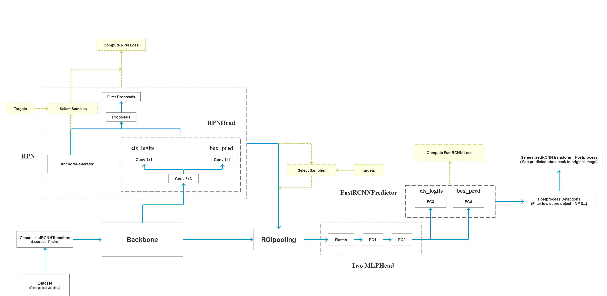

首先，我们拿到dataset之后，首先经过预处理，然后传入我们的主干网络（backbone）进行特征提取，然后将特征图输入rpn中，获得大约两千个目标建议框，然后将建议框根据投影得到特征矩阵，将每个特征矩阵输入roipooling层得到大小统一的特征图，接下来通过展平和两个全连接，最后同时接入一个类别分类模块和一个边界框回归层。
## 手动实现算法（准备阶段）

### FastRCNN模型类

FastRCNN模型类主要实现以下方法：
>初始化方法（init） 
>>初始化方法主要包括设置主干网络，设置分类和定位框回归网络，设置rpn网络 

>前向传播函数 
>>前向传播函数主要包括四种前向传播，1.完整前向传播，2.仅提取特征前向传播，3.仅生成特征框前向传播，4.仅分类和回归前向传播 

>冻结批归一化 
>>冻结批归一化将所有的归一化层设为评估模式，便于迁移学习等方法的使用 

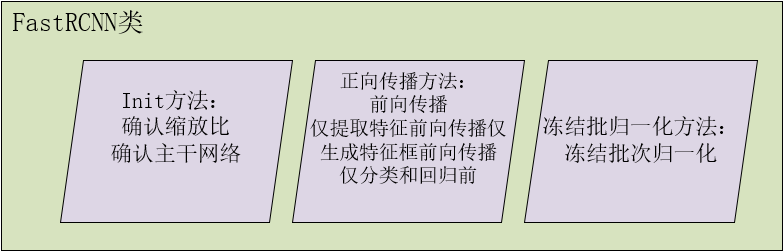

接下来我们用代码实现以下这个过程，有些函数要在后面才开始写：

    class FasterRCNN(nn.Module):
        def __init__(self, num_classes,  # 类别数量（不包括背景）
                    mode="training",  # 工作模式
                    feat_stride=16,  # 特征图步长（也就是缩放比例）
                    anchor_scales=[8, 16, 32],  # 锚框的尺度
                    ratios=[0.5, 1, 2],  # 锚框的长宽比
                    backbone='vgg',  # 主干网络类型
                    pretrained=False):  # 是否使用预训练模型        
            super(FasterRCNN, self).__init__()
            self.feat_stride = feat_stride
            if backbone == 'vgg':
                self.extractor, classifier = decom_vgg16(pretrained)  # 获取vgg16的特征提取部分和分类部分
                self.rpn = RegionProposalNetwork(  # 设置区域建议框网络
                    512, 512,
                    ratios=ratios,
                    anchor_scales=anchor_scales,
                    feat_stride=self.feat_stride,
                    mode=mode
                )
                self.head = VGG16RoIHead(  # 构建分类器和位置回归网络
                    n_class=num_classes + 1,
                    roi_size=7,
                    spatial_scale=1,
                    classifier=classifier
                )
            elif backbone == 'resnet50':
                self.extractor, classifier = resnet50(pretrained)  # 获取vgg16的特征提取部分和分类部分
                self.rpn = RegionProposalNetwork(  # 构建区域建议网络
                    1024, 512,
                    ratios=ratios,
                    anchor_scales=anchor_scales,
                    feat_stride=self.feat_stride,
                    mode=mode
                )
                self.head = Resnet50RoIHead(  # 构建分类器和位置回归网络
                    n_class=num_classes + 1,
                    roi_size=14,
                    spatial_scale=1,
                    classifier=classifier
                )

        def forward(self, x, scale=1., mode="forward"):
            if mode == "forward":
                img_size = x.shape[2:]  # 获取图像尺寸
                base_feature = self.extractor.forward(x)  # 进行特征提取
                _, _, rois, roi_indices, _ = self.rpn.forward(base_feature, img_size, scale)  # 进行建议框提取
                roi_cls_locs, roi_scores = self.head.forward(base_feature, rois, roi_indices, img_size)  # 进行特征框分类和回归
                return roi_cls_locs, roi_scores, rois, roi_indices
            elif mode == "extractor":
                base_feature = self.extractor.forward(x)
                return base_feature
            elif mode == "rpn":
                base_feature, img_size = x
                rpn_locs, rpn_scores, rois, roi_indices, anchor = self.rpn.forward(base_feature, img_size, scale)  # 进行特征框提取
                return rpn_locs, rpn_scores, rois, roi_indices, anchor
            elif mode == "head":
                base_feature, rois, roi_indices, img_size = x
                roi_cls_locs, roi_scores = self.head.forward(base_feature, rois, roi_indices, img_size)  # 进行分类和回归
                return roi_cls_locs, roi_scores

        def freeze_bn(self):#进行批次归一化的冻结
            for m in self.modules():
                if isinstance(m, nn.BatchNorm2d):
                    m.eval()

### VGG模块

接下来我们拓展整体结构图，即将init方法中的依赖补上，首先是vgg网络相关的函数，这个函数返回vgg网络的特征提取部分和回归部分

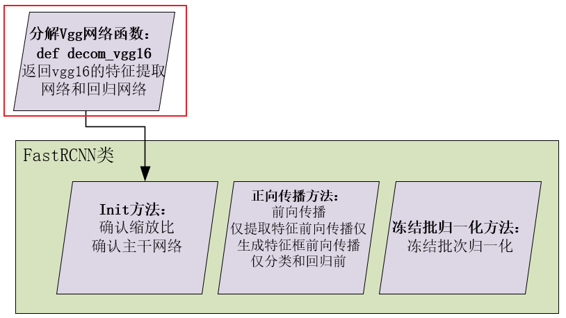

    def decom_vgg16(pretrained = False):
        model = VGG(make_layers(cfg))
        if pretrained:
            state_dict = load_state_dict_from_url("https://download.pytorch.org/models/vgg16-397923af.pth", model_dir="./model_data")
            model.load_state_dict(state_dict)
        #----------------------------------------------------------------------------#
        #   获取特征提取部分，最终获得一个37,37,1024的特征层
        #----------------------------------------------------------------------------#
        features    = list(model.features)[:30]
        #----------------------------------------------------------------------------#
        #   获取分类部分，需要除去Dropout部分
        #----------------------------------------------------------------------------#
        classifier  = list(model.classifier)
        del classifier[6]
        del classifier[5]
        del classifier[2]

        features    = nn.Sequential(*features)
        classifier  = nn.Sequential(*classifier)
        return features, classifier

上面这个函数中用到了两个依赖，分别是make_layers和VGG，就是下图这些部分：
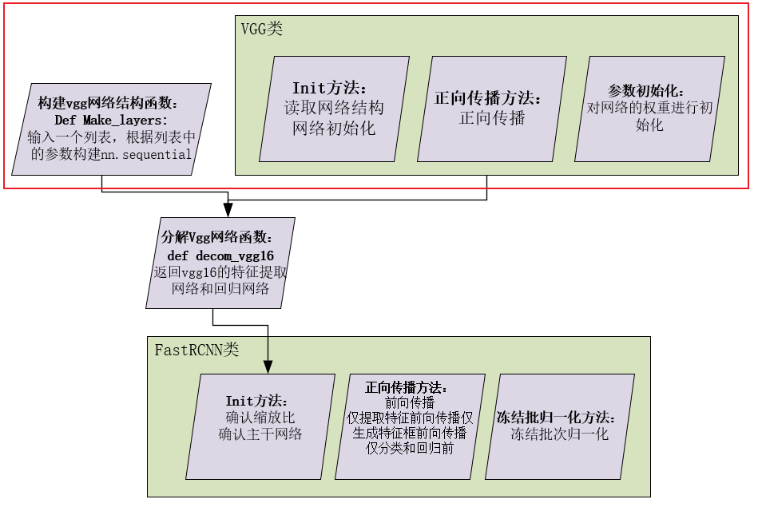

    class VGG(nn.Module):
        def __init__(self, features, num_classes=1000, init_weights=True):
            super(VGG, self).__init__()
            self.features = features
            self.avgpool = nn.AdaptiveAvgPool2d((7, 7))
            self.classifier = nn.Sequential(
                nn.Linear(512 * 7 * 7, 4096),
                nn.ReLU(True),
                nn.Dropout(),
                nn.Linear(4096, 4096),
                nn.ReLU(True),
                nn.Dropout(),
                nn.Linear(4096, num_classes),
            )
            if init_weights:
                self._initialize_weights()

        def forward(self, x):
            x = self.features(x)
            x = self.avgpool(x)
            x = torch.flatten(x, 1)
            x = self.classifier(x)
            return x

        def _initialize_weights(self):
            for m in self.modules():
                if isinstance(m, nn.Conv2d):
                    nn.init.kaiming_normal_(m.weight, mode='fan_out', nonlinearity='relu')
                    if m.bias is not None:
                        nn.init.constant_(m.bias, 0)
                elif isinstance(m, nn.BatchNorm2d):
                    nn.init.constant_(m.weight, 1)
                    nn.init.constant_(m.bias, 0)
                elif isinstance(m, nn.Linear):
                    nn.init.normal_(m.weight, 0, 0.01)
                    nn.init.constant_(m.bias, 0)

    '''
    假设输入图像为(600, 600, 3)，随着cfg的循环，特征层变化如下：
    600,600,3 -> 600,600,64 -> 600,600,64 -> 300,300,64 -> 300,300,128 -> 300,300,128 -> 
    150,150,128 -> 150,150,256 -> 150,150,256 -> 150,150,256 -> 75,75,256 -> 75,75,512 -> 
    75,75,512 -> 75,75,512 -> 37,37,512 ->  37,37,512 -> 37,37,512 -> 37,37,512
    到cfg结束，我们获得了一个37,37,512的特征层
    '''

        cfg = [64, 64, 'M', 128, 128, 'M', 256, 256, 256, 'M', 512, 512, 512, 'M', 512, 512, 512, 'M']
        def make_layers(cfg, batch_norm=False):
            layers = []
            in_channels = 3
            for v in cfg:
                if v == 'M':
                    layers += [nn.MaxPool2d(kernel_size=2, stride=2)]
                else:
                    conv2d = nn.Conv2d(in_channels, v, kernel_size=3, padding=1)
                    if batch_norm:
                        layers += [conv2d, nn.BatchNorm2d(v), nn.ReLU(inplace=True)]
                    else:
                        layers += [conv2d, nn.ReLU(inplace=True)]
                    in_channels = v
            return nn.Sequential(*layers)

        class VGG(nn.Module):
            def __init__(self, features, num_classes=1000, init_weights=True):
                super(VGG, self).__init__()
                self.features = features
                self.avgpool = nn.AdaptiveAvgPool2d((7, 7))
                self.classifier = nn.Sequential(
                    nn.Linear(512 * 7 * 7, 4096),
                    nn.ReLU(True),
                    nn.Dropout(),
                    nn.Linear(4096, 4096),
                    nn.ReLU(True),
                    nn.Dropout(),
                    nn.Linear(4096, num_classes),
                )
                if init_weights:
                    self._initialize_weights()

            def forward(self, x):
                x = self.features(x)
                x = self.avgpool(x)
                x = torch.flatten(x, 1)
                x = self.classifier(x)
                return x

            def _initialize_weights(self):
                for m in self.modules():
                    if isinstance(m, nn.Conv2d):
                        nn.init.kaiming_normal_(m.weight, mode='fan_out', nonlinearity='relu')
                        if m.bias is not None:
                            nn.init.constant_(m.bias, 0)
                    elif isinstance(m, nn.BatchNorm2d):
                        nn.init.constant_(m.weight, 1)
                        nn.init.constant_(m.bias, 0)
                    elif isinstance(m, nn.Linear):
                        nn.init.normal_(m.weight, 0, 0.01)
                        nn.init.constant_(m.bias, 0)

### Res-net模块

接下来是Res-net网络相关的函数，这个函数返回Res-net网络的特征提取部分和回归部分

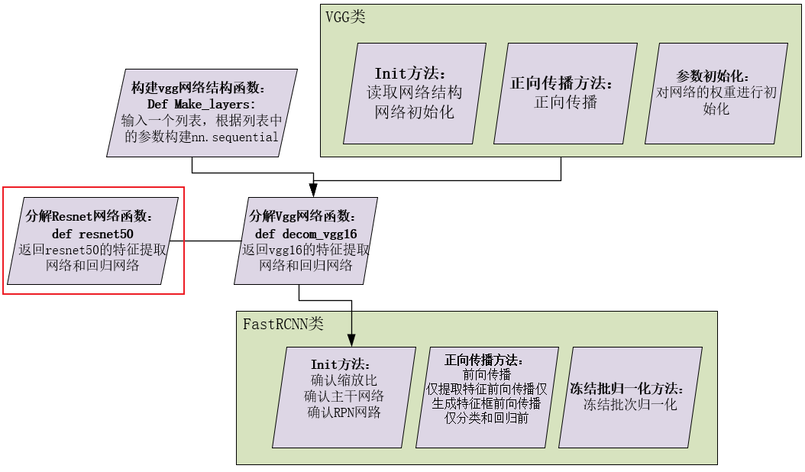

    def resnet50(pretrained = False):
        model = ResNet(Bottleneck, [3, 4, 6, 3])
        if pretrained:
            state_dict = load_state_dict_from_url("https://download.pytorch.org/models/resnet50-19c8e357.pth", model_dir="./model_data")
            model.load_state_dict(state_dict)
        #----------------------------------------------------------------------------#
        #   获取特征提取部分，从conv1到model.layer3，最终获得一个38,38,1024的特征层
        #----------------------------------------------------------------------------#
        features    = list([model.conv1, model.bn1, model.relu, model.maxpool, model.layer1, model.layer2, model.layer3])
        #----------------------------------------------------------------------------#
        #   获取分类部分，从model.layer4到model.avgpool
        #----------------------------------------------------------------------------#
        classifier  = list([model.layer4, model.avgpool])
        
        features    = nn.Sequential(*features)
        classifier  = nn.Sequential(*classifier)
        return features, classifier

在resnet50这方法中需要两个依赖，一个是ResNet类，一个是Bottleneck类，这两个类用于构建网络，这方面的理论知识在[ResNet（点击进入）](/ai/image_classification/resnet)这篇博客中有讲过，不记得的话可以去看一下，这里我直接列出代码，不做过多解释。

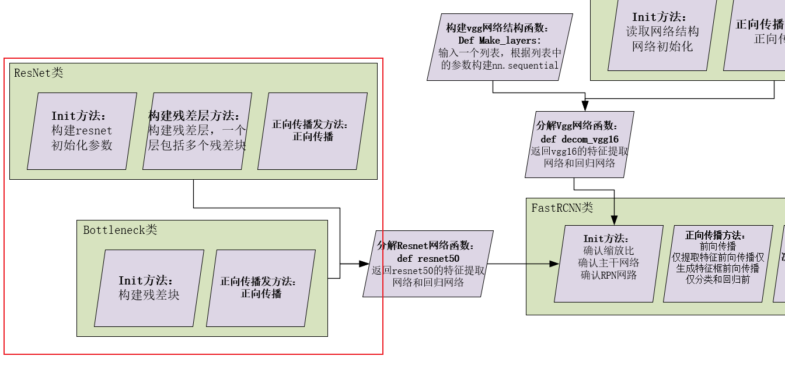

    class Bottleneck(nn.Module):
        expansion = 4
        def __init__(self, inplanes, planes, stride=1, downsample=None):
            super(Bottleneck, self).__init__()
            self.conv1 = nn.Conv2d(inplanes, planes, kernel_size=1, stride=stride, bias=False)
            self.bn1 = nn.BatchNorm2d(planes)

            self.conv2 = nn.Conv2d(planes, planes, kernel_size=3, stride=1, padding=1, bias=False)
            self.bn2 = nn.BatchNorm2d(planes)

            self.conv3 = nn.Conv2d(planes, planes * 4, kernel_size=1, bias=False)
            self.bn3 = nn.BatchNorm2d(planes * 4)

            self.relu = nn.ReLU(inplace=True)
            self.downsample = downsample
            self.stride = stride

        def forward(self, x):
            residual = x

            out = self.conv1(x)
            out = self.bn1(out)
            out = self.relu(out)

            out = self.conv2(out)
            out = self.bn2(out)
            out = self.relu(out)

            out = self.conv3(out)
            out = self.bn3(out)
            if self.downsample is not None:
                residual = self.downsample(x)

            out += residual
            out = self.relu(out)

            return out

    class ResNet(nn.Module):
        def __init__(self, block, layers, num_classes=1000):
            #-----------------------------------#
            #   假设输入进来的图片是600,600,3
            #-----------------------------------#
            self.inplanes = 64
            super(ResNet, self).__init__()

            # 600,600,3 -> 300,300,64
            self.conv1 = nn.Conv2d(3, 64, kernel_size=7, stride=2, padding=3, bias=False)
            self.bn1 = nn.BatchNorm2d(64)
            self.relu = nn.ReLU(inplace=True)

            # 300,300,64 -> 150,150,64
            self.maxpool = nn.MaxPool2d(kernel_size=3, stride=2, padding=0, ceil_mode=True)

            # 150,150,64 -> 150,150,256
            self.layer1 = self._make_layer(block, 64, layers[0])
            # 150,150,256 -> 75,75,512
            self.layer2 = self._make_layer(block, 128, layers[1], stride=2)
            # 75,75,512 -> 38,38,1024 到这里可以获得一个38,38,1024的共享特征层
            self.layer3 = self._make_layer(block, 256, layers[2], stride=2)
            # self.layer4被用在classifier模型中
            self.layer4 = self._make_layer(block, 512, layers[3], stride=2)
            
            self.avgpool = nn.AvgPool2d(7)
            self.fc = nn.Linear(512 * block.expansion, num_classes)

            for m in self.modules():
                if isinstance(m, nn.Conv2d):
                    n = m.kernel_size[0] * m.kernel_size[1] * m.out_channels
                    m.weight.data.normal_(0, math.sqrt(2. / n))
                elif isinstance(m, nn.BatchNorm2d):
                    m.weight.data.fill_(1)
                    m.bias.data.zero_()

        def _make_layer(self, block, planes, blocks, stride=1):
            downsample = None
            #-------------------------------------------------------------------#
            #   当模型需要进行高和宽的压缩的时候，就需要用到残差边的downsample
            #-------------------------------------------------------------------#
            if stride != 1 or self.inplanes != planes * block.expansion:
                downsample = nn.Sequential(
                    nn.Conv2d(self.inplanes, planes * block.expansion,kernel_size=1, stride=stride, bias=False),
                    nn.BatchNorm2d(planes * block.expansion),
                )
            layers = []
            layers.append(block(self.inplanes, planes, stride, downsample))
            self.inplanes = planes * block.expansion
            for i in range(1, blocks):
                layers.append(block(self.inplanes, planes))
            return nn.Sequential(*layers)

        def forward(self, x):
            x = self.conv1(x)
            x = self.bn1(x)
            x = self.relu(x)
            x = self.maxpool(x)

            x = self.layer1(x)
            x = self.layer2(x)
            x = self.layer3(x)
            x = self.layer4(x)

            x = self.avgpool(x)
            x = x.view(x.size(0), -1)
            x = self.fc(x)
            return x

### RPN类

在FastRCNN中，用到了RPN类，用来生成候选区域，在init方法中初始化网络结构，生成基础先验框，进行特征整合和预测是否为背景，然后生成建议框。     

我们在之前的图中添加对应部分：

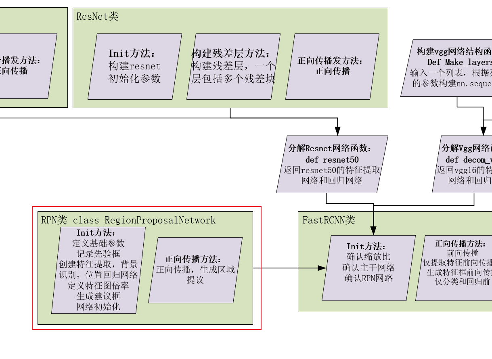

    class RegionProposalNetwork(nn.Module):
        def __init__(
            self, 
            in_channels     = 512, 
            mid_channels    = 512, 
            ratios          = [0.5, 1, 2],
            anchor_scales   = [8, 16, 32], 
            feat_stride     = 16,
            mode            = "training",
        ):
            super(RegionProposalNetwork, self).__init__()
            self.anchor_base    = generate_anchor_base(anchor_scales = anchor_scales, ratios = ratios)#生成基础先验框
            n_anchor            = self.anchor_base.shape[0]#记录基础先验框数量

            self.conv1  = nn.Conv2d(in_channels, mid_channels, 3, 1, 1)#特征再提取
            self.score  = nn.Conv2d(mid_channels, n_anchor * 2, 1, 1, 0)#背景识别
            self.loc    = nn.Conv2d(mid_channels, n_anchor * 4, 1, 1, 0)#位置回归
            
            self.feat_stride    = feat_stride#图像特征缩放倍率

            self.proposal_layer = ProposalCreator(mode)#先验框生成建议框类
            
            #下，网络初始化
            normal_init(self.conv1, 0, 0.01)
            normal_init(self.score, 0, 0.01)
            normal_init(self.loc, 0, 0.01)

        def forward(self, x, img_size, scale=1.):
            n, _, h, w = x.shape
            x = F.relu(self.conv1(x))
            
            rpn_locs = self.loc(x)#位置回归
            rpn_locs = rpn_locs.permute(0, 2, 3, 1).contiguous().view(n, -1, 4)
            rpn_scores = self.score(x)#背景回归
            rpn_scores = rpn_scores.permute(0, 2, 3, 1).contiguous().view(n, -1, 2)
    
            rpn_softmax_scores  = F.softmax(rpn_scores, dim=-1)#背景回归结果
            rpn_fg_scores       = rpn_softmax_scores[:, :, 1].contiguous()#获取soft的第一个值，用于判断
            rpn_fg_scores       = rpn_fg_scores.view(n, -1)#重新调整形状

            # 下：传入四个值（九个框的相对位置，特征图缩放比例，特征图宽，特征图高），获取所有的锚框位置
            anchor = _enumerate_shifted_anchor(np.array(self.anchor_base), self.feat_stride, h, w)
            rois        = list()
            roi_indices = list()
            for i in range(n):  # 对于每个批次进行循环
                roi         = self.proposal_layer(rpn_locs[i], rpn_fg_scores[i], anchor, img_size, scale = scale)#生成建议区域
                batch_index = i * torch.ones((len(roi),))
                rois.append(roi.unsqueeze(0))
                roi_indices.append(batch_index.unsqueeze(0))

            rois        = torch.cat(rois, dim=0).type_as(x)
            roi_indices = torch.cat(roi_indices, dim=0).type_as(x)
            anchor      = torch.from_numpy(anchor).unsqueeze(0).float().to(x.device)
            
            return rpn_locs, rpn_scores, rois, roi_indices, anchor

在RPN类中一共用到了以下的依赖generate_anchor_base，ProposalCreator，normal_init，_enumerate_shifted_anchor，proposal_layer，接下来我分解解释一下这几个依赖是干什么用的

>>generate_anchor_base：这个函数用于生成基础的锚框（anchor boxes），锚框是在图像上固定尺寸和长宽比的矩形框，用于在不同位置和尺度上提议目标区域。在RPN中，锚框被用来生成候选区域。
>
>>ProposalCreator：这个类用于根据RPN的输出（位置回归值和背景分类得分）和生成的锚框，生成最终的建议区域（Region of Interest, RoI）。ProposalCreator类实现了选择和筛选RoI的逻辑，通常会结合非极大值抑制（Non-Maximum Suppression, NMS）等技术来生成最终的RoI。
>
>>normal_init：这个函数用于对神经网络模型的参数进行初始化，通常是通过正态分布随机初始化参数的值。在RPN中，参数的初始化对模型的收敛速度和性能有重要影响。
>
>>_enumerate_shifted_anchor：这个函数用于生成所有可能的锚框位置，根据基础的锚框、特征图的步幅和特征图的大小来确定每个锚框在图像中的具体位置。
>

接下来我们依次构造上面这些依赖：

#### generate_anchor_base()：

首先我们构建基础锚框函数generate_anchor_base()：

    def generate_anchor_base(base_size=16, ratios=[0.5, 1, 2], anchor_scales=[8, 16, 32]):
        anchor_base = np.zeros((len(ratios) * len(anchor_scales), 4), dtype=np.float32)
        for i in range(len(ratios)):
            for j in range(len(anchor_scales)):
                h = base_size * anchor_scales[j] * np.sqrt(ratios[i])
                w = base_size * anchor_scales[j] * np.sqrt(1. / ratios[i])

                index = i * len(anchor_scales) + j
                anchor_base[index, 0] = - h / 2.
                anchor_base[index, 1] = - w / 2.
                anchor_base[index, 2] = h / 2.
                anchor_base[index, 3] = w / 2.
        return anchor_base

这个函数最后的输出如下图所示：

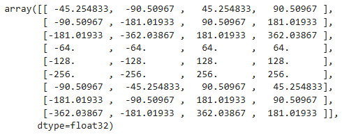

这个函数的输出就是一系列四维数组，四个值分别对应x1x2y1y2的偏移值。

#### normal_init():
这个函数用于对神经网络模型的参数进行初始化，通常是通过正态分布随机初始化参数的值。在RPN中，参数的初始化对模型的收敛速度和性能有重要影响。

输入要初始化的层，均值，方差，然后函数就会根据我们的设置将层进行初始化

    def normal_init(m, mean, stddev, truncated=False):
        if truncated:
            m.weight.data.normal_().fmod_(2).mul_(stddev).add_(mean)  # not a perfect approximation
        else:
            m.weight.data.normal_(mean, stddev)
            m.bias.data.zero_()

#### _enumerate_shifted_anchor():

_enumerate_shifted_anchor：这个函数用于生成所有可能的锚框位置，根据基础的锚框、特征图的步幅和特征图的大小来确定每个锚框在图像中的具体位置。

def _enumerate_shifted_anchor(anchor_base, feat_stride, height, width):
    #---------------------------------#
    #   计算网格中心点
    #---------------------------------#
    shift_x             = np.arange(0, width * feat_stride, feat_stride)
    shift_y             = np.arange(0, height * feat_stride, feat_stride)
    shift_x, shift_y    = np.meshgrid(shift_x, shift_y)
    shift               = np.stack((shift_x.ravel(), shift_y.ravel(), shift_x.ravel(), shift_y.ravel(),), axis=1)

    #---------------------------------#
    #   每个网格点上的9个先验框
    #---------------------------------#
    A       = anchor_base.shape[0]
    K       = shift.shape[0]
    anchor  = anchor_base.reshape((1, A, 4)) + shift.reshape((K, 1, 4))
    #---------------------------------#
    #   所有的先验框
    #---------------------------------#
    anchor  = anchor.reshape((K * A, 4)).astype(np.float32)
    return anchor

#### ProposalCreator:

根据RPN的输出（位置回归值和背景分类得分）和生成的锚框，生成最终的建议区域（Region of Interest, RoI）。

    class ProposalCreator():
        def __init__(
            self, 
            mode, 
            nms_iou             = 0.7,
            n_train_pre_nms     = 12000,
            n_train_post_nms    = 600,
            n_test_pre_nms      = 3000,
            n_test_post_nms     = 300,
            min_size            = 16
        
        ):

            self.mode               = mode
            self.nms_iou            = nms_iou
            self.n_train_pre_nms    = n_train_pre_nms
            self.n_train_post_nms   = n_train_post_nms

            self.n_test_pre_nms     = n_test_pre_nms
            self.n_test_post_nms    = n_test_post_nms
            self.min_size           = min_size

        def __call__(self, loc, score, anchor, img_size, scale=1.):
            if self.mode == "training":
                n_pre_nms   = self.n_train_pre_nms
                n_post_nms  = self.n_train_post_nms
            else:
                n_pre_nms   = self.n_test_pre_nms
                n_post_nms  = self.n_test_post_nms

            roi[:, [0, 2]] = torch.clamp(roi[:, [0, 2]], min = 0, max = img_size[1])
            roi[:, [1, 3]] = torch.clamp(roi[:, [1, 3]], min = 0, max = img_size[0])
            

            min_size    = self.min_size * scale
            keep        = torch.where(((roi[:, 2] - roi[:, 0]) >= min_size) & ((roi[:, 3] - roi[:, 1]) >= min_size))[0]

            roi         = roi[keep, :]
            score       = score[keep]

            order       = torch.argsort(score, descending=True)
            if n_pre_nms > 0:
                order   = order[:n_pre_nms]
            roi     = roi[order, :]
            score   = score[order]

            keep    = nms(roi, score, self.nms_iou)
            if len(keep) < n_post_nms:
                index_extra = np.random.choice(range(len(keep)), size=(n_post_nms - len(keep)), replace=True)
                keep        = torch.cat([keep, keep[index_extra]])
            keep    = keep[:n_post_nms]
            roi     = roi[keep]
            return roi

这次我们在原图中添加了下面这些部分：

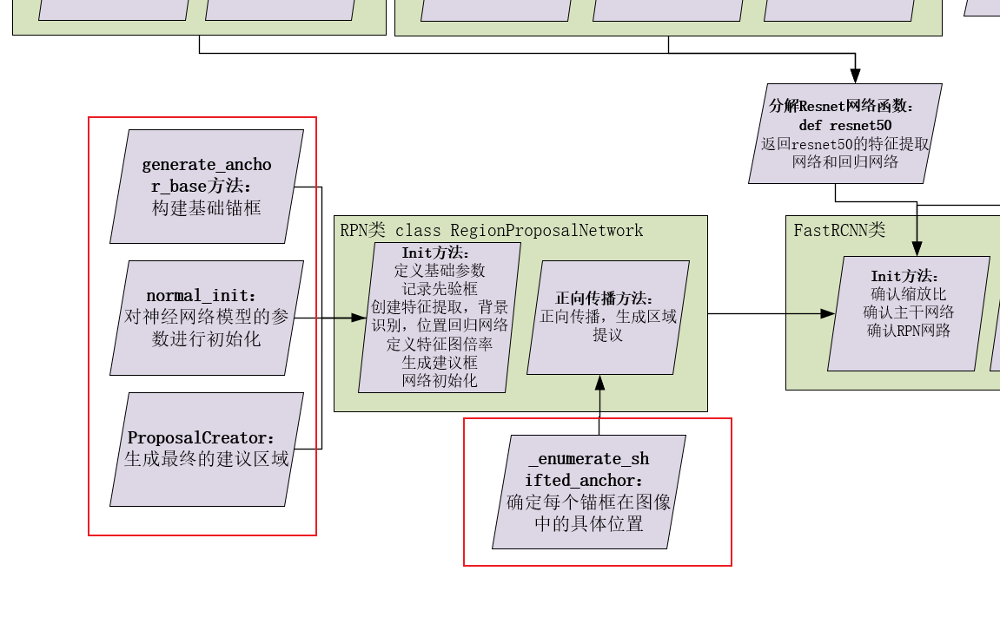

### head类
接下来是Faster RCNN中的两个最终分类函数，分别是使用vgg的最终分类函数和resnet50的最终分类函数：

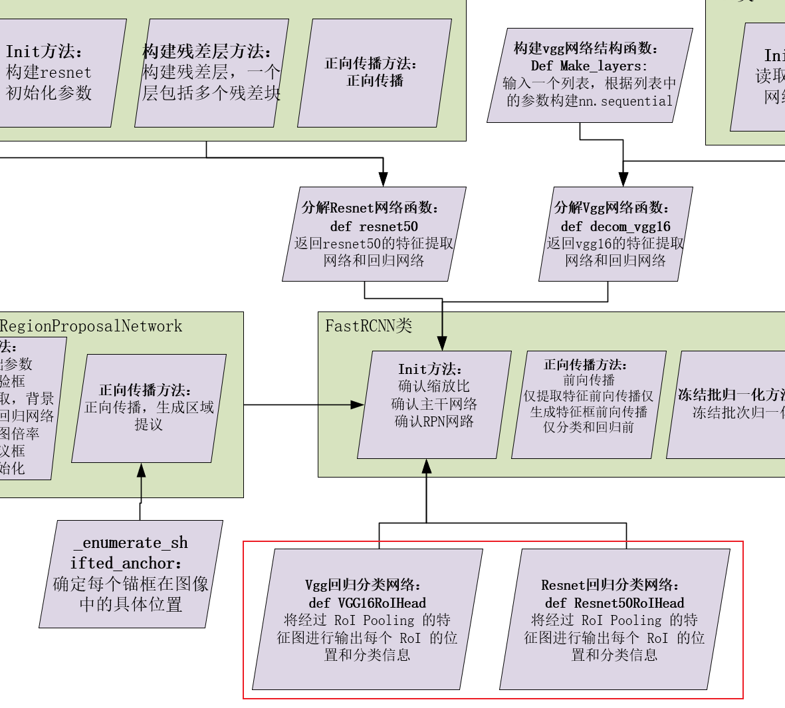

这两个函数也很简单，这里步过多解释：

    class VGG16RoIHead(nn.Module):
        def __init__(self, n_class, roi_size, spatial_scale, classifier):
            super(VGG16RoIHead, self).__init__()
            self.classifier = classifier
            #--------------------------------------#
            #   对ROIPooling后的的结果进行回归预测
            #--------------------------------------#
            self.cls_loc    = nn.Linear(4096, n_class * 4)
            #-----------------------------------#
            #   对ROIPooling后的的结果进行分类
            #-----------------------------------#
            self.score      = nn.Linear(4096, n_class)
            #-----------------------------------#
            #   权值初始化
            #-----------------------------------#
            normal_init(self.cls_loc, 0, 0.001)
            normal_init(self.score, 0, 0.01)

            self.roi = RoIPool((roi_size, roi_size), spatial_scale)
            
        def forward(self, x, rois, roi_indices, img_size):
            n, _, _, _ = x.shape
            if x.is_cuda:
                roi_indices = roi_indices.cuda()
                rois = rois.cuda()
            rois        = torch.flatten(rois, 0, 1)
            roi_indices = torch.flatten(roi_indices, 0, 1)

            rois_feature_map = torch.zeros_like(rois)
            rois_feature_map[:, [0,2]] = rois[:, [0,2]] / img_size[1] * x.size()[3]
            rois_feature_map[:, [1,3]] = rois[:, [1,3]] / img_size[0] * x.size()[2]

            indices_and_rois = torch.cat([roi_indices[:, None], rois_feature_map], dim=1)
            #-----------------------------------#
            #   利用建议框对公用特征层进行截取
            #-----------------------------------#
            pool = self.roi(x, indices_and_rois)
            #-----------------------------------#
            #   利用classifier网络进行特征提取
            #-----------------------------------#
            pool = pool.view(pool.size(0), -1)
            #--------------------------------------------------------------#
            #   当输入为一张图片的时候，这里获得的f7的shape为[300, 4096]
            #--------------------------------------------------------------#
            fc7 = self.classifier(pool)

            roi_cls_locs    = self.cls_loc(fc7)
            roi_scores      = self.score(fc7)

            roi_cls_locs    = roi_cls_locs.view(n, -1, roi_cls_locs.size(1))
            roi_scores      = roi_scores.view(n, -1, roi_scores.size(1))
            return roi_cls_locs, roi_scores

    class Resnet50RoIHead(nn.Module):
        def __init__(self, n_class, roi_size, spatial_scale, classifier):
            super(Resnet50RoIHead, self).__init__()
            self.classifier = classifier
            #--------------------------------------#
            #   对ROIPooling后的的结果进行回归预测
            #--------------------------------------#
            self.cls_loc = nn.Linear(2048, n_class * 4)
            #-----------------------------------#
            #   对ROIPooling后的的结果进行分类
            #-----------------------------------#
            self.score = nn.Linear(2048, n_class)
            #-----------------------------------#
            #   权值初始化
            #-----------------------------------#
            normal_init(self.cls_loc, 0, 0.001)
            normal_init(self.score, 0, 0.01)

            self.roi = RoIPool((roi_size, roi_size), spatial_scale)

        def forward(self, x, rois, roi_indices, img_size):
            n, _, _, _ = x.shape
            if x.is_cuda:
                roi_indices = roi_indices.cuda()
                rois = rois.cuda()
            rois        = torch.flatten(rois, 0, 1)
            roi_indices = torch.flatten(roi_indices, 0, 1)
            
            rois_feature_map = torch.zeros_like(rois)
            rois_feature_map[:, [0,2]] = rois[:, [0,2]] / img_size[1] * x.size()[3]
            rois_feature_map[:, [1,3]] = rois[:, [1,3]] / img_size[0] * x.size()[2]

            indices_and_rois = torch.cat([roi_indices[:, None], rois_feature_map], dim=1)
            #-----------------------------------#
            #   利用建议框对公用特征层进行截取
            #-----------------------------------#
            pool = self.roi(x, indices_and_rois)
            #-----------------------------------#
            #   利用classifier网络进行特征提取
            #-----------------------------------#
            fc7 = self.classifier(pool)
            #--------------------------------------------------------------#
            #   当输入为一张图片的时候，这里获得的f7的shape为[300, 2048]
            #--------------------------------------------------------------#
            fc7 = fc7.view(fc7.size(0), -1)

            roi_cls_locs    = self.cls_loc(fc7)
            roi_scores      = self.score(fc7)
            roi_cls_locs    = roi_cls_locs.view(n, -1, roi_cls_locs.size(1))
            roi_scores      = roi_scores.view(n, -1, roi_scores.size(1))
            return roi_cls_locs, roi_scores

至此，Faster R-CNN模型构建完成，我们查看一下完整的流程图,可以“右键--新建标签页打开”来查看原图：

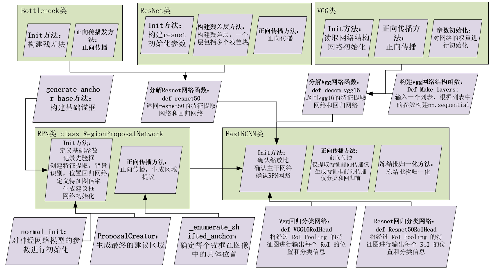

这个过程一遍应该是学不会的，建议反复学习，可以从边缘向中心学习，也可以从中心到边缘学习

## 实现单批次正向传播

接下来我会单批次实现正向传播，并解释每一步的数据变化，这里我们模拟的环境是单类别识别，训练模式，使用vgg16作为主干网络

首先定义以下变量：

    num_classes = 1  #类别
    feat_stride = 16  #缩放比
    anchor_scales=[8,16,31]
    ratios = [0.5,1,2]

    cfg = [64, 64, 'M', 128, 128, 'M', 256, 256, 256, 'M', 512, 512, 512, 'M', 512, 512, 512, 'M']

这个cfg是我们的主干特征提取网络的结构，'M'表示maxpool2d（2，2） 
这里我们可以查看一下这个网络：

    def make_layers(cfg, batch_norm=False):
        layers = []
        in_channels = 3
        for v in cfg:
            if v == 'M':
                layers += [nn.MaxPool2d(kernel_size=2, stride=2)]
            else:
                conv2d = nn.Conv2d(in_channels, v, kernel_size=3, padding=1)
                if batch_norm:
                    layers += [conv2d, nn.BatchNorm2d(v), nn.ReLU(inplace=True)]
                else:
                    layers += [conv2d, nn.ReLU(inplace=True)]
                in_channels = v
        return nn.Sequential(*layers)
    make_layers(cfg)

结果如下，我们观察到这个网络结构和我们cfg里的结构是一样的：

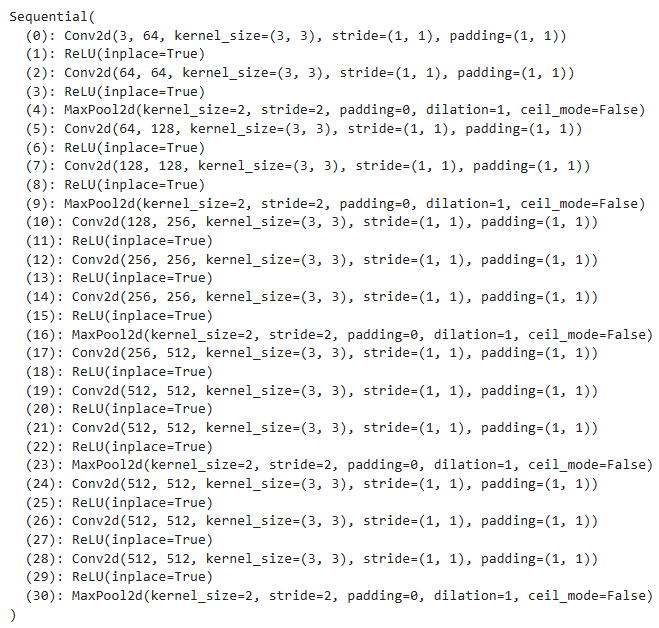

接下来定义vgg类，这里会有详细的解释，首先我们这个模型类有两部分，第一个网络：使用特征提取网络，也就是上面这个图中的网络对图片进行特征提取。这个网络是当参数传入进去的。第二个网络：使用自适应池化，将图像统一成7x7，然后dropout-linear-relu-dropout，最后分类。虽然写在一个类中，但是其实这两个网络最后是要分开的，这个在我们下面的代码中据可以看见

    class VGG(nn.Module):
        def __init__(self, features, num_classes=1000, init_weights=True):
            super(VGG, self).__init__()
            self.features = features
            self.avgpool = nn.AdaptiveAvgPool2d((7, 7))
            self.classifier = nn.Sequential(
                nn.Linear(512 * 7 * 7, 4096),
                nn.ReLU(True),
                nn.Dropout(),
                nn.Linear(4096, 4096),
                nn.ReLU(True),
                nn.Dropout(),
                nn.Linear(4096, num_classes),
            )
            if init_weights:
                self._initialize_weights()

        def forward(self, x):
            x = self.features(x)
            x = self.avgpool(x)
            x = torch.flatten(x, 1)
            x = self.classifier(x)
            return x

        def _initialize_weights(self):
            for m in self.modules():
                if isinstance(m, nn.Conv2d):
                    nn.init.kaiming_normal_(m.weight, mode='fan_out', nonlinearity='relu')
                    if m.bias is not None:
                        nn.init.constant_(m.bias, 0)
                elif isinstance(m, nn.BatchNorm2d):
                    nn.init.constant_(m.weight, 1)
                    nn.init.constant_(m.bias, 0)
                elif isinstance(m, nn.Linear):
                    nn.init.normal_(m.weight, 0, 0.01)
                    nn.init.constant_(m.bias, 0)

接下来我们将特征提取网络传入vgg类，并进行实例化：

    model = VGG(make_layers(cfg),1)
    model

结果如下图所示：红色的是特征提取部分，绿色的是最终分类部分

然后我们将模型分成上述的两部分，一部分用于提取特征，一部分用于后面分类，这里把dropout层删掉，同时把最后一层fc也删掉，这个在最后的时候会加入一层类似的。

    features    = list(model.features)[:30]
    classifier  = list(model.classifier)
    del classifier[6]
    del classifier[5]
    del classifier[2]

    features    = nn.Sequential(*features)
    classifier  = nn.Sequential(*classifier)

此时features就是我们的特征提取网络，classifite是生成候选框后要使用的分类网络。接着我们构建RPN部分

首先是默认的锚框的生成，这个函数记录了我们在遍历原图的时候需要的左上角坐标和右下角坐标的相对位置。

    def generate_anchor_base(base_size=16, ratios=[0.5, 1, 2], anchor_scales=[8, 16, 32]):
        anchor_base = np.zeros((len(ratios) * len(anchor_scales), 4), dtype=np.float32)
        for i in range(len(ratios)):
            for j in range(len(anchor_scales)):
                h = base_size * anchor_scales[j] * np.sqrt(ratios[i])
                w = base_size * anchor_scales[j] * np.sqrt(1. / ratios[i])

                index = i * len(anchor_scales) + j
                anchor_base[index, 0] = - h / 2.
                anchor_base[index, 1] = - w / 2.
                anchor_base[index, 2] = h / 2.
                anchor_base[index, 3] = w / 2.
        return anchor_base

最后的结果如下图所示：

然后构造RegionProposalNetwork类：

    class RegionProposalNetwork(nn.Module):
        def __init__(
            self, 
            in_channels     = 512, 
            mid_channels    = 512, 
            ratios          = [0.5, 1, 2],
            anchor_scales   = [8, 16, 32], 
            feat_stride     = 16,
            mode            = "training",
        ):
            super(RegionProposalNetwork, self).__init__()
            self.anchor_base    = generate_anchor_base(anchor_scales = anchor_scales, ratios = ratios)
            #生成基础先验框

            n_anchor            = self.anchor_base.shape[0]#记录基础先验框数量

            self.conv1  = nn.Conv2d(in_channels, mid_channels, 3, 1, 1)#特征再提取
            #返回的结果是一个512维的特征图

            self.score  = nn.Conv2d(mid_channels, n_anchor * 2, 1, 1, 0)#背景识别
            #输入（b，512，h,w）个维度，输出（b,18（9*2）,h,w）个维度，每两个维度代表一个锚框的背景true/false

            self.loc    = nn.Conv2d(mid_channels, n_anchor * 4, 1, 1, 0)#位置回归
            #输入（b，512，h,w）个维度，输出（b,36（9*4）,h,w）个维度，每两个维度代表一个锚框的背景true/false

            self.feat_stride    = feat_stride#图像特征缩放倍率

            self.proposal_layer = ProposalCreator(mode)#先验框生成建议框类

            #下，网络初始化
            normal_init(self.conv1, 0, 0.01)
            normal_init(self.score, 0, 0.01)
            normal_init(self.loc, 0, 0.01)

        def forward(self, x, img_size, scale=1.):
            n, _, h, w = x.shape
            x = F.relu(self.conv1(x))

            rpn_locs = self.loc(x)#位置回归
            rpn_locs = rpn_locs.permute(0, 2, 3, 1).contiguous().view(n, -1, 4)
            rpn_scores = self.score(x)#背景回归
            rpn_scores = rpn_scores.permute(0, 2, 3, 1).contiguous().view(n, -1, 2)

            rpn_softmax_scores  = F.softmax(rpn_scores, dim=-1)#背景回归结果
            rpn_fg_scores       = rpn_softmax_scores[:, :, 1].contiguous()#获取soft的第一个值，用于判断
            rpn_fg_scores       = rpn_fg_scores.view(n, -1)#重新调整形状

            # 下：传入四个值（九个框的相对位置，特征图缩放比例，特征图宽，特征图高），获取所有的锚框位置
            anchor = _enumerate_shifted_anchor(np.array(self.anchor_base), self.feat_stride, h, w)
            rois        = list()
            roi_indices = list()
            for i in range(n):  # 对于每个批次进行循环
                roi         = self.proposal_layer(rpn_locs[i], rpn_fg_scores[i], anchor, img_size, scale = scale)#生成建议区域
                batch_index = i * torch.ones((len(roi),))
                rois.append(roi.unsqueeze(0))
                roi_indices.append(batch_index.unsqueeze(0))

            rois        = torch.cat(rois, dim=0).type_as(x)
            roi_indices = torch.cat(roi_indices, dim=0).type_as(x)
            anchor      = torch.from_numpy(anchor).unsqueeze(0).float().to(x.device)
            
            return rpn_locs, rpn_scores, rois, roi_indices, anchor

### 数据变化

首先 数据传入经过extractor.forward()进行正向传播，得到的特征图通道数为512，长款为最初的十六分之一
假设最初的特征图是1x3x224x224 经过这个就变成了 1x512x14x14
然后将特征图送入rpn的forward，
首先获取批次大小，通道数，高，宽 分别是 1,512,14,14,
然后经过第一次relu(rpn.conv1(x)),特征图大小不变，1,512,14,14
然后经过一个并行分支

>> 经过rpn.loc(512,36,1,1,0),特征图变成1，36，14，14
>
>> 经过rpn.loc(512,18,1,1,0),特征图变成1，18，14，14

最后经过维度变换，viewrpn_scores.permute(0, 2, 3, 1).contiguous().view(n, -1, 2（还有一个4，并行操作）)最后数据会变成这样

    tensor([[[  1, 101],
        [201, 301],
        [401, 501],
        [601, 701],
        [  2, 102],
        [202, 302],
        [402, 502],
        [602, 702],
        [  3, 103],
        [203, 303],

就是每一个点的每一个框的置信度得分

然后经过回归提取和重新排列就能得到置信度得分
然后将置信度和偏移传入锚框函数，得到锚框位置，锚框函数会保留得分大的框，然后裁剪不合理的框
最后经过一点处理，把锚框和索引返回回去

然后rpn结束，跳回feaster rcnn，使用锚框对特征图进行投影，然后展平，然后进行分类和位置回归。

## 总结

这个算法的核心是RPN建议框提取，内部的索引，数据维度变化等操作让我很难抽象出高维空间的数据的形态变化和位置信息的意义，通过不断打断点和模拟实验，我终于掌握了Faster RCNN的核心思想和算法思路。后续还需要对算法进行加强性回归。**算法代码折磨了我好长时间，但是我很享受这种突破自己思维极限的快感。**