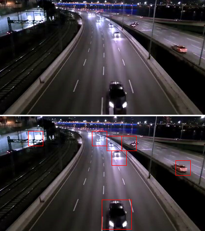

# overfeat
## overfeat简介
overfeat：使用卷积网络进行继承识别，定位和检测，由纽约大学提出了一个使用卷积网络进行分类、定位和检测的集成框架。展示了如何在 ConvNet 中有效地实现多尺度和滑动窗口方法。同时还引入了一种新颖的深度学习方法，通过学习预测对象边界来实现本地化。然后累积而不是抑制边界框，以提高检测置信度。论文表明，使用单个共享网络可以同时学习不同的任务。该集成框架是2013年ImageNet大规模视觉识别挑战赛（ILSVRC2013）定位任务的获胜者，并在检测和分类任务中获得了极具竞争力的结果。在比赛后的工作中，纽约大学从他们最好的模型中发布了一个名为 OverFeat 的特征提取器。

[overfeat论文官方链接(点击查看)](https://arxiv.org/abs/1312.6229)

[overfeat论文pdf链接(点击查看)](http://www.apache2.sanyueyu.top/blog/ai/object_detection/overfeat/overfeat.pdf)

[overfeat中文论文pdf链接(点击查看)（用ai&有道词典翻译的，质量一般）](http://www.apache2.sanyueyu.top/blog/ai/object_detection/overfeat/overfeatcn.pdf)

### 论文简述
传统的物体检测依赖于手工设计特征提取算法，泛用性很差。OverFeat算法整合了分类、定位和检测三个任务，通过使用滑动窗口方式在不同尺度上应用卷积神经网络。该框架使用单个网络在图像分类、定位和检测这三个方向上同时进行训练。利用卷积神经网络在不同任务之间的特征共享特性，提高每个任务的效果。

## 手动实现算法（准备阶段）

    工作化境：
        CPU: I3 10105F （x86_64）
        GPU: ASUS 3060 12G
        RAM: 威刚 DDR4 40G 2666
        主板：MSI B560M-A
        硬盘：WDC SN550 1T

        OS: UBUNTU22.04
        python版本：3.11.7
        torch版本：2.2.1
        jupyter notebook
    数据集：
        本人手动标注的高速公路汽车数据集，使用yolo格式进行标注
        
实验数据集下载[(点击此处下载)](http://www.apache2.sanyueyu.top/dataset/daolu.tar.gz)

首先 使用plt观察一下我们的数据
    #读取图片
    from PIL import Image,ImageDraw
    image=Image.open('../dataset/daolu/images/train/frame_10740.jpg')
    draw = ImageDraw.Draw(image)
    image.show()

    #读取标记
    with open('../dataset/daolu/labels/train/frame_10740.txt','r') as f:
    lines = f.readlines()

    #查看标记后的图片
    for line in lines:
    label = line.split()
    class_id = int(label[0])
    x_center = float(label[1]) * image.width
    y_center = float(label[2]) * image.height
    width = float(label[3]) * image.width
    height = float(label[4]) * image.height
    # 计算左上角和右下角坐标
    x_min = int(x_center - width / 2)
    y_min = int(y_center - height / 2)
    x_max = int(x_center + width / 2)
    y_max = int(y_center + height / 2)
    # 绘制边框
    draw.rectangle([(x_min, y_min), (x_max, y_max)], outline='red')
    # 显示图像
    image.show()

## 手动实现算法（动手阶段）
### 分类实现--划分数据集

    #工具定义
    import os
    def get_filenames(path):
        #获取图片名和标签名
        image_names = os.listdir(path)
        label_names = [x.split('.')[0]+'.txt' for x in image_names]
        return image_names,label_names
    
    def split_image(image_name,label_name,path1,path2):
        #分割图片里的数据
        image_data = os.path.join(path1,image_name)
        label_data = os.path.join(path2,label_name)
        image = Image.open(image_data)
        with open(label_data, 'r') as f:
            lines = f.readlines()
        sub_images = []
        for line in lines:
            label = line.split()
            x_center = float(label[1]) * image.width
            y_center = float(label[2]) * image.height
            width = float(label[3]) * image.width
            height = float(label[4]) * image.height
        
            # 计算左上角和右下角坐标
            x_min = int(x_center - width / 2)
            y_min = int(y_center - height / 2)
            x_max = int(x_center + width / 2)
            y_max = int(y_center + height / 2)
        
            # 分割图片
            sub_image = image.crop((x_min, y_min, x_max, y_max))
            sub_image = sub_image.resize((120, 120))
            sub_images.append(sub_image)
        return sub_images
上面两个函数用于读取文件名和划分图片中的标注数据，接下来我们把标注的数据从图片中取出来

    #验证集数据和标签
    val_image,val_label = get_filenames('../dataset/daolu/images/val/')
    val_list = []
    for i,j in zip(val_image,val_label):
        val_list+=split_image(i,j,'../dataset/daolu/images/val/','../dataset/daolu/labels/val/')
    val_label = [1]*len(val_list)
    #训练集数据和标签
    image_list,label_list = get_filenames('../dataset/daolu/images/train/')
    train_list = []
    for i,j in zip(image_list,label_list):
        train_list+=split_image(i,j,'../dataset/daolu/images/train/','../dataset/daolu/labels/train/')
    train_label = [1]*len(train_list)
    #构建训练集负样本
    def negative_sample(image,x1,x2,y1,y2,step_size,w1,w2):
        负样本切割函数
        for y in range(y1, y2, step_size):
            for x in range(x1, x2, step_size):
                # 从原始图像中裁剪出窗口大小的图像
                window = image.crop((x, y, x + w1, y + w2))
                test_dataset = transform(window)
                no_list.append(window)
    #加入负样本
    from torchvision import transforms
    transform = transforms.Compose([
        transforms.Resize((120, 120)),  
        transforms.ToTensor() 
    ])
    val_path = '../dataset/daolu/images/val/'
    val_file = os.path.join(val_path,val_image[0])
    val_data = Image.open(val_file)
    window_size = (120, 120)
    step_size = 10
    no_list = []
    img_width, img_height = val_data.size
    negative_sample(val_data,0,img_width - window_size[0],0, img_height - window_size[1],step_size,window_size[0],window_size[1])
    val_path = '../dataset/daolu/images/train/'
    val_file = os.path.join(val_path,image_list[52])
    val_data = Image.open(val_file)
    img_width, img_height = val_data.size
    window_list = [[120,120],[80,80],[30,30]]
    for i in window_list:
        window_size = (i[0],i[1])
        negative_sample(val_data,0,img_width - window_size[0],0, img_height - window_size[1],step_size,window_size[0],window_size[1])
    window_size = (50, 50)
    negative_sample(val_data,0,int(img_width/2) - window_size[0],0, img_height - window_size[1],step_size,window_size[0],window_size[1])
    for i in [[50,50],[25,25]]:
        window_size = (i[0],i[1])
        negative_sample(val_data,0,img_width - window_size[0],0, 30,step_size,window_size[0],window_size[1])
    #将负样本加入训练集
    train_list += no_list
    train_label += [0]*len(no_list)

然后我们可以检查一下图像是否分割成功了，如下图所示，可以看到我们的'车'已经被切割出来了

### 分类实现--模型构建

    import torch
    from torchvision import transforms
    from torchvision import datasets
    from torch.utils.data import DataLoader
    import torch.nn.functional as F
    import torch.optim as optim

    # 检查是否有可用的GPU
    if torch.cuda.is_available():
        # 获取GPU设备数量
        device_count = torch.cuda.device_count()
        print(f"发现 {device_count} 个可用的GPU 设备")
        # 获取每个GPU的名称
        for i in range(device_count):
            print(f"GPU 设备 {i}: {torch.cuda.get_device_name(i)}")
    else:
        print("没有发现可用的GPU")

检查算力平台gpu情况，结果如下

    #创建数据集类
    from torch.utils.data import DataLoader, Dataset
    class CarDataset(Dataset):
        def __init__(self, data, targets, transform=None):
            self.data = data
            self.targets = targets
            self.transform = transform

        def __len__(self):
            return len(self.data)

        def __getitem__(self, index):
            x = self.data[index]
            y = self.targets[index]
            if self.transform:
                x = self.transform(x)
            return x, y
    
    #创建transform类，将数据变成tensor，并且创建数据加载器
    transform = transforms.Compose([
        transforms.Resize((120, 120)),  
        transforms.ToTensor() 
    ])
    train_dataset = CarDataset(train_list, train_label,transform=transform)
    val_dataset = CarDataset(val_list, val_label,transform=transform)

    train_loader = DataLoader(train_dataset, batch_size=512, shuffle=True)
    val_loader = DataLoader(val_dataset, batch_size=512, shuffle=False)

这里的训练批次自行根据算力平台的运算能力进行调整，接下来构建CNN模型

    import torch.nn as nn
    # 定义CNN模型
    class CarCNN(nn.Module):
        def __init__(self):
            super(CarCNN, self).__init__()
            self.conv1 = nn.Conv2d(3, 16, 3, padding=1)
            self.pool = nn.MaxPool2d(2, 2)
            self.conv2 = nn.Conv2d(16, 32, 3, padding=1)
            self.conv3 = nn.Conv2d(32, 64, 3, padding=1)
            self.fc0 = nn.Linear(64*15*15,512)
            self.fc1 = nn.Linear(512, 128)
            self.fc2 = nn.Linear(128, 32)
            self.fc3 = nn.Linear(32,4)
            self.fc4 = nn.Linear(4,1)
            self.sigmoid = nn.Sigmoid()

        def forward(self, x):
            x = self.pool(F.relu(self.conv1(x)))
            x = self.pool(F.relu(self.conv2(x)))
            x = self.pool(F.relu(self.conv3(x)))
            x = x.view(-1, 64 * 15 * 15)
            x = F.relu(self.fc0(x))
            x = F.relu(self.fc1(x))
            x = F.relu(self.fc2(x))
            x = F.relu(self.fc3(x))
            x = self.sigmoid(self.fc4(x))
            return x
    #迁移模型
    model=CarCNN()
    device = torch.device("cuda:0")
    model.to(device)

模型结构如下图所示

接下来定义损失和优化器，构建训练和测试函数

    criterion = nn.MSELoss()#这里使用均方差损失
    optimizer = optim.Adam(model.parameters(), lr=0.0001)
    loss_list = []

    def train(epoch):
        running_loss = 0.0
        correct = 0
        total = 0
        for i, data in enumerate(train_loader, 0):
            inputs, labels = data
            labels = labels.float()
            inputs, labels = inputs.to(device), labels.to(device)
            optimizer.zero_grad()
            outputs = model(inputs)
            outputs = outputs.view(-1)
            loss = criterion(outputs, labels)
            loss.backward()
            optimizer.step()
            running_loss += loss.item()
            
            # 计算训练集准确率
            predicted = (outputs > 0.8).float()  # 使用阈值0.5将输出转换为0或1
            total += labels.size(0)
            correct += (predicted == labels).sum().item()
        loss_list.append(running_loss)
        print(f"train Epoch {epoch+1}, Loss: {running_loss / len(train_loader)}, Accuracy: {(correct/total)*100:.2f}%")

    def val(epoch):
        running_loss = 0.0
        correct = 0
        total = 0
        for i, data in enumerate(val_loader, 0):
            inputs, labels = data
            labels = labels.float()
            inputs, labels = inputs.to(device), labels.to(device)
            outputs = model(inputs)
            outputs = outputs.view(-1)
            loss = criterion(outputs, labels)
            running_loss += loss.item()
            
            # 计算验证集准确率
            predicted = (outputs > 0.8).float()  # 使用阈值0.5将输出转换为0或1
            total += labels.size(0)
            correct += (predicted == labels).sum().item()

        print(f"val Epoch {epoch+1}, Loss: {running_loss / len(val_loader)}, Accuracy: {(correct/total)*100:.2f}%")

执行训练函数
    for epoch in range(2000):
        train(epoch)
        # val(epoch)

观察输出，发现梯度下降的还不错

使用plt查看损失的变化情况

    import matplotlib.pyplot as plt
    plt.plot(loss_list)
    plt.ylim(0, 2)
    plt.show()

损失图像如下

保存模型到本地

    torch.save(model, 'carmodel.pth')

### 定位实现--滑动窗口分类

构建滑动窗口函数

    def test_windows(val_data,y1,y2,x1,x2,step_size,window_size,outputs=0.99):
        for y in range(y1, y2, step_size):
            for x in range(x1, x2, step_size):
                # 从原始图像中裁剪出窗口大小的图像
                window = val_data.crop((x, y, x + window_size[0], y + window_size[1]))
                test_dataset = transform(window)
                test_dataset = test_dataset.to(device)
                outputs = model(test_dataset)
                if outputs > 0.99:
                    draw_list.append([x, y, x + window_size[0], y + window_size[1]])

使用滑动窗口对输入图像进行划分和预测

    val_path = '../dataset/daolu/images/val/'
    val_file = os.path.join(val_path,val_image[0])
    val_data = Image.open(val_file)
    val_data.show()# 定义窗口大小和步长
    # window_size = (80, 80)
    window_size = (30, 30)
    step_size = 10
    # 获取图像的尺寸
    img_width, img_height = val_data.size
    draw_list = []
    test_windows(val_data,0, img_height - window_size[1],0, img_width - window_size[0],step_size,window_size)
    window_size = (60, 60)
    test_windows(val_data,0, img_height - window_size[1],0, img_width - window_size[0],step_size,window_size)
    for i in draw_list:
        draw.rectangle((i[0], i[1], i[2], i[3]), outline="red", width=1)

    val_data.show()

这次我们发现，新画出来的边框就更加符合我们预期的结果

结果如下图所示，可以看到检测框有很多重叠的地方，接下来我们采用非极大值抑制算法对窗口进行筛选

### 定位实现--非极大值抑制算法筛选

    #非极大值抑制算法
    def calculate_iou(box1, box2):
        # 计算两个边界框的交集部分的坐标
        x1 = max(box1[0], box2[0])
        y1 = max(box1[1], box2[1])
        x2 = min(box1[2], box2[2])
        y2 = min(box1[3], box2[3])

        # 计算交集部分的面积
        intersection_area = max(0, x2 - x1 + 1) * max(0, y2 - y1 + 1)

        # 计算两个边界框的面积
        area_box1 = (box1[2] - box1[0] + 1) * (box1[3] - box1[1] + 1)
        area_box2 = (box2[2] - box2[0] + 1) * (box2[3] - box2[1] + 1)

        # 计算并返回重叠面积
        iou = intersection_area / float(area_box1 + area_box2 - intersection_area)
        return iou

    def non_max_suppression(boxes, scores, threshold):
        # 将边界框和置信度按照置信度降序排列
        sorted_indices = scores.argsort()[::-1]
        sorted_boxes = boxes[sorted_indices]
        sorted_scores = scores[sorted_indices]

        selected_indices = []
        while len(sorted_indices) > 0:
            # 选择置信度最高的边界框
            selected_index = sorted_indices[0]
            selected_indices.append(selected_index)

            # 计算当前边界框与其他边界框的重叠面积
            current_box = sorted_boxes[0]
            ious = [calculate_iou(current_box, box) for box in sorted_boxes[1:]]

            # 保留与当前边界框重叠面积小于阈值的边界框
            indices_to_keep = np.where(np.array(ious) <= threshold)[0]
            sorted_indices = sorted_indices[indices_to_keep + 1]
            sorted_boxes = sorted_boxes[indices_to_keep + 1]
            sorted_scores = sorted_scores[indices_to_keep + 1]

        return selected_indices

更新我们的预测算法，在进行滑动窗口检测后，使用非极大值抑制算法对窗口进行筛选，如下所示

    val_path = '../dataset/daolu/images/val/'
    val_file = os.path.join(val_path,val_image[0])
    val_data = Image.open(val_file)
    val_data.show()# 定义窗口大小和步长
    window_size = (60, 60)
    # window_size = (80, 80)
    window_size = (30, 30)
    step_size = 10
    # 获取图像的尺寸
    img_width, img_height = val_data.size
    draw_list = []
    draw = ImageDraw.Draw(val_data)
    test_windows(val_data,0, img_height - window_size[1],0, img_width - window_size[0],step_size,window_size)
    window_size = (60, 60)
    test_windows(val_data,0, img_height - window_size[1],0, img_width - window_size[0],step_size,window_size)

    boxes = np.array([[x1, y1, x2, y2] for x1, y1, x2, y2 in draw_list])  # 边界框的坐标信息，格式为[x1, y1, x2, y2]
    scores = np.array([outputs.item() for _ in draw_list]) 
    threshold = 0.2  # 非极大值抑制的阈值

    selected_indices = non_max_suppression(boxes, scores, threshold)

    # 根据选中的边界框索引绘制边界框
    for index in selected_indices:
        box = boxes[index]
        draw.rectangle((box[0], box[1], box[2], box[3]), outline="red", width=1)
    val_data.show()

## 总结

算法优化策略：

>增加训练集的规模，增加网络复杂度，减小滑动窗口的间距，增加滑动窗口的尺度类型可以有效提升overfeat的结果精度

算法缺点：
>overfeat采用多尺度滑动窗口策略，需要对原图片进行大量的裁剪卷积池化等操作，计算资源消耗大，运行速度慢

>对于小尺物体的识别效果不好

>训练需要的数据量很大

在当前的ai科学生态中，overfeat是一个比较老的目标检测算法，实用性远不及新产生的目标检测算法，但是熟悉overfeat对于我理解目标检测这一领域具有很大的帮助