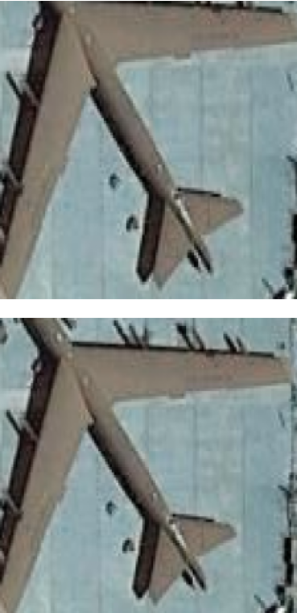
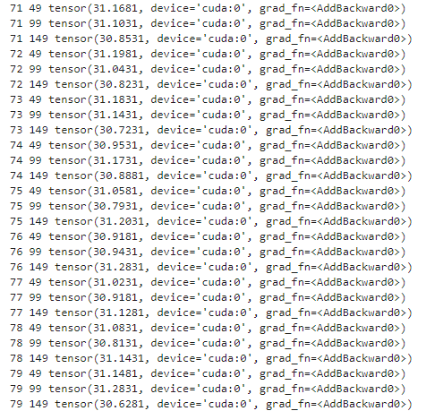
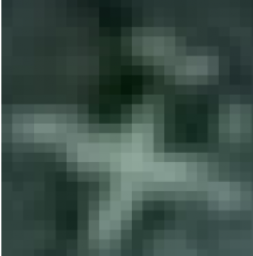
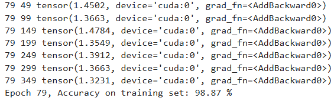
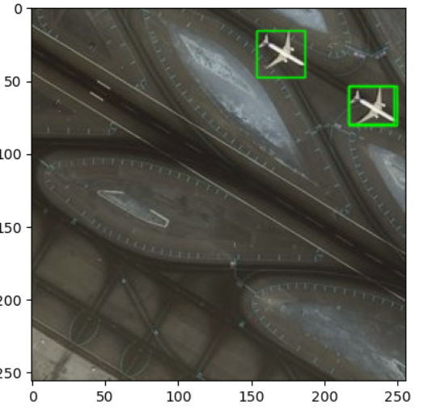

# RCNN
## RCNN概述

[RCNN论文官方链接(点击查看)](http://xxx.itp.ac.cn/abs/1311.2524)

[RCNN论文备用链接(点击查看)](http://www.apache2.sanyueyu.top/blog/ai/image_classification/googlenet/GoogLeNet_v1.pdf)

下面中文论文中有些图片分辨率太低了，图片方面可以参考上面备用链接里的图片，而且GoogLeNet的论文写的巨抽象，大概是因为我见识浅薄，读起来很吃力

[RCNN论文中文pdf链接(点击查看)（本人翻译能力和手段有限，可以看看别人写的）](http://www.apache2.sanyueyu.top/blog/ai/image_classification/googlenet/GoogLeNet_v1cn.pdf)

### 背景

当时比较主流的目标检测算法都是多个模型融合，比较复杂，也没有创新性，所以当时作者就提出了rcnn

### 方法

核心内容:使用cnn来定位object，提出了有监督的预训练，当标签数据较少的时候，可以在imagenet上进行有监督的预训练，然后进行目标检测迁移训练，可以获得较大的性能提升，后来的研究表明，只要增加训练时长也可以获得较好的性能。

其他内容：
展示network学习到的图像特征层次结构，并对cnn进行消融实验，分析rcnn的主要问题是poor localization，并通过（边界框回归）解决。同时给出了rcnn在各个任务上的性能

### 效能

在目标检测方面，在voc2012数据集上mAP达到了53.3%，比之前SOTA高出30%以上

在语义分割方面，在voc2011上的accuracy达到47.9

### 不足

要求图像的size是固定的

训练分三步，首先训练卷积网络，然后训练svm，然后训练bbox regressor

训练耗时耗空间

检测速度满，使用vgg进行detection时，每张图片要检测四十秒以上

## RCNN流程

首先使用selective search算法生成大概2000个region proposal 
接着通过affine image warping将这些region proposal的尺寸统一到固定size(227x227) 
然后将名美国人region proposal和原图片输入到alexNet，获得每个region proposal对应的feature vector（4096维）
然后把每个feature vector分别输入到多个线性svm（每个class对应一个线性svm，判断是否属于该class），注意：classification和regression并行
最后对所有scored region进行greedy NMS,每个class的box独立进行

### region proposals（生成可能包含目标对象的区域）

思路：为每个image生成2000个左右category-independent region proposal（独立类别区域建议）

方法：文本使用selective search（fast mode），也可以使用任意的其他方法

selective search（选择搜索）的大概思路：先将图片分割成很多小区域，然后按照一定规则合并相邻的两个区域，抑制合并到只剩一个区域，整个过程中存在过的所有区域就是selective search的结果

### feature extraction（特征提取）

思路：使用alexnet为每个region proposal生成一个4096维的feature vector

affine image warping（仿射图像扭曲）：作用：使输入到Alexnet的每个region proposal的size都为227x227，以匹配alexnet的要求

方法：不管proposal（提案）的size 和aspect ratio（长宽比）是多少，都将其扭曲到所需size，在wrap之前扩张proposal box，是wrao之后原始proposal box周围正好有p（16）个上下文像素

### classification

每个class都有一个对应了linear SVM涌来判断是否为该class，使用每个SVM对每个featurevector进行score

feature matrix：2000x4096，SVM weight matrix：4096xN（N为class的数量）

即使有100K个class，matrix multiplication在当时的多核CPU上也只需要跑十秒

## 代码实现

首先要安装完整的opencv库，在终端输入以下命令：

>pip install opencv-contrib-python

或者使用清华源

>pip install opencv-contrib-python -i https://pypi.tuna.tsinghua.edu.cn/simple

我们这次使用的是一个机场的数据集，检测飞机的位置，数据集下载路径我后面会更新

首先我们导包，设置文件路径

    # 导入库
    import os
    import cv2
    import pandas as pd
    import matplotlib.pyplot as plt
    import numpy as np
    #图片文件夹和csv的文件夹
    path = "./airplane_dataset/Images"
    annot = "./airplane_dataset/Airplanes_Annotations"

然后我们记录目标位置，设置正样本和负样本（因为二分类不能全是正样本，不然模型非常没用随便输入一张图片都会识别成正样本），这里样本的生成是使用cv2的搜索框建议算法生成的，具体的内容在上面特征提取部分有介绍，下面的代码首先读取事先准备好的标注，然后依次读取opencv生成的候选框，对于每个样本读取30个正样本（ioU>0.7）和三十个负样本（ioU<0.3）

    train_images=[]#x
    train_labels=[]#y
    #定义bb1和bb2的iou
    def get_iou(bb1, bb2):
        assert bb1['x1'] < bb1['x2']
        assert bb1['y1'] < bb1['y2']
        assert bb2['x1'] < bb2['x2']
        assert bb2['y1'] < bb2['y2']

        x_left = max(bb1['x1'], bb2['x1'])
        y_top = max(bb1['y1'], bb2['y1'])
        x_right = min(bb1['x2'], bb2['x2'])
        y_bottom = min(bb1['y2'], bb2['y2'])

        if x_right < x_left or y_bottom < y_top:
            return 0.0

        intersection_area = (x_right - x_left) * (y_bottom - y_top)

        bb1_area = (bb1['x2'] - bb1['x1']) * (bb1['y2'] - bb1['y1'])
        bb2_area = (bb2['x2'] - bb2['x1']) * (bb2['y2'] - bb2['y1'])

        iou = intersection_area / float(bb1_area + bb2_area - intersection_area)
        assert iou >= 0.0
        assert iou <= 1.0
        return iou
    ss = cv2.ximgproc.segmentation.createSelectiveSearchSegmentation()
    for e,i in enumerate(os.listdir(annot)):
        try:
            if i.startswith("airplane"):
                filename = i.split(".")[0]+".jpg"
                print(e,filename)
    #             读入图片
                image = cv2.imread(os.path.join(path,filename))
    #            读入目标框的位置信息
                df = pd.read_csv(os.path.join(annot,i))
                gtvalues=[]
    #           将框加入到gtvalues,将目标框保存下来
                for row in df.iterrows():
                    x1 = int(row[1][0].split(" ")[0])
                    y1 = int(row[1][0].split(" ")[1])
                    x2 = int(row[1][0].split(" ")[2])
                    y2 = int(row[1][0].split(" ")[3])
                    gtvalues.append({"x1":x1,"x2":x2,"y1":y1,"y2":y2})
    #         将这张图片进行选择性搜索,得到候选框
                ss.setBaseImage(image)#向生成框算法提交图像
                ss.switchToSelectiveSearchFast()#选择快速模式
                ssresults = ss.process()#进行生成框搜索
                imout = image.copy()#复制当前图像
                counter = 0 #记录有效候选框数量
                falsecounter = 0 #记录无效候选框数量
                flag = 0 
                fflag = 0
                bflag = 0
    #             遍历这张图片所有的候选框
                for e,result in enumerate(ssresults):
                    # print('e,result:',e,result)
    #             因为约2k个候选框，多余不要^_^
                    if e < 2000 and flag == 0:
    #                     遍历目标物体框
                        for gtval in gtvalues:
                            x,y,w,h = result
    #                       得到候选框和目标框的iou
                            iou = get_iou(gtval,{"x1":x,"x2":x+w,"y1":y,"y2":y+h})
    #                       一处物体只要30个
                            if counter < 30:
    #                             候选框和目标框重合度高，认为ok
    #                             加入训练集的图片
                                if iou > 0.70:
                                    timage = imout[y:y+h,x:x+w]
    #                               interpolation插值方法
                                    resized = cv2.resize(timage, (224,224), interpolation = cv2.INTER_AREA)
                                    train_images.append(resized)
                                    #这个框的图片是飞机
                                    train_labels.append(1)
                                    counter += 1
                            else :
                                fflag =1
                            if falsecounter <30:
                                if iou < 0.3:
                                    timage = imout[y:y+h,x:x+w]
                                    resized = cv2.resize(timage, (224,224), interpolation = cv2.INTER_AREA)
                                    train_images.append(resized)
                                    #这个框的图片不是飞机
                                    train_labels.append(0)
                                    falsecounter += 1
                            else :
                                bflag = 1
                        if fflag == 1 and bflag == 1:
                            print("inside")
                            flag = 1
        except Exception as e:
            print(e)
            print("error in "+filename)
            continue
    #得到x和y
    X_new = np.array(train_images)
    y_new = np.array(train_labels)

对数据进行一下预处理，方便训练

    import torch
    X_new=torch.from_numpy(X_new)
    y_new=torch.from_numpy(y_new)
    print(X_new.shape,y_new.shape)
    # 只检测图片中是否有飞机
    #因为torch接受(b,c,w,h),所以更改维度
    X_new=X_new.transpose(3,1)
    import torch
    from torch import nn
    from torchvision.models import vgg16

观察一下正样本，看看够不够正

import numpy as np
import matplotlib.pyplot as plt

for i in range(0,100):
    if int(y_new[i]) == 1:
        # 将图片数据转换为numpy数组
        image = X_new[i].numpy().transpose(1, 2, 0)  # 调整维度顺序，从(c, w, h)到(w, h, c)
        
        # 将数据缩放到0-1范围
        image = image / 255.0
        
        # 显示图片
        plt.imshow(image)
        plt.axis('off')  # 关闭坐标轴
        plt.show()

结果如下,可以看出飞机被划出来了：

然后定义分类器，数据集类实例化，损失函数等，以便于对飞机进行分类，这里我们不定义冻结参数，让他训练的更深入：

    vgg=vgg16(pretrained=True)
    #冻结参数进行训练
    # for p in vgg.parameters():
    #     p.requires_grad=False

    # vgg16的输入为224x224
    class Mynet(nn.Module):
        def __init__(self):
            super(Mynet, self).__init__()
            self.vgg=vgg
            #下面都是线性分类层
            self.fc1=nn.Linear(1000,256)
            self.fc2=nn.Linear(256,10)
            self.fc3=nn.Linear(10,2)
            self.relu=nn.ReLU()
            self.softmax=nn.Softmax(dim=1)
        def forward(self,x):
            x=vgg(x)
            x=self.relu(self.fc1(x))
            x = self.relu(self.fc2(x))
            x = self.softmax(self.fc3(x))
            return x

    from torch.utils.data import TensorDataset,DataLoader
    dataset=TensorDataset(X_new,y_new)
    dataloader=DataLoader(dataset=dataset,
                        batch_size=200,
                        shuffle=True,
                        num_workers=0)

    net=Mynet()
    device = torch.device("cuda:0")
    net.to(device)

    optimizer=torch.optim.Adam(net.parameters(),lr=0.001)
    criterion=nn.CrossEntropyLoss()

    for j in range(100):
        running_loss = 0.0
        for i,(x,y) in enumerate(dataloader):
            x, y = x.to(device), y.to(device)
            pred=net(x.to(torch.float32))
            loss1 = criterion(pred,y)  # 计算损失值
            running_loss += loss1
            optimizer.zero_grad()
            loss1.backward()                    # loss反向传播
            optimizer.step()      # 反向传播后参数更新 
            if i%50 == 49:
                print(j,i,running_loss)
                running_loss = 0.0

查看训练情况，发现训练的并不好根据我们的定义，最初损失在31左右，经过八十轮训练结果还是31左右：

最后的测试函数，使用cv2对文本进行

    z=0
    for e1,i in enumerate(os.listdir(path)):
    #.  z==1为了早点结束
        if(z==1):
            break
        if i.startswith("428481"):
            z += 1
            img = cv2.imread(os.path.join(path,i))
            ss.setBaseImage(img)
            ss.switchToSelectiveSearchFast()
            ssresults = ss.process()
            imout = img.copy()
            for e,result in enumerate(ssresults):
            #.  同样e==50为了早点结束
                if(e==50):
                    break
                if e < 2000:
                    x,y,w,h = result
                    timage = imout[y:y+h,x:x+w]
                    resized = cv2.resize(timage, (224,224), interpolation = cv2.INTER_AREA)
                    img = np.expand_dims(resized, axis=0)
                    img=torch.from_numpy(img)
                    img=img.transpose(3,1)
                    # print(e,img.shape)
                    img=img.to(device)
                    out= net(img.to(torch.float32))
                    # print(out)
                    # print(F.softmax(out)[0][0])
                if F.softmax(out)[0][1] > 0.5:
                        cv2.rectangle(imout, (x, y), (x+w, y+h), (0, 255, 0), 1, cv2.LINE_AA)
            plt.figure()
            plt.imshow(imout)

这里我推测是没有经过批次归一化导致的，因为我通过观察发现有的飞机非常抽象，比如下图所示：

我们换一种特征提取方法，这里使用resnet进行特征提取 

    #首先定义resnet网络
    import torch.nn as nn
    class resBlock(nn.Module):
        def __init__(self,in_channels,out_channels,stride=1):
            super().__init__()
            self.conv1 = nn.Conv2d(in_channels,out_channels,3,stride,1)
            self.bn1 = nn.BatchNorm2d(out_channels)
            self.conv2 = nn.Conv2d(out_channels,out_channels,3,1,1)
            self.bn2 = nn.BatchNorm2d(out_channels)
            if stride != 1 or in_channels != out_channels:
                self.conv_down = nn.Conv2d(in_channels, out_channels, 1, stride=stride, padding=0)
                self.bn3 = nn.BatchNorm2d(out_channels)
        def forward(self,x):
            inputs = x
            x = F.relu(self.bn1(self.conv1(x)))
            x = self.bn2(self.conv2(x))
            if self.conv_down is not None:
                inputs = self.bn3(self.conv_down(inputs))
            out = x + inputs
            out = F.relu(out)
            return out

    class resNet(nn.Module):
        def __init__(self):
            super().__init__()
            self.res1 = resBlock(3,20)
            self.res2 = resBlock(20,40,2)
            self.res3 = resBlock(40,60,2)
            self.res4 = resBlock(60,80,2)
            self.res5 = resBlock(80,100,2)
            self.fc = nn.Linear(19600,10)
            self.fc1 = nn.Linear(10,2)
        def forward(self,x):
            batch_size = x.shape[0]
            x = self.res1(x)
            x = self.res2(x)
            x = self.res3(x)
            x = self.res4(x)
            x = self.res5(x)
            x = self.fc(x.view(batch_size,-1))
            x = self.fc1(x)
            return x
    #实例化网络
    net=resNet()
    device = torch.device("cuda:0")
    net.to(device)
    #定义损失函数和优化器
    optimizer=torch.optim.Adam(net.parameters(),lr=0.00001)
    criterion=nn.CrossEntropyLoss()

    #进行训练
    for j in range(500):
        running_loss = 0.0
        for i, (x, y) in enumerate(dataloader):
            x, y = x.to(device), y.to(device)
            pred = net(x.to(torch.float32))
            loss1 = criterion(pred, y)
            running_loss += loss1
            optimizer.zero_grad()
            loss1.backward()
            optimizer.step()
            
            if i % 50 == 49:
                print(j, i, running_loss)
                running_loss = 0.0
                
            # 计算当前轮次的准确率
            correct = 0
            total = 0
        if j%5==4:
            with torch.no_grad():
                for data in dataloader:
                    images, labels = data
                    images = images.float()
                    images, labels = images.to(device), labels.to(device)
                    outputs = net(images)
                    _, predicted = torch.max(outputs.data, 1)
                    total += labels.size(0)
                    correct += (predicted == labels).sum().item()

            accuracy = 100 * correct / total
            print('Epoch %d, Accuracy on training set: %.2f %%' % (j, accuracy))

使用resnet之后，收敛的明显快了很多，最后训练集准确率达到98%的时候我停止了训练

然后我们随便挑一张图片进行预测，首先使用ss算法生成候选框，然后对候选框中的内容进行识别

    z=0
    for e1,i in enumerate(os.listdir(path)):
    #.  z==1为了早点结束
        if(z==1):
            break
        if i.startswith("428481"):
            z += 1
            img = cv2.imread(os.path.join(path,i))
            ss.setBaseImage(img)
            ss.switchToSelectiveSearchFast()
            ssresults = ss.process()
            imout = img.copy()
            for e,result in enumerate(ssresults):
            #.  同样e==50为了早点结束
                if(e==50):
                    break
                if e < 2000:
                    x,y,w,h = result
                    timage = imout[y:y+h,x:x+w]
                    resized = cv2.resize(timage, (224,224), interpolation = cv2.INTER_AREA)
                    img = np.expand_dims(resized, axis=0)
                    img=torch.from_numpy(img)
                    img=img.transpose(3,1)
                    # print(e,img.shape)
                    img=img.to(device)
                    out= net(img.to(torch.float32))
                    # print(out)
                    # print(F.softmax(out)[0][0])
                if F.softmax(out)[0][1] > 0.5:
                        cv2.rectangle(imout, (x, y), (x+w, y+h), (0, 255, 0), 1, cv2.LINE_AA)
            plt.figure()
            plt.imshow(imout)

最后的结果如下，可以看到效果还是蛮不错的,后续如果使用以下非极大值抑制就更完美了。

