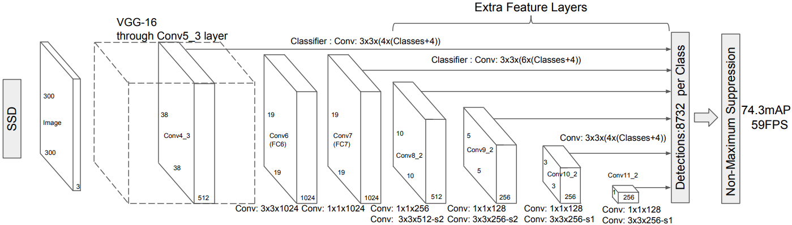
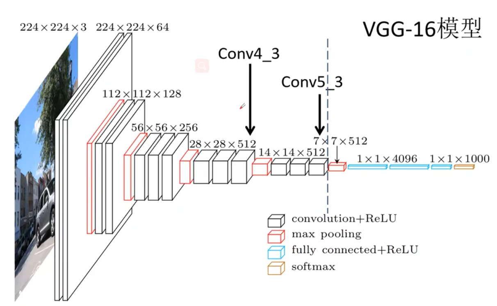
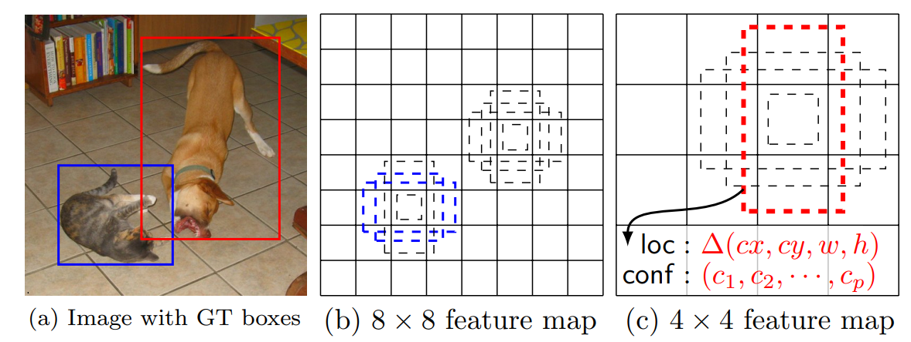
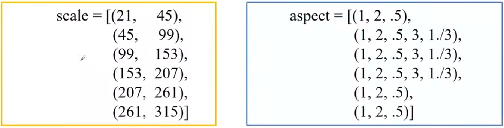
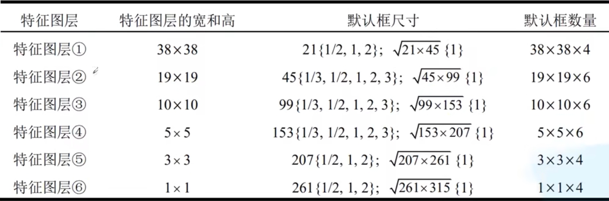
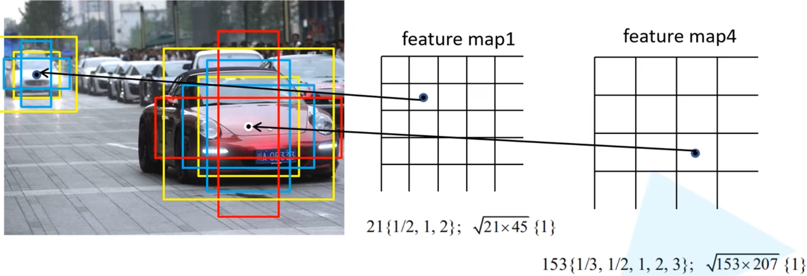
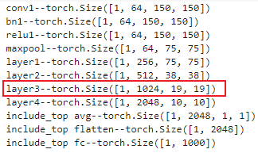

# SSD
## SSD简介

[SSD论文官方链接(点击查看)](http://xxx.itp.ac.cn/abs/1512.02325)

[SSD论文pdf链接(点击查看)](http://www.apache2.sanyueyu.top/blog/ai/object_detection/SSD/SSD.pdf)

[SSD中文论文pdf链接(点击查看)（用ai&有道词典翻译的，质量一般）](http://www.apache2.sanyueyu.top/blog/ai/object_detection/SSD/SSDcn.pdf)

SSD算法是作者wei liu 在ECCV2016上发表的论文，对于输入尺寸300x300的网络，使用nvidia titanx在voc2007的测试集上达到了74.3%map以及59fps。

SSD算法通过单次前向传播来同时预测物体的位置和类别，因而得名“Single Shot”。它在不同尺度的特征图上进行检测，能够有效地处理不同大小的物体。

SSD论文中使用的是VGG16作为特征提取器。然后通过添加额外卷积层来生成不同尺度的特征图，用来检测不同大小的物体。

我们先来回归一下SSD的前辈FasterRCNN存在的问题，首先是对小目标检测效果很差，FasterRCNN在生成候选框的时候，会使用一个超参数控制目标框的最小值，这样会丢失那些比较小的目标，同时FasterRCNN的模型较大，检测速度相比SSD也比较慢，ssd在一定程度上解决了这个问题。

## 原理

接下来我们看一下SSD论文中提供的网络模型图：

这张图直观展示了SSD算法的网络框架，首先输入是一个300x300的rgb图像，然后将图像输入VGG16网络，但是只要Conv5_3之前的部分（如下图所示），然后将vgg的Conv4_3作为SSD的第一个特征预测层。然后将Conv5_3后面的池化层改为3x3-s1来保证特征图大小不变，后续的结构如上面的结构图所示，挑选后四个卷积组结果来作为后续的特征预测层。

我们会根据预测特征层来预测不同大小的目标，越靠前的预测特征层检测到的目标越小，因为越靠前的预测特征层的感受野越小，这里可以看一下论文中给的示例图：

同时论文中给出了每个特征预测锚框的大小，长宽比分别包括1:1,1:2,2:1,3:1,1:3等，如下图所示：

在scale中给了两个参数，第一个参数用于计算锚框，第二个参数用于计算1x1比例的外锚框，计算公式是根号（第一个参数x第二个参数）

最后一共生成8732个框用于预测。我们用下面这张图片更直观查看这个default box：

最后的分类回归过程和FasterRCNN类似，这里就不过多赘述了。

## 代码复现

这里我们使用resnet50作为主要特征提取网络来使用SSD

### ResNet模块

首先是ResNet模块,这块的代码在[resnet（点击进入）](/ai/image_classification/resnet)这篇博客中有详细解释,这里不过多赘述：

    class Bottleneck(nn.Module):
        expansion = 4

        def __init__(self, in_channel, out_channel, stride=1, downsample=None):
            super(Bottleneck, self).__init__()
            self.conv1 = nn.Conv2d(in_channels=in_channel, out_channels=out_channel,
                                kernel_size=1, stride=1, bias=False)  # squeeze channels
            self.bn1 = nn.BatchNorm2d(out_channel)
            # -----------------------------------------
            self.conv2 = nn.Conv2d(in_channels=out_channel, out_channels=out_channel,
                                kernel_size=3, stride=stride, bias=False, padding=1)
            self.bn2 = nn.BatchNorm2d(out_channel)
            # -----------------------------------------
            self.conv3 = nn.Conv2d(in_channels=out_channel, out_channels=out_channel*self.expansion,
                                kernel_size=1, stride=1, bias=False)  # unsqueeze channels
            self.bn3 = nn.BatchNorm2d(out_channel*self.expansion)
            self.relu = nn.ReLU(inplace=True)
            self.downsample = downsample

        def forward(self, x):
            identity = x
            if self.downsample is not None:
                identity = self.downsample(x)

            out = self.conv1(x)
            out = self.bn1(out)
            out = self.relu(out)

            out = self.conv2(out)
            out = self.bn2(out)
            out = self.relu(out)

            out = self.conv3(out)
            out = self.bn3(out)

            out += identity
            out = self.relu(out)

            return out

    class ResNet(nn.Module):

        def __init__(self, block, blocks_num, num_classes=1000, include_top=True):
            
            '''
            Args:
                block: 残差块类型 
                blocks_num: 残差块数量列表
                num_classes: 输出类别
                include_top: 是否包含全连接层
            '''
            super(ResNet, self).__init__()
            self.include_top = include_top
            self.in_channel = 64

            self.conv1 = nn.Conv2d(3, self.in_channel, kernel_size=7, stride=2,
                                padding=3, bias=False)
            self.bn1 = nn.BatchNorm2d(self.in_channel)
            self.relu = nn.ReLU(inplace=True)
            self.maxpool = nn.MaxPool2d(kernel_size=3, stride=2, padding=1)
            self.layer1 = self._make_layer(block, 64, blocks_num[0])
            self.layer2 = self._make_layer(block, 128, blocks_num[1], stride=2)
            self.layer3 = self._make_layer(block, 256, blocks_num[2], stride=2)
            self.layer4 = self._make_layer(block, 512, blocks_num[3], stride=2)
            if self.include_top:
                self.avgpool = nn.AdaptiveAvgPool2d((1, 1))  # output size = (1, 1)
                self.fc = nn.Linear(512 * block.expansion, num_classes)

            for m in self.modules():#初始化权重
                if isinstance(m, nn.Conv2d):
                    nn.init.kaiming_normal_(m.weight, mode='fan_out', nonlinearity='relu')
        def _make_layer(self, block, channel, block_num, stride=1):
            downsample = None
            if stride != 1 or self.in_channel != channel * block.expansion:#如果步长不为1或通道数不等于通道x扩展银子
                downsample = nn.Sequential(
                    nn.Conv2d(self.in_channel, channel * block.expansion, kernel_size=1, stride=stride, bias=False),
                    nn.BatchNorm2d(channel * block.expansion))

            layers = []
            layers.append(block(self.in_channel, channel, downsample=downsample, stride=stride))
            self.in_channel = channel * block.expansion
            for _ in range(1, block_num):
                layers.append(block(self.in_channel, channel))
            return nn.Sequential(*layers)

        def forward(self, x):
            x = self.conv1(x)
            x = self.bn1(x)
            x = self.relu(x)
            x = self.maxpool(x)

            x = self.layer1(x)
            x = self.layer2(x)
            x = self.layer3(x)
            x = self.layer4(x)

            if self.include_top:
                x = self.avgpool(x)
                x = torch.flatten(x, 1)
                x = self.fc(x)
            return x

    def resnet50(num_classes=1000, include_top=True):
        return ResNet(Bottleneck, [3, 4, 6, 3], num_classes=num_classes, include_top=include_top)

这里我做了一个小实验来查看Resnet50输入300x300时每层的输出大小，我们直接看结果，这里的layer3的步长后面我们会改成1，这里记一下：

### 骨干网络部分

骨干网络主要负责带哦用resnet网络，修改步长，生成新的特征提取网络

    class Backbone(nn.Module):
        def __init__(self, pretrain_path=None):
            super(Backbone, self).__init__()
            net = resnet50()
            self.out_channels = [1024, 512, 512, 256, 256, 256]

            if pretrain_path is not None:
                net.load_state_dict(torch.load(pretrain_path))

            self.feature_extractor = nn.Sequential(*list(net.children())[:7])

            conv4_block1 = self.feature_extractor[-1][0]

            # 修改conv4_block1的步距，从2->1
            conv4_block1.conv1.stride = (1, 1)
            conv4_block1.conv2.stride = (1, 1)
            conv4_block1.downsample[0].stride = (1, 1)

        def forward(self, x):
            x = self.feature_extractor(x)
            return x

这个代码构造函数的中后部份将layer3的步长改成了1，这样特征图的h和w就和layer2的输出一样了，为38x38

### SSD类

SSD包括以下几个部分：

构造函数：构造函数负责调用resnet50和后续卷积特征提取曾，以及锚框和损失函数

额外卷积函数：构造后续的卷积层用于特征提取

初始化函数：负责初始化权重

特征提取函数：负责使用特征图，位置提取器和置信度提取器对特征图进行信息提取，进行排序和格式转换之后方便后续使用

正向传播函数：负责模型的推理

    class SSD300(nn.Module):
        def __init__(self, backbone=None, num_classes=21):
            '''
            Args:
                backbone: 特征提取网络，默认是Backbone
                num_classes: 类别，包括背景
            '''
            super(SSD300, self).__init__()
            if backbone is None:
                raise Exception("backbone is None")
            if not hasattr(backbone, "out_channels"):
                raise Exception("the backbone not has attribute: out_channel")
            self.feature_extractor = backbone  # 这是特征提取部分
            self.num_classes = num_classes  # 这是类别数量，默认是20，包括背景就是21
            # out_channels = [1024, 512, 512, 256, 256, 256] for resnet50
            self._build_additional_features(self.feature_extractor.out_channels)
            self.num_defaults = [4, 6, 6, 6, 4, 4]
            location_extractors = []
            confidence_extractors = []

            # out_channels = [1024, 512, 512, 256, 256, 256] for resnet50
            for nd, oc in zip(self.num_defaults, self.feature_extractor.out_channels):
                # nd is number_default_boxes, oc is output_channel
                location_extractors.append(nn.Conv2d(oc, nd * 4, kernel_size=3, padding=1))
                confidence_extractors.append(nn.Conv2d(oc, nd * self.num_classes, kernel_size=3, padding=1))
                
                
            self.loc = nn.ModuleList(location_extractors)#这个用于位置框回归
            self.conf = nn.ModuleList(confidence_extractors)#这个用于类别回归
            self._init_weights()#权重初始化

            default_box = dboxes300_coco()
            self.compute_loss = Loss(default_box)#损失函数
            self.encoder = Encoder(default_box)
            self.postprocess = PostProcess(default_box)

        def _build_additional_features(self, input_size):
            """
            为backbone(resnet50)添加额外的一系列卷积层，得到相应的一系列特征提取器
            :param input_size:传图特征提取网络的各层的输出通道数，倒叙，也就是[1024, 512, 512, 256, 256, 256]
            :return:最后输出一个包含五个层的模块，padding，stride分别是(1,2)(1,2)(1,2)(0,1)(0,1)
            """
            additional_blocks = [] # 用于存储额外的卷积层
            # input_size = [1024, 512, 512, 256, 256, 256] for resnet50
            middle_channels = [256, 256, 128, 128, 128]  # 卷积层的中间通道数
            for i, (input_ch, output_ch, middle_ch) in enumerate(zip(input_size[:-1], input_size[1:], middle_channels)):
                padding, stride = (1, 2) if i < 3 else (0, 1)
                layer = nn.Sequential(
                    nn.Conv2d(input_ch, middle_ch, kernel_size=1, bias=False),
                    nn.BatchNorm2d(middle_ch),
                    nn.ReLU(inplace=True),
                    nn.Conv2d(middle_ch, output_ch, kernel_size=3, padding=padding, stride=stride, bias=False),
                    nn.BatchNorm2d(output_ch),
                    nn.ReLU(inplace=True),
                )
                additional_blocks.append(layer)
            self.additional_blocks = nn.ModuleList(additional_blocks)

        def _init_weights(self):
            layers = [*self.additional_blocks, *self.loc, *self.conf]
            for layer in layers:
                for param in layer.parameters():
                    if param.dim() > 1:
                        nn.init.xavier_uniform_(param)

        # Shape the classifier to the view of bboxes
        def bbox_view(self, features, loc_extractor, conf_extractor):
            locs = []
            confs = []
            for f, l, c in zip(features, loc_extractor, conf_extractor):
                # [batch, n*4, feat_size, feat_size] -> [batch, 4, -1]
                locs.append(l(f).view(f.size(0), 4, -1))
                # [batch, n*classes, feat_size, feat_size] -> [batch, classes, -1]
                confs.append(c(f).view(f.size(0), self.num_classes, -1))

            locs, confs = torch.cat(locs, 2).contiguous(), torch.cat(confs, 2).contiguous()
            return locs, confs

        def forward(self, image, targets=None):
            x = self.feature_extractor(image)

            # Feature Map 38x38x1024, 19x19x512, 10x10x512, 5x5x256, 3x3x256, 1x1x256
            detection_features = torch.jit.annotate(List[Tensor], [])  # [x]
            detection_features.append(x)
            for layer in self.additional_blocks:
                x = layer(x)
                detection_features.append(x)

            # Feature Map 38x38x4, 19x19x6, 10x10x6, 5x5x6, 3x3x4, 1x1x4
            locs, confs = self.bbox_view(detection_features, self.loc, self.conf)

            # For SSD 300, shall return nbatch x 8732 x {nlabels, nlocs} results
            # 38x38x4 + 19x19x6 + 10x10x6 + 5x5x6 + 3x3x4 + 1x1x4 = 8732

            if self.training:
                if targets is None:
                    raise ValueError("In training mode, targets should be passed")
                # bboxes_out (Tensor 8732 x 4), labels_out (Tensor 8732)
                bboxes_out = targets['boxes']
                bboxes_out = bboxes_out.transpose(1, 2).contiguous()
                # print(bboxes_out.is_contiguous())
                labels_out = targets['labels']
                # print(labels_out.is_contiguous())

                # ploc, plabel, gloc, glabel
                loss = self.compute_loss(locs, confs, bboxes_out, labels_out)
                return {"total_losses": loss}

            # 将预测回归参数叠加到default box上得到最终预测box，并执行非极大值抑制虑除重叠框
            # results = self.encoder.decode_batch(locs, confs)
            results = self.postprocess(locs, confs)
            return results

### 损失类

损失类负责计算位置损失和分类损失，用于后续模型训练的时候的反向传播过程

    class Loss(nn.Module):
        """
            Implements the loss as the sum of the followings:
            1. Confidence Loss: All labels, with hard negative mining
            2. Localization Loss: Only on positive labels
            Suppose input dboxes has the shape 8732x4
            
            执行损失为以下各项之和： 
            1.置信度损失：所有标签，硬负挖掘 
            2.定位损失：
            假设输入 dboxes 的形状为 8732x4
        """
        def __init__(self, dboxes):
            super(Loss, self).__init__()
            # Two factor are from following links
            # http://jany.st/post/2017-11-05-single-shot-detector-ssd-from-scratch-in-tensorflow.html
            self.scale_xy = 1.0 / dboxes.scale_xy  # 10
            self.scale_wh = 1.0 / dboxes.scale_wh  # 5

            self.location_loss = nn.SmoothL1Loss(reduction='none')
            # [num_anchors, 4] -> [4, num_anchors] -> [1, 4, num_anchors]
            self.dboxes = nn.Parameter(dboxes(order="xywh").transpose(0, 1).unsqueeze(dim=0),
                                    requires_grad=False)

            self.confidence_loss = nn.CrossEntropyLoss(reduction='none')

        def _location_vec(self, loc):
            # type: (Tensor) -> Tensor
            """
            Generate Location Vectors
            计算ground truth相对anchors的回归参数
            :param loc: anchor匹配到的对应GTBOX Nx4x8732
            :return:
            """
            gxy = self.scale_xy * (loc[:, :2, :] - self.dboxes[:, :2, :]) / self.dboxes[:, 2:, :]  # Nx2x8732
            gwh = self.scale_wh * (loc[:, 2:, :] / self.dboxes[:, 2:, :]).log()  # Nx2x8732
            return torch.cat((gxy, gwh), dim=1).contiguous()

        def forward(self, ploc, plabel, gloc, glabel):
            # type: (Tensor, Tensor, Tensor, Tensor) -> Tensor
            """
                ploc, plabel: Nx4x8732, Nxlabel_numx8732
                    predicted location and labels

                gloc, glabel: Nx4x8732, Nx8732
                    ground truth location and labels
            """
            # 获取正样本的mask  Tensor: [N, 8732]
            mask = torch.gt(glabel, 0)  # (gt: >)
            # mask1 = torch.nonzero(glabel)
            # 计算一个batch中的每张图片的正样本个数 Tensor: [N]
            pos_num = mask.sum(dim=1)

            # 计算gt的location回归参数 Tensor: [N, 4, 8732]
            vec_gd = self._location_vec(gloc)

            # sum on four coordinates, and mask
            # 计算定位损失(只有正样本)
            loc_loss = self.location_loss(ploc, vec_gd).sum(dim=1)  # Tensor: [N, 8732]
            loc_loss = (mask.float() * loc_loss).sum(dim=1)  # Tenosr: [N]

            # hard negative mining Tenosr: [N, 8732]
            con = self.confidence_loss(plabel, glabel)

            # positive mask will never selected
            # 获取负样本
            con_neg = con.clone()
            con_neg[mask] = 0.0
            # 按照confidence_loss降序排列 con_idx(Tensor: [N, 8732])
            _, con_idx = con_neg.sort(dim=1, descending=True)
            _, con_rank = con_idx.sort(dim=1)  # 这个步骤比较巧妙

            # number of negative three times positive
            # 用于损失计算的负样本数是正样本的3倍（在原论文Hard negative mining部分），
            # 但不能超过总样本数8732
            neg_num = torch.clamp(3 * pos_num, max=mask.size(1)).unsqueeze(-1)
            neg_mask = torch.lt(con_rank, neg_num)  # (lt: <) Tensor [N, 8732]

            # confidence最终loss使用选取的正样本loss+选取的负样本loss
            con_loss = (con * (mask.float() + neg_mask.float())).sum(dim=1)  # Tensor [N]

            # avoid no object detected
            # 避免出现图像中没有GTBOX的情况
            total_loss = loc_loss + con_loss
            # eg. [15, 3, 5, 0] -> [1.0, 1.0, 1.0, 0.0]
            num_mask = torch.gt(pos_num, 0).float()  # 统计一个batch中的每张图像中是否存在正样本
            pos_num = pos_num.float().clamp(min=1e-6)  # 防止出现分母为零的情况
            ret = (total_loss * num_mask / pos_num).mean(dim=0)  # 只计算存在正样本的图像损失
            return ret

### 锚框提取部分

锚框提取部分负责根据网络结构建立候选框，这块的代码和feaster rcnn类似，这里不做过多解释

    def dboxes300_coco():
        figsize = 300  # 输入网络的图像大小
        feat_size = [38, 19, 10, 5, 3, 1]   # 每个预测层的feature map尺寸
        steps = [8, 16, 32, 64, 100, 300]   # 每个特征层上的一个cell在原图上的跨度
        # use the scales here: https://github.com/amdegroot/ssd.pytorch/blob/master/data/config.py
        scales = [21, 45, 99, 153, 207, 261, 315]  # 每个特征层上预测的default box的scale
        aspect_ratios = [[2], [2, 3], [2, 3], [2, 3], [2], [2]]  # 每个预测特征层上预测的default box的ratios
        dboxes = DefaultBoxes(figsize, feat_size, steps, scales, aspect_ratios)
        #最后返回的是xmin ymin xmax y max
        return dboxes

    class DefaultBoxes(object):
        def __init__(self, fig_size, feat_size, steps, scales, aspect_ratios, scale_xy=0.1, scale_wh=0.2):
            self.fig_size = fig_size   # 输入网络的图像大小 300
            # [38, 19, 10, 5, 3, 1]
            self.feat_size = feat_size  # 每个预测层的feature map尺寸

            self.scale_xy_ = scale_xy #默认0.1
            self.scale_wh_ = scale_wh #默认0.2

            # According to https://github.com/weiliu89/caffe
            # Calculation method slightly different from paper
            # [8, 16, 32, 64, 100, 300]
            self.steps = steps    # 每个特征层上的一个cell在原图上的跨度

            # [21, 45, 99, 153, 207, 261, 315]
            self.scales = scales  # 每个特征层上预测的default box的scale

            fk = fig_size / np.array(steps)     # 计算每层特征层的fk
            # [[2], [2, 3], [2, 3], [2, 3], [2], [2]]
            self.aspect_ratios = aspect_ratios  # 每个预测特征层上预测的default box的ratios
            
            self.default_boxes = []
            # size of feature and number of feature
            # 遍历每层特征层，计算default box
            for idx, sfeat in enumerate(self.feat_size):
                sk1 = scales[idx] / fig_size  # scale转为相对值[0-1]
                sk2 = scales[idx + 1] / fig_size  # scale转为相对值[0-1]
                sk3 = sqrt(sk1 * sk2)
                # 先添加两个1:1比例的default box宽和高
                all_sizes = [(sk1, sk1), (sk3, sk3)]

                # 再将剩下不同比例的default box宽和高添加到all_sizes中
                for alpha in aspect_ratios[idx]:
                    w, h = sk1 * sqrt(alpha), sk1 / sqrt(alpha)
                    all_sizes.append((w, h))
                    all_sizes.append((h, w))

                # 计算当前特征层对应原图上的所有default box
                for w, h in all_sizes:
                    for i, j in itertools.product(range(sfeat), repeat=2):  # i -> 行（y）， j -> 列（x）
                        # 计算每个default box的中心坐标（范围是在0-1之间）
                        cx, cy = (j + 0.5) / fk[idx], (i + 0.5) / fk[idx]
                        self.default_boxes.append((cx, cy, w, h))

            # 将default_boxes转为tensor格式
            self.dboxes = torch.as_tensor(self.default_boxes, dtype=torch.float32)  # 这里不转类型会报错
            self.dboxes.clamp_(min=0, max=1)  # 将坐标（x, y, w, h）都限制在0-1之间

            # For IoU calculation
            # ltrb is left top coordinate and right bottom coordinate
            # 将(x, y, w, h)转换成(xmin, ymin, xmax, ymax)，方便后续计算IoU(匹配正负样本时)
            self.dboxes_ltrb = self.dboxes.clone()
            self.dboxes_ltrb[:, 0] = self.dboxes[:, 0] - 0.5 * self.dboxes[:, 2]   # xmin
            self.dboxes_ltrb[:, 1] = self.dboxes[:, 1] - 0.5 * self.dboxes[:, 3]   # ymin
            self.dboxes_ltrb[:, 2] = self.dboxes[:, 0] + 0.5 * self.dboxes[:, 2]   # xmax
            self.dboxes_ltrb[:, 3] = self.dboxes[:, 1] + 0.5 * self.dboxes[:, 3]   # ymax

        @property
        def scale_xy(self):
            return self.scale_xy_

        @property
        def scale_wh(self):
            return self.scale_wh_

        def __call__(self, order='ltrb'):
            # 根据需求返回对应格式的default box
            if order == 'ltrb':
                return self.dboxes_ltrb

            if order == 'xywh':
                return self.dboxes

## 总结

ssd更像是一个one stage的faser rcnn，因为不需要专门生成预测框，所以速度比feaster rcnn又快了一个档次，同时ssd的先验框是用比例固定好的，不需要使用rpn网络生成，这也使得ssd的速度有了一定提升。