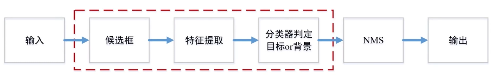
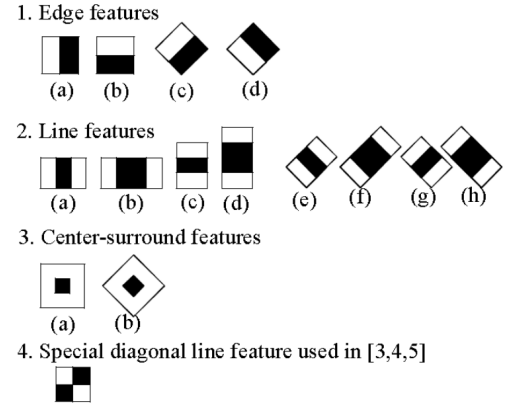
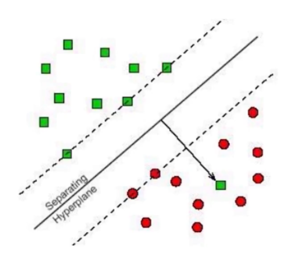
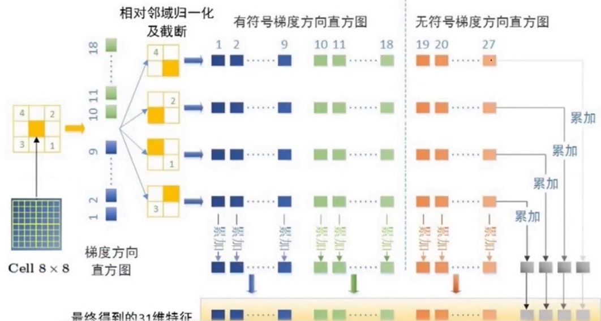
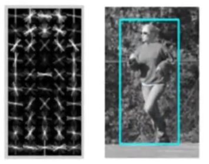

# 传统目标检测算法

传统目标检测方法的基本流程如下图所示：

首先通过滑动窗口的方法进行候选框提取，然后对特征进行提取，常用的方法有基于形状的方法，基于纹理的方法，基于颜色的方法等，然后由分类器对目标进行判定。然后经过NMS(非极大值抑制)，最后输出结果
## Viola-Jones
VJ算法主要用于人脸检测，采用haar特征抽取，这是纹理特征的一种，分类器主要使用adaboost算法，候选框的提取采用滑动窗口方法。

haar特征的计算方式主要借助以下的这些模板

通过白色部分的值求和减去黑色部分的值求和得到我们需要的特征值，也就是计算不同方向上的梯度值

adaboost算法的步骤如下：

>> 初始化样本的权重ω，样本权重和为1
>
>>训练多个弱分类器
>
>>更新样本权重，将分类有问题的样本权重增加
>
>>循环第二步
>
>>纠结个各个分类器的结果进行投票

## HOG+SVM
HOG+SVM算法主要用于行人检测，可以使用opencv实现，使用hog特征，svm分类器，采用滑动窗口提取候选框，使用nms非极大值抑制

HOG特征：
>>灰度化+gamma变换（根号操作）
>
>>计算梯度map（计算x和y方向的梯度，然后计算tan值，也就是x/y，求出当前像素的方向角）
>
>>图像划分成小的cell，统计每个cell梯度直方图
>
>>将多个cell组成一个block，特征归一化
>
>>多个block串联，并归一化

SVM算法通过寻找不同类别之间最大的分类间隔面来对样本进行分类，如下图所示，最大的分类间隔面就是两条虚线之间的部分，右下角的这个绿色的点（箭头指向的）我们可以把它当作噪声。

## DPM

 DPM特征提取同时提取了有符号的梯度和无符号的梯度，如下图所示：

 
 在1-18维中每个维度代表了20°，一共是360°，在19-27维中每个维度代表了20°，一共是180°，然后将有符号的梯度和无符号的梯度拼接在一起得到最终的维度。

 经过dpm特征图计算之后，生成的数据可能是下面这个样子：

我们会进一步计算响应图，然后使用svm分类器进行训练。