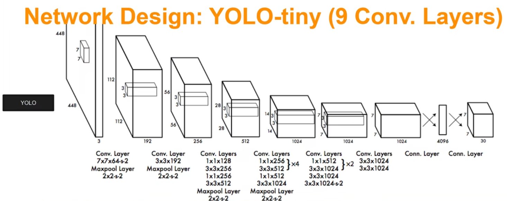

# YOLO_V1
## YOLO_V1简介

[YOLO_V1论文官方链接(点击查看)](http://xxx.itp.ac.cn/abs/1506.02640)

[YOLO_V1论文pdf链接(点击查看)](http://www.apache2.sanyueyu.top/blog/ai/object_detection/YOLO_V1/YOLO_V1.pdf)

[YOLO_V1中文论文pdf链接(点击查看)（用ai&有道词典翻译的，质量一般）](http://www.apache2.sanyueyu.top/blog/ai/object_detection/YOLO_V1/YOLO_V1cn.pdf)

YOLO的意思是you only look once（你只能看一次）
算法精讲部分我参考的是bilibili视频创作者同济子豪兄的视频，[视频地址（点击跳转）](https://www.bilibili.com/video/BV15w411Z7LG/?p=4&spm_id_from=pageDriver&vd_source=e5859cc7bd3c7f25b8ba6a43f83200d3)
## 推理阶段

首先我们看一下yolov1的模型结构

输入是448x448x3的rgb图像，通过若干个卷积层，池化层，最后变成一个7x7x1024的特征图，将特征图拉平，经过一个4096的全连接层，输出4096维的向量，再将向量送入1470维度的fc层，最后reshape输出7x7x30的结果，这个结果中包含类别，偏移等等。

在推理过程中，首先将图片分成sxs个网格，这里的s默认为7，也就是将图像分成7x7的网格，每个格子生成两个预测框，预测框的中心点落在对应的格子中，预测框包含xywh，其是物体的置信度，以及他是某个类别的置信度。

这里输出的7x7x30的特征图的第三个维度就是这么算出来的。首先，每个格子有两个预测框，每个预测框有五个属性，分别是是否包含物品的概率，以及xywh的回归参数，一个框有五个参数，两个框就是十个，再加上每个类别的概率，在yolov1使用的数据集中一共有20个类别，就是20个参数，加在一起就是三十个参数，也就是三十个维度。将原图片划分为7x7的网格，那就是一共有7
x7个区域需要预测，所以就是7x7x30。

这里使用图片直观观察一下这个过程，假设我们将图像分成7x7的网格，现在我们对这个红色的网格做推理：

网络预测出了两个预测框，这里预测框的粗细表示了他是物体的置信度

然后我们又对另一个背景处的网格进行预测，可以发现网络预测出来的物体置信度很低，在图片中的反应就是他们的线很细

每一个格子还会生成对应类别的条件概率，如下图所示，绿的的格子是狗的概率很高，紫色的格子是自行车的概率很高，橙色格子是车的概率很高等等

这里也说明了yolov1网络的一个缺陷，预测的物体数量有限，每个格子的颜色只能有一种，每个格子的预测框只有两个，所以网络最多预测出7x7x2 = 98个物体，不过这在一般的任务中也是够用的。

最后整个推理过程我们可以用下面这幅图片来解释

### 推理阶段预处理

推理阶段的预处理主要是讲生成的一系列预测框进行处理，将没有用的框删除掉，保留关键的预测框，也就是将最后得到的7x7x30的张量变成最后我们需要的结果：

首先我们回顾一下在推理阶段最后的步骤：每个小个子可以预测出两个预测框，我么可以得到这两个预测框的位置回归参数，是否为物体的概率以及20个类别的置信度，49个格子就可以得到98条数据：

### 非极大值抑制

yolo使用的非极大值抑制算法和传统非极大值抑制算法有一点不同，首先我们拿到98个数据条，观察分类部分的数据，这里用狗做例子，首先将狗的值小于阈值的全部变成0，然后使用狗98条数据进行排序。然后从前往后进行nms，后面的框要是和前面的框的nms值大于nms阈值的时候也要变成0。对每个类别都进行这个操作，最后就会得到我们要的结果。这个操作只有在预测阶段的时候要做，在训练阶段是不做的

## 损失函数

在计算损失函数之前我们要知道我们的训练目的：我们的训练目的是，如果某个格子在预标注的目标框的中心点，我们就希望他能预测出目标的位置和置信度，如果某个格子中没有目标框，我们就希望他的置信度尽可能小。

这里我使用 同济子豪兄 写的批注进行解释

首先第一项损失函数是负责检测物体的bbox的中心点定位误差，也就是我们预测出来的负责预测的框的中心点和标注中心点的误差

第二项是负责检测物体的bbox的宽高定位误差，也就是我们预测出来的负责预测的框的宽高和实际宽高之间的误差

第三项是负责检测物体的物体置信度误差，也就是我们预测出来的负责预测的框是不是物体的值的误差

第四项是部分则检测物体的置信度误差，这个我们让他尽量等于0

第五个是负责检测物体的分类误差，也就是负责预测物体的框预测物体的每个类的分类误差

这里有的误差有一些权重，负责检测物体的权重取5，部分则检测物体的误差的权重取0.5，这样就可以更加关注预测的物体，而忽略一些不负责检测的物体的误差。

如果一个框负责检测物体，那他就有后续的分类误差，入宫一个框不负责检测物体，那他后续的分类的值越接近0越好

