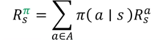
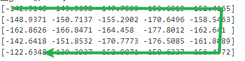

# reinforcement_learning

## 强化学习概述

强化学习，是在与环境的互动当中，为了达成一个目标而进行的学习过程。其主要的要素包括：agent，environment，goal。

>> environment 指的是环境，可以理解为一个游戏
>
>> goal 指的是目标
>
>> agent 指的是与环境互动的主体，可以理解为玩游戏的玩家

当有了玩家和环境之后，我们就要设计这个游戏的玩法，玩法的主要要素包括：state，action，reward。

>> state指的是状态，可以理解为玩家和环境的状态，这个状态很广泛，举例说明的话，状态可以包括比如自身和对手的位置，等级等一系列当前确定的信息。
>
>> action指的是行动，指的是agent通过当前的state做出来的行动决策。
>
>> reward指的是奖励，指的是，当agent做出action之后得到的即时反馈，在强化学习中reward通常是一个实数，并且可能是0，比如在五子棋比赛中，只有当agent赢得比赛，我们才会给他一个大于0的reward。reward的设置是很重要的，比如在一场篮球赛中，我们的reward如果设置成进球可以获得奖励，那我们的模型就会更倾向于进攻，但篮球的规则是最终得分多的队伍才是赢家，所以一个合理的奖励应该是在己方进球的同时防止对方进球。

接下来是强化学习的核心结构：policy，value。

>> policy指的是策略，策略是指，在某个状态下应该做出什么操作，策略本身是一个函数，当我们把state输入进去，策略函数会告诉我们需要采取什么样的action。
>
>> value指的是价值，价值本身也是一个函数，当我们把状态输入进去，价值函数会对玩家将来能获得的奖励进行一个评估。

强化学习的核心就是怎么通过当前的状态来进行下一步行动，以及怎么让玩家在最后得到更高的价值。

强化学习的特点： 
trial and error （试错） 强化学习是一种试错学习，也就是在不断地尝试中学习。 
delayed reward （延迟奖励） 行动没有对应即时的奖励，但是他一定有价值，比如下棋，每一步棋都没有实质的奖励，直到最后胜利，才会有奖励。 

强化学习的核心问题：exploration vs exploitation(探索与开发) 在强化学习中，不应一味使用当前的最优方案，这样会使我们的模型陷入一个局部最优解，应该一边完善当前的解一边探索新的解
## 强化学习例子 K-armed Bandit（多臂老虎机）

### enviroment

现在我们有两台老虎机，分别叫“左老虎机”和“右老虎机”，在后台规则中“左老虎机”每次启动都会获得一个奖励，奖励的值是服从均值500，标准差为50的正态分布，而启动“右老虎机”得到的奖励值服从均值550，标准差为100的正态分布。作为玩家的agent并不知道这两台老虎机的奖励的分布规律。

### goal

我们希望在进行启动老虎机之后能得到更多的奖励值，这也是我们这次实验的最终目的，

### value

我们使用平均奖励作为奖励的评估，这一行动价值的估计方法称为sample-average（样本平均），是最简单的一种方法。

### policy

策略函数的选择有很多种，最直接的方法就是选择启动当前时刻价值最大的老虎机，这一策略被称为greedy(贪婪策略)，利用我们已经学习到的价值函数选择价值最大的老虎机，但是这个策略并不是很好的策略，假设我们先启动了“左老虎机”得到了510的价值，此时“右老虎机”的价值还是0，如果使用贪婪策略，则模型会一直选择“左老虎机”。此时我们可以设计一个补救策略，就是在开始的时候强行让所有老虎机都启动一次，再做贪婪选择。但是，因为随机性的存在，只启动一次显然是不够的。为此我们设计了一个新的策略，让两台老虎机的初始值很大，比如1000，随着启动次数的增加，最后两个老虎机的期望值会逐渐逼近他们的后台配置,值。同时为了加大随机性以防止模型陷入死角，我们提出了一种新的策略：ε-greedy,其含义是，在大部分情况下使用贪婪策略，以一定概率ε执行随机策略，在不同的问题中ε的最优值也是不同的。并且我们可以随着时间变化修改ε的值。

### 强化学习误差

首先我们回忆以下使用sample average样本平均来估计价值的方法，假设Qn+1是采取n次行动后对行动价值的估计值，Ri是第i次操作产生的实际价值，根据sample average我们可以得到下面这个公式，我们对他进行推导如图所示：

我们对最后得到的推到公式进行解释：Qn是在第n次行动之前的价值估计，Qn+1是第n次行动之后的价值估计，(Rn-Qn)则是误差，也就是之前行动中预测值与实际值之间的偏差，1/n则是学习率，也就是根据误差对新预测结果的调整幅度，当我们把学习率设置为1/n的时候，越往后这个学习率会越小，也就是模型对后面的行动的价值重视程度越来越低，如果我们不使用1/n，转而使用一个常数a，则刚好相反，模型会更看重最近得到的奖励的情况。这种方法也被称为weighted average(加权平均)。这里需要注意的是，sample average中初始值对最后的价值估计影响很小，几乎可以忽略不计，但是weighted average中初始值对最后的价值估计影响可能比较大。 

### 代码构建

首先：创建老虎机类，定义启动函数，计算奖励的函数

    import numpy as np
    import random

    class laohuji:#创建老虎机类
        def __init__(self,mean,std_dev):
            self.q = 1000
            self.n = 1
            self.v = 1000
            self.mean = mean
            self.std_dev = std_dev
            self.v_list = []
        def start(self):
            q = int(np.random.normal(self.mean, self.std_dev))
            self.q += q
            self.n +=1
            return q
        def value(self):
            self.v = self.q/self.n
            self.v_list.append(int(self.v))
            return self.v

然后创建active函数：

    def action():#模型决定的操作
        print(f'左老虎机价值：{zuolaohuji.value()}')
        print(f'右老虎机价值：{youlaohuji.value()}')
        if zuolaohuji.value() > youlaohuji.value():
            q = zuolaohuji.start()
            print(f'启动左老虎机，奖励为{q}')
        else:
            q = youlaohuji.start()
            print(f'启动右老虎机，奖励为{q}')

初始化“左老虎机”和“右老虎机”：

    zuolaohuji = laohuji(500,50)
    youlaohuji = laohuji(550,100)

使用ε-greedy方法，这里我设置了十分之一的概率随机：

    for i in range (1000):
        if random.random() < 0.1:
            if random.random() < 0.5:
                zuolaohuji.start()
            else:
                youlaohuji.start()
        else:
            action()

观察两台老虎机的value：

    import matplotlib.pyplot as plt

    plt.plot(zuolaohuji.v_list, label='zuolaohuji')
    plt.plot(youlaohuji.v_list, label='youlaohuji')

    plt.legend()

    plt.grid(True)

    plt.xlabel('n')
    plt.ylabel('v')

    plt.show()

结果如下图：

稍后我们可以启动一下active函数，看看模型会做出什么决策：

    action()
    

可以观察到，模型的决策还是没有什么问题的。

## MDP(马尔可夫决策框架)

一个MDP有很多要素：
第一个要素————sets（集合）：

>> state space ：状态空间 状态空间指的是所有可能的状态组成的集合
>
>> action space ：动作空间 动作空间指的是智能体在某个状态下可以选择的所有可能动作组成的集合
>
>> reward space ：奖励空间 奖励空间指的是智能体在某个状态下采取某个动作后获得的即时奖励的集合

第二个要素————probability distribution（概率分布）：

>>state transition probability : 状态转移概率指的是在MDP中，智能体在某个状态下采取某个动作后转移到下一个状态的概率。状态转移概率通常用函数形式表示，记为(P(s'|s, a))，表示在状态(s)下采取动作(a)后转移到状态(s')的概率。
>
>>reward probability : 奖励函数是描述智能体在某个状态下采取某个动作后获得的即时奖励的函数。

第三个要素————policy:策略 是智能体在特定环境下做出决策的规则或策略函数

第四个要素————markov property：马尔可夫性质 是指随机过程中当前状态的未来发展只依赖于当前状态，而与过去的状态序列无关的性质。
假设我们有一个状态动作图如下图所示，箭头代表的是该行动的概率：

由于我们马尔可夫决策框架只考虑当前的状态，所以当我们知道当前状态可以画出以下的状态转移概率矩阵：

操作的奖励使用R表示，一次action的奖励应用action之后的R，也就是箭头指向的状态的R。累计回报Gt应该随着时间递减，也就是增加一个折扣系数Y，累计回报的公式如下：

V值（价值函数）的计算，就是将所有路径的累计回报取平均，如下图所示，首先我们经计算出所有的Gt，然后请平均得到V

V的递推公式：上一个状态的V等于本次行动的奖励加上下一个状态的V

我们将上面这个式子用矩阵展开：

则，当前的v矩阵= 当前的reward矩阵+y\*当前的条件概率\*概率对应的状态的v矩阵。 
我们对这个式子进行化简：

这时候我们用代码来计算一下价值矩阵： 
首先导入numpy库用于矩阵计算，然后定义当前已知的信息，这里我定义了三个γ（gamma）：

    import numpy as np
    #先定义概率矩阵
    P = np.array([[0,0.5,0,0,0,0.5,0],
                [0,0,0.8,0,0,0,0.2],
                [0,0,0,0.6,0.4,0,0],
                [0,0,0,0,0,0,1],
                [0.2,0.4,0.4,0,0,0,0],
                [0.1,0,0,0,0,0.9,0],
                [0,0,0,0,0,0,1]])
    #然后定于gamma
    gamma = np.array([0,0.9,0.99999])
    #然后定义return
    R=np.array([-2,-2,-2,10,1,-1,0])

定义完已知的条件之后，分别对三个gamma进行带入公式并计算：

    np.set_printoptions(precision=4)
    for i in range(3):
        print(f'当gamma取{gamma[i]}时,V如下：')
        print((np.linalg.inv(np.eye(7)-gamma[i]*P)@R))

np.linalg.inv()方法是用于计算逆矩阵的，np.eye()用于创建单位矩阵，最后得到的结果如下：

通过这个结果我们可以看到，当γ设置的越大，他的考虑约长远，比如当γ等于0.99的时候，facebook的value就很小，达到了-22，说明我们的智能体非常不希望到达facebook，从图中我们也可以看出，facebook确实是与最终的sleep状态相差很长的距离。而当我们把γ设置成0的时候，智能体只考虑当前能拿到的回报，所以他更忌讳进入c1,c2和c3，因为这三个选项的return是-2。

## 贝尔曼公式

St是当前的状态 At是采取的行动，Rt+1是获得的reward，St+1是下一个时刻的状态，我们可以画出这样一张图：

这个图和上面我们学的马尔可夫决策框架相比，增加了一个策略，原本是从状态s转移到状态s'，现在是状态s有一定概率选择a操作，a操作有一定概率转移到状态s'。上下两条路径的结果应该是一样的，所以我们可以推导出以下公式：

看这个公式和图可能比较不好理解，通俗的讲，如果我们想使用策略来表示奖励的计算公式，那奖励的计算公式为（每一个动作的概率*该动作转移到下一个状态的概率）的和

此时，当前状态的奖励也可以用决策进行推导，就是下面的式子：
 
也就是将所有策略的奖励进行求和，也就是概率论中的期望

当我们有了这种加权的思想之后，我们就可以来推导贝尔曼方程，首先

这个公式表示状态s的奖励期望值，等于s的返回值Rs加上s的所有下个状态的期望值求和，然后我们把策略π加入到公式中，表示我们的计算是根据策略进行的，如下图，我们对公式进行化简

这里我们对紫色框框起来的这部分进行命名，叫'状态-动作值函数',即使用状态-动作将期望值求出，所谓贝尔曼方程就是一个递推关系，即我们使用下一时刻的值来更新上一时刻的值

这里我们再梳理一下这些关系，首先是q值，q值等于奖励加上后续的期望的求和，v值等于每一个策略的概率*该策略的新状态的q值的求和，也就是下面这两个公式：

我们根据这两个是自互相带入，可以得到贝尔曼公式，如下图所示：

这两个关系就和我们上面的那张三角形的图是一样的，Q就是通过a到s'，v则是直接到s'，总结起来就是下面这张图

在上面我们计算的公式中（下图红色框吧），由于需要求逆所以计算量会比较大， 所以我们还有另一个求v矩阵的方法就是随机初始化v然后用下面这个公式（下图绿色框）不停迭代：

接下来我们做实验验证一下这个方法：

首先导包，定义已知的条件：
    import numpy as np
    P = np.array([[0,0.5,0,0,0,0.5,0],
                [0,0,0.8,0,0,0,0.2],
                [0,0,0,0.6,0.4,0,0],
                [0,0,0,0,0,0,1],
                [0.2,0.4,0.4,0,0,0,0],
                [0.1,0,0,0,0,0.9,0],
                [0,0,0,0,0,0,1]])
    gamma = np.array([0,0.9,0.99999])
    R=np.array([-2,-2,-2,10,1,-1,0])
    #然后定义逆矩阵公式并打印结果
    np.set_printoptions(precision=4)
    for i in range(3):
        print(f'当gamma取{gamma[i]}时,V如下：')
        print((np.linalg.inv(np.eye(7)-gamma[i]*P)@R))
    #然后定义迭代方法打印结果：
    for j in range(3):
        V = np.array([0,0,0,0,0,0,0])
        for i in range(100):
            V=R+gamma[j]*(P@V)
        print(f'当gamma取{gamma[j]}时,V迭代一百次之后的结果如下：')
        print(V)
    
接下来观察两个结果，首先是逆矩阵的结果： 

然后是迭代方法的结果： 

可以看到，这个迭代的方法是没有问题的。

<!-- state value：表示在某个状态下，智能体能够获得的长期回报的期望值。return针对单个操作进行return，而state value是针对多个操作进行return然后求平均 -->

## 贝尔曼最优公式：

定义：如果一个策略在任意状态相比于其他策略的value都要大，我们就说他是最优的

问题：
>>1.只有策略在某些状态上能打败其他策略，但是在某些状态没法打败呢？
>
>>2.这个策略是否唯一？
>
>>3.策略是确定性的还是非确定性的？
>
>>4.我们怎么得到最优策略？

为了解决这些问题，我们需要研究贝尔曼最优公式，首先我们直接给出最优公式，如下：

我们在贝尔曼公式前加入了max(pi),我们要求解这个pi。我们要求解的就是v和pi，同时我们可以给出向量化的公式：

这里通俗的说就是我们要把reward更大的策略的概率拉到最大，也就是1，这样才能保证整个式子是最优的。

## value iteration(值迭代算法)
### step 1 : policy update
处理下面这个优化问题，得到pi k+1

求解的方法如下所示：

这是一个贪婪策略，他会寻找一个回报最大的策略
### step 2 : value update
通过pi k+1 得到Vk+1

求解方法如下：

我们做个实验来验证一下这个算法：首先我们定义一个迷宫，迷宫的规则如下：紫色为起点，黄色为终点，绿色为通道，蓝色为阻碍，且玩家不能越过边界 
为了让玩家不进入蓝色块，我们给蓝色块设置一个很大的惩罚，比如-10，给迷宫的终点设置一个很大的奖励，比如10，迷宫如图所示，内部的字是其对应的return：

假设玩家每次行动的方式分为五种：上下左右不动，且概率相同，则我们可以得到以下的概率矩阵：

假设玩家有上下左右原地不动四个状态。

首先在这个二维的游戏中每个块都有一个二维的编号，我们写一个函数将这个二维的编号转换为一维：

    def position_mapping(x,y):
        return int(x+y*5)

然后我们定义一个矩阵，并将每个块可以进行的action的概率表示出来，比如左上角的起点可以做三个动作，向下，向右和原地不动，那他对应的三个行动的值就是1/3

    #首先使用循环将每个块的可能的状态标出
    for x in range(5):
        for y in range(5):
            pa[position_mapping(x,y)][position_mapping(x,y)] = 1
            if x==0:
                pa[position_mapping(x,y)][position_mapping(x+1,y)] = 1
                if y==0: 
                    pa[position_mapping(x,y)][position_mapping(x,y+1)] = 1
                elif y == 4:
                    pa[position_mapping(x,y)][position_mapping(x,y-1)] = 1
                else:
                    pa[position_mapping(x,y)][position_mapping(x,y-1)] = 1
                    pa[position_mapping(x,y)][position_mapping(x,y+1)] = 1        
            elif x == 4:
                pa[position_mapping(x,y)][position_mapping(x-1,y)] = 1
                if y==0: 
                    pa[position_mapping(x,y)][position_mapping(x,y+1)] = 1
                elif y == 4:
                    pa[position_mapping(x,y)][position_mapping(x,y-1)] = 1
                else:
                    pa[position_mapping(x,y)][position_mapping(x,y-1)] = 1
                    pa[position_mapping(x,y)][position_mapping(x,y+1)] = 1
            else: 
                pa[position_mapping(x,y)][position_mapping(x+1,y)] = 1
                pa[position_mapping(x,y)][position_mapping(x-1,y)] = 1
                if y==0: 
                    pa[position_mapping(x,y)][position_mapping(x,y+1)] = 1
                elif y == 4:
                    pa[position_mapping(x,y)][position_mapping(x,y-1)] = 1
                else:
                    pa[position_mapping(x,y)][position_mapping(x,y-1)] = 1
                    pa[position_mapping(x,y)][position_mapping(x,y+1)] = 1
    #然后平均每个状态的概率           
    for i in pa:
        p = (1/np.sum(i))
        for j in range(len(i)):
            if i[j] == 1:
                i[j] = p

最后我们可以得到下面这张表，这张表太大了所以我只截取一部分总共有25行数据，我只展示五行： 

然后定义R矩阵，根据上面迷宫的示意图我们定义如下R矩阵，同时定义三个gamma，使用迭代方法：

    R = np.array([0,0,0,0,0,
                0,0,0,-10,0,
                -10,-10,0,-10,0,
                0,0,-10,-10,0,
                10,0,0,0,0])
    gamma = [0.5,0.9,0.99]

    for ga in gamma:
        V = np.array([0]*25)
        for i in range(100):
            V=R+ga*(pa@V)
        print(f'当gamma取{ga}时：')
        for i in range(5):
            print(V[5*i:5*i+5])
    
得到的结果如下：

这里我们已经可以看到大致的方向的，如下图所示：

我们把最后的奖励提升到100，这样模型应该会考虑进入蓝块，我们查看新的结果和走势：

我们可以看到当结果奖励很大，且模型很考虑长期结果的情况下，模型会选择直接往下走。

接下来我们更新策略，将每个状态的回报最高的策略设置成1，这块的代码我就不写了。

## policy iteration（策略迭代法）
首先我们会有一个initial policy pi0，这个pi是随机的
然后每次迭代分为两个步骤：
step 1：policy evaluation:我给定一个策略，求解贝尔曼公式
step 2: policy inprovement:使用心得v求解新的pi

整个过程如下图所示：

他奶奶滴，这玩意太烧脑了，我决定休息一下看看nlp

## truncated policy iteration

