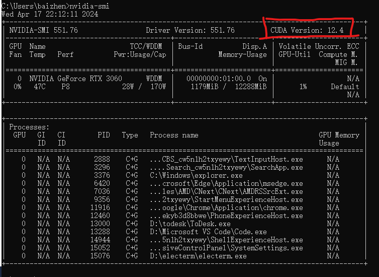
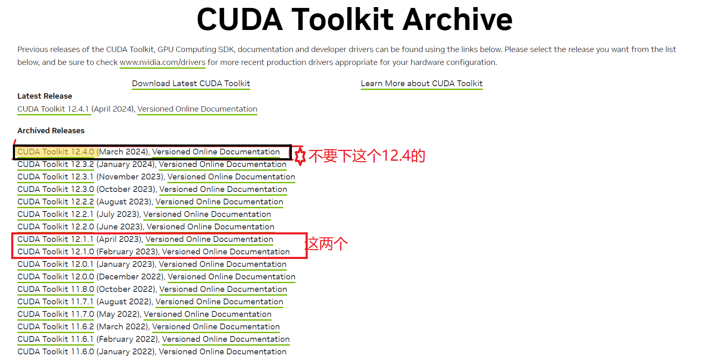
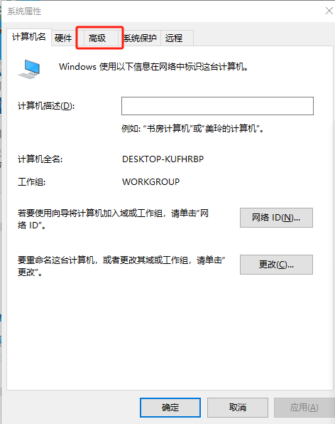
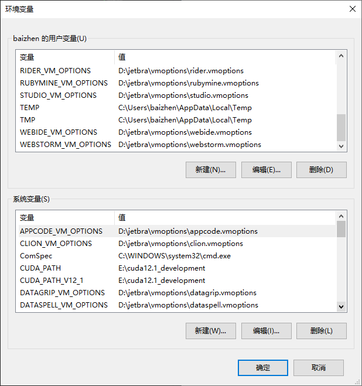
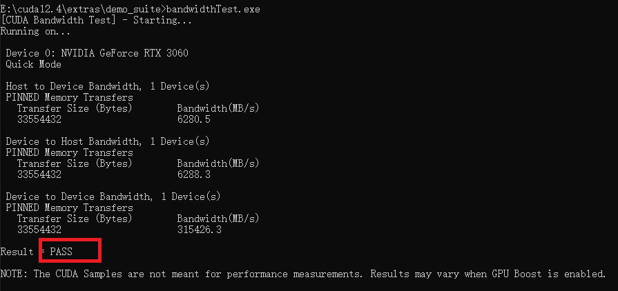

# win10中配置torch
    前提条件：要求电脑中已经配置了anaconda和英伟达显卡驱动

## 查看驱动推荐的CUDA版本
首先查看显卡驱动推荐的显卡驱动，使用win+r cmd 打开终端

    win+r cmd

在终端输入nvidia-smi 查看显卡驱动的详细信息，主要留意右上角的cuda Version

    nvidia-smi

如图 我的显卡最高使用的cuda版本就是12.4

## 下载CUDA安装包
进入CUDA官网[（点击此处进入）](https://developer.nvidia.com/cuda-toolkit-archive)

<!-- https://developer.download.nvidia.com/compute/cuda/12.1.0/local_installers/cuda_12.1.0_531.14_windows.exe win10 -->
<!-- https://developer.download.nvidia.com/compute/cuda/12.1.0/local_installers/cuda_12.1.0_531.14_windows.exe win11 -->

**当前pytorch(一会我们要用的软件)最高支持到cuda12.1，如果您的推荐版本大于12.1就下载cuda12.1。如果小于12.1就下载对应版本的cuda。**

cuda官网连接较慢这里提供cuda12.1的快速下载链接：

[cuda 12.1.0 win10/win11 64位安装包（点击下载）](https://developer.download.nvidia.com/compute/cuda/12.1.0/local_installers/cuda_12.1.0_531.14_windows.exe)

[cuda 12.1.1 win10/win11 64位安装包（点击下载）](https://developer.download.nvidia.com/compute/cuda/12.1.1/local_installers/cuda_12.1.1_531.14_windows.exe)

如果您需要别的版本的快速链接可以通过galijiangzhi@163.com联系我，我会尽快更新

如果您不能使用cuda12.1就进入[CUDA官网（点击此处进入）](https://developer.nvidia.com/cuda-toolkit-archive)
找到适合自己的显卡驱动的cuda版本，比如我就是12.1.1，这里我点击下图中的CUDA  tooklkit 12.1.1

跳转到下图这样的下载页面，根据自己的计算机选择一下这些选项，从上往下分别是系统类型，系统架构，系统版本，离线安装或者在线安装，最后一个选离线安装。

都选好之后点击下面的Download

## 安装CUDA

双击下载的文件，设置安装过程中临时文件的路径，点击ok

这里需要等待一下安装程序的加载

系统检查 点击同意并继续

选择安装选项，点击自定义，下一步

勾选所有的组件，点击下一步

设置安装位置，点击浏览选择安装位置，可以使用默认，如果不使用默认位置则要记住安装位置

后续一直点下一步就ok

## 添加环境变量

win+r 打开运行 输入 sysdm.cpl

    win+r sysdm.cpl

点击高级

点击环境变量

检查系统变量中有没有CUDA的变量，版本号可以和我的不一样，如果有，则表明环境变量无误，如果没有的话，需要按照我这个格式新建cuda变量，版本号写自己的，位置也要写自己设置的安装位置。

## 检测cuda是否安装成功

打开安装cuda的目录，双击打开extras

双击打开demo_suite

在文件夹地址栏中输入cmd 并敲回车

在终端中输入 deviceQuery.exe,可以复制下面的命令然后在终端里点一下鼠标右键（终端的粘贴指令不是ctrl+v 是鼠标右键）

    deviceQuery.exe

观察最下面的输出是不是PASS

如果不是PASS则需要重新安装，检查一下安装的版本和驱动推荐的版本是否一致。如果是PASS则继续输入 bandwidthTest.exe

    bandwidthTest.exe

继续观察最下面的输出是不是PASS，如果不是PASS则需要重新安装，检查一下安装的版本和驱动推荐的版本是否一致。

如果两个都是PASS 说明CUDA安装完成

## 安装pytorch

首先进入[pytorch下载仓库（点击进入）](https://download.pytorch.org/whl/torch_stable.html)

在[pytorch下载仓库（点击进入）](https://download.pytorch.org/whl/torch_stable.html)中往下滑，根据自己的cuda版本和python版本选择要下载的文件，如下图所示

这里提供一些快捷torch下载链接：

[torch-cuda12.1-python3.8-windows(推荐右键复制链接到迅雷下载，直接点击下载很慢)](https://download.pytorch.org/whl/cu121/torch-2.3.0%2Bcu121-cp38-cp38-win_amd64.whl)

[torch-cuda12.1-python3.9-windows(推荐右键复制链接到迅雷下载，直接点击下载很慢)](https://download.pytorch.org/whl/cu121/torch-2.3.0%2Bcu121-cp39-cp39-win_amd64.whl)

[torch-cuda12.1-python3.10-windows(推荐右键复制链接到迅雷下载，直接点击下载很慢)](https://download.pytorch.org/whl/cu121/torch-2.3.0%2Bcu121-cp310-cp310-win_amd64.whl)

[torch-cuda12.1-python3.11-windows(推荐右键复制链接到迅雷下载，直接点击下载很慢)](https://download.pytorch.org/whl/cu121/torch-2.3.0%2Bcu121-cp311-cp311-win_amd64.whl)

[torch-cuda12.1-python3.12-windows(推荐右键复制链接到迅雷下载，直接点击下载很慢)](https://download.pytorch.org/whl/cu121/torch-2.3.0%2Bcu121-cp312-cp312-win_amd64.whl)

推荐右键复制链接到迅雷下载，在上面这几个下载链接复制也可以在官网下载仓库复制也ok，如下图所示：

下载完成后 使用管理员权限打开一个cmd，流程是开始菜单-windows系统-cmd-右键-更多-以管理员身份运行，如下图所示：

首先确认一下自己的python工作环境，这块就不做演示了，每个人的工作环境不一样

然后跳转到下载了文件的目录，示例：

我的文件下载在d:/迅雷下载 首先在终端输入 d: 进入d盘

    d:

然后输入 cd 迅雷下载

    cd 迅雷下载

就进入了迅雷下载目录

在终端输入 pip install 下载的文件名(不需要敲完，敲两个字母点一下tab会自动补全) ，如下图所示：

等待安装即可，要是报error的错误自己用ai查一下看哪里有问题，自己解决一下。

## 验证pytorch

在cmd的工作环境中依次输入（复制粘贴）

    python

    import torch
 
    print(torch.__version__)
    
    print("gpu", torch.cuda.is_available())

观察输出结果中的这几项是否存在

如果最后一个不是true的话，说明torch调用gpu失败，**依次检查你的显卡驱动，cuda和torch**，确认torch的python版本和cuda版本与你电脑上安装的cuda和python对应，如果还是有问题就**把显卡驱动降到531的版本**，531的版本推荐的cuda版本就是12.1不存在向下兼容的问题。