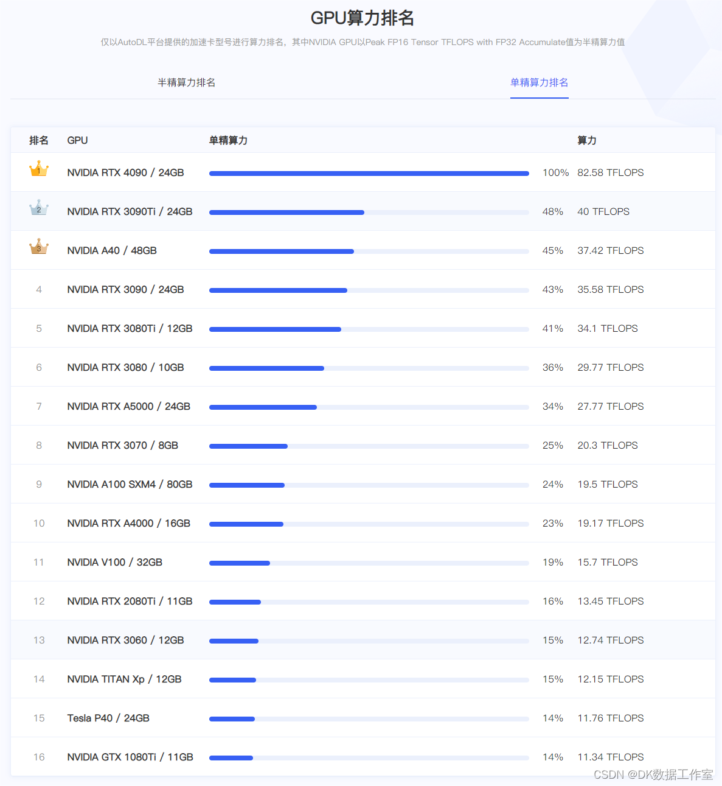
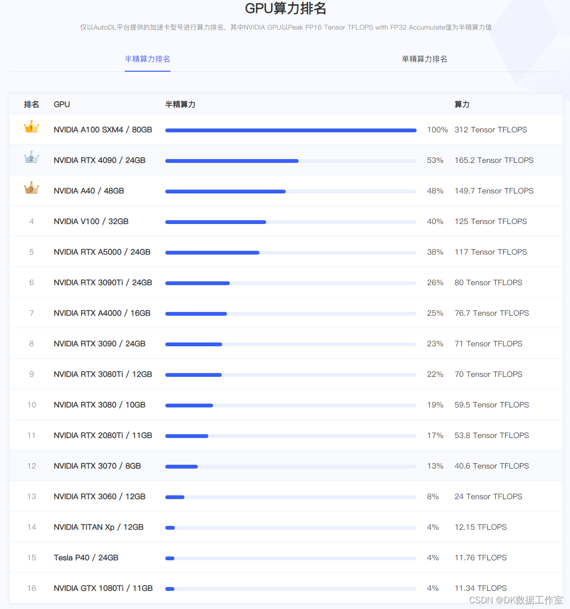

# 开始
## 声明
该博客中的**理论知识**有一些为本人个人总结，可能与官方资料不符，本项目旨在快速搭建ai训练模型，**请勿将本项目中本人说的理论知识用于正式的考试**。如果您发现项目中有错误请及时联系我们，我将非常感谢您对项目的支持。

## 简介
AI模型的训练通常需要以下元素：
>1.工作环境
>>硬件环境：
>>>硬件环境 主要包括 GPU（显卡），RAM（内存），一个合适的CPU以及足够的存储空间，可以根据自身经济实力考虑将算力服务器搭建在本地，或者在互联网算力租赁平台进行租赁。
>>>软件环境 软件方面主要包括 操作系统，显卡驱动，cuda，深度学习框架等

>2.模型
>>主要采用开源模型 比如yolo gpt resnet等

>3.数据集
>>采用网络公开数据集

>4.调参和优化

本项目将**从头开始**，在物理机中搭建**ubuntu 22.04 server**操作系统，进行对各种模型的训练。

## 硬件选购

本章节为准备搭建物理算力平台的用户简单介绍一下硬件，如果您使用的是网络算力平台或者企业/学校的算力平台，可以跳过此章节

首先先我们看一下2024年4月为止的显卡算力排行

只要在榜上的其实都不错，根据自己的实际情况选择显卡，学习阶段不要太浪费，顶上那几种都是几万起步，贵的十几万一张，我经费不多算力平台装的是3060。这里需要注意的是，当前阶段新手显卡**一定要选择NVIDIA（英伟达）的显卡**，因为英伟达的显卡软件配套比较全面。其次**显存一定要大，10G起步**，多多益善。最后，选购显卡的时候一定要**注意配套电源**，保证算力平台正常运行。

RAM（内存）方面最小要16G，这个算是最低标准了，经费充足最好扩充到32G或者更大

CPU方面要求不像显卡那么严格，近五年发售的主流处理器我估计都可以。

最后列出我用的平台配置给大家作参考：
>CPU: I3 10105F （x86_64）

>RAM（内存）: 威刚DDR4 16G 2133

>主板：MSI B560M-A

>硬盘：WDC SN550 1T

>电源：长城GW-EPS800

## 环境配置

### Ubuntu_Server操作系统安装

本章将下载并安装Ubuntu_Server 22.04 操作系统，如果您为云算力平台租赁用户可以跳过本章

安装前准备：win操作系统电脑一台，8GB以上U盘一个（如果您是虚拟机用户则可以不用U盘）

#### 1.操作系统下载地址(如果您不知道自己的架构，可以百度一下cpu型号，一般都是x86_64架构）：

>[点击此处下载 x86_64架构 ubuntu_server](https://cn.ubuntu.com/download/server/thank-you?version=22.04.4&architecture=amd64)

>[点击此处下载 ARM 架构 ubuntu_server](https://cdimage.ubuntu.com/releases/22.04/release/ubuntu-22.04.4-live-server-arm64.iso)

>[点击此处下载 POWER 架构 ubuntu_server](https://cdimage.ubuntu.com/releases/22.04/release/ubuntu-22.04.4-live-server-ppc64el.iso)

>其他架构可以访问[Ubuntu_Server](https://cn.ubuntu.com/download/server/step1#architectures)官网自行寻找下载网址

#### 2.虚拟机用户请按照以下步骤进行安装
#### 2.物理机用户请按照以下步骤进行安装

