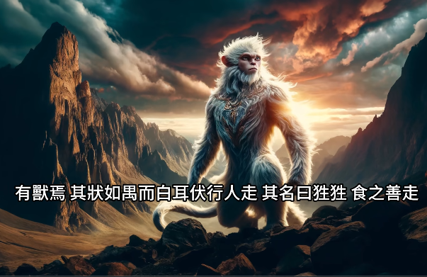

<!-- ## 《奈落》游戏剧本 -->
## 烛龙

钟山之神，名曰烛阴，视为昼，瞑为夜，吹为冬，呼为夏，不饮，不食，不息，息为风。身长千里。在无䏿之东。其为物，人面，蛇身，赤色，居钟山下。《海外北经》
西北海之外，赤水之北，有章尾山。有神，人面蛇身而赤，直目正乘，其瞑乃晦，其视乃明，不食不寝不息，风雨是谒。是烛九阴，是烛龙。《大荒北经》

烛龙在山海经中的形象是人面，蛇身，红色。

## 狌狌

任何吃到其肉的人都可以获得超乎想象的速度，脚下生风

## 蜀黍

会唱歌，长寿迹象

## 九尾狐

吃了之后可以辟邪

## 赤鱬

人面鲤鱼身，在沼泽里

## 蠱雕

吃人的鸟，长角

## 白泽
白色的鹿，可以驱邪，神灵

## 应龙

## 天狗
<!-- ## 华为人才认证学习经历

### [HCIA-AI](/HUAWEI/HCIA-AI) -->