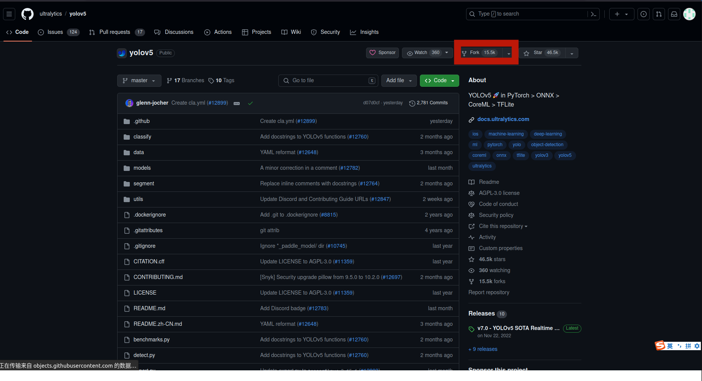
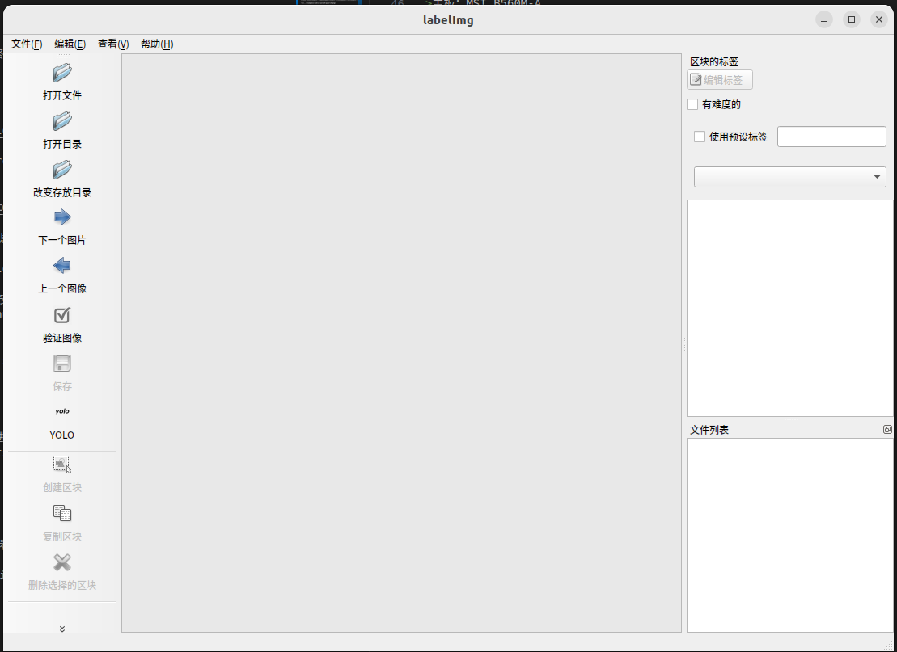
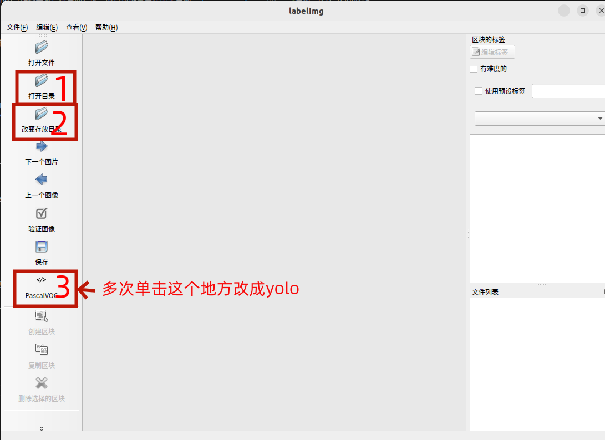

# Model 
## YOLOv5
### 概述
本项目在ubuntu22.04物理机中进行配置,进行最简单的yolov5的使用

YOLO（You Only Look Once）是一种流行的目标检测算法，它可以在图像中快速而准确地识别多个物体。YOLO的特点是能够实时处理图像，并且在单个前向传播中直接预测边界框和类别概率。这种方法使得YOLO在速度和准确性上都具有优势。YOLO算法通过将图像分成网格，并在每个网格中预测边界框和类别，从而实现对多个物体的检测。
### 创建虚拟环境

>conda create -n yolov5 python==3.8

上述命令中的yolov5是环境名，可以根据自己的需求进行创建，创建过程中根据提示输入y确认。

### 进入虚拟环境
>conda activate yolov5

或者

>source activate yolov5

进入虚拟环境之后注意看终端头部有没有虚拟环境的名字，没有的话说明进入失败，成功进入会有下图所示的内容。

### (非必要 可跳过）获取yolov5的项目代码到自己的git

复制下面的地址到浏览器打开
>https://github.com/ultralytics/yolov5

如果你想把代码移入自己的仓库，请登录自己的git账号，然后返回到yolov5的页面 点击fork（如下图所示）根据网页提示设置仓库名

### 克隆yolov5仓库
**如果你进行了上一步的将yolov5代码获取到自己的仓库，则需要将下面的git地址改为自己仓库的地址,如果跳过了上一步，则可以直接照我的代码运行**

进入工作目录，执行以下终端命令
>git clone https://github.com/ultralytics/yolov5

待克隆完成之后，进入yolov5目录

>cd yolov5

### 安装PyTorch

首先查看工作电脑的cuda版本，在终端输入以下命令
> nvidia-smi

查看当前显卡驱动和cuda版本

去torch官网根据cuda版本安装torch，**不要随便下载，cuda版本和torch版本是一一对应的**

[点击此处进入PyTorch官网](https://pytorch.org/)

在官网中选择自己的服务器的相关信息，我的服务器选择如下，根据自己的服务器信息选：

根据官网的提示，在终端输入对应的安装命令，本人的服务器安装命令如下。(下面命令中的-i https://pypi.tuna.tsinghua.edu.cn/simple 意思是使用清华源，根据自己的网络酌情添加，国内用户可以无脑加)

>pip3 install torch torchvision torchaudio -i https://pypi.tuna.tsinghua.edu.cn/simple

### 安装必要的第三方库

根据官方文件requirements.txt进行第三方库的安装 
>pip install -r requirements.txt -i https://pypi.tuna.tsinghua.edu.cn/simple

### 数据标注

**要训练训练自己的数据的工作者可以看一下本章，训练第三方数据集的可以跳过数据标注。**

使用用于数据标注的电脑安装labelimg（服务器不提供界面程序，所以可能需要在个人电脑安装），在终端输入
> pip install labelimg

然后创建一个文件夹用于保存当前数据集，这里我们用一个道路车辆数据集做例子,数据集文件夹就叫daolu(道路)

首先创建一个daolu文件夹
然后进入daolu文件夹 创建 images文件夹和labels文件夹

然后分别进入images文件夹和labels文件夹，创建train文件夹和val文件夹。**images和labels里都要创建train和val**

目录结构如下

文件夹解释：

images/train 放入训练集图片文件

images/val 放入测试集图片文件

label/train 放训练集图片标签

label/val 放入测试集图片标签

创建好目录结构之后，将所有的数据集图片文件放入images/train中 

等待label安装完成，且数据图片放入images/train之后 在终端输入

>labelImg

软件界面如下：

1.单击打开目录：选择images/train目录

2.单击改变存放目录：选择label/train目录

3.修改模式为yolo 

如下图所示:

然后开始数据标注,

首先创建预设标签，我这里标注的是车，就创建一个car(车)

然后点击创建区块（快捷键 w）进行标注,每次新的标注都需要按一下w，当前图片标注完之后ctrl+s保存，然后点击下一张图片(快捷键 d)

常用快捷键如下：

创建区块：w

上一张图片：a

下一张图片：d

保存：ctrl+s

所有的图片标注完之后关闭labelImg，去文件夹中划分训练集和测试集:

在images/train中选择一部分图片剪切粘贴到images/val （要记住剪切过去的图片的名字）

在label/train中将相应的文件剪切粘贴到label/val中。

注意label和images剪切过去的文件的名字要对得上。比如我将images/train中的图片111.jpg剪切到了images/val，那对应的我也要将label/train中的111.txt剪切到label/val中

### 迁移数据
**如果您进行了上一步的数据标注，则需要进行数据迁移，如果是在网上下载的数据集则要自己研究一下数据的目录结构**

我一般使用scp命令对数据进行迁移

首先在**服务器**的yolov5文件夹中创建dataset文件夹

> mkdir dataset

#### 使用scp拉取刚才电脑上的数据集文件夹daolu

举例：

**数据集文件夹所在的电脑**
ip地址为192.168.1.123 

文件夹位置/home/baizhen/dataset/daolu 

账户名为hello 

密码为world

**算力服务器**

ip地址 192.268.1.234 

服务器中yolov5文件夹的位置为/home/zijian/yolov5

则迁移命令为：scp -r 数据计算机用户名@ip地址:路径 本地路径
>scp -r hello@192.168.1.123:/home/baizhen/dataset/daolu /home/zijian/yolov5/dataset

输入密码之后等待数据迁移即

迁移完成之后目录结构如图

### 复制并修改配置文件

yolov5/data下有一个文件叫coco128.yaml（如下图框1），复制这个文件，粘贴到yolov5/data中 重命名为gonglu.yaml(如下图框2),我要训练的是公路所以叫gonglu.yaml，名字你们自己随便写。

编辑你创建的yaml，改成下面这个样子

path：以yolov5文件夹为基准的数据集文件目录

train：以上面path为基准的训练集图片目录

val：以上面path为基准的测试集图片目录

names：标签列表，我这次的示例模型只有车，所以就设置一个0：car

### 下载预训练模型

yolo官方提供了以下预训练模型，可以直接点击下载，我这里使用的是yolov5s

这里下载很慢，如果真的很慢受不了了，可以使用个人计算机科学上网下载之后，使用迁移数据的时候用的scp命令将.pt结尾的模型文件上传到算力平台的/yolov5文件夹下面。

[yolov5n](https://github.com/ultralytics/yolov5/releases/download/v7.0/yolov5n.pt)
> https://github.com/ultralytics/yolov5/releases/download/v7.0/yolov5n.pt

[yolov5s](https://github.com/ultralytics/yolov5/releases/download/v7.0/yolov5s.pt)
> https://github.com/ultralytics/yolov5/releases/download/v7.0/yolov5s.pt

[yolov5m](https://github.com/ultralytics/yolov5/releases/download/v7.0/yolov5m.pt)
> https://github.com/ultralytics/yolov5/releases/download/v7.0/yolov5m.pt

[yolov5l](https://github.com/ultralytics/yolov5/releases/download/v7.0/yolov5l.pt)
> https://github.com/ultralytics/yolov5/releases/download/v7.0/yolov5l.pt

[yolov5x](https://github.com/ultralytics/yolov5/releases/download/v7.0/yolov5x.pt)
> https://github.com/ultralytics/yolov5/releases/download/v7.0/yolov5x.pt

[yolov5n6](https://github.com/ultralytics/yolov5/releases/download/v7.0/yolov5n6.pt)
> https://github.com/ultralytics/yolov5/releases/download/v7.0/yolov5n6.pt

[yolov5s6](https://github.com/ultralytics/yolov5/releases/download/v7.0/yolov5s6.pt)
> https://github.com/ultralytics/yolov5/releases/download/v7.0/yolov5s6.pt

[yolov5m6](https://github.com/ultralytics/yolov5/releases/download/v7.0/yolov5m6.pt)
> https://github.com/ultralytics/yolov5/releases/download/v7.0/yolov5m6.pt

[yolov5l6](https://github.com/ultralytics/yolov5/releases/download/v7.0/yolov5l6.pt)
> https://github.com/ultralytics/yolov5/releases/download/v7.0/yolov5l6.pt

[yolov5x6](https://github.com/ultralytics/yolov5/releases/download/v7.0/yolov5x6.pt)
> https://github.com/ultralytics/yolov5/releases/download/v7.0/yolov5x6.pt

### 修改train.py文件

修改yolov5文件夹下的train.py文件

#### 1.修改517行左右的预训练模型
>parser.add_argument("--weights", type=str, default=ROOT / "yolov5s.pt", help="initial weights path")

将yolov5s.py修改为刚才下载的预训练模型文件，如果你用的也是yolov5s可以不修改。

#### 2.修改519行左右的    
>parser.add_argument("--data", type=str, default=ROOT / "data/coco128.yaml", help="dataset.yaml path")，

将coco128.yaml修改为我们刚才做的gonglu.yaml（或者其他你自己构建的yaml配置文件）

#### 3.修改538行左右的     
>parser.add_argument("--device", default="", help="cuda device, i.e. 0 or 0,1,2,3 or cpu") 

在default=""中输入要用于模型推理的GPU或CPU编号，单GPU设备一般是0，CPU的话就是cpu，我的服务器就是改成:
>parser.add_argument("--device", default="0", help="cuda device, i.e. 0 or 0,1,2,3 or cpu")

### 运行python train.py

在yolov5文件夹中执行下列命令
>python train.py

等待训练结束即可

### 查看运行结果

运行结果会保存在yolov5/runs/train文件夹中，一般名字为exp加一个数字，数字最大的那个文件夹就是最后训练出来的文件夹。我这里最大的文件夹是exp5，进入exp5，里面有训练时的各种数据截图，可以查看一下。模型放在exp【数字】/weights/best.pt。我这次示例的最终的模型为exp5/weights/best.pt

### 测试模型

测试命令如下

> python detect.py --weight 模型位置 --source 图片位置 --conf 置信度 --line-thickness 结果框的线条宽度（非必须）

> 举例：python detect.py --weights runs/train/exp5/weights/best.pt --source dataset/daolu/images/val/frame_100240.jpg  --conf 0.8 --line-thickness 1
检测完成之后,结果的位置会保存在inference/output

