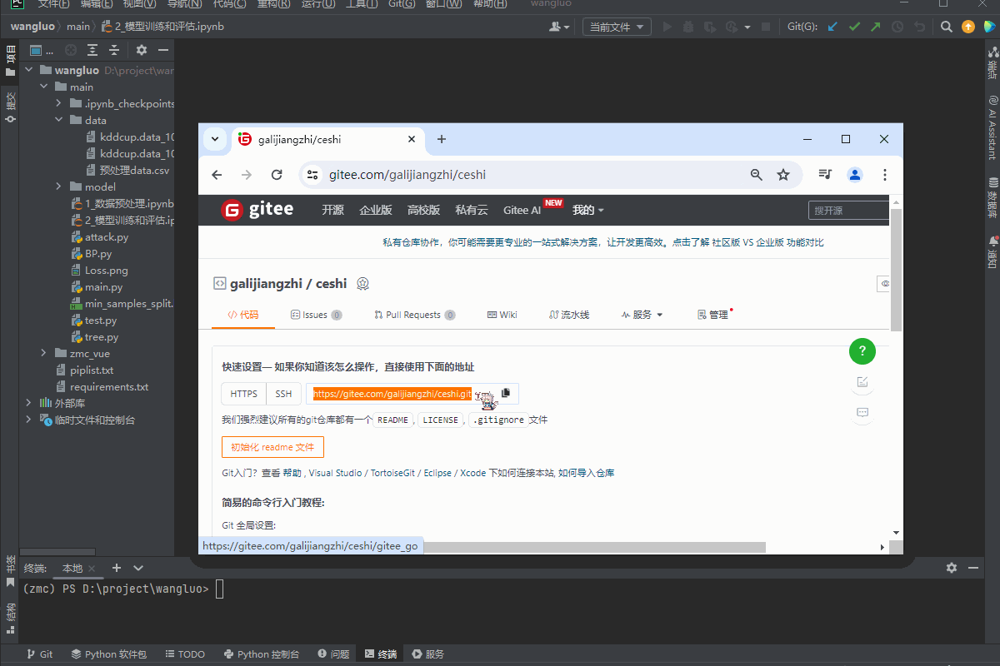

# git简易教程

## 安装git

### windows系统安装git

首先根据自己的操作系统选择下载下面的安装包

[windows系统 64位git下载地址（点击下载）](https://mirrors.tuna.tsinghua.edu.cn/github-release/git-for-windows/git/Git%20for%20Windows%20v2.44.0.windows.1/Git-2.44.0-64-bit.exe)

[windows系统 32位git下载地址（点击下载）](https://mirrors.tuna.tsinghua.edu.cn/github-release/git-for-windows/git/Git%20for%20Windows%20v2.44.0.windows.1/Git-2.44.0-32-bit.exe)

下载完成之后打开安装包一直点next即可，如下图

等待读条结束,点击键盘上的 win+r 打开运行，输入cmd /k git -v。

    cmd /k git -v

如果成功显示git版本，说明安装成功

### linux系统安装git

CentOS，Fedora，RHEL操作系统请在终端执行以下命令：

    sudo yum install -y git

Debian,Ubuntu,Kali,Deepin操作系统请在终端执行以下命令：

    sudo apt install git;

## 面向学生的git使用教程

**面向学生的git使用教程**主要讲解如何使用**gitee**和**git**进行项目的管理，gitee的服务器在国内，不需要过多的网络配置即可访问，非常适合国内学生使用。类似的托管平台还有[github](https://github.com/)，[gitlab](https://about.gitlab.com/)等，使用方法大同小异。

### 注册gitee

首先进入[gitee官网（点击进入）](https://gitee.com/),点击右上角的注册，输入注册信息，完成注册。

### 创建远程仓库

登录gitee，创建一个仓库用于管理我们的项目。如下图所示：

仓库名称就是项目名称，路径会根据仓库名称自动生成，设置好之后点击创建，如下图所示：

创建完成之后，可以看到我们的项目地址，点击旁边的复制按钮，如下图所示：

### 使用pycharm克隆项目
这里我是用pycharm专业版对我的项目进行管理

**克隆项目可以让你在本地修改和管理项目**

win+r打开运行输入cmd /k where git

    cmd /k where git

ctrl+c 复制现实的git路径

打开pycahrm，点击文件-设置-版本控制-git 将复制的路径粘贴进去 点击测试,出现git版本为xxxx表示git设置成功

接下来克隆我们刚才创建的仓库，点击git-克隆（clone）-在url的位置粘贴我们的项目地址，设置一下保存项目的位置（即你平时保存项目代码的文件夹），点击克隆即可

现在我们的pycharm中显示的就是一个可以使用git进行管理的项目

### 使用pycharm推送代码

推送的意思就是把本地的代码（本地的计算机中的代码）推送到代码仓库（gitee的联网服务器）中

为了演示推送操作我先在这个项目里写一个helloworld.py

然后点击git-提交-选择要推送的文件-输入推送信息-提交并推送-推送-输入账号密码，下面有整体的演示和补充：

在"**未进行版本管理的文件**"中选择要推送的文件，我这里需要推送的代码是helloworld.py 所以我就勾选了helloworld.py 其他的文件是pycharm的配置文件我们不用管

" **提交信息** " **一定要写!!!一定要写!!!一定要写!!!**,不然提交不了，一般要写一些提交的信息，比如这次提交的代码主要增加或修改了什么功能。

提交完成后，我们打开gitee 刷新一下网页，发现gitee中的项目更新了

### 使用gitee和pycharm进行分支管理

“分支”主要用于多人开发不同模块，每个人在自己的分支进行独立开发，不影响别人的分支。

首先在gitee中点击分支-创建分支-设置分支的名字

在pycharm中选择分支，首先在pycahrm中点击 git-拉取更新 git-分支=远程-刚才创建的分支名（我的就是baizhen）- 签出

现在我编辑的就是baizhen分支，为了做演示我们向分支中写一个python文件baizhen，提交到远程仓库

切入我们的gitee 刷新一下我们会发现master分支中没有发生改变，但是baizhen分支发生了改变。

假设我们现在要把baizhen分支里增加的函数合并到主分支里

按照以下操作：进入分支-点击贡献代码-输入标题-输入说明-点击创建pull requests-审查通过-测试通过-合并分支

这时候我们观察主分支，发现我刚才在baizhn分支写的baizhen.py已经出现在了主分支里面

分支的主要作用是在不影响主代码库的情况下进行并行开发和实验性工作。通过创建分支，开发者可以在独立的环境中进行代码修改和提交，而不会影响到主代码库。这样可以更安全、更灵活地进行开发，并且可以在不同的分支上进行不同的实验性工作，最终将成果合并到主分支中。