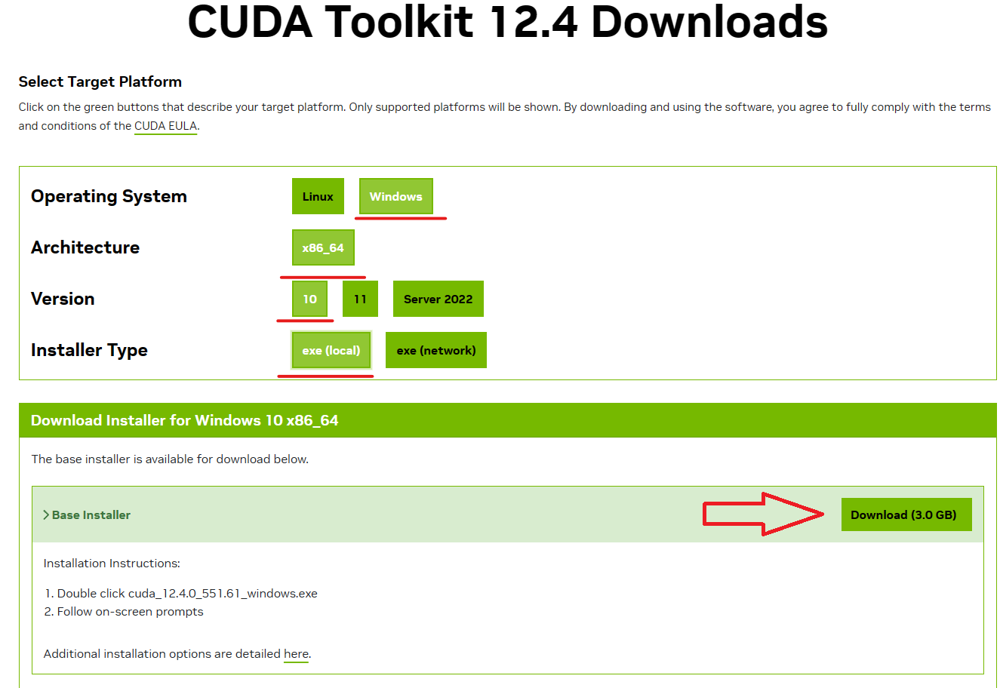

# win10中配置torch
    前提条件：要求电脑中已经配置了anaconda和英伟达显卡驱动
## 查看驱动推荐的CUDA版本
首先查看显卡驱动推荐的显卡驱动，使用win+r cmd 打开终端

    win+r cmd

在终端输入nvidia-smi 查看显卡驱动的详细信息，主要留意右上角的cuda Version

    nvidia-smi

如图 我应该使用的cuda版本就是12.4

## 下载CUDA安装包
进入CUDA官网[（点击此处进入）](https://developer.nvidia.com/cuda-toolkit-archive)

找到适合自己的显卡驱动的cuda版本，比如我就是12.4.0，这里我点击下图中的CUDA  tooklkit 12.4.0

跳转到下图这样的下载页面，根据自己的计算机选择一下这些选项，从上往下分别是系统类型，系统架构，系统版本，离线安装或者在线安装，最后一个选离线安装。

都选好之后点击下面的Download

## 安装CUDA

双击下载的文件，设置安装过程中临时文件的路径，点击ok

这里需要等待一下安装程序的加载

系统检查 点击同意并继续

选择安装选项，点击自定义，下一步

勾选所有的组件，点击下一步

设置安装位置，点击浏览选择安装位置，可以使用默认，如果不使用默认位置则要记住安装位置

后续一直点下一步就ok

## 添加环境变量

win+r 打开运行 输入 sysdm.cpl

    win+r sysdm.cpl

点击高级

点击环境变量

检查系统变量中有没有CUDA的变量，版本号可以和我的不一样，如果有，则表明环境变量无误，如果没有的话，需要按照我这个格式新建cuda变量，版本号写自己的，位置也要写自己设置的安装位置。

## 检测cuda是否安装成功

打开安装cuda的目录，双击打开extras

双击打开demo_suite

在文件夹地址栏中输入cmd 并敲回车

